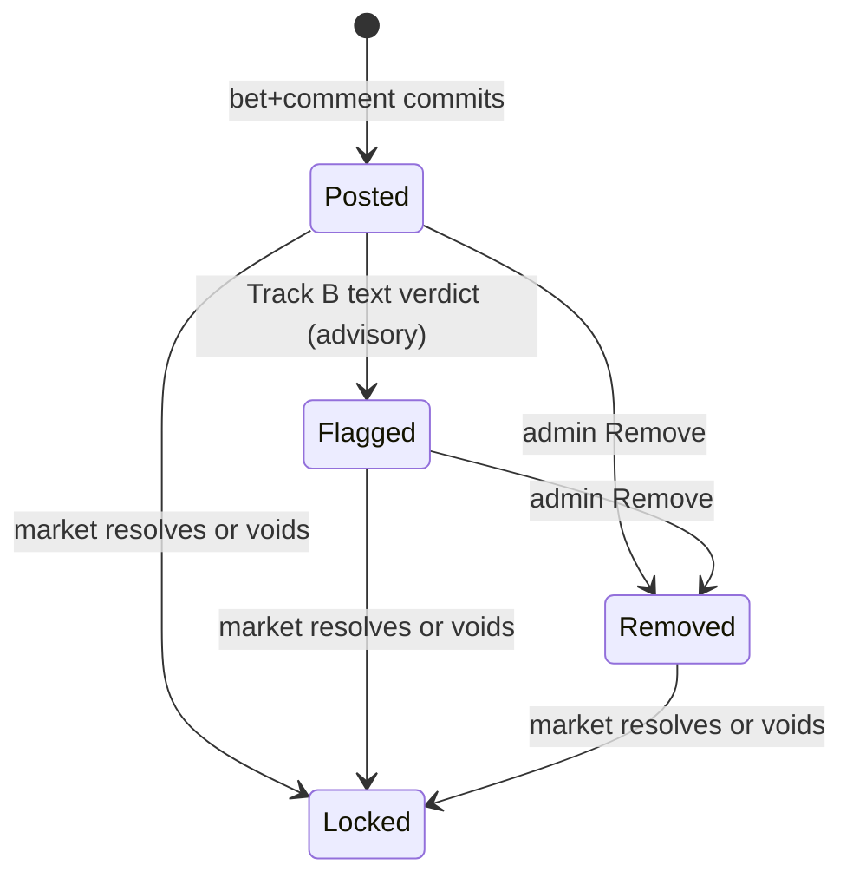

# SPEC-1-PASS — plan and change ledger · SPEC.1 → 2.0.0

**Plan version:** 1.1 (2026-09-06). Supersedes 1.0 (md5 `8368654804774b392e29fe10c221079e`) — see §8 for what changed and why.
**Status:** RATIFIED by the founder, 2026-09-06 (this document is the plan; D-29 is the ruling).
**Anchor base:** `docs/specs/SPEC.1.md` blob `fdf5db80bba9eaa00875f1a7694c56f441b0e28e` · 2,018 lines · declared 1.0.49.
**Branch base:** current `origin/main`. The blob above is byte-identical at `5d53ed58` and at `20cd322c` (measured, SPEC-1-PASS execute report 2026-09-06T1339 §2), so **every line anchor in §2 and §3 holds regardless of how far `main` has advanced, as long as the blob check in §0.1 passes.**
**Every line anchor below has been verified against that blob**, by locating the quoted fragment and confirming its line number. Anchors that appear at more than one line are pinned to the intended occurrence.
**Precedence:** decision record → SPEC.1 → SPEC.2 → ADRs → tracker (D-22). This plan carries rulings D-20, D-21/D-26, D-22, D-24, D-28 (rows 1, 7, 8, 9, 10, 21), D-29 and ADR-0046 into SPEC.1. It invents nothing.
**Roles:** web Claude authored; founder ratified; Claude Code commits and executes; a fresh-session reviewer reads the diff against this plan; web Claude and the founder read the diff (Lock 5 domain, OPERATING.md §3); founder merges.

---

## 0 · Execution contract

### 0.1 Preconditions (measured, then proceed or HALT)
1. `pwd` is a worktree on branch `docs/spec-1-pass`, cut from `origin/main`; `git status --porcelain` empty.
2. `git hash-object docs/specs/SPEC.1.md` → `fdf5db80bba9eaa00875f1a7694c56f441b0e28e`. **Any other value → HALT.** The anchors are invalid and the plan must be re-measured.
3. `git log --oneline -1 -- docs/plans/SPEC-1-PASS.md` shows the plan committed on this branch (Relay A landed).
4. `docs/decisions/RECORD-v2.5-amendment.md` exists on this branch (Relay A landed).
5. `git log -1 --format=%h -- docs/specs/SPEC.1.md` → record this sha. It is the **last 1.0.x commit** and is substituted for `<LAST-1.0.x-SHA>` in T-02 and T-19. Do not invent it; do not proceed without it.

### 0.2 Order of operations
- **Bottom-up.** Apply §2 (structural) and §3 (line-level) from the highest line number to the lowest, so every anchor above the current edit stays valid. Before each range delete or replace, `sed -n '<first>p;<last>p'` and confirm the two boundary lines match the text quoted in this plan. Mismatch → HALT, report the lines seen.
- **Verbatim.** Every text block in §4 is applied character-for-character. No paraphrase, no "improvement", no reflow beyond what markdown requires. A restatement in your own words has changed the spec.
- **Rule-based edits** (§4 T-23) are applied by the stated rule; every before/after pair is listed in the run report.
- **Conditionals** (marked ⟨COND⟩) are decided by the command shown, never by inference; the command and its output go in the run report.
- **ONE commit**, `docs/specs/SPEC.1.md` only. `CLAUDE.md` is **not** edited by this task (T-22, §8.2). Author `Zugzwang/world <zugzwangworld@proton.me>`; SSH-signed; no Co-authored-by trailer.
- **Then §5 post-checks, all of them, measured.** Then push, then `gh pr create --draft`. **Do not merge. Do not mark ready.**

### 0.3 Not in scope (do not touch)
`src/`, `tests/`, `drizzle/` (MOD-1 owns the moderation code) · `CLAUDE.md` (already carries the advisory posture; T-22 is verify-and-report only) · `docs/specs/SPEC.2.md` (its own pass — cross-references into removed SPEC.1 sections are **reported**, not edited) · `docs/adr/*` (ADR pass) · `docs/specs/flows/*` · the eight market specs · `AGENTS.md` · `docs/STATE.md` · `docs/decisions/README.md` beyond the one index row in Relay A · SPEC.1 §10.6 and §13 (untouched by ruling).

### 0.4 Report (transmission law, CLAUDE.md §8)
Write incrementally to `~/Downloads/zz_SPEC-1-PASS_execute_<YYYY-MM-DDTHHMM>.md`: preconditions (including the §0.1.5 sha) → each range operation with its boundary check → each rule-based before/after → each conditional with command + output → the §5 post-check table → `wc -l`, `git hash-object`, commit sha, PR URL, SPEC.2/flow cross-reference list (reported only), T-22 verification output (reported only). Inline reply is the ≤10-line headline (FILE · LINES · MD5 · STATUS · HALTED-AT · headline).

---

## 1 · D-29 — decision record amendment 2.5 (new file, verbatim)

Path: `docs/decisions/RECORD-v2.5-amendment.md`

```
# DECISION RECORD — amendment 2.5

**Amends** `RECORD-v2.0.md` · follows 2.1, 2.2, 2.3, 2.4 · **Opened** 2026-09-06
**Ruling** D-29

---

## D-29 · `SPEC.1` is rebaselined at 2.0.0

**Narrows** D-23 (2026-09-04) for `SPEC.1` only. `SPEC.2`'s rebuild stands.

**Ruling.** `SPEC.1` is a product contract, not a catalogue. §16.3–§16.5 (privacy, audit logs,
compliance), §17 (acceptance catalogue), §18 (out of scope), §19 (open questions) and §21–§23
(ancillary surfaces, Discovery, Profile) are removed; the repository carries the built surfaces
and the tests. The change log is reset; the 1.0.0–1.0.49 line stays in git history. Section
numbers are retained, with gaps, so cross-references elsewhere stay resolvable. Version 2.0.0.

Five prescriptive sentences survive by relocation: the append-only rule on `mod_actions` and
`admin_events` → §15; the AGPL-3.0 source link in the Terms → §13 F-AUTH-4; "removed content is
never rendered or exported" → §15; "no misinformation moderation" and the thesis-bearing
exclusions → §3.2 (NG6–NG15). Every flow keeps its inline Acceptance line.

**Consequences.** D-20's enforcement site `SPEC.1 §16.5` falls away; `SPEC.1 §14` is the sole
`SPEC.1` site. D-26's `SPEC.1 §21.4` survivor is honoured in code, not in a section. D-24 holds.
Number tuning (D-28 r1) and §10.6 are untouched. Moderation code conformance is `MOD-1`,
pending; the spec leads the code until it lands, and the 2.0.0 change-log row says so.
`CLAUDE.md` already carries the advisory posture (landed at the D-20…D-27 sweep) and is not
edited by this ruling.

**Enforced at** `SPEC.1` §0, §20 · `SPEC.2` §0 at the `SPEC.2` pass.

---

*End amendment 2.5.*
```

Also in Relay A: append one row to the amendment index in `docs/decisions/README.md`, in the exact format of the existing amendment rows (measure the format with `grep -n '2.4' docs/decisions/README.md` first). Content: amendment 2.5 · 2026-09-06 · D-29 · "`SPEC.1` rebaselined at 2.0.0".

---

## 2 · Structural operations (ranges verified at blob `fdf5db80`; apply bottom-up)

| Op | Range | First line must read | Last line must read | Action |
|---|---|---|---|---|
| S-01 | 2007–2013 | `AI_FLAG_THRESHOLD_TRACK_A_CSAM = TBD …` | `AI_FLAG_THRESHOLD_TRACK_B_HARASSMENT = TBD` | delete (D-28 r8) |
| S-02 | 1999 | `OTP_TTL_MIN = TBD` | same | delete (D-28 r9) |
| S-03 | 1995 | `PROFILE_GRAPH_Y_MAX = 10000 …` | same | delete (D-28 r10) |
| S-04 | 1971 | `Specific confidence thresholds per category per track …` | same | delete (D-28 r8) |
| S-05 | 1967 | `**Track B disposition (ADR-0021).** …` | same | replace with T-20.b |
| S-06 | 1951–1965 | starts `` | `csam` (hash match) | `` | `| (below threshold) | — | C | Posts normally. |` | replace Notes column per T-20.a (AI category, Source layer and Track columns unchanged) |
| S-07 | 1947 | `Source vendors: OpenAI moderation API (text) …` | same | replace with T-20.c |
| S-08 | 1670–1944 | `## §21 Ancillary Product Surfaces` | (blank line before `## Appendix A` at 1945) | delete §21, §22, §23 (D-29) |
| S-09 | 1590–1668 | `## §20 Change Log` | (last change-log table row; line 1669 is blank and stays) | replace with T-19 |
| S-10 | 1558–1589 | `## §19 Open Questions and Deferred Decisions` | (blank line after the `---` at 1588) | delete (D-29; all answered) |
| S-11 | 1493–1557 | `## §18 Out of Scope (Negative Space)` | (blank line after the `---` at 1556) | delete — **after** T-05 is inserted at §3.2 (bottom-up order guarantees this; §5 post-checks confirm T-05 is present) |
| S-12 | 1262–1492 | `## §17 Acceptance Tests` | (blank line after the `---` at 1491) | delete (D-29) |
| S-13 | 1214–1259 | `### 16.3 Privacy and Data` | (blank line before the `---` at 1260) | delete §16.3, §16.4, §16.5 (D-29) |
| S-14 | 1190–1191 | starts `` | `AI_FLAG_THRESHOLD_TRACK_A_*` | Per-category Track A confidence thresholds `` | starts `` | `AI_FLAG_THRESHOLD_TRACK_B_*` | Per-category Track B confidence thresholds `` | delete (D-28 r8) |
| S-15 | 1182 | `` | `OTP_TTL_MIN` | Email-OTP time-to-live (per `K1`). | `` | same | delete (D-28 r9) |
| S-16 | 1175 | starts `` | `PROFILE_GRAPH_Y_MAX` | Fixed Y-axis ceiling of the §23 cumulative Dharma graph `` | same | delete (D-28 r10) |
| S-17 | 956–1015 | `## §14 Moderation` | `- Lawyer review of ToS + content policy.` | replace with T-15 (lines 1016–1018 — blank, `---`, blank — stay) |
| S-18 | 252–263 | the ```` ```mermaid ```` fence under `### 6.2 Comment lifecycle` (header at 250) | the closing ```` ``` ```` | replace with T-08 (fence + one paragraph). **Line 264 is blank and line 265 is the Flipped/Exited paragraph — both stay.** |
| S-19 | 11–23 | `## §0 Document Metadata` | `- **Anchor lock:** …` | replace with T-02 (lines 24–26 stay) |
| S-20 | 3–7 | `> **Reader contract:** SPEC.1 is the source of truth …` | `> updated by an ADR.` | replace with T-01 |

---

## 3 · Line-level ledger (single-line edits; every anchor verified; apply bottom-up)

Confirm the quoted fragment is on the stated line before editing. If it is not, `grep -n` the fragment, report, and HALT rather than guessing — several fragments occur twice by design and are pinned below.

| L# | Line | Fragment on the line | Edit | Ruled by |
|---|---|---|---|---|
| L-01 | 1969 | `**Image adult-imagery → Track A realisation` | append at end of line: ` *(Realisation moves to the attach path at MOD-1; until then this describes the superseded gate.)*` | ADR-0046 |
| L-02 | 1207 | `Admin queue overload` | replace whole line with T-18.c | ADR-0021/0046 |
| L-03 | 1202 | `Comment blocked at the gate (Track B)` | replace whole line with T-18.b | D-20 |
| L-04 | 1201 | `Comment auto-banned (Track A)` | replace whole line with T-18.a | D-20 |
| L-05 | 1171 | `Value TBD at number-tuning (~2026-09-01).` (inside the `BET_MAX_STAKE` row) | → `Value pins at the number-tuning pass.` | D-28 r21 |
| L-06 | 1159 | `Symbolic only. Specific values → number-tuning pass (target: 2026-09-01).` | → `Symbolic only. Specific values pin at the number-tuning pass.` | D-28 r21 |
| L-07 | 1147 | `- **No market creation or pool seed.**` | **after** this line insert the two bullets T-16.f | D-29 salvage |
| L-08 | 1138 | `beyond the standard §18 list:` | → `beyond §3.2:` | D-29 |
| L-09 | 1122 | `- **Acceptance.** Moderation acceptance coverage` | replace whole line with T-16.e | D-29 |
| L-10 | 1118 | `Gate auto-actions (Track A auto-ban, Track B gate-block, the` | apply T-16.d (three fragment replacements on this line) | ADR-0046 |
| L-11 | 1117 | `- **Track B blocked** items` | replace whole line with T-16.c.iii | ADR-0046 |
| L-12 | 1116 | `- **Text-only ...sexual/minors... carve-out items (LD-3):**` | replace whole line with T-16.c.ii | ADR-0046 |
| L-13 | 1115 | `- **Auto-actioned (Track A):**` | replace whole line with T-16.c.i | ADR-0046 |
| L-14 | 1114 | `- **Live (Track C): Remove / Ban.**` | fragment `**Live (Track C): Remove / Ban.**` → `**Live and Live — flagged: Remove / Ban.**`; and append at end of line: ` A flag is advisory: it tells the admin where to look and decides nothing.` | ADR-0046 |
| L-15 | 1113 | `showing live (passed) posts and replies` | → `showing published posts and replies, flagged items marked with their category and reason code,` | ADR-0046 |
| L-16 | 1112 | `- **Pre.** A post or reply exists in one of two states` | replace whole line with T-16.b | ADR-0046 |
| L-17 | 1055 | `- **Identity-pool depth tripwire — DROPPED as a UI surface, and covered.**` | replace whole line with T-16.a ⟨COND⟩ | D-28 r12 |
| L-18 | §15, lines 1019–1150 | `live (Track C) content` (every occurrence in range) | → `live content` | ADR-0046 |
| L-19 | 803 | `3. **ToS and Privacy Policy text** are loaded` | append at end of line: ` The Terms carry the AGPL-3.0 source link — github.com/zugzwang-foundation/experiment (in backticks) — a licence obligation (AGPL-3.0 §13).` | D-29 salvage |
| L-20 | 711 | `used in the Devcon 8 talk or accompanying writeups, are generated` | delete the fragment `used in the Devcon 8 talk or accompanying writeups, ` | D-21/D-26 |
| L-21 | 707 | `Removed media (Track A images) explicitly *not* released.` | → `Dropped and removed images are *not* released.` | ADR-0046 |
| L-22 | 704 | `*excluding* Track A hard-removed content.` | → `*excluding* content removed by moderation (content_removed, in backticks).` | ADR-0046 |
| L-23 | 695 | `Site stays live indefinitely; frozen experiment is a public artifact.` | → `Read surfaces remain live after the freeze.` | D-26 |
| L-24 | **687** | `The experiment terminates on November 6, 2026 with a public deliverable.` | → `The experiment ends at the freeze instant, 2026-11-05 23:59 UTC, with a public deliverable released on 2026-11-06.` | D-26 |
| L-25 | 436 | `via the number-tuning pass (target 2026-09-01) before launch` | → `via the number-tuning pass before launch` | D-28 r21 |
| L-26 | 411 | `media.test.ts::image-moderation-routes` (F-COMMENT-3 Acceptance) | → `media.test.ts::image-screened-at-attach-never-gates` and append ` *(proposed path; MOD-1 confirms)*` | ADR-0046 |
| L-27 | 409 | `plus image-specific moderation codes (own uploads).` | → `A dropped image is not an error.` | ADR-0046 |
| L-28 | 408 | `- **Response.** Bet+comment response on success; F-MOD-4-shaped error on failure.` | replace whole line with T-11.d | ADR-0046 |
| L-29 | 407 | `Image moderation result routes to Track A / B / C the same way text moderation does; if Track A on either layer, the whole bet+comment transaction fails (INV-1).` | → T-11.c | ADR-0046 |
| L-30 | 406 | `Image then runs through CSAM hash + general classifier before the bet+comment transaction commits.` | → `The image is screened at attach (§14); its verdict exists, or is pending, before the bet+comment transaction commits, and never gates it.` | ADR-0046 |
| L-31 | 406 | `picking is the **fast** image path.` (same line as L-30; apply after it) | insert immediately after that fragment: ` *(Pick-from-pool is deferred — not in the launch build; the comments.market_media_id column is not in schema.)*` | founder F-7 |
| L-32 | **397** | `Comment passes moderation Track C.` — **F-COMMENT-2 Pre** (the other occurrence is L-36) | delete the sentence | D-20 |
| L-33 | **398** | `single transaction; moderation; insert comment row` — **F-COMMENT-2 System** | delete `moderation; ` | D-20 |
| L-34 | **391** | `400 comment_track_a_blocked, 400 comment_track_b_blocked, ` (each in backticks) — **F-COMMENT-1 Errors** | delete that fragment | D-20 |
| L-35 | **389** | `single transaction; moderation; insert comment row` — **F-COMMENT-1 System** | delete `moderation; ` | D-20 |
| L-36 | **388** | `Comment passes moderation Track C.` — **F-COMMENT-1 Pre** | delete the sentence | D-20 |
| L-37 | 304 | `Run text/image moderation on C; if Track A or Track B, abort (see §14 F-MOD-4).` — F-BET-2 System | → `Moderation never gates the transaction (§14).` | D-20 |
| L-38 | **297** | `400 comment_track_a_blocked, 400 comment_track_b_blocked, ` (each in backticks) — **F-BET-1 Errors** | delete that fragment | D-20 |
| L-39 | 295 | `Run text and image moderation on C; if Track A or Track B, abort transaction (see §14 F-MOD-4).` — F-BET-1 System | → `Moderation never gates the transaction: text moderation is dispatched off the request path once the transaction commits, and an attached image carries its attach-time outcome (§14).` | D-20 |
| L-40 | 272 | `Active --> Banned: Track A or admin Block (E2)` | → `Active --> Banned: Track A image verdict or admin Ban (E2)` | ADR-0046 |
| L-41 | 246 | `4. **Human factors.**` | replace whole line with T-07 | D-21/D-26 |
| L-42 | 141 | `lived out in §10, §11, §15, and §16.4` | → `lived out in §10, §11, and §15` | D-29 |
| L-43 | 113 | `- **NG5.** No per-user posting integrations to external platforms. Brand-account propagation is admin-curated only.` | **after** this line insert T-05 (NG6–NG15) | D-29 |
| L-44 | **105** | `already captured by §16.4` — **G8** | → `already captured by the event log and ledger` | D-29 |
| L-45 | **100** | `already captured by §16.4` — **G3** | → `already captured by the event log and ledger` | D-29 |
| L-46 | 86 | the `**Top / ranking mode**` glossary row | append to the end of the definition cell (before the final cell): ` No mode selector ships in v1 (ADR-0017 P3); Top is the only rendered order, with a single lane-dominance badge per dominating post.` | founder F-6 |
| L-47 | 78 | the `**Review queue**` glossary row | replace whole row with T-04.e | ADR-0046 |
| L-48 | 77 | the `**Brand-account**` glossary row | ⟨COND⟩ delete the row if `grep -rniE 'social-queue|brand-account|brandAccount' src/ | wc -l` → `0`; also then at line 113 replace `Brand-account propagation is admin-curated only.` → `Propagation of market activity to external platforms is admin-curated only.` If > 0, keep both and report | founder F-4 |
| L-49 | 71 | the `**Mod-action log**` glossary row | replace whole row with T-04.d | ADR-0046 |
| L-50 | 65, 66, 67 | the `**Track A**`, `**Track B**`, `**Track C**` glossary rows | replace with T-04.a, T-04.b, T-04.c respectively | D-20 |
| L-51 | 27 | `## §1 One-Paragraph Product Description` | → `## §1 Product Description` | founder F-5 |

---

## 4 · Text blocks (verbatim)

### T-01 — Reader contract (replaces lines 3–7)
```
> **Reader contract:** SPEC.1 is the product contract for the Zugzwang Experiment — what it does and why. Architecture lives in SPEC.2. The build contract lives in `CLAUDE.md` and `AGENTS.md`. Precedence (D-22): decision record → SPEC.1 → SPEC.2 → ADRs → tracker. When this document and code disagree, this document wins; it changes only by a ruling in the decision record.
```

### T-02 — §0 (replaces lines 11–23)
`<LAST-1.0.x-SHA>` is substituted with the value measured at §0.1.5.
```
## §0 Document Metadata

*Thesis relevance: (b) operationally enabling.*

- **Version:** 2.0.0 (semver; bump major on invariant changes)
- **Last updated:** 2026-09-06
- **Authors:** The Zugzwang Authors
- **Status:** Approved — rebaselined at 2.0.0 by D-29 (decision record amendment 2.5, 2026-09-06). The 1.0.0–1.0.49 line and its change log are retained in git history; last 1.0.x commit `<LAST-1.0.x-SHA>`.
- **Sections:** §0–§16, §20, Appendices A–B. §17–§19 and §21–§23 are intentionally absent (D-29); numbering is retained for cross-reference stability.
- **Related contracts:** `docs/decisions/` (the record outranks this document, D-22) · `docs/specs/SPEC.2.md` (architecture) · `CLAUDE.md`, `AGENTS.md` (build contract) · `docs/adr/` · `docs/specs/RANKING.md` (ranking math, ADR-0017) · `docs/specs/cpmm.md`
- **Reader:** Claude Code (primary), human reviewers (secondary)
- **Parked outside SPEC.1 scope:** market content (Hrishikesh alone; this document never invents markets) · number tuning (Appendix B; in progress, D-28 r1)
```

### T-04 — §2 glossary rows
**T-04.a** (replaces line 65)
```
| **Track A** | Moderation track for image-borne categories (CSAM hash, image-attached sexual/minors, adult imagery). Screened at attach: the image is dropped and the author is auto-banned (E2). The post is not blocked (§14). | `mod_actions.action = 'track_a_auto_ban'` |
```
**T-04.b** (replaces line 66)
```
| **Track B** | Moderation track for admin-review categories (graphic violence, threats, hate, harassment, self-harm, weapons; text-only sexual/minors). Text publishes and is flagged for reactive review; a flagged image is dropped (§14). | `mod_actions.action ∈ {track_b_flagged, sexual_minors_text_flagged, image_rejected}` |
```
**T-04.c** (replaces line 67)
```
| **Track C** | Moderation track: below threshold. Nothing is written. | absence of a `mod_actions` row |
```
**T-04.d** (replaces line 71)
```
| **Mod-action log** | Append-only log of every classifier verdict and every admin moderation action. | `mod_actions` table |
```
**T-04.e** (replaces line 78)
```
| **Review feed** | The admin's chronological feed of published content, flagged items marked (§15 F-ADMIN-4). | `/admin/moderation` |
```

### T-05 — §3.2 NG6–NG15 (insert after line 113)
```
- **NG6.** No misinformation moderation. Markets are how Zugzwang resolves wrongness; removing content because it is wrong about a market violates the thesis (§14).
- **NG7.** No community or user-side moderation (block / hide / report) in the experiment.
- **NG8.** No personalised ranking. The model is universal — same inputs, same order, for every reader at every moment (§9).
- **NG9.** No passive-engagement ranking inputs (views, dwell, clicks) and no author-Dharma input. An admissible signal must require committing Dharma to generate (ADR-0017).
- **NG10.** No free or no-stake reactions. Support and Counter are aggregates over reply-bets; every expression is a stake (§8, §9).
- **NG11.** No "vindicated" or track-record ordering before resolution, no shuffled default, no online-learned weights (ADR-0017).
- **NG12.** No synthetic Dharma and no separate liquidity ledger. One ledger, Path A (§10.2).
- **NG13.** No mid-market liquidity adjustments. Pool seed is fixed at creation (§10.6).
- **NG14.** No Brier overlay or time-weighted bonus. The award is CPMM-native (§10.3).
- **NG15.** No escalating or streak-based Daily Credit and no referral grants (ADR-0018, §10.4).
```

### T-07 — §6.1 point 4 (replaces line 246)
```
4. **Human factors.** The freeze instant is **05:29 IST on 2026-11-06**. Discharge the obligation in daylight, days before it.
```

### T-08 — §6.2 comment lifecycle (replaces lines 252–263)
````


Publication is the first state: no comment is ever submitted-but-unposted (§14). A flag is advisory and changes nothing the Audience sees; Remove renders the `removed by moderator` placeholder with the thread intact. Image outcomes (attached / pending / dropped) are per-image and do not change the comment's state. Track A is a user-lifecycle event (§6.3), not a comment state.
````

### T-11.c — §8 F-COMMENT-3 System sentence (replaces the sentence at L-29)
```
The attach-time verdict decides the image, never the post: a passed image publishes with the post; a pending verdict publishes the post and attaches the image when it passes; a rejected or failed image is dropped and the participant is told which one and why (§14). The transaction is never conditional on a verdict (INV-1 holds because nothing can partially commit).
```

### T-11.d — §8 F-COMMENT-3 Response (replaces line 408)
```
- **Response.** Bet+comment response, carrying the image outcome (`attached` / `pending` / `dropped` with reason).
```

### T-15 — §14 Moderation (replaces lines 956–1015)
```
## §14 Moderation

*Thesis relevance: (c) legal/safety floor.*

**Moderation is advisory. No post is ever blocked, no submission ever fails, no participant ever waits** (ADR-0046; D-20). The invariant, stated once: *a post is never blocked by moderation, and an image is never served before it has been screened.* Both hold because the screening window is the composing window — an image is attached before the mandatory argument is written.

**One vendor, two paths.** OpenAI omni-moderation screens text and image bytes. PhotoDNA and a dedicated image classifier are parked (Appendix A). Classification uses three tracks — A (image-borne; auto-ban), B (admin review), C (below threshold) — mapped per category in Appendix A. Per-category thresholds are implementation constants, not spec constants (D-28 r8).

| Track | Categories (Appendix A) | Text | Image |
|---|---|---|---|
| **A** | CSAM; image-attached sexual/minors; adult imagery | — (no text-only category routes to A) | Dropped at attach; author auto-banned (E2); admin informed. No automated report (D-28 r7); the admin reports at their discretion |
| **B** | Graphic violence; threats; hate; harassment; self-harm; weapons; text-only sexual/minors | Publishes; flagged in the review feed for reactive Remove / Ban. No auto-ban | Dropped at attach; the participant is told which image and why. No ban |
| **C** | Below threshold | Publishes; nothing written | Attaches |

**Text — fire-and-forget.** The moderation call is dispatched off the request path once the bet+comment transaction commits; it is never awaited and never gates the transaction (the transaction is never conditional on a verdict, so INV-1 cannot partially commit). A Track B verdict writes a `mod_actions` row and marks the item in the review feed (§15). A provider failure, timeout or error writes an audit row and changes nothing a participant sees.

**Images — screened at attach.** An upload lands in a private prefix; screening fires immediately; the composer stays interactive. At submit the verdict usually exists, and post and image publish together. If the verdict is still pending, the post publishes and the image appears when the verdict passes. A rejected image is dropped and the participant is told which one and why; a failed screening drops the image, records the failure, and the admin sees it. A byte-identical re-upload reuses the cached verdict (ADR-0028). An image is never served before it has been screened.

**Admin moderation is reactive** (ADR-0021; ADR-0020 decoupling). There is no held queue; nothing waits on operator availability. The admin reviews the chronological feed of published content, flagged items marked, and applies on any live comment **Remove** (hide the comment; author untouched) and/or **Ban** (ban the author) — either without the other. Every classifier verdict and every admin action writes an append-only `mod_actions` row with a reason code; there is no silent suppression. **No action touches a bet or the ledger (INV-1 / INV-2 / INV-3): a banned or removed author's positions ride to resolution — ban removes voice, not balance.** Moderation removes content out-of-bounds for any market discourse — *not* content wrong about a market. There is no misinformation track; it would violate the thesis (§3 NG6).

Reason codes: `track_a_auto_ban` · `track_b_flagged` · `sexual_minors_text_flagged` · `image_rejected` · `image_screening_failed` · `content_removed` · `user_banned`. Realised at MOD-1; until it lands, `src/` implements the superseded gate (§20).

### F-MOD-1 — Track A (image) auto-ban

- **Pre.** An attached image returns a Track A verdict.
- **System.** The image is dropped and never served. `users.banned_at` is set (E2); existing positions ride to resolution; existing comments are preserved with markers frozen at ban-time; no Daily Credit from ban-time; no appeal in v1. A `mod_actions` row (`track_a_auto_ban`) records category, confidence and image key. The composer tells the author the image was rejected. A banned account's subsequent writes return 403 (F-BET-7 / F-MOD-5) — the account state, not a moderation gate. If the verdict lands after submit, the post text is already live; the image is never served; the admin is informed and may Remove.
- **Acceptance.** `tests/server/moderation/track-a.test.ts::image-dropped-auto-ban-positions-preserved` *(path confirmed at MOD-1).*

### F-MOD-2 — Track B flag

- **Pre.** Published text returns a Track B verdict, or an attached image returns a Track B verdict.
- **System.** Text: the comment is already live; a `mod_actions` row (`track_b_flagged`, or `sexual_minors_text_flagged` for the LD-3 carve-out) records verdict, categories with confidence and `user_id`; the item is marked in the review feed. No auto-ban. Image: dropped at attach (`image_rejected`); the participant is told which image and why; the post publishes without it.
- **Acceptance.** `tests/server/moderation/track-b.test.ts::text-publishes-then-flags`, `tests/server/moderation/track-b.test.ts::image-dropped-post-publishes` *(paths confirmed at MOD-1).*

### F-MOD-3 — Admin reactive moderation (Remove / Ban)

- **System.** Reactive, post-publication moderation on live content — the coverage role for what the classifier missed or flagged, including the image-category hate/harassment/weapons gap omni-moderation cannot classify (a third image classifier was rejected). It also covers the text-only `sexual/minors` carve-out items flagged by F-MOD-2 (the text is live). Two decoupled actions, per ADR-0020 — content removal is independent of user ban:
  - **Remove** — hide the already-public comment from all surfaces. **Author untouched; the author's bet rides to resolution.** Replies under a removed parent remain (they are other users' stake-backed arguments); the parent renders a `removed by moderator` placeholder with the thread intact.
  - **Ban** — ban the author (account flagged `banned`, Daily Credit stops from ban-time, existing comments preserved with markers frozen at ban-time, no appeal per E2). **The author's positions ride to resolution.**
  Either may be applied without the other. Each action writes an append-only `mod_actions` row with a reason code distinguishing content-removal (`content_removed`) from user-ban (`user_banned`); there is **no silent suppression**. **No action touches the bet or ledger (INV-1 / INV-2 / INV-3) — ban removes voice, not balance; there is no clawback.** Two surfaces, same backend: the hub review feed at `/admin/moderation` and the inline affordance on debate views (F-ADMIN-4). Both call the same endpoint, write the same `mod_actions` shape, and apply the same audit discipline.
- **Acceptance.** `moderation::reactive-remove-ban-positions-ride` (`tests/server/moderation/reactive.test.ts`).

### F-MOD-4 — Retired (2.0.0)

The bet+comment transaction is never conditional on a verdict (ADR-0046); there is no abort-on-flag path. INV-1 holds because nothing can partially commit.

### F-MOD-5 — User banned mid-session

- **System.** On next request after ban-event, server returns 403. Existing session cookie remains technically valid; subsequent bet/comment writes return 403 `banned_user` from F-BET-7 / F-COMMENT-1 paths.
- **Acceptance.** `tests/server/auth/session.test.ts::banned-mid-session`.

### Out-of-scope

No misinformation moderation. No community / user-side moderation in v1 (per `C9`). No NSFW warning-wrap (no product fit). No three-strike model (per `E2`). No appeal flow in v1.
```

### T-16 — §15
**T-16.a** (replaces line 1055; ⟨COND⟩) — run `grep -rniE 'identity_pool.*(watermark|cron)|low.?watermark' src/ scripts/ drizzle/ supabase/ 2>/dev/null | wc -l`. If `0`:
```
- **Identity-pool depth tripwire — DROPPED as a UI surface.** Pool depletion halts signups (F-AUTH-3); detection is operational, not a widget.
```
If `> 0`, use the line above with this appended, the job name in backticks: ` A pg_cron low-watermark job at 5% of pool covers it.` Report the command and count either way.

**T-16.b** (replaces line 1112)
```
- **Pre.** A post or reply exists as **Live** (published, unflagged) or **Live — flagged** (published; a Track B text verdict, including the text-only `sexual/minors` carve-out). There is no Held state and no unpublished item (ADR-0021; ADR-0046). Content removal and user ban are independent (ADR-0020).
```
**T-16.c.i** (replaces line 1115)
```
  - **Track A (image) events:** informational only — no admin decision. The image was never served; the author is already auto-banned (F-MOD-1). Links to the audit record.
```
**T-16.c.ii** (replaces line 1116)
```
  - **Text-only `sexual/minors` carve-out items (LD-3):** live and flagged (`sexual_minors_text_flagged`); the admin may **Remove** and/or **Ban**, or dismiss as a false positive.
```
**T-16.c.iii** (replaces line 1117)
```
  - **Dropped images** (Track B or screening failure): informational — the post is live without the image; the row is searchable via F-ADMIN-5.
```
**T-16.d** — three fragment replacements on line 1118, each replacement given as a fenced block so backticks survive:

fragment 1, find:
```
Gate auto-actions (Track A auto-ban, Track B gate-block, the `sexual_minors_text_blocked` carve-out) write their own `mod_actions` rows at gate time.
```
replace with:
```
Classifier rows (`track_a_auto_ban`, `track_b_flagged`, `sexual_minors_text_flagged`, `image_rejected`, `image_screening_failed`) are written when the verdict lands.
```
fragment 2: `distinguishable from gate rows` → `distinguishable from classifier rows`
fragment 3: `whereas a gate` → `whereas a classifier`
(If a fragment is absent on the line, report it and continue.)

**T-16.e** (replaces line 1122)
```
- **Acceptance.** `tests/server/admin/moderation.test.ts::remove-ban-decoupled-positions-ride`, `tests/server/admin/moderation.test.ts::flagged-items-marked-stream-chronological`, `tests/server/admin/moderation.test.ts::inline-parity` *(paths confirmed at MOD-1).*
```
**T-16.f** (insert after line 1147)
```
- **No rendering or export of removed content, anywhere.** A comment carrying `content_removed` renders the `removed by moderator` placeholder on every surface — debate view, profile, downloads, the dataset — identically for every viewer, the owner included.
- **No mutation of the audit tables.** `mod_actions` and `admin_events` are append-only, enforced by the same row-level rules and tests as INV-4; they are enforcement layers, not §5 invariants.
```

### T-18 — §16.2 rows
**T-18.a** (replaces line 1201)
```
| Track A image verdict at attach | The composer says which image was rejected and why. The account is banned (E2); subsequent writes return 403. | `mod_actions` row (`track_a_auto_ban`); `users.banned_at` set. The post is not blocked; a post already live stays live until the admin acts. |
```
**T-18.b** (replaces line 1202)
```
| Track B verdict | Nothing at all for text — the post is live. A Track B image is dropped and the author told which one and why. | `mod_actions` row (`track_b_flagged` / `image_rejected`); the item is marked in the review feed; the admin acts reactively. |
```
**T-18.c** (replaces line 1207)
```
| Review-feed backlog | Nothing — nothing is withheld from participants. | Flagged items wait on the admin's schedule; no SLA (ADR-0021). |
```

### T-19 — §20 (replaces lines 1590–1668)
`<LAST-1.0.x-SHA>` is substituted with the value measured at §0.1.5.
```
## §20 Change Log

*Reset at 2.0.0 (D-29). The 1.0.0–1.0.49 log is in git history; last 1.0.x commit `<LAST-1.0.x-SHA>`.*

| Date | Version | Change | Ruling |
|---|---|---|---|
| 2026-09-06 | 2.0.0 | Rebaselined. Moderation restated as advisory — text fire-and-forget, images screened at attach, no post ever blocked (§2, §6, §7, §8, §14, §15, §16.2, Appendix A); F-MOD-4 retired; no automated CSAM reporting. §16.3–§16.5, §17–§19, §21–§23 removed; five prescriptive sentences relocated (§3.2 NG6–NG15, §13 F-AUTH-4, §15). Devcon struck; "by 1 September" claims repointed at the number-tuning pass; seven `AI_FLAG_THRESHOLD_*`, `OTP_TTL_MIN`, `PROFILE_GRAPH_Y_MAX` removed; reader contract aligned to D-22. **Code conformance for moderation: MOD-1, pending** — until it lands, `src/` implements the superseded gate. | D-20, D-21/D-26, D-22, D-24, D-28, D-29; ADR-0046 |
```

### T-20 — Appendix A
**T-20.a** — Notes column, row by row (AI category, Source layer and Track columns unchanged). Backticked identifiers in the new cells are written as code spans:

| Row (AI category) | New Notes cell |
|---|---|
| csam (hash match) | Image dropped at attach; auto-ban. No automated report (D-28 r7); the admin reports at their discretion. |
| sexual/minors (text-only) | Text publishes; flagged `sexual_minors_text_flagged` for reactive Remove / Ban. No auto-ban (LD-3: high false-positive rate on this category). |
| sexual/minors (image-attached) | Image dropped at attach; auto-ban. |
| sexual (text-only) | Text publishes; flagged. No auto-ban. |
| sexual (image-attached) | Image dropped at attach; auto-ban — the CSAM-image backstop while PhotoDNA is parked (omni scores image-borne CSAM as adult `sexual`). |
| nsfw / adult imagery | Image dropped at attach; auto-ban. No product fit. |
| violence/graphic | Publishes; flagged. Edges: war markets, journalistic context. |
| violence (image) | Image dropped at attach; participant told. No ban. |
| harassment | Publishes; flagged. |
| harassment/threatening | Publishes; flagged. Threats specifically. |
| hate | Publishes; flagged. Edges: quoting slurs to criticise. |
| hate/threatening | Publishes; flagged. |
| self-harm | Publishes; flagged. |
| weapons | Image dropped at attach; participant told. Edges: weapon-policy markets. |
| (below threshold) | Publishes; nothing written. |

**T-20.b** (replaces line 1967)
```
**Track B disposition (ADR-0046).** "Flagged" means reactive review of published text by the admin (Remove / Ban, §15 F-ADMIN-4). A Track B image is dropped at attach and the participant told. No item is held and no post is blocked (D-20).
```
**T-20.c** (replaces line 1947)
```
Source vendor: OpenAI omni-moderation on text and on image bytes. PhotoDNA and a dedicated image classifier are parked; see the realisation note below.
```

### T-22 — `CLAUDE.md`: VERIFY AND REPORT ONLY. **Do not edit.**
`CLAUDE.md` §2 already carries the advisory posture, in a superset of the sentence plan 1.0 proposed, including the ⚠ `MOD-1 pending` caveat this plan's own T-19 requires. It landed before this plan's base. Editing it would delete that caveat.

Run and record in the report; change nothing:
```
git rev-parse --abbrev-ref HEAD
grep -n 'Moderation is advisory' CLAUDE.md      # expect >= 1
grep -n 'fails closed' CLAUDE.md                # expect only build-lag sentences, quoted in the report
grep -n 'MOD-1 pending' CLAUDE.md               # expect >= 1
git diff --stat -- CLAUDE.md                    # expect EMPTY at every stage of this task
```
If `Moderation is advisory` returns 0 on this branch, **HALT and report** — the premise of this block has changed and the founder rules before anything is written.

### T-23 — Reference rules (rule-based; every pair reported)
- **§17 as a location.** Any fragment whose only purpose is to point at §17 — "§17 rows", "(§17 `x::y`)", "minted in the DEBATE.7 plan (§17 …)", "§17 acceptance-test catalogue", "at §17" — is removed. The `family::name` identifiers are test names in `tests/` and are **kept** where they identify a test. Sentences that become empty are removed whole.
- **§16.3 / §16.4 / §16.5 as a location.** §16.4 → `§15` when the referent is audit rows, `§12.2` when the referent is the dataset; §16.3 → `§6.3` or `§10.7` (erasure); §16.5 → `§13 F-AUTH-4` (ToS). If no sensible referent, strike the parenthetical.
- **§18 as a location** → `§3.2`.
- **§19, §21, §22, §23 as a location** → strike the reference (the surface lives in the repo); a sentence that exists only to make the reference is removed whole.
- **`sexual_minors_text_blocked`** anywhere surviving → `sexual_minors_text_flagged`.
- Do **not** touch: "showcase", "conference", "Track A"/"Track B"/"Track C" as names, ADR-0014 / ADR-0021 citations, the `MARKET_CHART_*` constant rows at 1176–1180 (their dates are axis values, not deadline claims), §10.6, §13.

---

## 5 · Post-checks (all measured; table in the run report: command · expected · actual · PASS/FAIL)

```
git hash-object docs/specs/SPEC.1.md            # new blob, reported
wc -l docs/specs/SPEC.1.md                      # reported (expect ~1,150-1,300)
git diff --stat -- CLAUDE.md                    # EMPTY - this task does not edit CLAUDE.md
grep -c '^## ' docs/specs/SPEC.1.md             # 20  (S0-S16, S20, App A, App B)
grep -nE '^## §' docs/specs/SPEC.1.md           # S0..S16, S20 - no 17/18/19/21/22/23
grep -c 'Devcon' docs/specs/SPEC.1.md           # 0     control: grep -c 'Dharma' > 0
grep -ciE 'comment_track_[ab]_blocked|track_b_blocked|sexual_minors_text_blocked|gate-block|fail[ -]closed|block or pass|transaction never opens|auto-report|NCMEC' docs/specs/SPEC.1.md   # 0   control: grep -c 'advisory' >= 3
grep -nE 'PhotoDNA' docs/specs/SPEC.1.md        # list every survivor; each must say "parked" on the same line
grep -nE '§16\.[345]|§17|§18|§19|§21|§22|§23' docs/specs/SPEC.1.md   # only inside S0's "Sections" bullet and S20 - list any others
grep -n '2026-09-01' docs/specs/SPEC.1.md       # list every survivor; each must be inside a MARKET_CHART_* row (1176-1180 pre-edit)
grep -ciE 'six[ -‑]card' docs/specs/SPEC.1.md   # 0  (Unicode hyphen included)
grep -cE 'AI_FLAG_THRESHOLD|OTP_TTL_MIN|PROFILE_GRAPH_Y_MAX' docs/specs/SPEC.1.md   # 0
grep -c 'NG15' docs/specs/SPEC.1.md             # 1
grep -c 'F-MOD-4 — Retired' docs/specs/SPEC.1.md   # 1
grep -c 'MOD-1' docs/specs/SPEC.1.md            # >= 3 (S14, S20, App A)
grep -c 'LAST-1.0.x-SHA' docs/specs/SPEC.1.md   # 0 - the token must have been substituted
grep -n 'Reader contract' docs/specs/SPEC.1.md  # line 3; contains the D-22 ladder
grep -c 'AGPL-3.0 §13' docs/specs/SPEC.1.md     # 1 (S13 F-AUTH-4)
grep -c 'No rendering or export of removed content' docs/specs/SPEC.1.md   # 1
grep -c '2.0.0' docs/specs/SPEC.1.md            # >= 2 (S0 Version, S20 row)
grep -n 'Submitted --> Posted' docs/specs/SPEC.1.md   # 0 - the old lifecycle fence is gone
grep -nE 'SPEC.1 §1[6789]|SPEC.1 §2[123]' docs/specs/SPEC.2.md        # REPORT ONLY (SPEC.2 pass repairs)
grep -rnE 'SPEC.1 §1[789]|SPEC.1 §2[123]' docs/specs/flows/ CLAUDE.md AGENTS.md   # REPORT ONLY
pnpm biome check docs/ 2>&1 | tail -3           # or the repo's markdown lint, if any; report
```

---

## 6 · Relays

### Relay A — commit the plan and D-29 (session 1; halts after commit)
```
TASK.ID: SPEC-1-PASS
PHASE: plan-commit
MODE: gated. Not ultracode. No bypass-permissions.

Worktree: cut fresh if absent —
  git worktree add -b docs/spec-1-pass ~/code/zugzwang/wt-spec-1-pass origin/main
  (if the branch already exists, `git worktree add ~/code/zugzwang/wt-spec-1-pass docs/spec-1-pass`)
From that worktree:
  git fetch origin --prune; git rev-parse HEAD; git rev-parse origin/main   # equal, or ff-only
  git hash-object docs/specs/SPEC.1.md   # must be fdf5db80bba9eaa00875f1a7694c56f441b0e28e, else HALT

1. cp ~/Downloads/SPEC-1-PASS_ledger.md docs/plans/SPEC-1-PASS.md   (md5 both; must match, and the file's line 3 must read "Plan version: 1.1")
2. Create docs/decisions/RECORD-v2.5-amendment.md with the block in plan §1, verbatim.
3. Append the amendment-2.5 index row to docs/decisions/README.md in the existing rows' format (measure the format first).
4. ONE commit: "docs(spec): SPEC-1-PASS plan + D-29 (amendment 2.5) — SPEC.1 rebaseline to 2.0.0"
5. git push -u origin docs/spec-1-pass
6. Report per transmission law to ~/Downloads/zz_SPEC-1-PASS_plan-commit_<ts>.md; <=10-line headline inline. HALT. Do not execute the plan in this session.
```

### Relay B — execute (session 2, FRESH, same worktree)
```
TASK.ID: SPEC-1-PASS
PHASE: execute
MODE: gated. Not ultracode. No bypass-permissions. Moderation is a Lock-5 document.

cd ~/code/zugzwang/wt-spec-1-pass
Read docs/plans/SPEC-1-PASS.md in full. It is the only instruction. Nothing in this prompt adds to it.
Run plan §0.1 preconditions, all five; HALT on any failure.
Apply plan §2 and §3 bottom-up, with the boundary checks; apply §4 text verbatim; run §4 T-23 rules; decide every ⟨COND⟩ by its command; T-22 is verify-and-report only — CLAUDE.md is not edited.
ONE commit: docs/specs/SPEC.1.md — "docs(spec): SPEC.1 2.0.0 — rebaseline per D-29; moderation restated as advisory (ADR-0046, D-20)"
Run every plan §5 post-check; the table goes in the report.
git push; gh pr create --draft --title "docs(spec): SPEC.1 2.0.0 — rebaseline per D-29; moderation advisory" --body "Plan: docs/plans/SPEC-1-PASS.md · Ruling: D-29 (amendment 2.5) · Code half: MOD-1 pending · CLAUDE.md already carries the posture (T-22, no edit) · Gate C: reviewer + web + founder diff-read before ready"
Do not merge. Do not mark ready.
Report to ~/Downloads/zz_SPEC-1-PASS_execute_<ts>.md; <=10-line headline inline.
```

### Relay C — reviewer (session 3, FRESH; issued after B's headline)
Reads the PR diff against `docs/plans/SPEC-1-PASS.md`: every §2/§3/§4 item present and verbatim; nothing outside the plan touched; `CLAUDE.md` untouched; post-check table reproduced; SPEC.2/flow cross-reference report present. Output: a findings list, HIGH/MED/LOW, to `~/Downloads`. Web Claude and the founder read the diff after the reviewer.

---

## 7 · Parked and follow-ons (not this PR)

| ID | Item | Owner / when |
|---|---|---|
| P-1 | §10.6 and §3.2 NG13 forbid mid-market liquidity injection. Any liquidity injector deploy needs a ruling and an ADR **before** it. | Founder; before any injector deploy |
| MOD-1 | Code half of ADR-0046 / D-20: text unawaited, images at attach, reason-code enum, tests re-derived. Critical path: plan → execute → reviewer → founder diff-read. Launch-day posture depends on it (six seconds in front of every commented bet; OpenAI outage halts betting until it lands). | Founder to sequence against Sep 15 |
| SPEC.2 pass | Repair cross-references into removed SPEC.1 sections; §10 rebuild to advisory; ADR ceiling; runbooks (D-28 r12); error-codes/PSEUDONYM/design promises (r15–17); tracker names; App A counts. | Next chat |
| ADR pass | ADR-0014 `Amended-by` row; ADR-0021 Track B consequence patch; ADR-0011 ×2 (r16); ADR-0006:34 (r20); Status formatting (r19). | After SPEC.2 |
| Hygiene | `docs/decisions/README.md:16–18` ("the spec wins") and `docs/STATE.md` (D-22's "lone dissenter") still state the superseded ladder. | One small PR |
| PK refresh | After SPEC.2 lands (D-28 r28). | Founder |

---

## 8 · What changed from plan 1.0, and why

### 8.1 Corrections found by verifying 1.0's own anchors against the blob
| Item | 1.0 said | Measured | Fix |
|---|---|---|---|
| L-24 | line 685 | 685 is the thesis-relevance line; the target sentence is at **687** | anchor corrected |
| S-18 | "replace the fence **and the sentence-paragraph that follows it**" | there is no such paragraph — 264 is blank, 265 is the Flipped/Exited paragraph, which stays | range pinned to **252–263** |
| L-32 / L-36 | fragment "Comment passes moderation Track C." | occurs at **388** (F-COMMENT-1) and **397** (F-COMMENT-2) | both pinned |
| L-33 / L-35 | fragment "moderation; insert comment row" | occurs at **389** and **398** | both pinned |
| L-34 / L-38 | fragment "comment_track_a_blocked" | occurs at **297** (F-BET-1) and **391** (F-COMMENT-1) | both pinned |
| L-44 / L-45 | fragment "already captured by §16.4" | occurs at **100** (G3) and **105** (G8) | both pinned |
| T-23 | "the CHART-6 execution note at line 1178" | the dated axis values sit across **1176–1180** | rule restated by range |
| §5 `2026-09-01` check | "≤ 1" | survivors are axis values inside `MARKET_CHART_*` rows | check restated as list-and-justify |
| L-28 | replacement given inline in the table | now a named block (T-11.d) so its code spans survive | block added |
| all others (L-21, L-22, L-23, L-26–L-31, L-37, L-39, L-42, L-46–L-51, every S-op) | locate-by-text or asserted | each fragment located and its line confirmed unique | line numbers pinned |

### 8.2 T-22 — demoted to verify-and-report
Plan 1.0 instructed an edit to `CLAUDE.md` §2. Claude Code measured that the advisory posture **is already there**, landed at `729724ef` (the D-20…D-27 sweep), which is an ancestor of the plan's own declared base — and that the shipped text is a superset carrying the ⚠ `MOD-1 pending` caveat that this plan's T-19 requires. Applying 1.0's T-22 verbatim would have deleted that caveat and put the plan in contradiction with itself. 1.0's own HALT branch would not have caught it: the two surviving "fails closed" sentences describe the build's lag, not the rule, and sit outside §2.1–§2.4. **Cause:** T-22 was written from a summary rather than re-measured against the live file. **Fix:** T-22 is now verification only; the second commit is removed; a post-check asserts `CLAUDE.md` is unmodified.

### 8.3 `<LAST-1.0.x-SHA>` — an asserted value removed
Plan 1.0 wrote `e193cfb6` into T-02 and T-19 as "last 1.0.x commit". That sha was **never measured**. It is replaced by a token substituted from §0.1.5's command, and a post-check fails if the token survives into the file.

### 8.4 Base
Plan 1.0 declared base `5d53ed58`; `origin/main` has since advanced (`20cd322c` at last measurement) with no change to `SPEC.1.md`, `CLAUDE.md` or `docs/decisions/`. The blob check in §0.1.2 — not a commit sha — is what makes the anchors valid, so the plan needs no re-measurement while that check passes.
