# Zugzwang — AWS Migration Technical Deep Dive

**Compute · Data · Network · and the DynamoDB question, answered from the code**

| | |
|---|---|
| **Document** | Technical deep dive + architecture decision record |
| **Version** | 1.0 |
| **Date** | 2026-09-21 |
| **Status** | For client review |
| **Supersedes** | `aws-migration-guide.html`, `aws-migration-proposal.html` (same target, no evidence layer) |
| **Companion** | `DATABASE-MIGRATION-PLAN.html` — the cutover runbook, unchanged by this document |
| **Scope** | Vercel → AWS ECS · Supabase Postgres → AWS RDS · DynamoDB evaluated and declined, with reasons · **No pricing in this document** — sizing is decided here, budget is a separate conversation |

> **How to read this.** §1 is the answer. §2 explains the product to someone who has not
> seen it. §3–§5 are the three deep dives that were asked for — **data**, **application**,
> **network**. §6 is the DynamoDB evaluation done properly: we designed the DynamoDB model
> before rejecting it. §7–§9 are target architecture, migration and risk.
>
> Every technical claim carries a `file:line` citation to this repository. Where a number is
> an estimate rather than a measurement, it says so.
>
> **Diagrams.** All twelve diagrams are Mermaid, which renders natively in GitHub, GitLab,
> VS Code, Obsidian and Notion. If your viewer shows them as code blocks, paste the block
> into <https://mermaid.live> — or tell us and we will ship a PNG set alongside.

---

## Table of contents

1. [Executive summary and the DynamoDB ruling](#1-executive-summary-and-the-dynamodb-ruling)
2. [What the system actually is](#2-what-the-system-actually-is)
3. [Deep dive A — how data is stored and how it moves](#3-deep-dive-a--how-data-is-stored-and-how-it-moves)
4. [Deep dive B — the application](#4-deep-dive-b--the-application)
5. [Deep dive C — the network](#5-deep-dive-c--the-network)
6. [The DynamoDB evaluation](#6-the-dynamodb-evaluation)
7. [Target architecture on AWS](#7-target-architecture-on-aws)
8. [Migration plan](#8-migration-plan)
9. [Risks, and what we need from you](#9-risks-and-what-we-need-from-you)
10. [Appendix — evidence index](#10-appendix--evidence-index)

---

## 1. Executive summary and the DynamoDB ruling

### 1.1 What is being proposed

Move **compute** from Vercel serverless to **ECS on EC2** in `ap-south-1`, and move the
**database** from Supabase Postgres to **AWS RDS for PostgreSQL 17** in the same VPC.
Everything else — Cloudflare DNS/edge, Cloudflare R2 object storage, Upstash Redis, OpenAI,
Resend, Sentry, PostHog — stays where it is. The infrastructure is already written as CDK
TypeScript under `infra/` and synthesises clean.

### 1.2 The DynamoDB question

You asked whether DynamoDB should replace RDS. We took that seriously rather than defending
the existing plan: §6 contains an actual single-table DynamoDB design for this workload,
access pattern by access pattern.

**Recommendation: keep PostgreSQL. Do not move the transactional core to DynamoDB.**

This is not a preference for the familiar. It is five specific, checkable blockers:

| # | Blocker | The hard fact | Evidence |
|---|---|---|---|
| **B1** | **One bet is one ACID transaction across 9 tables** | Every bet writes `positions`, `comments`, `bets`, `lots`, `dharma_ledger`, `events` ×2–3, `pools`, `bet_receipts` — all-or-nothing. DynamoDB `TransactWriteItems` caps at **100 items and 4 MB**, has **no isolation level**, and **cannot read-modify-write under a held lock**. | `src/server/bets/place.ts:98-315` |
| **B2** | **Settlement is unbounded fan-out in one transaction** | Resolving a market reads *every* position and bet in it and writes one `payout_events` row per bet plus ledger rows per winner — atomically. A market with 60 bets exceeds DynamoDB's 100-item transaction ceiling. There is no "partial settlement" that is safe. | `src/server/resolution/settle.ts:78-175` |
| **B3** | **Immutability is enforced by the storage engine, not the app** | 11 tables carry `BEFORE UPDATE`/`BEFORE DELETE` triggers that `RAISE EXCEPTION`. A compromised app cannot rewrite the Dharma ledger. DynamoDB has **no triggers and no server-side guards** — Streams fire *after* the write has already happened. This is an audit property of a financial-style ledger, and it would be downgraded from *impossible* to *policy*. | `drizzle/migrations/0003_append_only_triggers.sql` |
| **B4** | **The read models are relational analytics, not key lookups** | The post-ranking query is a single statement with a `LATERAL` join across four tables, four `COUNT(DISTINCT …) FILTER (…)` aggregates and two `SUM(COALESCE(…)) FILTER (…)` aggregates, grouped and ordered server-side. DynamoDB has no joins, no aggregates, no `GROUP BY`, no `DISTINCT`. Each of these becomes a hand-maintained counter that must be updated inside the same transaction — multiplying B1. | `src/server/debate-view/ranking-substrate.ts:84-220` |
| **B5** | **The scheduler lives inside the database** | 470 lines of PL/pgSQL run on `pg_cron` — the liquidity injector takes a row lock with a `lock_timeout`, re-reads market status under that lock, and writes. This has no DynamoDB equivalent; it becomes a Lambda that must reimplement the locking it currently gets for free. | `drizzle/migrations/0027_liquidity_injector_pg_cron.sql:152-345` |

**And the decisive fact:** the entire production dataset is roughly **12,000 rows, under
1 MB**. DynamoDB's value is horizontal scale past what one node can hold. There is no scale
problem here. A DynamoDB move would be a **full rewrite of the money path** to solve a
problem the system does not have.

> **Where DynamoDB *would* be right, and we will say so plainly:** if this were a
> write-heavy, key-addressed, eventually-consistent workload — session stores, feature flags,
> clickstream, device state — DynamoDB would beat RDS on operational simplicity. §6.6 lists the
> three components here that genuinely fit that description, and what moving them would buy.
> The answer is "very little."

### 1.3 Your questions, answered — and where the detail is

| Your question | Short answer | Full answer |
|---|---|---|
| **"How is our data stored, and how does it work?"** | 25 PostgreSQL tables in three buckets. Eleven of them are append-only, enforced by the database itself. One bet is one transaction across nine tables. Every read model is a relational query. | §3 |
| **"Should we use DynamoDB instead of RDS?"** | No. We designed the DynamoDB model and it fails on five checkable points, the hardest being settlement. | §6 |
| **"Deep dive on the application"** | Next.js 16 as a single long-lived container, warm connection pool, two kinds of cron, one deliberate scaling constraint. | §4 |
| **"Deep dive on the network"** | Private VPC in Mumbai, no public IP on the database, every firewall rule references a security group rather than an address, one NAT for egress. | §5 |
| **"What does moving from Vercel to AWS actually change?"** | Compute and database move. Everything else stays. See the table below. | §4.3, §7, §8 |

**Vercel → AWS: what changes and what stays**

| Component | Today | After | Changes? |
|---|---|---|---|
| Application compute | Vercel serverless functions, `bom1` | ECS on EC2, `ap-south-1`, one long-lived container | ✅ Moves |
| Database | Supabase PostgreSQL via Supavisor pooler | AWS RDS PostgreSQL 17, same VPC as compute | ✅ Moves |
| Scheduled HTTP jobs | `vercel.json` crons | EventBridge rules → API Destinations | ✅ Moves |
| In-database jobs | `pg_cron` on Supabase | `pg_cron` on RDS — recreated by hand | ✅ Moves, needs care |
| Secrets | Doppler → Vercel env | Doppler → AWS Secrets Manager | ✅ Moves |
| DNS, DDoS, edge TLS | Cloudflare | Cloudflare | ⬜ Unchanged |
| Object storage | Cloudflare R2 ×3 buckets | Cloudflare R2 | ⬜ Unchanged |
| Cache, rate limits, idempotency | Upstash Redis | Upstash Redis | ⬜ Unchanged |
| Moderation | OpenAI | OpenAI | ⬜ Unchanged |
| Email | Resend | Resend | ⬜ Unchanged |
| Errors, analytics | Sentry, PostHog | Sentry, PostHog | ⬜ Unchanged |
| Authentication | Better Auth in our own database | Better Auth in our own database | ⬜ Unchanged — no Supabase Auth was ever used |
| **Application code** | — | — | ⬜ **Zero changes to business logic.** Containerization touches build config only (§4.7); the database move is a change of address |

### 1.4 The one-line version for a non-engineer

> The product's core rule is *a bet and its argument are one indivisible act, and the
> reputation ledger can never be edited*. PostgreSQL enforces both of those in the storage
> engine. DynamoDB would move that enforcement into application code that we would have to
> write, test and trust. That trade is wrong for a ledger, and it buys us nothing, because
> the dataset is under one megabyte.

---

## 2. What the system actually is

Read this section if you have not seen the product. §3 onward assumes it.

**Zugzwang** is a prediction market where **you cannot place a bet without writing an
argument, and you cannot write an argument without placing a bet.** The two are the same
action. Reputation is a non-transferable balance called **Dharma**.

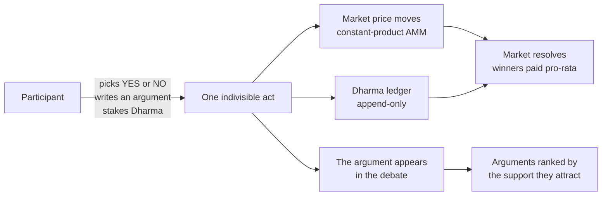

**The vocabulary you will meet below:**

| Term | Meaning |
|---|---|
| **Market** | A binary YES/NO question with a constant-product pool behind it |
| **CPMM** | Constant-product market maker — the pricing engine. Pure TypeScript, no fees, single maker |
| **Pool** | The two reserve numbers, `yes_reserves` and `no_reserves`, that set the price |
| **Bet** | A stake on one side. Always carries exactly one comment |
| **Comment** | An argument. Always rides exactly one bet |
| **Reply-bet** | A reply *is* a Support or Counter bet on the parent argument. Depth is capped at 1 |
| **Dharma** | Soulbound reputation. Append-only ledger. **There is deliberately no transfer table** |
| **Lot** | The per-bet cost-basis record that survives partial sells |
| **Position** | A user's net holding in one market on one side |
| **Resolution** | Settlement — the market closes and winners are paid |
| **Freeze** | 2026-11-05 23:59 UTC. The database becomes read-only. This date is in a table row |

**Four rules the whole product rests on** — these are the reason the database choice matters:

| ID | Rule | How it is enforced today |
|---|---|---|
| **INV-1** | A bet and its comment are atomic | One `SERIALIZABLE` transaction wraps both inserts; `bets.comment_id` is `NOT NULL` |
| **INV-2** | Dharma is non-transferable and cannot go negative | No transfer table exists by design; `CHECK (balance_after >= 0)` on every ledger row |
| **INV-3** | A comment's side is frozen at post time | `comments.side_at_post_time` is immutable after insert |
| **INV-4** | Resolutions are append-only | `resolution_events` and `payout_events` reject `UPDATE` and `DELETE` at the storage layer |

There are **13 machine-checked invariant test specs** at `tests/invariants/` that assert
these against a real Postgres. They are part of the migration's acceptance criteria.

**Operating window:** the experiment runs **2026-09-15 → 2026-11-05**. It is **live now**,
with markets open and people betting. That is the single most important constraint on the
migration plan in §8.

---

## 3. Deep dive A — how data is stored and how it moves

This is the section you asked for: *how our data is stored and works.*

### 3.1 The inventory

**25 tables**, **31 migrations**, **13 monthly partitions** on the event log, **25 event
types**. All money and reputation is `NUMERIC(38,18)` — exact decimal, never a float.

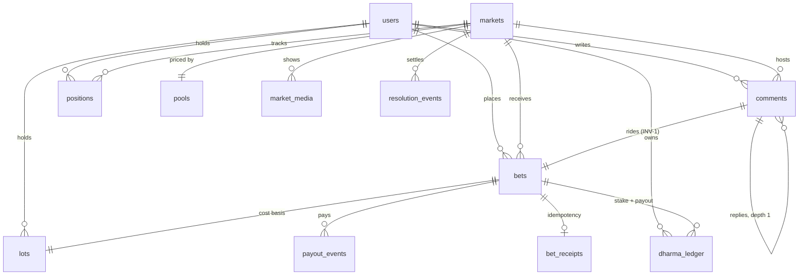

Every table sits in one of three **buckets**, and the bucket is enforced by database triggers
rather than by convention:

| Bucket | Meaning | Tables | Enforcement |
|---|---|---|---|
| **A — strictly append-only** | `UPDATE` and `DELETE` both raise an exception. `TRUNCATE` is blocked at statement level. | **11**: `events`, `dharma_ledger`, `bets`, `comments`, `resolution_events`, `payout_events`, `mod_actions`, `admin_events`, `user_events`, `bet_receipts`, `liquidity_policy` | `0003_append_only_triggers.sql`, `0021`, `0022`, `0027` |
| **B — append-only with one whitelisted transition** | Exactly one column may go `NULL → timestamp`, once. Everything else is rejected. | **3**: `identity_pool`, `image_uploads`, `system_state` | Per-table trigger functions |
| **C — mutable** | Ordinary rows. | `positions`, `bookmarks`, `lots`, `markets`, `pools`, auth tables | — |

> **`lots` is a deliberate special case worth understanding**, because it shows how precise
> this model is. A lot's `surviving_shares` may *decrease* — that is what a partial sell is —
> but a lot may never be *deleted*. So it is Bucket C with a bespoke `BEFORE DELETE` reject
> named `lots_no_delete`, deliberately outside the `bucket_%` family so it does not
> misrepresent itself as append-only. (`drizzle/migrations/0026_lots_no_delete.sql`)

**The eleven Bucket-A triggers are the single most important fact in this document.** They
are why "can an attacker rewrite the ledger" has the answer *no, not even with the
application's own database credentials*. Any target platform has to answer that question as
well or better.

### 3.2 The write path — what one bet actually does

This is the hot path, and it is the reason the database choice is not interchangeable.

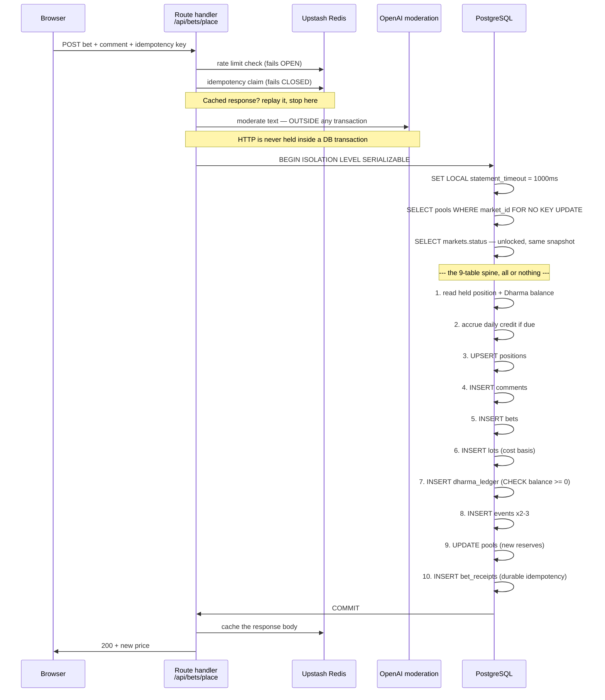

**Five properties of that path that a replacement database must preserve:**

1. **`SERIALIZABLE` isolation with a held row lock.** The pool row is locked
   `FOR NO KEY UPDATE` — deliberately the *weaker* lock, because the bet only touches the two
   reserve columns and `FOR UPDATE` would needlessly serialise the foreign-key checks that
   child inserts perform. (`src/server/bets/transaction.ts`)

2. **A measured retry budget.** Six attempts with full-jitter backoff on bases
   `[50, 100, 200, 400, 800] ms`, retrying only on SQLSTATE `40001` (serialization failure)
   and `40P01` (deadlock). This number is a **measurement, not a guess** — a barrier-released
   storm onto a single pool row:

   | Concurrent writers | Refused at 4 attempts | Refused at 6 attempts |
   |---|---|---|
   | 8 · 16 · 24 · 32 | 0 % | 0 % |
   | 48 | 10.4 % | **0 %** |
   | 64 | 10.9 % | **0 %** |

   The 64-way storm completed end-to-end in 595 ms – 1.0 s. Postgres was never the
   bottleneck; writers were giving up while their turn was still coming.
   (`src/server/bets/transaction.ts`, `tests/scale/write-ceiling-sweep.scale.test.ts`)

3. **A bounded lock hold.** `statement_timeout = 1000 ms` covers the lock *acquire* as well,
   so a stuck transaction can never hold the pool row indefinitely.
   `idle_in_transaction_session_timeout = 30 s` catches a client that stops driving.

4. **Idempotency is durable, not just cached.** `bet_receipts` carries a `UNIQUE` on the
   idempotency key and is the **last write inside the transaction**. A replay hits `23505`
   and the whole transaction rolls back — so a lost Redis cache entry can never produce a
   double charge. (`src/db/schema/bets.ts`, `drizzle/migrations/0022_bet_receipts.sql`)

5. **No HTTP inside a transaction, ever.** Moderation runs *before* `BEGIN`. This is a hard
   architectural rule, because an external call inside a transaction holds the pool lock for
   the duration of someone else's outage.

### 3.3 The settlement path — unbounded fan-out, one transaction

When a market resolves, one transaction:

- reads **every** `positions` row for that market;
- reads **every** `bets` row for that market;
- computes pro-rata payouts against surviving lot basis;
- inserts **one `payout_events` row per bet**;
- inserts `dharma_ledger` rows per winning user;
- writes the terminal `resolution_events` row and flips market status.

All of it commits together or none of it does. (`src/server/resolution/settle.ts:78-175`)

**This is the single hardest requirement to relocate.** There is no safe partial settlement:
a half-paid market is a corrupted ledger, and the ledger is append-only, so it cannot be
cleaned up afterwards.

### 3.4 The read path — the access patterns, enumerated

This is the table a DynamoDB design has to satisfy. We built it by reading every exported
read function under `src/server/`.

| # | Access pattern | Shape in Postgres today | Key-value friendly? |
|---|---|---|---|
| R1 | Market by slug | Index lookup | ✅ Yes |
| R2 | Discovery grid — N open markets + price + totals + media | N lookups + aggregates, cached 15 s | ⚠ Partly |
| R3 | Market totals: `SUM(stake)`, post count, reply count | `SUM` + two `COUNT(*) FILTER` over `comments`/`bets` | ❌ **No — aggregates** |
| R4 | Post ranking substrate | `LATERAL` join across 4 tables, 4 × `COUNT(DISTINCT) FILTER`, 2 × `SUM(COALESCE) FILTER`, `GROUP BY`, `ORDER BY` | ❌ **No** |
| R5 | Reply lane for a post | Join `comments` → `bets` → `lots` with `LIMIT 1 LATERAL` | ❌ **No** |
| R6 | Price chart | **Read-time replay** of `market.opened` + `bet.placed` + `bet.sold` + `pool.liquidity_added` from the event log, ordered database-side to microsecond precision, thinned to 256 points | ⚠ Partly — see §6.4 |
| R7 | Current price / reserves | Single row read of `pools` | ✅ Yes |
| R8 | Viewer's context in a market | Position + balance + held side | ✅ Yes |
| R9 | Dharma balance | Most recent `dharma_ledger` row for the user, ordered by `seq` | ✅ Yes |
| R10 | Profile — arguments, positions, tiles, episode history | Multi-table reads with aggregates | ❌ **No** |
| R11 | Removed-content mask set | Anti-join against `mod_actions` on every body read | ⚠ Partly |
| R12 | Moderation review + audit feed | Joins with filters and ordering | ❌ **No** |
| R13 | Markets due to close | Range scan on `markets.resolution_deadline <= now()` filtered to status `Open` | ⚠ Needs a GSI |
| R14 | Orphaned upload sweep | Range scan on `image_uploads` by terminal state and age | ⚠ Needs a GSI |
| R15 | Conservation / drift checks | Whole-table `SUM` comparisons across `dharma_ledger` vs `positions` | ❌ **No — full aggregate** |

**Score: 4 of 15 are natural key-value lookups. 6 of 15 are relational analytics with no
DynamoDB equivalent.**

The ranking substrate (R4) deserves quoting, because it is what "relational analytics" means
concretely. In one statement it computes, per post:

- `support_count_total` / `counter_count_total` — every reply, counted for display;
- `support_count` / `counter_count` — **distinct people**, self-replies excluded, because
  the product's thesis counts people rather than replies;
- `support_dharma` / `counter_dharma` — summed **surviving lot basis**, so a replier who
  sells out withdraws the weight they lent the parent;
- the parent's own still-held stake, via a `LATERAL` that takes the earliest bet.

Six aggregates, three of them `DISTINCT`, all with different filters, over a four-table join,
in one round trip. (`src/server/debate-view/ranking-substrate.ts:84-220`)

### 3.5 The event log

`events` is the canonical audit ledger: **hand-partitioned by range on `created_at`**, 13
monthly partitions, composite primary key `(event_id, created_at)` because Postgres requires
the partition column in any primary key. One index covers all partitions:
`events_aggregate_idx (aggregate_type, aggregate_id, created_at)`.

`event_type` is deliberately `text` rather than an enum, for open extensibility — the closed
value set is a TypeScript constant of **25 types**, compile-guarded.

The price chart replays this log at read time rather than storing a series. That is a
deliberate choice: there is no derived series to drift from the truth.

### 3.6 Data volume — the number that decides the DynamoDB question

| Measure | Value | Source |
|---|---|---|
| Total rows, production | **~12,000** | `DATABASE-MIGRATION-PLAN.html` §meta — **re-measure before the window** |
| Total size | **under 1 MB** | same |
| Tables | 25 | `src/db/schema/` |
| Peak measured write concurrency on one pool row | 64 writers, 0 % refused | `tests/scale/` |
| Maximum stake per bet | Đ 250 | `src/server/config/limits.ts` |
| Maximum comment length | 5,000 chars | same |
| Reply depth | 1 (flat) | same |
| Live window | 2026-09-15 → 2026-11-05 (~7 weeks) | `CLAUDE.md` §1 |

**Under one megabyte, for a fixed seven-week window.** A `db.t4g.small` has 2 GB of RAM —
the entire database fits in memory with room to spare, several thousand times over. Every
read is a memory read. This is the context in which "should we use a distributed
key-value store" has to be answered.

---

## 4. Deep dive B — the application

### 4.1 Runtime shape

| Property | Value |
|---|---|
| Framework | Next.js 16.3.2, App Router, React 19.2.4, TypeScript strict |
| Runtime | Node 24 |
| Rendering | React Server Components by default; client components only at the leaves |
| Caching | `cacheComponents` enabled — Partial Prerendering, `'use cache'`, `cacheLife`, `cacheTag` |
| ORM | Drizzle 0.45 over `postgres.js` |
| Auth | Better Auth 1.6.11 — Google OAuth + email OTP via Resend + Cloudflare Turnstile |
| Package manager | pnpm 10.33.2 |
| Deploy target | `output: 'standalone'` → Docker → ECR → ECS |

### 4.2 Request topology

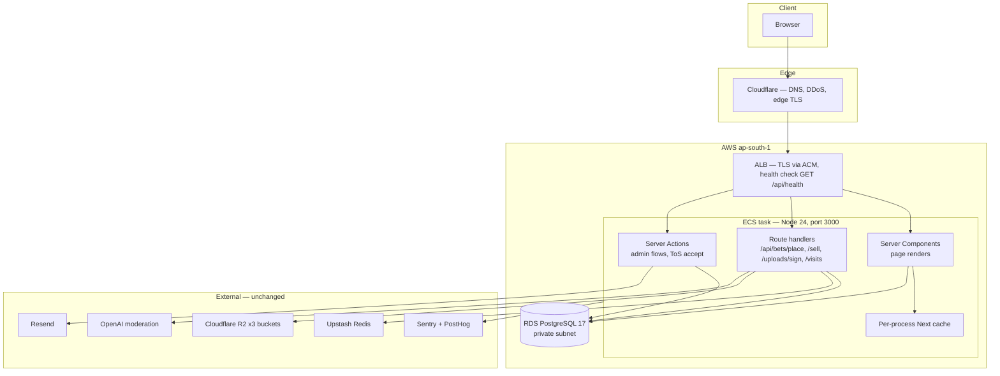

**Three kinds of server entry point, and they have different rules:**

| Kind | Where | Rule |
|---|---|---|
| **Route handlers** | `src/app/api/*/route.ts` — 10 of them | Zod-validated input, envelope response shape, rate limited |
| **Server Actions** | Admin flows, ToS acceptance | Zod-validated, every multi-write wrapped in `db.transaction(...)` |
| **Server Components** | Every page | Read-only. Never import into a `"use client"` component |

### 4.3 The connection pool — and why it is set to 2

This is the strongest single argument for moving compute, so it is worth being precise.

On Vercel, each serverless instance opens its own pool. Under transaction-mode pooling the
binding ceiling is **client** connections, consumed by *instance count × pool size*, whether
or not those sockets do anything.

**Measured on production, 2026-09-17:** 200 concurrent requests spun up **~13 instances**,
and the pooler reported **52 client connections** — 13 × 4 — while Postgres was running one
to three actual queries and holding 7–9 backends of 45. The pool size was therefore *halved
to 2*, not raised, because the thing being protected against is what a **suspended** instance
can strand. (`src/db/index.ts`)

And the timers cannot be relied on to hand a slot back:

> A connection sat idle **620 seconds** with both a 20 s `idle_timeout` and a 600 s
> `max_lifetime` configured and verified live — because Vercel Fluid *suspends* an instance
> between requests, and a suspended instance runs no timers.

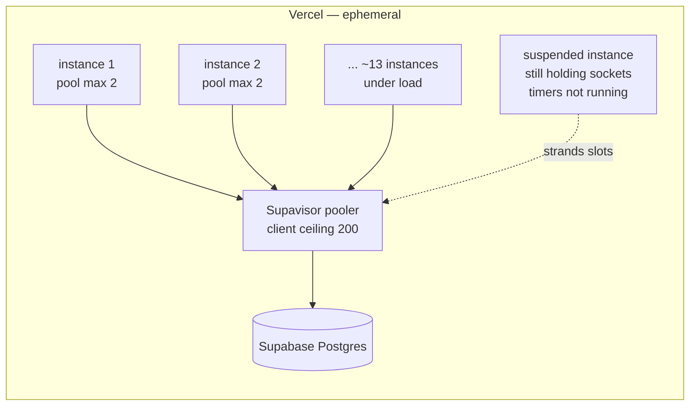

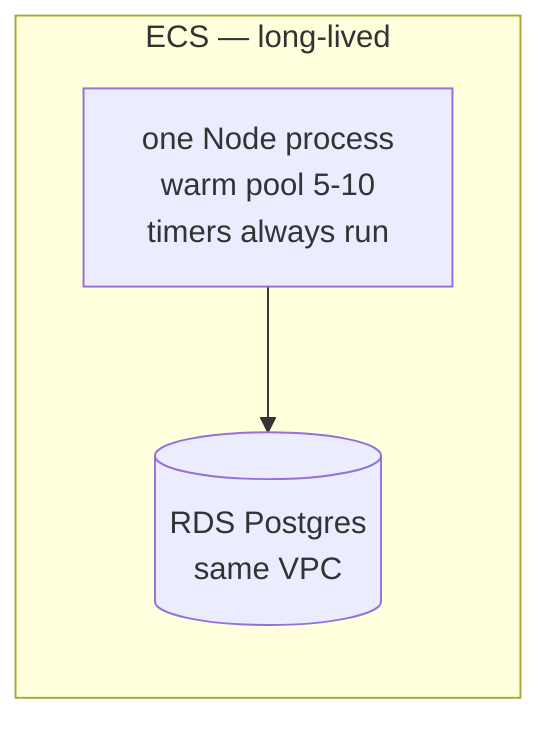

**What moving to ECS changes:** one long-lived process, a warm pool whose timers actually
fire, no cold starts on the CPMM path, and background work — `after()` telemetry, cache
instrumentation — that gets 30 seconds to drain on shutdown instead of being cut off.

### 4.4 The scaling constraint you must know about

```
productionConfig.maxCapacity = 1
```

**This is a correctness constraint, not a capacity one.** `cacheComponents` keeps the Next.js
cache **per process**. A `revalidateTag` raised by a moderation removal reaches only the task
that handled it — so a second task could keep serving a comment that has been removed, for
the length of the cache window. (`infra/config/production.ts:1-12`)

**Consequence:** the app runs as a **single task** until a shared cache handler exists. It
scales *vertically* (bigger instance) rather than horizontally. At this traffic level that is
entirely adequate, and it is honest to state it rather than imply elastic scaling.

**Follow-up work if horizontal scale is ever needed:** implement a Next.js cache handler
backed by Redis — the Upstash instance is already there — then raise `maxCapacity`. That is
a contained piece of work, not an architectural change. It is **out of scope for this
migration** and we recommend keeping it that way.

### 4.5 Two kinds of scheduled work, and they migrate differently

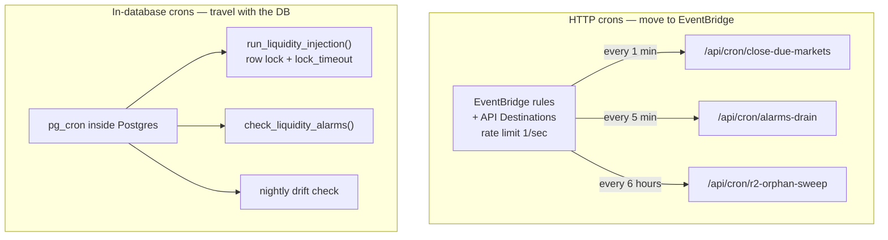

| | HTTP crons | In-database crons |
|---|---|---|
| **Today** | `vercel.json` → 3 paths | `pg_cron` inside Supabase Postgres |
| **Target** | EventBridge Rules → API Destinations, Bearer auth from Secrets Manager | `pg_cron` on RDS, via a **custom parameter group** |
| **Migration risk** | Low — already written in `infra/lib/scheduler-stack.ts` | ⚠ **Medium — these do NOT travel with a `pg_dump`.** They are recreated by hand and must be verified, or markets stop closing and nobody is told |

The in-database half is genuinely load-bearing. The liquidity injector is 470 lines of
PL/pgSQL that takes a `FOR UPDATE` on each open market's pool with a **100 ms
`lock_timeout`**, re-reads market status *under* the lock — because the cursor's snapshot
predates every lock it takes — and holds a total lock budget of 600 ms so it can never
collide with the bet path's non-retryable 1,000 ms `statement_timeout`.

A CloudWatch alarm on **cron silence** (the every-minute job not firing) is already in the
monitoring stack. That alarm is not optional: a silent scheduler failure looks exactly like
a quiet market.

### 4.6 Failure posture — deliberate and asymmetric

| Subsystem | On failure | Why |
|---|---|---|
| Rate limiting | **Fails open** | A Redis outage must not stop people betting |
| Idempotency | **Fails closed** | Better to refuse than to risk a double charge |
| Moderation | Advisory — never blocks a post | Text is fire-and-forget; images are screened at attach, so nothing is served unscreened |
| Database | Fails closed, loudly | A missing `DATABASE_URL` throws at module scope — the build fails rather than a deploy silently pointing at the wrong database |

### 4.7 Containerization — the work not yet done

| # | Task | Notes |
|---|---|---|
| 1 | `output: 'standalone'` in `next.config.ts` | One line |
| 2 | Multi-stage `Dockerfile` | Node 24, must include `sharp`, `public/`, **and `drizzle/migrations/`** — the health endpoint reports migration drift by reading them |
| 3 | `/api/health` reports `APP_COMMIT_SHA` + `APP_REGION` | Canary verification: CI asserts the live endpoint reports the SHA it just deployed |
| 4 | Build-time env parity | `BETTER_AUTH_URL` fails at **build** time, not request time. The domain and URL must be set before the image is built |
| 5 | Graceful shutdown | `stopTimeout: 30 s` is configured; confirm the Node process handles `SIGTERM` and drains |

---

## 5. Deep dive C — the network

### 5.1 Topology

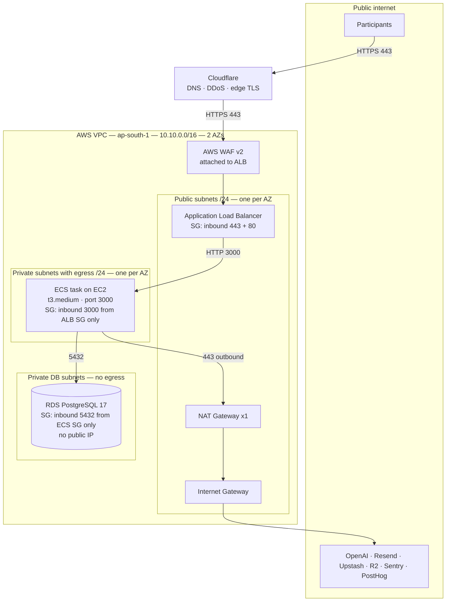

### 5.2 Security groups — the whole access control surface

| Security group | Inbound | Outbound | Effect |
|---|---|---|---|
| **ALB SG** | `0.0.0.0/0` on **443** and **80** | to Service SG on 3000 | The only internet-facing port |
| **Service SG** | **3000 from ALB SG only** — referenced by group, not by CIDR | 443 to anywhere, 5432 to DB SG | The container is unreachable from the internet even though it makes outbound calls |
| **DB SG** | **5432 from Service SG only** | none | The database has **no public IP and no route to the internet** |

**The property worth stating to a security reviewer:** there is no CIDR-based rule anywhere
in the chain. Every rule references another security group, so re-addressing the VPC cannot
silently widen access.

### 5.3 Ingress path, hop by hop

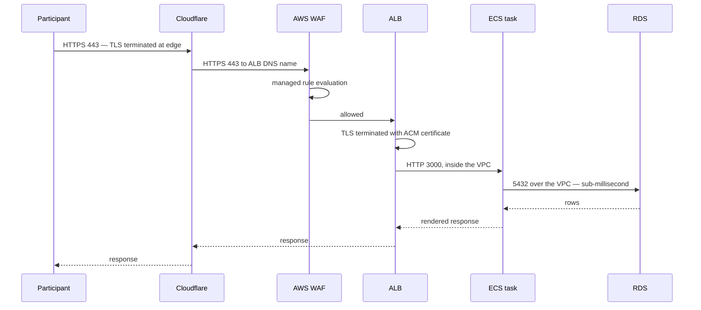

**Two TLS terminations, deliberately.** Cloudflare terminates at the edge for DDoS and
caching; ACM terminates at the ALB so the certificate is AWS-managed and auto-renewing. The
ALB→ECS hop is plain HTTP **inside the VPC**, which is standard and is why the Service SG
accepts traffic only from the ALB's security group.

### 5.4 Egress path — what leaves the VPC

| Destination | Port | Path | Purpose |
|---|---|---|---|
| OpenAI | 443 | NAT → IGW | Text and image moderation, 3 s timeout, 1 retry |
| Upstash Redis | 443 | NAT → IGW | Rate limits, idempotency, cache metrics. REST, not TCP |
| Cloudflare R2 ×3 buckets | 443 | NAT → IGW | Uploads, profile pictures, market media. S3-compatible, presigned URLs |
| Resend | 443 | NAT → IGW | Email OTP |
| Google OAuth | 443 | NAT → IGW | Sign-in |
| Cloudflare Turnstile | 443 | NAT → IGW | Bot check |
| Sentry / PostHog | 443 | NAT → IGW | Errors and product analytics |
| ECR / Secrets Manager / CloudWatch | 443 | NAT → IGW | Image pull, secret read, logs |

**One NAT Gateway, not two.** A second NAT would give per-AZ egress resilience. With a
single task and a single-AZ-at-a-time failure mode, one is sufficient — **but it is a single
point of failure for outbound traffic and should be stated as such.** Adding a second is a
configuration change (`natGateways: 2`), not a redesign.

> **Improvement worth taking:** the AWS-destined egress (ECR, Secrets Manager, CloudWatch
> Logs, S3) can go through **VPC endpoints** instead of the NAT. AWS-internal traffic then
> never leaves the AWS network, and the NAT is out of the path for image pulls and secret
> reads at task start. Recommended as a fast follow, not a blocker.

### 5.5 Latency budget — why region placement is the whole story

This is already proven in production, and it is the most dramatic number in this document.

**PERF-1**: Vercel functions were running in `iad1` (Virginia) against a Mumbai database.
The fix was to put compute in the same region as the data:

| Measure | Before | After | Change |
|---|---|---|---|
| Per-round-trip latency | **361.6 ms** | **5.34 ms** | **−98.5 %** |
| Discovery page p50 | **35.07 s** | **0.692 s** | **−98 %** |

The Discovery page issues many sequential reads. At 361 ms each, that is 35 seconds. At
5.34 ms each, it is under a second. **Moving to RDS inside the same VPC as ECS takes that
5.34 ms down again**, because the hop stops crossing a pooler and the public internet.

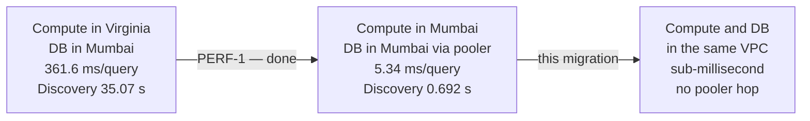

**⚠ One live caveat you should know:** the fix is on `main` and on staging, but the
production alias is still pinned to an older build reporting `region: None`. That is a
pending promotion, not a defect — and it means **the production numbers above are the
staging-verified ones.**

### 5.6 What we recommend adding to the network design

| # | Recommendation | Why | Priority |
|---|---|---|---|
| N1 | **VPC endpoints** for ECR, Secrets Manager, CloudWatch Logs, S3 | Keeps AWS-internal traffic inside AWS and takes the NAT out of the secret-read path | High |
| N2 | **RDS Proxy**, or a deliberate decision not to use it | The pool settings were tuned against Supavisor. On RDS this becomes direct connections or RDS Proxy. **Decide and prove under rehearsal rather than assume** | High |
| N3 | **Restrict ALB ingress to Cloudflare IP ranges** | Today the ALB accepts 443 from `0.0.0.0/0`, so the origin is reachable directly and Cloudflare can be bypassed | Medium |
| N4 | ~~Redirect port 80 → 443~~ | **Already done** — the ALB registers an HTTP listener that redirects to HTTPS when a certificate is configured (`compute-stack.ts:272`). Listed here only so a reviewer does not re-raise it | ✅ Closed |
| N5 | **Second NAT Gateway** | Only if per-AZ outbound resilience is judged necessary | Low |
| N6 | **Flow logs on the VPC** | Forensics; currently not configured | Low |

---

## 6. The DynamoDB evaluation

We did not dismiss this. This section contains the DynamoDB design we would build if we were
building it, and the exact points at which it fails.

### 6.1 The method

A DynamoDB design is judged by one question: **can every access pattern be served by a
`Query` against a partition key, with at most a handful of Global Secondary Indexes?** If a
pattern needs a `Scan`, a join, or an aggregate, it must instead be served by a
**pre-computed item that is maintained on every write**.

So the evaluation is: (a) design the table, (b) list what has to be maintained, (c) check
whether the maintenance fits inside DynamoDB's transaction limits.

### 6.2 The single-table design, honestly attempted

```
Table: zugzwang
  PK (partition key)          SK (sort key)                    Item
  ─────────────────────────── ──────────────────────────────── ─────────────────────
  MARKET#<id>                 META                             market row
  MARKET#<id>                 POOL                             yes/no reserves
  MARKET#<id>                 TOTALS                           ← derived, must be maintained
  MARKET#<id>                 POST#<ts>#<commentId>            top-level comment
  MARKET#<id>                 EVENT#<ts>#<eventId>             event log entry
  COMMENT#<id>                META                             comment body + side
  COMMENT#<id>                RANK                             ← derived, must be maintained
  COMMENT#<id>                REPLY#<ts>#<replyId>             reply comment
  BET#<id>                    META                             bet row
  BET#<id>                    LOT                              cost basis
  USER#<id>                   PROFILE                          user row
  USER#<id>                   BALANCE                          ← derived, must be maintained
  USER#<id>                   LEDGER#<seq>                     dharma ledger entry
  USER#<id>                   POS#<marketId>#<side>            position
  IDEM#<key>                  RECEIPT                          idempotency receipt

GSI1 — closing markets:   PK = STATUS#Open,  SK = closes_at
GSI2 — user's bets:       PK = USER#<id>,    SK = BET#<ts>
GSI3 — moderation queue:  PK = MODSTATE#<s>, SK = created_at
```

That design is *reasonable*. It handles R1, R7, R8, R9, R13 cleanly. Now the problems.

### 6.3 Blocker B1 — the bet transaction does not fit the primitive

A bet writes to **9 tables**. In the DynamoDB model that is 10–12 items, which is inside the
100-item cap. So the item count is not the problem. **Three other things are:**

**(a) There is no lock, and the pool is a read-modify-write.**

The CPMM price depends on the current reserves. The flow is: read reserves → compute new
reserves → write them. Postgres does this with `SELECT … FOR NO KEY UPDATE`, which makes
concurrent bettors queue. DynamoDB has no lock; the equivalent is a `ConditionExpression`
asserting the reserves are unchanged — **optimistic** concurrency. Under the 64-writer storm
we measured, optimistic concurrency does not queue, it **collides**, and every collision is a
full client-side retry of the entire 12-item transaction.

Postgres, measured: **0 % refused at 64 concurrent writers.** DynamoDB optimistic retry under
the same contention on a single hot item would be materially worse, and the failure mode is
a user-visible "try again" on the money path.

**(b) There is no `CHECK (balance_after >= 0)` across items.**

`ConditionExpression` constrains **one item**. The Dharma rule is that a ledger row's
`balance_after` must be non-negative *and* equal the previous row's balance plus this
row's amount. That is a **chain** property across items. In DynamoDB it becomes application
code holding a `BALANCE` item under a version condition — enforceable, but now the invariant
lives in code we wrote rather than in the engine.

**(c) `dharma_ledger.seq` is a database-assigned monotonic identity.**

`GENERATED ALWAYS AS IDENTITY` gives a total order per user that *is* the insert order.
DynamoDB has no sequences. The replacement is a counter item incremented in the same
transaction — which adds a second hot item per user and another condition that can fail.

### 6.4 Blocker B2 — settlement exceeds the transaction ceiling

| | Postgres today | DynamoDB |
|---|---|---|
| Items written at settlement | 1 `payout_events` row per bet + ledger rows per winner + 1 resolution row + position updates | same count |
| Atomicity | **Unbounded** — one transaction, any size | **100 items, 4 MB, hard cap** |
| A 60-bet market | fine | ~130+ items → **exceeds the cap** |
| A 200-bet market | fine | **impossible as one transaction** |

The workaround is a saga: chunk the settlement into ≤100-item transactions with a
compensation path. **On an append-only ledger there is no compensation path** — you cannot
delete a payout row to undo a half-finished settlement. You would have to introduce
reversal entries, which changes the ledger's semantics and every conservation check built on
it.

This alone is disqualifying.

### 6.5 Blockers B3–B5 — enforcement, analytics, and the in-database scheduler

**B3 — immutability moves from the engine to the application.**

| | Postgres | DynamoDB |
|---|---|---|
| Can the app UPDATE a ledger row? | **No.** Trigger raises an exception | Yes, unless every call site remembers `attribute_not_exists(PK)` |
| Can the app DELETE one? | **No.** Trigger raises | Yes, unless IAM denies `DeleteItem` — which also blocks legitimate deletes elsewhere in the table |
| Can a database superuser? | Only by dropping the trigger — a schema change, visible in migration history | Yes, silently |
| Is there an audit test? | **Yes** — `tests/db/triggers/` — one spec per protected table, plus a positive control | Would have to be rebuilt as IAM policy tests |

For a system whose entire thesis is *the reputation ledger is trustworthy*, moving that
guarantee from "the storage engine refuses" to "our code always remembers" is a real
downgrade. It is the kind of thing that is fine for years and then is not.

**B4 — six of fifteen read patterns have no DynamoDB form.**

Every aggregate becomes a maintained counter, and every maintained counter becomes an extra
item inside the bet transaction — which feeds straight back into B1:

| Aggregate | Maintained as | What it adds |
|---|---|---|
| `SUM(bets.stake)` per market | `MARKET#x / TOTALS.dharmaStaked` | +1 item per bet |
| post count, reply count | same item | included |
| `COUNT(DISTINCT user)` support/counter per post | `COMMENT#x / RANK` — **and `DISTINCT` cannot be maintained by increment**; it needs a per-post set of user ids | +1 item, unbounded growth |
| `SUM(surviving_basis)` per post | same item | +1 item |
| Conservation check — whole-ledger sums | **no form at all** — a full table scan | operational only |

The `DISTINCT` one is worth dwelling on. `COUNT(DISTINCT rc.user_id)` cannot be incremented,
because you must know whether this user has already replied. You must store the set. A post
with 500 repliers stores 500 user ids in one item, against a **400 KB item limit**, and
every new reply rewrites the whole set.

**B5 — `pg_cron` has no equivalent.** The liquidity injector's correctness depends on taking
a row lock with a timeout and re-reading status under it. On DynamoDB that becomes a Lambda
implementing distributed locking by hand — reimplementing, less well, what the database
already does.

### 6.6 What DynamoDB *would* legitimately be good for here

To be fair to the suggestion, three components genuinely fit the DynamoDB model:

| Component | Today | DynamoDB fit | Verdict |
|---|---|---|---|
| **Idempotency receipts** | `bet_receipts` in Postgres + Upstash cache | ✅ Perfect — key-addressed, TTL, conditional put | **But it must be in the same transaction as the bet**, which is exactly why it is in Postgres. Moving it breaks the guarantee it exists to provide |
| **Rate limiting** | Upstash Redis | ✅ Good fit | Upstash already does this. No reason to move |
| **Session storage** | Better Auth in Postgres | ✅ Good fit | Would save a few Postgres reads. Session reads were already optimised away in a recent change. **Marginal** |

**None of these is worth a second datastore.** Adding DynamoDB alongside RDS means two
consistency models, two backup stories, two failure modes and two things to reason about at
3 a.m., for a workload measured in kilobytes.

### 6.7 Side-by-side

| Dimension | RDS PostgreSQL 17 | DynamoDB | Winner |
|---|---|---|---|
| Multi-entity ACID transaction | Unbounded, `SERIALIZABLE` | 100 items, 4 MB, no isolation level | **RDS** |
| Settlement fan-out | Native | Requires a saga on an append-only ledger | **RDS** |
| Immutability enforcement | Storage-engine triggers | Application discipline + IAM | **RDS** |
| Exact decimal money | `NUMERIC(38,18)` native | Number type, 38 digits, app-side arithmetic | **RDS** |
| Joins and aggregates | Native | None — maintained counters | **RDS** |
| Ordering and sequences | `ORDER BY`, `IDENTITY` | Sort key only, no sequences | **RDS** |
| In-database scheduling | `pg_cron` | None | **RDS** |
| Code change required | **Zero** — same SQL, new address | **Rewrite of the entire data layer** | **RDS** |
| Operational overhead | Patching, backups, sizing | Effectively none | **DynamoDB** |
| Scale ceiling | One node — vertical | Effectively unlimited | **DynamoDB** |
| Cold start / connection limits | Pool management needed | None | **DynamoDB** |

**DynamoDB wins on operational simplicity and scale ceiling. It loses on every property
this specific product depends on.** The rewrite is a multi-month re-engineering of the money
path, during a live seven-week experiment, on a system whose value proposition is that its
ledger is trustworthy.

### 6.8 Verdict

> **Keep PostgreSQL on RDS.**
>
> The migration as planned is a **change of address** — the same SQL, the same schema, the
> same guarantees, a new host. It can be rehearsed, verified row-by-row, and rolled back by
> changing one setting.
>
> A DynamoDB migration would be a **change of substance**. It would require reimplementing
> atomicity, immutability, ordering, aggregation and scheduling in application code, and
> would relax at least two of the four invariants the product is built on.
>
> **We recommend revisiting DynamoDB only if a future version of this product develops a
> genuine horizontal-scale problem** — millions of rows, write throughput beyond one node —
> and even then, for the high-volume append-only surfaces (events, telemetry) rather than the
> ledger.

---

## 7. Target architecture on AWS

### 7.1 Full picture

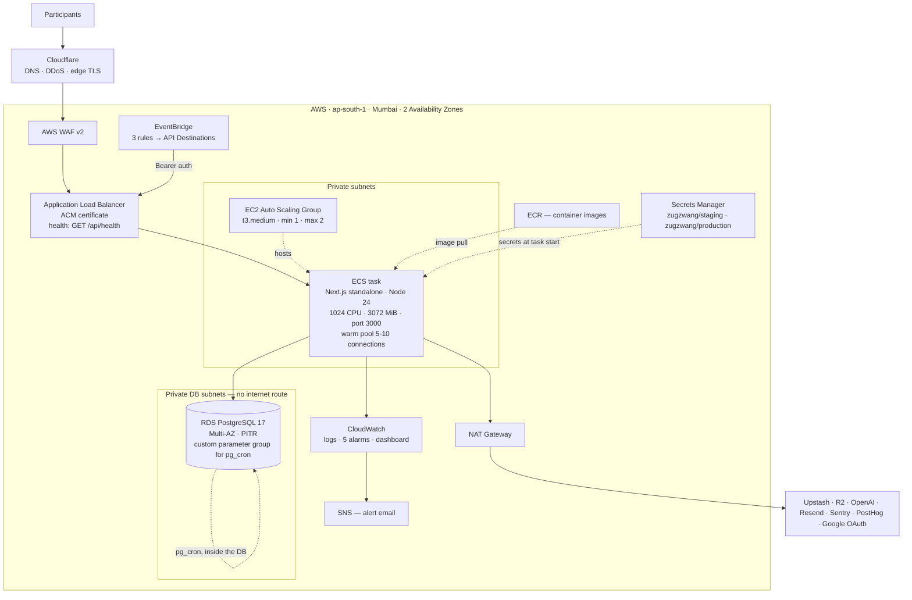

### 7.2 The five CDK stacks, already written

| Stack | File | Creates | Status |
|---|---|---|---|
| **Network** | `infra/lib/network-stack.ts` | VPC `10.10.0.0/16`, public + private subnets across 2 AZs, ALB SG, Service SG | ✅ Synthesised |
| **Security** | `infra/lib/security-stack.ts` | ECR repository, Secrets Manager reference, task execution role, task role, log group | ✅ Synthesised |
| **Compute** | `infra/lib/compute-stack.ts` | ECS cluster, EC2 ASG, launch template, ALB, target group, task definitions, WAF | ✅ Synthesised |
| **Scheduler** | `infra/lib/scheduler-stack.ts` | EventBridge connection, 3 API destinations, 3 rules, rate-limited to 1/sec | ✅ Synthesised |
| **Monitoring** | `infra/lib/monitoring-stack.ts` | SNS topic, 5 alarms, cron-silence alarm, dashboard | ✅ Synthesised |

Ten stacks in total — five staging, five production. `pnpm tsc --noEmit` passes with zero
errors and `cdk synth` output is verified in `infra/cdk.out`.

**Configuration is environment-driven**: every value that differs between staging and
production lives in `infra/config/{staging,production}.ts`, so `cdk diff` between the two
environments is a diff of one file. **No secret value ever appears in configuration** — only
the Secrets Manager secret name and the JSON keys inside it.

### 7.3 Production sizing as configured

| Setting | Value | Note |
|---|---|---|
| Region | `ap-south-1` | **Pinned, never inherited** from the operator's AWS profile |
| VPC CIDR | `10.10.0.0/16` | 2 AZs |
| NAT Gateways | 1 | Resilience decision — see §5.4 |
| EC2 instance | `t3.medium` | ASG min 1, max 2 (max 2 gives a rolling deploy room to land) |
| Task CPU / memory | 1024 units / 3072 MiB hard, 1024 MiB soft reservation | Soft reservation below hard ceiling lets old and new tasks co-reside during a deploy |
| Desired count | 1 | **`maxCapacity: 1` — see §4.4** |
| Stop timeout | 30 s | Background drain |
| Deregistration delay | 30 s | |
| Health check grace | 90 s | |
| WAF | Enabled | |
| Log retention | 90 days | |
| Alarms | 5xx > 5 per 5 min · p95 > 2 s · CPU > 80 % · memory > 80 % · unhealthy hosts · cron silence | → SNS email |

### 7.4 RDS sizing recommendation

Not yet in configuration — **this is a decision we need from you.**

| Option | Instance | Storage | Multi-AZ | Recommendation |
|---|---|---|---|---|
| Minimum | `db.t4g.micro` | 20 GB gp3 | No | Staging only |
| **Recommended** | **`db.t4g.small`** | **20 GB gp3** | **Yes** | **Production** — 2 GB RAM holds the whole database many times over; Multi-AZ gives automatic failover |
| Headroom | `db.t4g.medium` | 50 GB gp3 | Yes | Only if profiling says so |

Plus: automated backups **7 days minimum**, point-in-time recovery **on from day one**,
deletion protection **on**, and a **custom parameter group** with `shared_preload_libraries`
including `pg_cron` — without which the in-database schedulers do not run.

---

## 8. Migration plan

The database cutover runbook already exists as `DATABASE-MIGRATION-PLAN.html` and is
**unchanged by this document**. What follows is the full programme, with the database
migration as one phase inside it.

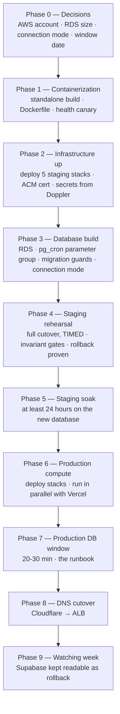

### 8.1 Phase detail and risk

| Phase | Work | Duration | Risk | Rollback |
|---|---|---|---|---|
| **0** | Account, sizing, window date, named stop authority | — | — | — |
| **1** | `output: 'standalone'`, Dockerfile, health canary fields | 1–2 days | Low | No production impact |
| **2** | Deploy staging stacks, ACM certificate, Secrets Manager populated from Doppler | 1 day | Low | `cdk destroy` |
| **3** | RDS instance, `pg_cron` parameter group, **rewrite the migration safety guards**, decide direct-vs-RDS-Proxy | 2 days | **Medium** — the guards today refuse to run unless the connection string contains the Supabase project identifier. Against RDS they would either block every migration or stop protecting the right thing | Not yet live |
| **4** | Full cutover rehearsal on staging, **timed**, verification checklist, rollback performed | 1 day | Low — that is what staging is for | N/A |
| **5** | Staging runs on RDS, watched: the every-minute job firing, connection counts flat, memory steady | ≥24 h | Low | Point staging back |
| **6** | Production stacks deployed, running in parallel with Vercel, not yet receiving traffic | 1 day | Low | Traffic still on Vercel |
| **7** | **The production window.** Writes stop → final dump → restore → recreate `pg_cron` jobs → 9-point verification → change one setting → start | 20–30 min | **High — this is the live moment** | Point the setting back at Supabase |
| **8** | Cloudflare DNS → ALB | Minutes | Medium | Change the record back |
| **9** | Watching week, Supabase kept alive read-only ≥1 week | 7 days | — | Diminishing over time |

### 8.2 The verification gate

Nine checks run against the new database **before** the application is pointed at it. Every
line must pass; one failure stops the migration.

| # | Check | Why this one |
|---|---|---|
| 1 | Row counts match, table by table | There is already a tool that does this and exits non-zero on mismatch |
| 2 | Append-only protections present | Data without the triggers is not the same database |
| 3 | A test `DELETE` against `bets` is **rejected** | Proves the triggers are armed, not merely present |
| 4 | All 13 events partitions exist | A missing partition loses history silently |
| 5 | `pg_cron` jobs registered and firing | Otherwise markets stop closing and nobody is told |
| 6 | Migration history matches the code | The health endpoint reports this directly |
| 7 | `pnpm test:invariants` passes — 13 specs | The four rules, checked by machine |
| 8 | `system_state.frozen_at` preserved exactly | The experiment's end date lives in a row |
| 9 | Dharma ledger totals match, old and new | The strongest single check that nothing was lost |

### 8.3 Two things that do not travel with the data

Worth repeating because both fail *silently*:

1. **The `pg_cron` job registrations.** A `pg_dump` carries the PL/pgSQL functions but not
   the `cron.schedule()` registrations. Missing them means markets stop closing. Check 5
   exists for exactly this.
2. **The migration safety guards.** They are hard-coded against the Supabase project
   identifier. They must be rewritten, reviewed and tested **before** the window, never
   during it.

### 8.3.1 ⚠ A defect in the current dump/restore commands

The earlier guide specifies:

```bash
pg_dump    ... --data-only --disable-triggers -Fc > supabase_data.dump
pg_restore ... --data-only --disable-triggers supabase_data.dump
```

`--disable-triggers` issues `ALTER TABLE … DISABLE TRIGGER ALL`, which requires **table
ownership or superuser**. On RDS there is no true superuser — the master user holds
`rds_superuser`, which is not the same thing — and the tables are owned by whichever role
Drizzle ran the migrations as.

**Three consequences, and the third is the dangerous one:**

1. The restore may simply fail on permissions. Loud, recoverable, fine.
2. It may succeed as the owning role — in which case the append-only triggers are
   **disabled for the duration of the restore**, which is correct and necessary, because
   a `--data-only` load into Bucket-A tables would otherwise be rejected by the very guards
   we are trying to preserve.
3. **If re-enabling is not verified afterwards, the database comes up with its immutability
   guards switched off** — and everything looks entirely normal. Reads work. Writes work.
   Nothing errors. The ledger is simply no longer protected.

**Mitigation, and this is why verification check 3 exists:** the checklist does not ask
whether the triggers are *present*, it asks that a test `DELETE` against `bets` is
**rejected**. A present-but-disabled trigger passes a presence check and fails that one.
Run it as the application role, not as the master user.

**Action:** rehearse the exact dump/restore command pair in Phase 4 and record which role
runs it. Do not carry the commands from the earlier guide into the window unchanged.

### 8.4 An honest note on timing

The same migration becomes **markedly simpler after 5 November**, when the freeze makes the
database read-only and removes the possibility of writes landing in two places at once.

Doing it now is achievable and the plan is built for it. **But if the date is flexible, later
is safer, and the work is identical.** We would rather say that than discover it in the
window.

---

## 9. Risks, and what we need from you

### 10.1 Risk register

| # | Risk | Likelihood | Impact | Mitigation |
|---|---|---|---|---|
| R1 | **Writes land in two databases during the window** | Low | **Critical — unrepairable** | Writes stop *before* the dump. Never overlapping. This is the single reason the plan uses a window rather than live replication |
| R2 | `pg_cron` jobs not recreated | Medium | High — markets stop closing silently | Verification check 5; CloudWatch cron-silence alarm |
| R3 | Migration guards block or mis-protect | Medium | Medium | Rewritten and tested in Phase 3, before the window |
| R4 | Connection mode wrong on RDS | Medium | Medium | Proven under the Phase 4 rehearsal, not assumed |
| R5 | `maxCapacity: 1` misread as a scaling ceiling problem | Low | Low | Stated in §4.4; shared cache handler is a known follow-up |
| R6 | Single NAT Gateway fails | Low | High — all outbound stops | Accept, or add a second (§5.6 N5) |
| R7 | Cloudflare bypassed via the ALB directly | Medium | Medium | Restrict ALB ingress to Cloudflare ranges (§5.6 N3) |
| R8 | Window runs long | Medium | Medium | Phase 4 rehearsal turns the estimate into a measurement |
| R9 | Migration attempted too close to the 5 Nov freeze | — | High | Do not schedule in the final days. See §8.4 |
| R10 | **Append-only triggers left disabled after the restore** | Medium | **Critical — silent** | Verification check 3 is a *behavioural* test, not a presence test: a `DELETE` against `bets` must be **rejected**. See §8.3.1 |

### 10.2 Decisions we need from you

| # | Decision | Default if unanswered |
|---|---|---|
| D1 | **Is the DynamoDB recommendation in §6.8 accepted?** | Proceed with RDS |
| D2 | AWS account and region confirmation | New account, `ap-south-1` |
| D3 | RDS instance class and Multi-AZ | `db.t4g.small`, Multi-AZ |
| D4 | Backup retention | 7 days + PITR |
| D5 | NAT Gateway — keep 1, go to 0, or 2 | Keep 1 |
| D6 | RDS Proxy — yes or no | Decide under rehearsal |
| D7 | Window date and hour, with the operator present | ~04:00 IST, low traffic |
| D8 | **Named person with stop authority** | — **required** |
| D9 | Restrict ALB ingress to Cloudflare | Recommended yes |
| D10 | Migrate before or after the 5 Nov freeze | See §8.4 |

### 10.3 What would change our recommendation

We would revisit DynamoDB if any of these became true:

- The dataset grew past what a single Postgres node serves comfortably — realistically
  hundreds of gigabytes, not one megabyte;
- The write pattern became append-only and key-addressed, with the ledger's chain and
  settlement fan-out removed from the product;
- Multi-region active-active became a requirement;
- The invariants in §2 were relaxed by product decision — specifically, if bet-and-comment
  atomicity or ledger immutability stopped being hard requirements.

**None of these is true today, and the first three are unlikely for a seven-week experiment.**

---

## 10. Appendix — evidence index

Every claim in this document traces to a file in the repository.

| Claim | Location |
|---|---|
| Bet transaction: `SERIALIZABLE`, `FOR NO KEY UPDATE`, 6-attempt retry, 1 s statement timeout | `src/server/bets/transaction.ts` |
| Bet write spine — 9 tables in one transaction | `src/server/bets/place.ts:98-315` |
| Sell path | `src/server/bets/sell.ts` |
| Settlement fan-out — all positions, all bets, one transaction | `src/server/resolution/settle.ts:78-175` |
| Append-only triggers — 11 Bucket-A tables | `drizzle/migrations/0003_append_only_triggers.sql` |
| TRUNCATE guards | `drizzle/migrations/0021`, `0022`, `0027` |
| `lots` bespoke DELETE guard | `drizzle/migrations/0026_lots_no_delete.sql` |
| Dharma ledger — `NUMERIC(38,18)`, `CHECK (balance_after >= 0)`, `seq` identity, no transfer table | `src/db/schema/dharma.ts` |
| Durable idempotency receipts | `src/db/schema/bets.ts`, `drizzle/migrations/0022_bet_receipts.sql` |
| Events partitioning — 13 partitions, composite PK, `events_aggregate_idx` | `drizzle/migrations/0002_events_partitioning.sql` |
| 25 event types, compile-guarded | `src/server/events/schemas.ts` |
| Ranking substrate — `LATERAL`, `COUNT(DISTINCT) FILTER`, `SUM FILTER` | `src/server/debate-view/ranking-substrate.ts:84-220` |
| Market totals aggregate | `src/server/debate-view/market-totals.ts:34-45` |
| Price chart — read-time event replay, ordered database-side | `src/server/discovery/price-series.ts:180-245` |
| Connection pool — `max: 2`, `prepare: false`, measured instance behaviour | `src/db/index.ts` |
| Liquidity injector — 470 lines PL/pgSQL, row lock, `lock_timeout` | `drizzle/migrations/0027_liquidity_injector_pg_cron.sql` |
| Lock-budget tightening after security review | `drizzle/migrations/0029_liquidity_policy_ceilings_tightened.sql` |
| `maxCapacity: 1` and why | `infra/config/production.ts:1-12` |
| Production sizing | `infra/config/production.ts` |
| Network stack — VPC, subnets, security groups | `infra/lib/network-stack.ts` |
| Compute stack — ECS, ASG, ALB, WAF | `infra/lib/compute-stack.ts` |
| Scheduler stack — EventBridge, rate limit 1/sec | `infra/lib/scheduler-stack.ts` |
| Monitoring stack — 5 alarms + cron silence | `infra/lib/monitoring-stack.ts` |
| Secret key inventory | `infra/config/types.ts` |
| HTTP cron schedules today | `vercel.json` |
| Limits — stake ceiling, comment length, reply depth, poll cadence | `src/server/config/limits.ts` |
| PERF-1 — 361.6 → 5.34 ms, Discovery 35.07 → 0.692 s | `AGENTS.md` §3 |
| Invariant specs — 13 on disk | `tests/invariants/` |
| Trigger specs | `tests/db/triggers/` |
| Write-concurrency measurement | `tests/scale/write-ceiling-sweep.scale.test.ts` |
| Data volume ~12,000 rows / <1 MB | `docs/reports/DATABASE-MIGRATION-PLAN.html` — **re-measure before the window** |

---

### Document control

| | |
|---|---|
| Prepared by | Zugzwang Engineering |
| Reviewed against | Live repository, branch `feat/aws-cdk-migration`, 2026-09-21 |
| Status | For client review |
| Next action | Decisions D1–D10 in §9.2 |
| Related | `DATABASE-MIGRATION-PLAN.html` — cutover runbook · `infra/README.md` — CDK usage |

*Confidential.*
