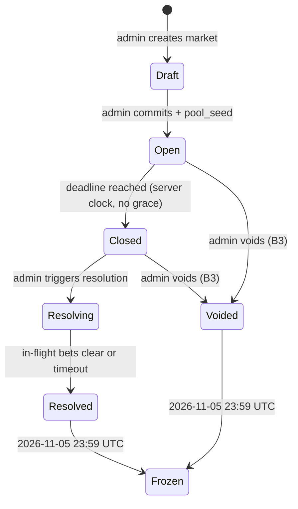
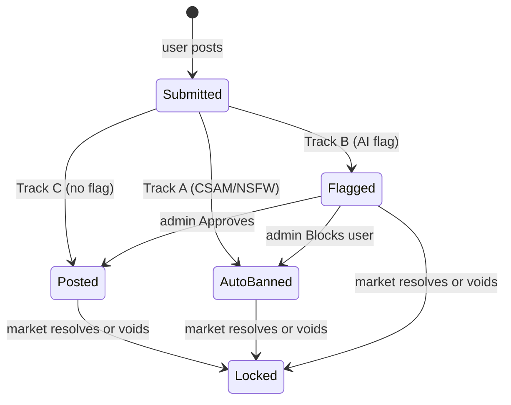
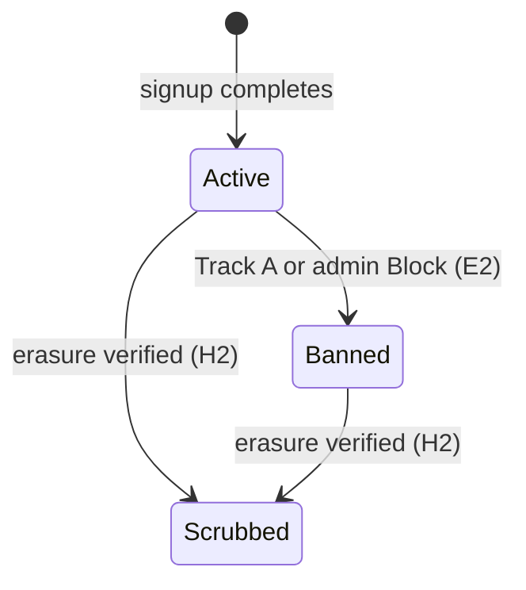

# Zugzwang — Product Specification (SPEC.1)

> **Reader contract:** SPEC.1 is the source of truth for what the Zugzwang
> Experiment does and why. Architecture lives in SPEC.2. Build contract lives
> in `CLAUDE.md` and `AGENTS.md`. Architectural Decision Records in `docs/adr/`
> override. When this document and code disagree, this document wins until
> updated by an ADR.

---

## §0 Document Metadata

*Thesis relevance: (b) operationally enabling.*

- **Version:** 1.8.0-draft (semver; bump major on invariant changes)
- **Last updated:** 2026-05-08
- **Authors:** The Zugzwang Authors
- **Status:** Draft (promotes to Approved on v1.0.0 lock)
- **Related contracts:** `CLAUDE.md`, `AGENTS.md`, `docs/specs/SPEC.2.md` (architecture, forthcoming), `docs/adr/`
- **Reader:** Claude Code (primary), human reviewers (secondary)
- **Source decisions absorbed:** `spec1_gap_decisions.md` (75 rows resolved 2026-04-30); `cluster_a_ratify.md` (19 defaults); `cluster_b_decisions.md` (privacy/identity, 5 rows); `cluster_c_decisions.md` (visibility/brand/conclusion, 6 rows); `cluster_d_decisions.md` (operational edges, 4 rows); `cluster_e_decisions.md` (E1+E2 moderation, provisional); `cluster_launch_surfaces.md` (I1/I4/I5/I6); `Cluster_B` (A2 award formula, B1 lifecycle, B5 admin role); `Meta-rule__Prior-art_reference_policy`.
- **Parked outside SPEC.1 scope:** A6 → `FOUND.1` (pre-registered hypothesis); J1 → Hrishikesh sole owner (refusal: spec does not invent market content); J9 → number-tuning pass.

---

## §1 One-Paragraph Product Description

*Thesis relevance: (a) directly testing K × n > C.*

The Zugzwang Experiment is a Reputation Market — a platform for debate over the questions facing humanity, where participants stake reputation rather than capital, built to test whether true knowledge prevails over manipulative capital across the course of a debate, and so shape what happens next in humanity's favour.

The user is anyone, anywhere, who holds a position on a contested question facing humanity and is willing to put their reputation behind it. The problem the protocol tests is that in current opinion-formation systems, capital systematically outweighs knowledge: a well-funded actor with weak claims can swamp informed actors who lack the money to push back, and by the time the world resolves the question, the prevailing narrative has already shaped what gets decided.

Every debate on Zugzwang takes the same shape. A *Ruling Party* commits to one side of a contested question and stakes reputation on it; an *Opposition* commits to the other and stakes equally; an *Audience* reads, watches, and forms a view, with the freedom to cross into either side as the debate persuades them. The two staked sides are structurally symmetrical — neither is presumed correct, neither carries more institutional weight.

The mechanism is a prediction market, but the unit of stake is reputation. Prediction markets are well-studied for the way game theory pulls private information into a public signal: a participant who believes the market price is wrong faces an incentive to act, because acting on a true belief is rewarded with reputation, and acting on a false belief costs them reputation. The aggregate of these individual decisions is a price that reflects what the staking population collectively believes, weighted by how much each participant is willing to risk. Zugzwang inherits this property and binds it to reputation. A staked position must be accompanied by an argument; the record of who said what under what stake is permanent and public; and the visibility of stake-backed correctness draws further informed participants in, growing the population of knowledgeable voices over the course of the debate.

Zugzwang's wager is that this combination — reputation as the staked unit, argument as a precondition for staking, an immutable record as the substrate — produces a price signal in which the informed-and-staking population dominates noise, capital, and inertia. The protocol claims that effective knowledge eventually overtakes the cost of manipulative capital, and that this overtaking happens early enough in the debate window to matter — before the world acts on whatever signal was available at the moment of decision. Success is when this race — knowledge against capital, knowledge against time — is observably won across debates whose outcomes shape what happens next.

---

## §2 Glossary

*Thesis relevance: (b) operationally enabling.*

| Term | Definition | Code identifier |
|---|---|---|
| **Market** | A binary YES/NO question with a deadline and a resolution criterion. | `markets` table, `Market` type |
| **Bet** | An atomic stake on a side of a market, accompanied by a comment. | `bets` table, `Bet` type |
| **Comment** | The textual / image argument attached to a bet, or a reply to one. | `comments` table, `Comment` type |
| **Reply** | A comment whose `parent_comment_id` is non-null. Inherits the *replier's* current side at reply-time. | `comments.parent_comment_id` |
| **Side** | YES or NO. The market's two share types. | `comments.side_at_post_time`, `bets.side` |
| **Position** | A user's net share holding in a market. Computed from the bet ledger. | derived; not a column |
| **Pool** | The CPMM share reserves for a market. Counterparty to every user trade. | `pools` table |
| **Pool seed** | A `pool_seed` Dharma flow from the admin account into the market pool at market creation. | `dharma_ledger.tag = 'pool_seed'` |
| **Pool unwind** | A `pool_unwind` Dharma flow from the pool back to the admin account at resolution or void. | `dharma_ledger.tag = 'pool_unwind'` |
| **Dharma** | Non-transferable reputation score. Single fluid unit; same instrument is staked, won, and lost. | `NUMERIC(38,18)` column on user rows; flows in `dharma_ledger` |
| **Daily Allowance** | A per-user, use-or-lose Dharma credit accruing once per UTC day. | `daily_allowance_events` table |
| **Pseudonym** | The user's auto-assigned public display name of the form `<Colour><Animal><Number>` where `<Number>` is three-digit zero-padded (e.g., `RedFox001`, `BlueWolf472`). Permanent. Not user-chosen, not user-editable. Not an alias for a real-world identity. | `users.pseudonym` |
| **PFP** | Profile picture: a pre-generated illustration of the user's `(colour, animal, number)` tuple, served from CDN. Coherent with the pseudonym. Permanent. | `users.pfp_filename` |
| **Identity Pool** | The pre-generated bank of `(colour, animal, number)` tuples and matching PFP images consumed by signup. Filled pre-launch via the asset pipeline (§13 F-AUTH-3); FIFO-consumed at signup; never replenished except by re-running the pipeline operationally. | `identity_pool` table |
| **Track A** | Moderation track: auto-ban category (CSAM, sexual minors, NSFW, adult imagery). No admin in loop. | `mod_actions.action ∈ {csam_blocked, nsfw_auto_banned}` |
| **Track B** | Moderation track: admin-review category (graphic violence, threats, hate, harassment). Admin in loop. | `mod_actions.action ∈ {flagged, approved, blocked}` |
| **Track C** | Moderation track: below threshold. Posts normally. | absence of `mod_actions` flag row |
| **In / Flipped / Exited** | The three-state marker on every comment, reflecting the *author's current position* relative to the comment's *frozen post-time side*. | derived from `bets` + `comments.side_at_post_time` |
| **Open / Closed / Resolving / Resolved / Voided / Frozen** | The six market lifecycle states. See §6. | `markets.state` |
| **Banned** | A user-account state. Existing positions ride to resolution; no new bets, comments, allowance accrual, or appeal. | `users.banned_at` (non-null = banned) |
| **Mod-action log** | Append-only log of every Track A and Track B action. | `mod_actions` table |
| **Admin-events log** | Append-only log of every admin-initiated state-changing action. | `admin_events` table |
| **K_eff** | Effective knowledge present in a market's price at time t. K_eff(t) = K₀ · n(t) · σ(t) per the whitepaper. | computed; derivable from the public dataset post-hoc (per §12.2) |
| **Zugzwang Condition Z** | The thesis success criterion: t* < T, where t* is the time at which K_eff overtakes manipulative capital. Per whitepaper. | computed; reported in conclusion dataset |
| **Admin / MM** | The single operational identity (Hrishikesh) that creates markets, seeds pools, resolves markets, and operates moderation via the Admin Control Centre (§15). **Admin does not bet, comment, vote, or hold positions** — per `B5`, enforced structurally: admin authenticates via F-AUTH-ADMIN, has no `users` row, and therefore has no participant identity from which to act. | `admin_sessions` table; `ADMIN_PASSWORD` env var; `admin_events.actor_id = 'admin-singleton'` |
| **Admin Control Centre** | The internal-facing UI consolidation of admin operations (§15). Hub at `/admin` plus inline admin-only affordances on public pages. Admin-only at every surface; non-admin requests are rejected at the auth middleware. | `/admin/*`, inline affordances |
| **Brand-account** | Zugzwang-owned social-platform accounts that propagate market activity outward. AI-agent-curated, admin-reviewed. | external; see `K2` and Social workstream |
| **Review queue** | Admin queue surface for Track B flagged comments and AI-generated brand-account posts. | `/admin/moderation`, `/admin/social-queue` |
| **CPMM** | Constant-product market maker. The pricing rule for share trades. Standard form: `x · y = k`. | `src/server/markets/cpmm.ts` |
| **Stake** | The Dharma amount committed to a bet. Bought back on sell; settled on resolution. | `bets.stake` |
| **Slippage** | The price impact of a single trade against thin liquidity. | computed pre-confirm |
| **Friendly-fire** | Asymmetric upvote/downvote mechanic: a user upvotes only opposite-side comments and downvotes only same-side comments. Display-only — never a Dharma flow, never affects state, but does enter the §9 ranking function as one input among others. | `friendly_fire_events` table |
| **Ranking function** | Open-source, deterministic, universal function that orders both top-level comments and replies in the debate view. Lives in `RANKING.md`. Inputs: `stake_at_post_time` (frozen on row), friendly-fire net score, opposite-side direct-reply count, same-side direct-reply count, comment age. Auditable from public dataset; not an audit event itself. Locked by ADR-0009. | `RANKING.md`, `src/lib/ranking.ts` |
| **Single-side rule** | Per-market constraint: a user holds a position on at most one side at a time. Enforced at the `(user_id, market_id)` position layer. To switch sides, exit fully then re-enter via a fresh F-BET-1 with new comment. | enforced in `src/server/bets/place.ts` |

Drift between this glossary and code identifiers is a bug — a column rename, a type alias, or a route name change must update this section in the same PR.

---

## §3 Goals and Non-Goals

*Thesis relevance: (a) directly testing K × n > C.*

### 3.1 Goals (numbered, testable)

- **G1.** Test the Zugzwang Condition Z: produce a public dataset across the experiment window from which K_eff(t) and its components can be measured directly, such that the informed-and-staking population — on whichever side of the question they sit — produces a price signal that prevails over noise, capital, and inertia. *(Maps to acceptance test `dataset-zugzwang-condition-derivable`.)*
- **G2.** Release the full archive — markets, bets, comments, Dharma ledger — as a public dataset on November 6, 2026. *(Per `H1`. Maps to `archive-bundle-released-on-time`.)*
- **G3.** Make the public dataset sufficient for *post hoc* derivation of K_eff(t) and its components — by including the events log, Dharma ledger, bets, and comments already captured by §16.4, and bundling a derived K_eff trajectory series in the dataset release per §12.2. No live, snapshot, or in-product K_eff surface ships in v1; conclusion-event analytics are generated out-of-band against the dataset. *(Maps to acceptance test `dataset-k-eff-derivable`.)*
- **G4.** Enforce bet+comment atomicity at the database transaction layer such that no observable state contains a bet without its comment, or vice versa. *(Per `INV-1`. Maps to `bet-comment-atomicity` test family.)*
- **G5.** Make commentary mandatory at every market entry: the entry comment is the user's first stake-attached argument, side-frozen to the entry position. *(Per `INV-1` + `INV-3`. Maps to `entry-bet-requires-comment`.)*
- **G6.** Preserve pseudonym-stable reputation: a user's Dharma trajectory and comment record persist across the experiment window under a pseudonym chosen at signup. Pseudonym scrub on right-to-erasure replaces the display name with a permanent placeholder; the ledger and content remain. *(Per `H2`, `D8`. Maps to `pseudonym-scrub-preserves-ledger`.)*
- **G7.** Bound the admin role: the admin authenticates separately, creates markets, seeds pools, resolves, and moderates Track B. Admin cannot place bets, post comments, or hold positions — enforced structurally, not by runtime check: admin has no `users` row (per `B5`, F-AUTH-ADMIN). *(Maps to `admin-not-participant` test family.)*
- **G8.** Make the public dataset sufficient for *post hoc* analysis of propagation dynamics — including the rate at which informed participation grows (dn/dt) and how that growth relates to stake-backed correctness — by including timestamps on every bet, comment, and admin-events row already captured by §16.4. No live propagation dashboard ships; the goal is satisfied by the data being analysable downstream by anyone with the archive. *(No new flows, no new tables. Maps to `dataset-propagation-derivable`.)*

### 3.2 Non-Goals (high-level — full out-of-scope catalogue in §18)

- **NG1.** No testnet or mainnet scope. Web2 only. No blockchain primitives.
- **NG2.** No native mobile apps. Responsive web only.
- **NG3.** No end-to-end encryption. Hosted experiment.
- **NG4.** No federation. Single deployment, single domain.
- **NG5.** No per-user posting integrations to external platforms. Brand-account propagation is admin-curated only.

---

## §4 Personas and Primary Use Cases

*Thesis relevance: (a) directly testing K × n > C.*

Every contested question has two sides and an audience. The protocol takes no position on which side carries truth, capital, or knowledge — none of those is a stable property of a side. They are properties of the debate as it unfolds, and they can flip. The personas below name positions in a debate, not identities of people. A participant is the Ruling Party in one market, the Opposition in another, part of the Audience in a third — and may switch role within a single market as their position changes. The admin is operational, not a persona, per `B5`.

### The Ruling Party

The side whose claim, at this moment, is where the price sits. They may have arrived first, carry more stake, or simply occupy the position price discovery has converged on so far. None of this implies they are right, knowledgeable, or well-funded. Each stake they place enters at a price that already reflects their position, so the marginal information they add is small — until the price moves against them, at which point they are no longer the Ruling Party. The protocol serves them by making the dominant claim something that has to be defended in argument and stake rather than merely asserted, by recording what they said and when so a correct dominant-side call compounds reputation, and by ensuring challenges are paid for in stake rather than noise.

### The Opposition

The side whose claim, at this moment, is against the price. They may have arrived later, carry less stake, or occupy the position price discovery has not yet converged on. None of this implies they are right, knowledgeable, or under-funded. Each stake they place enters at a price disfavoured to their side, so a correct call against the price pays disproportionately — until the price moves their way, at which point they become the Ruling Party and the asymmetry inverts. The protocol serves them by rewarding correctness against the price in reputation that compounds across markets under a stable pseudonym, by making their argument visible and stake-weighted so the contrary case is legible, and by preserving an audit-able record so a correct call does not get retconned by the prevailing narrative.

### The Audience

Anyone reading without yet committing a position on a given market — unauthenticated, or authenticated but not staked here. Their attention is what the K × n > C race is *for*: the protocol's job is to surface price and arguments legibly enough for them to either join a side as an informed participant, or walk away with a credible read of where the question probably sits. Whether and how fast they convert is what the propagation-dynamics signal in the dataset measures. The protocol serves them by giving unobstructed read access without a login wall, by framing every market clearly as Ruling Party versus Opposition with labels that describe *current price position* and may flip as they read, by surfacing stake-weighted comments so either side's case is inspectable, and by releasing a credible, downloadable dataset at the end so the experiment's claim about reality is independently checkable.

---

## §5 The Hard-Locked Invariants

*Thesis relevance: (a) directly testing K × n > C — this is the spine.*

This section mirrors `CLAUDE.md` §2.1–§2.4 verbatim in semantics. It exists in SPEC.1 because it is the gating contract for every code path Claude touches; drift between the two files is a bug fixed in the same PR. Conservation of Dharma (every trade is a flow between user and pool, no synthetic mint) and audit-trail immutability across `admin_events` and `mod_actions` are real and important rules — they are *enforcement* layers on these invariants, lived out in §10, §11, §15, and §16.4. They are not themselves §5 invariants. The closed set of invariants is four.

### INV-1 — Bet ↔ comment atomicity

- **Statement.** A bet row and its associated comment row are either both persisted or neither is. There is no observable state in which a bet exists without its comment, or vice versa.
- **Rationale.** Mandatory commentary is the product's thesis. Allowing silent bets re-creates a generic prediction market.
- **Enforcement.** Single Postgres transaction wrapping both inserts. `bets.comment_id` is `NOT NULL` with foreign key. `POST /api/bets` (or the corresponding Server Action) without a `commentId` returns 400.
- **Test assertions.** `tests/server/bets/atomicity.test.ts`:
  - `it("rolls back the bet when the comment insert fails")`
  - `it("rolls back the comment when the bet insert fails")`
  - `it("rejects API calls missing either field with 400")`
  - `it("rejects bet inserts where comment_id is NULL with a constraint error")`
- **Failure mode.** Silent corruption: bets exist without commentary, thesis violated, dataset compromised. Recovery requires migration replay from last clean snapshot.
- **Code paths.** `src/server/bets/place.ts`, `src/app/api/bets/route.ts`, every Server Action that creates a bet, all admin tooling that synthesises bets (none in v1).

### INV-2 — Dharma is non-transferable

- **Statement.** Dharma moves only as a market mechanic — staking on a bet, settling on resolution, or seeding/unwinding a pool. There is no user-to-user transfer.
- **Rationale.** Reputation that can be bought, gifted, or laundered is not reputation. The K × n term collapses if Dharma is fungible across identities.
- **Enforcement.** No `dharma_transfer` table by design. Every `dharma_ledger` row carries a `source` tag in a fixed enum: `bet_stake`, `bet_settle`, `daily_allowance`, `pool_seed`, `pool_unwind`, `correction_reverse`, `correction_apply`, `void_refund`. No "send Dharma" UI surface. No admin override that moves Dharma between accounts except via a resolution event.
- **Test assertions.** `tests/server/dharma/non-transferable.test.ts`:
  - `it("rejects any direct user-to-user dharma write")`
  - `it("requires a tag from the fixed enum on every ledger row")`
  - `it("admin pool_seed and pool_unwind flow account ↔ pool, never user → user")`
- **Failure mode.** Reputation laundering. Sybil farms purchase or transfer Dharma to game leaderboard and K_eff, invalidating the experiment.
- **Code paths.** `src/server/dharma/*`, `src/server/markets/pool.ts`, every code path that produces a `dharma_ledger` row.

### INV-3 — Side is frozen at comment-time

- **Statement.** A comment inherits the author's market position at the moment the comment is posted. If the author later flips, exits, or re-enters, the comment's side label does not change. Replies inherit the *replier's* current side at reply-time, not the parent's.
- **Rationale.** Comments are stake-backed arguments; their meaning is bound to the side the author was on when they spoke. Allowing post-hoc reassignment converts the debate view into a self-rewriting record.
- **Enforcement.** `comments.side_at_post_time` is non-null and never updated after insert. A row-level rule rejects updates to that column. The author's *current* position is computed live on read and surfaces as the **In / Flipped / Exited** marker per `B1`. A user with zero current position cannot post a new comment (`A1`); their prior comments remain visible with the **Exited** marker.
- **Test assertions.** `tests/server/comments/side-frozen.test.ts`:
  - `it("preserves comment side after author flips position")`
  - `it("preserves comment side after author exits position")`
  - `it("inherits replier's side on reply, not parent's")`
  - `it("rejects new comment from user with zero position")`
  - `it("preserves prior comments visible with Exited marker after exit")`
- **Failure mode.** Strategic record-laundering. Users post under one side, flip, and the debate view reorganises around their new position — the audit record dissolves.
- **Code paths.** `src/server/comments/*`, `src/server/debate-view/*`, `drizzle/migrations/*` for any change to `comments.side_at_post_time`.

### INV-4 — Resolutions are append-only

- **Statement.** Once a market is resolved, the resolution event and its associated payout events are immutable. Corrections happen via new events that reference prior ones — never by rewriting history.
- **Rationale.** The dataset's auditability hinges on this. A resolution that can be edited can be quietly tilted; the entire experiment becomes uninspectable.
- **Enforcement.** `UPDATE` on `resolution_events` or `payout_events` is rejected by a row-level rule + audit trigger. Corrections write a new event with `corrects_event_id` set and apply clawback semantics: reverse original payout, apply corrected payout. Floored at zero (per `B4`) — user balances cannot go negative; uncollectable remainders are logged as `uncollectable` ledger entries. Comments locked at resolution **do not unlock** under correction. This same append-only discipline — enforced as code-level rules, not invariants — extends to `mod_actions` and `admin_events` per §16.4.
- **Test assertions.** `tests/server/resolution/append-only.test.ts`:
  - `it("rejects UPDATE on resolution_events with constraint error")`
  - `it("rejects UPDATE on payout_events with constraint error")`
  - `it("correction writes a new event with corrects_event_id set")`
  - `it("clawback floors at zero and writes uncollectable on overflow")`
  - `it("correction does not unlock locked comments")`
- **Failure mode.** Trust collapse. The dataset becomes uncitable; the experiment's deliverable becomes unverifiable.
- **Code paths.** `src/server/resolution/*`, `drizzle/migrations/*` for any change to `resolution_events`, `payout_events`, `mod_actions`, `admin_events`.

If a request asks to relax any of these — including framings like "just for testing", "temporary admin override", or "let me refactor this" — stop and surface it. Do not silently weaken them in the name of cleanup.

---

## §6 Lifecycle

*Thesis relevance: (b) operationally enabling.*

Three lifecycle state machines: market, comment, user. Mermaid diagrams below; legal and explicitly-illegal transitions enumerated.

### 6.1 Market lifecycle



**Transitions.**
- `Draft → Open`: admin commits market parameters (question, criterion, deadline ≤ 2026-11-05 23:59 UTC per `J10`) and the `pool_seed` Dharma flow lands in the pool.
- `Open → Closed`: server clock crosses `resolution_deadline`. Hard cutoff, no grace window (per `B7`).
- `Closed → Resolving`: admin triggers resolution. Bets in flight at trigger are allowed to commit or timeout (per `G6`); new bets after this transition return 400 `market_closed_at`.
- `Resolving → Resolved`: in-flight window clears. Payouts compute and write per §11.
- `Open|Closed → Voided`: admin voids with free-text reason (per `B3`). Stakes refunded, Dharma effects reversed, comments lock with `voided` marker.
- `Resolved|Voided → Frozen`: hard freeze at 2026-11-05 23:59 UTC. Read-only mode.

**Illegal transitions** (each tested as a negative case).
- `Resolved → Open` — no un-resolution (`INV-4`).
- `Frozen → Open` — no un-freeze after Nov 5.
- `Voided → Resolved` — voiding is terminal until freeze.
- `Open|Closed → Resolved` — must transit through `Resolving`.
- `Draft → Voided` — cannot void what was never opened; `Draft → discard`.
- Any transition that attempts to extend `resolution_deadline` (per `B8`).

### 6.2 Comment lifecycle



Three-state In / Flipped / Exited marker is **derived live** on read from the author's current position vs `comments.side_at_post_time`. It is not a state in this machine — it is a render-time property. At market resolution, the marker freezes alongside the comment.

### 6.3 User lifecycle



`Banned` is one-way per `E2` (no appeal in v1). `Scrubbed` replaces pseudonym with a permanent placeholder; bets, comments, and ledger rows persist under the placeholder.

---

## §7 Bet Flow

*Thesis relevance: (a) directly testing K × n > C.*

Numbered flows. Each: Pre / System / Response / Errors / Invariants / Acceptance.

**Single-side rule.** A user holds a position on at most one side of a market at any moment. The entry bet (F-BET-1) commits the user to that side for the duration of their participation in that market. Subsequent buys must be on the same side (F-BET-2). The opposite side cannot be bought while a position is held; to switch sides, the user must first sell their entire position to zero (F-BET-3) and then re-enter via F-BET-1 with a fresh comment. This is a spec-level rule, not an invariant — enforced via the `(user_id, market_id)` position constraint and pre-condition checks on F-BET-1 and F-BET-2. Rationale: a stake is an argument, and a user cannot meaningfully argue both sides of a contested question simultaneously.

### F-BET-1 — Entry bet+comment (atomic)

- **Pre.** `market.state = Open` ∧ `S > BET_MIN_STAKE` ∧ `C.length ∈ [1, COMMENT_MAX_LENGTH]` ∧ user `Active` ∧ user not admin ∧ user has no current position in this market (i.e., zero shares on both sides) ∧ user balance ≥ S.
- **System.** Open one Postgres transaction. Read market state and pool reserves. Compute CPMM share quantity for stake `S` at current price `p` for the chosen side. Run text and image moderation on `C`; if Track A or Track B, abort transaction (see §14 F-MOD-4). Insert comment row with `side_at_post_time` = chosen side. Insert bet row with `comment_id` set and `side` = chosen side. Decrement user balance by `S`; increment pool reserves; write `dharma_ledger` row tagged `bet_stake`. Commit. The user is now committed to this side for the lifetime of this position.
- **Response.** `{ betId, commentId, side, sharesBought, newPrice }`.
- **Errors.** 400 `insufficient_dharma`, 400 `market_closed_at`, 400 `comment_too_long`, 400 `comment_track_a_blocked`, 409 `market_resolving`, 403 `banned_user`.
- **Invariants.** INV-1, INV-3.
- **Acceptance.** `tests/server/bets/atomicity.test.ts::happy-path-entry`.

### F-BET-2 — Subsequent buy (existing position, same side)

- **Pre.** Same as F-BET-1, but user has a current non-zero position in this market **on the side being bought**. (If the user holds a position on the opposite side, F-BET-2 is rejected — see F-BET-10.) Comment is *not* mandatory — INV-1 binds the *entry* bet only.
- **System.** Single transaction. Read market and pool. Verify the user's existing position is on the chosen side; if not, reject before any state changes. Compute shares. Decrement balance, increment pool, write `dharma_ledger` row.
- **Response.** `{ betId, sharesBought, newPrice }`.
- **Errors.** Same as F-BET-1 (minus comment-related codes), plus 400 `opposite_side_held`.
- **Invariants.** INV-2 (every flow tagged on the ledger).
- **Acceptance.** `tests/server/bets/subsequent-buy.test.ts::happy-path`.

### F-BET-3 — Sell (in-stream exit)

- **Pre.** User holds a non-zero position in this market on the side being sold. `market.state = Open`.
- **System.** Single transaction. Compute Dharma return at current price. Increment user balance; decrement pool reserves; write `dharma_ledger` row tagged `bet_stake` with negative direction (or equivalently `bet_unwind` — schema decides). Position adjusts; comment record unaffected (per `B1`); In/Flipped/Exited marker recomputes on next read.
- **Response.** `{ sharesSold, dharmaReturned, newPrice }`.
- **Errors.** 400 `position_not_held`, 400 `market_closed_at`.
- **Invariants.** INV-2, INV-3 (selling does *not* delete or alter prior comments).
- **Acceptance.** `tests/server/bets/sell.test.ts::sell-preserves-comments`.

### F-BET-4 — Insufficient Dharma

- **Pre.** Form-submitted stake exceeds balance.
- **System.** Pre-validation rejects before transaction opens. If bypassed (direct API), inside-transaction check returns 400 with current balance and required stake.
- **Response.** 400 `insufficient_dharma`, payload includes `balance` and `required`.
- **Invariants.** None.
- **Acceptance.** `tests/server/bets/validation.test.ts::insufficient-dharma`.

### F-BET-5 — Market closed mid-bet

- **Pre.** Bet submitted; before transaction commits, server clock crosses `resolution_deadline`.
- **System.** Transaction reads market state at step 1 (per `G5`). If `Closed` or `Resolving`: 400 with `market_closed_at` timestamp. No partial commits.
- **Response.** 400 `market_closed_at`.
- **Invariants.** None special.
- **Acceptance.** `tests/server/bets/race-conditions.test.ts::closed-mid-bet`.

### F-BET-6 — Market resolving mid-bet (in-flight window)

- **Pre.** Bet initiated before `Open → Resolving` transition; transaction not yet committed.
- **System.** Per `G6`: in-flight bets initiated before the `Resolving` flag are allowed to commit or timeout (timeout value → number-tuning pass). Bets initiated *after* the flag return 400.
- **Response.** Either F-BET-1/2 success path on commit, or 400 `in_flight_timeout`.
- **Invariants.** INV-1, INV-3.
- **Acceptance.** `tests/server/bets/race-conditions.test.ts::in-flight-resolving`.

### F-BET-7 — Banned user attempts bet

- **Pre.** User account `banned`.
- **System.** Bet placement code path checks user state pre-transaction. Returns 403.
- **Response.** 403 `banned_user`.
- **Invariants.** None.
- **Acceptance.** `tests/server/bets/auth.test.ts::banned-user-rejected`.

### F-BET-9 — Slippage above threshold

- **Pre.** User submits bet whose computed price impact exceeds `SLIPPAGE_WARNING_PCT_THRESHOLD`.
- **System.** Pre-confirm modal: "Price will move from X to Y — confirm?" (per `G1`). On user confirmation, bet proceeds via F-BET-1 or F-BET-2.
- **Response.** Modal then bet response.
- **Invariants.** None special.
- **Acceptance.** `tests/server/bets/slippage.test.ts::warning-modal-triggered`.

### F-BET-10 — Opposite-side buy attempt (rejected)

- **Pre.** User holds a non-zero position on side X in market M and submits a buy on side ¬X.
- **System.** Pre-validation rejects before the transaction opens. If bypassed (direct API), inside-transaction check verifies the existing position's side, finds a mismatch, and returns 400 with no state changes. UI surfaces the rejection with a switch-sides prompt: "You're on YES in this market. To switch sides, sell your YES position to zero first." Per the single-side rule (§7 preamble); enforced at the `(user_id, market_id)` position layer.
- **Response.** 400 `opposite_side_held`, payload includes current side and current shares held.
- **Errors.** 400 `opposite_side_held`.
- **Invariants.** None special — spec rule, not invariant.
- **Acceptance.** `tests/server/bets/single-side.test.ts::opposite-side-rejected`.

---

## §8 Comment Flow

*Thesis relevance: (a) directly testing K × n > C.*

**Shared write-rate budget.** Direct comments (F-COMMENT-1), replies (F-COMMENT-2), image-attached comments (F-COMMENT-3), and friendly-fire votes (F-COMMENT-6) share a single per-user, per-market rate-limit budget governed by `RATE_LIMIT_PER_MARKET_PER_DAY` and `RATE_LIMIT_BURST_PER_MIN`. The cooldown applies identically to all four — replies are not exempt, friendly-fire votes are not exempt. Numeric values per the number-tuning pass.

### F-COMMENT-1 — Direct comment (post-entry, additional argument)

- **Pre.** User has a current non-zero position in the market on the side they're commenting from. `market.state ∈ {Open, Closed, Resolving}`. Comment passes moderation Track C. Rate-limit budget not exhausted.
- **System.** Insert comment row with `side_at_post_time` derived from current position.
- **Response.** `{ commentId, side }`.
- **Errors.** 403 `no_position_no_voice`, 400 `comment_too_long`, 400 `comment_track_a_blocked`, 423 `comment_track_b_under_review`, 429 `rate_limit_exhausted`.
- **Invariants.** INV-3.
- **Acceptance.** `tests/server/comments/direct.test.ts::position-required`.

### F-COMMENT-2 — Reply

- **Pre.** Same as F-COMMENT-1; additionally `parent_comment_id` references an existing comment in the same market.
- **System.** Reply inherits the *replier's* current side, not the parent's. Depth limit `REPLY_DEPTH_MAX` = 1 enforced (replies cannot themselves be replied to in v1; flat replies only per ADR-0009). The reply is scored by the same ranking function as top-level comments per §9.
- **Response.** `{ commentId, side, depth }`.
- **Errors.** Same as F-COMMENT-1, plus 400 `reply_depth_exceeded`.
- **Invariants.** INV-3.
- **Acceptance.** `tests/server/comments/reply.test.ts::replier-side-not-parent`.

### F-COMMENT-3 — Comment with image attachment

- **Pre.** Same as F-COMMENT-1. Image upload occurs out of band: browser uploads directly to R2 via signed URL; server bypassed for file bytes (per `K3`). Image then runs through CSAM hash + general classifier before comment row commits.
- **System.** Image moderation result routes to Track A / B / C the same way text moderation does; if Track A on either layer, both fail.
- **Response.** Comment response on success; F-MOD-4-shaped error on failure.
- **Errors.** Same as F-COMMENT-1, plus image-specific moderation codes.
- **Invariants.** INV-1 (entry case), INV-3.
- **Acceptance.** `tests/server/comments/media.test.ts::image-moderation-routes`.

### F-COMMENT-4 — Comment exceeds length limit

- **Pre.** Submitted comment text length > `COMMENT_MAX_LENGTH`.
- **System.** Live counter on input, submit disabled past limit (per `G4`). If bypassed, 400.
- **Response.** 400 `comment_too_long`.
- **Acceptance.** `tests/server/comments/validation.test.ts::length-limit`.

### F-COMMENT-5 — Comment by user with no current position

- **Pre.** User has zero current position in the market.
- **System.** Reject *new* comment submission with 403 `no_position_no_voice`. Their prior comments in this market remain visible with the **Exited** marker (per `B1`, `INV-3`).
- **Response.** 403 `no_position_no_voice`.
- **Invariants.** INV-3.
- **Acceptance.** `tests/server/comments/no-position.test.ts::reject-new-allow-existing`.

### F-COMMENT-6 — Friendly-fire vote (cast)

- **Description.** "Friendly-fire" is the asymmetric upvote/downvote mechanic: a user **upvotes only comments on the opposite side of theirs** and **downvotes only comments on their own side**. The mechanic surfaces cross-aisle acknowledgement (where the other side reluctantly validates an argument) and same-side accountability (where a user calls out their own side). It is display-only — never a Dharma flow, never an INV affecting state, never a sort-order primary signal (it is *one input* among others to the open-source ranking function in §9).
- **Pre.** User has a current non-zero position in the market on side X. `market.state ∈ {Open, Closed, Resolving}`. Target comment exists in the same market with frozen `side_at_post_time` = Y. Voting rule keys on the comment's frozen side, not the author's current side. Eligibility:
  - Direction **upvote** allowed only if Y = ¬X (cross-aisle).
  - Direction **downvote** allowed only if Y = X (same-side).
  - User cannot vote on their own comments.
  - One vote per `(user, comment)` — second vote in the same direction returns 409 `already_voted`. To change a vote, the user clears it first via F-COMMENT-7, then casts the new direction.
  - Rate-limit budget not exhausted.
- **System.** Insert `friendly_fire_events` row: `voter_id, comment_id, market_id, comment_side, direction (up | down), voter_side_at_cast_time, timestamp, frozen_at = NULL`.
- **Response.** `{ commentId, direction, newDisplayedCount }` where `newDisplayedCount` is the live `(up, down)` after the cast.
- **Errors.** 403 `no_position_no_voice`, 403 `friendly_fire_ineligible_direction`, 403 `friendly_fire_self_vote`, 409 `already_voted`, 429 `rate_limit_exhausted`.
- **Invariants.** None (display-only mechanic; not an invariant).
- **Acceptance.** `tests/server/friendly-fire/eligibility.test.ts::cross-aisle-up-same-side-down`.

### F-COMMENT-7 — Friendly-fire vote (clear)

- **Pre.** User has a previously cast friendly-fire vote on the target comment. `frozen_at IS NULL` (vote not yet frozen by exit-event).
- **System.** Mark the existing `friendly_fire_events` row as cleared via a compensating row tagged `cleared`, OR delete it (schema decides; cleared semantics preserves the audit trail more cleanly — recommended). Display count recomputes.
- **Response.** `{ commentId, newDisplayedCount }`.
- **Errors.** 404 `vote_not_found`, 410 `vote_already_frozen`.
- **Invariants.** None.
- **Acceptance.** `tests/server/friendly-fire/clear.test.ts::clear-recomputes-display`.

### F-COMMENT-8 — Friendly-fire freeze on exit-to-zero

- **Trigger.** Not a user-initiated flow. Fires automatically as a side-effect of F-BET-3 (Sell — in-stream exit) when a user's position in a market goes to zero.
- **System.** Within the F-BET-3 transaction (so it commits atomically with the exit), find all the user's `friendly_fire_events` rows in this market where `frozen_at IS NULL` and set `frozen_at = now()`. Frozen rows remain in the audit log permanently (released in the public dataset per §16.4 + §12.2). Frozen rows **do not appear in the live displayed counts** on comments (counts show only votes from current eligible voters — those with `frozen_at IS NULL` and a current non-zero position on the legitimate voting side). This is the "remove from display, keep in record" rule.
- **Re-entry behaviour.** A user who exits and re-enters the same side does *not* automatically thaw their old votes. Old votes stay frozen; new votes are fresh casts via F-COMMENT-6. A user who exits and re-enters the opposite side (a flip) similarly cannot reuse old votes — the old votes were cast from the prior side and remain frozen with their original `voter_side_at_cast_time`.
- **Audit row.** Existing `friendly_fire_events` row updated with `frozen_at` only; nothing else changes. Append-only discipline preserved (the freeze is a single-field update on the existing row, not a mutation of historical content).
- **Invariants.** None — this is a display-eligibility rule, not an INV.
- **Acceptance.** `tests/server/friendly-fire/freeze-on-exit.test.ts::frozen-votes-removed-from-display-kept-in-log`.

---

## §9 Debate View + Three-State Marker

*Thesis relevance: (a) directly testing K × n > C — sort order is a propagation mechanism on the dn/dt half of the thesis.*

**Ranking function (open-source).** Comments in the debate view — both top-level and replies — are ordered by a published, deterministic, universal ranking function. Inputs: `stake_at_post_time` (the Dharma-valued size of the author's position on the comment's side at the moment of post, frozen on the comment row at write-time), friendly-fire net score (`up − down`, computed over `friendly_fire_events` rows where `frozen_at IS NULL` and `cleared_at IS NULL`), opposite-side direct-reply count (replies to this comment whose `side_at_post_time` differs from the parent's), same-side direct-reply count (replies whose `side_at_post_time` matches the parent's), and comment age. The function is open-source (AGPL-3.0, same license as the protocol), versioned, and lives in `RANKING.md` at the repo root — referenced from this section, not embedded. The function is auditable: the inputs at any moment are reconstructible from the public dataset, so any reader can re-run the function over the inputs and verify the order they saw was honest. The function is *not* personalised — every reader sees the same order for the same market at the same moment. The function is **not** an audit event — ranking is a pure display operation; no `ranking_snapshots` table; no per-poll history; researchers compute rank on demand from the inputs already in the audit log. Changes to the function ship via ADR + a code commit. The function shape and design-intent weight ordering for v1 are locked by **ADR-0009**; specific weight values pin in `RANKING.md` via the number-tuning pass (target 2026-09-01) before public launch. At market resolution the function freezes — its `now` parameter is set to the resolution timestamp, and the rendered order at that moment becomes permanent.

**Replies** under any parent comment are scored by the same ranking function, then rendered via a **two-slot rule**: by default each parent surfaces its **best opposite-side reply** (highest-scoring reply whose `side_at_post_time` differs from the parent's) and its **best same-side reply** (highest-scoring reply whose `side_at_post_time` matches the parent's). A "show all replies" affordance expands the full reply set, ordered by ranking-function score descending. Replies are flat — depth is capped at 1 per ADR-0009 (a reply cannot itself be replied to). Edge cases: when no opposite-side reply exists, render the two best same-side; when no same-side reply exists, render the two best opposite-side; when only one reply exists, render it without an expansion affordance; when zero replies exist, no reply widget is rendered.

**Friendly-fire display.** Every comment renders an up/down split: `↑ N ↓ M`, where N and M are the **live counts** — votes from current eligible voters only (those whose `frozen_at IS NULL` and who currently hold a non-zero position on the legitimate voting side). Frozen votes (cast by users who have since exited their position) are excluded from the display but retained in the audit log per F-COMMENT-8 and §16.4. The comment's frozen side label tells the reader who is allowed to vote in each direction; no per-comment voter-side breakdown is rendered.

### F-DEBATE-1 — Render debate view

- **Pre.** User (anonymous or authenticated) requests market detail page.
- **System.** Two columns: YES side (left), NO side (right). Top-level comments ordered by the ranking function in `RANKING.md`. Under each top-level comment, the two-slot reply rule renders the best opposite-side reply and the best same-side reply (per the §9 preamble); a "show all replies" affordance expands the full reply set, ranked by the same function. Replies are flat (depth = 1 per ADR-0009). Empty side renders `Be the first to argue [YES/NO]` CTA until at least one comment exists (per `C8`). Each comment renders the friendly-fire `↑ N ↓ M` live count next to the stake badge. Track B hidden comments invisible to anonymous and authenticated non-admin users (visible to author on their own profile only).
- **Response.** Two-column rendered list.
- **Acceptance.** `tests/server/debate-view/sort.test.ts::ranking-function-order`, `tests/server/debate-view/replies.test.ts::two-slot-best-opposite-and-same`, `tests/server/debate-view/replies.test.ts::expansion-ranked-by-function`.

### F-DEBATE-2 — Three-state marker computation

- **Pre.** Comment exists with `side_at_post_time = X`. Author currently holds position `Y`.
- **System.** Compute on read:
  - If `Y = X` (same side as comment): no marker (**In**, default).
  - If `Y = ¬X` (opposite side): **Flipped** marker rendered alongside comment header.
  - If `Y = 0` (no position): **Exited** marker rendered alongside comment header.
  - The frozen side label (YES/NO badge) on the comment never changes (`INV-3`).
- **Response.** Marker enum `{In, Flipped, Exited}` per comment in the rendered list.
- **Acceptance.** `tests/server/debate-view/marker.test.ts::three-state-from-current-position`.

### F-DEBATE-3 — Resolution-time marker freeze

- **Pre.** Market transitions to `Resolved` or `Voided`.
- **System.** All comment markers freeze at the values they held at resolution time. They no longer recompute on read. Frozen marker stored at resolution-event-time per comment (or computed once and cached — schema decides). Resolution does not unlock or re-evaluate comments under any subsequent correction event (`INV-4`).
- **Acceptance.** `tests/server/debate-view/marker.test.ts::frozen-at-resolution`.

### F-DEBATE-4 — Polled-on-view refresh

- **Pre.** User has the debate view open in browser.
- **System.** Per `C7`: debate view polls the read endpoint at interval `POLL_INTERVAL_MS_DEBATE_VIEW`. New comments and changed markers appear on next poll. No SSE / WebSockets in v1.
- **Tradeoff (named).** Stale stake counts and missed replies between polls. Acceptable at experiment scale; SSE deferred to SPEC.2.
- **Acceptance.** `tests/server/debate-view/poll.test.ts::interval-respected`.

---

## §10 Dharma Economy

*Thesis relevance: (a) directly testing K × n > C — this is the K side.*

Per `Cluster_B` (A2, B1, B5, F5/F6) and `cluster_a_ratify.md` (B6, B7, B8). No specific numeric values in this section — symbolic constants only. Numbers belong in §16.1 and the number-tuning pass.

### 10.1 Account types

Three logical account roles, all on the same single Dharma ledger (Path A):

- **User accounts.** Receive an initial seed at signup. Accrue a daily allowance per UTC day. Can stake on bets, hold positions, post comments, sell, and collect resolution payouts. Subject to leaderboard, profile pages, and the in/flipped/exited marker.
- **Admin account** (singular, ledger-only). Operational. Seeds pools at market creation. Receives `pool_unwind` flows at resolution and void. **Not a `users` row** — admin authenticates via F-AUTH-ADMIN and exists only as an actor identifier in the Dharma ledger (per `B5`, `J3`). Cannot bet, post comments, or hold positions because the data model offers no participant identity to act under. No daily allowance. Naturally absent from the leaderboard, which queries `users`.
- **Pool accounts.** One per market. Hold pool reserves denominated in shares. Counterparty to every user trade. Created at market `Draft → Open` transition, dissolved at `Resolved → Frozen` or `Voided → Frozen`.

### 10.2 Conservation

Dharma is conserved across the system: total Dharma equals admin seed + sum of user seeds + sum of daily allowances accrued. **Conservation is not strictly bettor-zero-sum** — the pool is a real counterparty, and the admin's expected aggregate PnL across the experiment is negative when informed traders systematically extract value from it (per `B5`). This is the K × n > C signal showing up as MM PnL — *correct* behaviour, not a bug.

Every CPMM trade is a Dharma flow between user and pool. There are no synthetic mints. There is no separate liquidity ledger. INV-2 (non-transferability) holds because account ↔ pool flows are market-mechanic flows, not user-to-user transfers.

### 10.3 Award rule (CPMM share-payout)

Per `A2`: A bet of stake `S` at market-implied probability `p` for the chosen side buys `S/p` shares. Each share pays 1 Dharma at resolution if its side wins, 0 otherwise.

- If the user's side wins: `dharma_delta = +S × (1 − p) / p`.
- If the user's side loses: `dharma_delta = −S`.

Convexity-in-confidence and time-weighting are *emergent* properties of CPMM share math, not separate terms. A bet at low `p` that resolves correctly pays disproportionately. Earlier bets get better prices via market drift. No Brier overlay. No time-weighted bonus.

Per-bet `dharma_delta` is computed independently. A user holding multiple bets in one market sees their total movement as the sum of per-bet `dharma_delta` values.

### 10.4 Daily Allowance

Every user account accrues a fresh Dharma allowance once per UTC day. Use-or-lose: the allowance does not accumulate. Per `B2`, no decay on the rest of the user's balance — the daily allowance + use-or-lose handles the stale-Dharma concern across the seven-week window. Admin account does not accrue an allowance.

### 10.5 Pool seeding rule

Per `B5`: pools are seeded *abundantly, finitely, criterion-based*:

- Typical individual trades produce small but visible price impact.
- Cumulative informed activity over the market's lifetime moves the price meaningfully toward truth.

Specific seed magnitudes are deferred to the number-tuning pass. Solvency is structural: CPMM mechanics guarantee the pool can pay all winners regardless of bet distribution (share issuance prices in late entry). The seed's job is *price quality*, not payout coverage. Over-collateralising flattens price discovery in the normal case to defend an extreme case the pool already handles. Infinite liquidity flattens the price entirely and kills the K_eff signal — explicitly rejected.

### 10.6 No mid-market liquidity adjustments

Per `B6`: pool seed is fixed at market creation. Mid-market injections re-price existing positions retroactively and break audit-trail and CPMM-math integrity. Not v1.

### 10.7 Edge cases

- **Resolution correction (per `B4`).** Reverse original payout, apply corrected payout. Floored at zero — uncollectable remainder logged. INV-4 holds.
- **Market void (per `B3`).** Stakes refunded, Dharma effects reversed via compensating ledger entries. Pool unwinds back to admin. Comments lock with `voided` marker.
- **Banned user (per `E2`).** Existing positions ride to resolution. Resolution payouts apply normally. No daily allowance from ban-time forward. No forced liquidation.
- **Erasure scrub (per `H2`).** Pseudonym replaced; ledger rows persist under placeholder. Balance unaffected.

### 10.8 Display rules

- Per-user current Dharma balance visible on profile, in debate view next to comments, on leaderboard (per `J3`, `D8`).
- Daily-allowance usage history visible on user's own profile only (per `D8`).
- Admin is structurally absent from the leaderboard — no `users` row, nothing to query (per F-AUTH-ADMIN).

---

## §11 Resolution

*Thesis relevance: (a) directly testing K × n > C.*

### F-RESOLVE-1 — Resolution event

- **Pre.** `market.state = Resolving`. In-flight bet window has cleared.
- **System.** In a single transaction: write `resolution_event` row (winning side, resolver = admin, criterion-met evidence). For each bet on the winning side, settle shares to 1 Dharma each via `payout_event` rows tagged `bet_settle` (positive). For each bet on the losing side, settle shares to 0 (`bet_settle` with `dharma_delta = 0` or `−S` per A2 form). Compute residual pool balance. Write `pool_unwind` flow to admin account. Transition market to `Resolved`. Lock comments.
- **Response.** `{ resolutionEventId, winningSide, totalPaidOut, poolUnwindAmount }`.
- **Invariants.** INV-2, INV-4.
- **Acceptance.** `tests/server/resolution/happy-path.test.ts::resolution-settles-and-locks`.

### F-RESOLVE-2 — Resolution correction (clawback floored at zero)

- **Pre.** Prior `resolution_event` exists. Admin determines it was wrong.
- **System.** Per `B4`: write a new `resolution_event` row with `corrects_event_id` referencing the prior. For each affected bet, write two `payout_event` rows: `correction_reverse` (negative of original) and `correction_apply` (corrected delta). Floored at zero per user — if reversal would drive a user balance negative, truncate at current balance and write `uncollectable` ledger entry for the remainder. Comments do not unlock.
- **Response.** `{ correctionEventId, betsAffected, uncollectableTotal }`.
- **Errors.** None — operation is admin-only and append-only by construction.
- **Invariants.** INV-4 (correction is a new event, not a mutation), INV-2 (every flow tagged).
- **Acceptance.** `tests/server/resolution/correction.test.ts::clawback-floors-at-zero`.

### F-RESOLVE-3 — Market void

- **Pre.** `market.state ∈ {Open, Closed}`. Admin determines market is unresolvable (resolution source unavailable, event cancelled, criterion ambiguous — per `B3`).
- **System.** Single transaction: market state → `Voided`. For every bet, write a compensating ledger entry tagged `void_refund` reversing its Dharma effect. Pool unwinds back to admin via `pool_unwind`. Comments lock with `voided` marker. Single `voided` event written to `admin_events` log with admin's free-text reason. INV-4 preserved (no mutations, only new compensating entries).
- **Response.** `{ voidEventId, betsRefunded, poolUnwindAmount }`.
- **Invariants.** INV-2, INV-4.
- **Acceptance.** `tests/server/resolution/void.test.ts::full-refund-and-pool-unwind`.

---

## §12 Conclusion Event

*Thesis relevance: (a) directly testing K × n > C.*

The experiment terminates on November 6, 2026 with a public deliverable. This section specifies what ships and when.

### 12.1 Hard freeze (per `J10`)

At 2026-11-05 23:59 UTC: every market is either `Resolved` or `Voided`. A curatorial constraint enforces this — every market created during the experiment has `resolution_deadline ≤ 2026-11-05 23:59 UTC`, validated at the market-creation form (per `B8`, no extensions). Leaderboard freezes. Public dataset snapshots. From 2026-11-06 onwards, the platform is read-only: all read endpoints stay live, no write paths, erasure requests still accepted (per `H2`). Site stays live indefinitely; frozen experiment is a public artifact.

### 12.2 Public dataset release (per `H1`, `E5`)

On 2026-11-06, the full archive is released as a public dataset. Includes:

- All markets — creation, deadline, resolution event, void status.
- All bets — pseudonym, side, stake, timestamp, market state at bet.
- Full Dharma ledger — every flow, every event, every tag.
- All comments — including frozen In/Flipped/Exited markers — *excluding* Track A hard-removed content.
- Aggregated event timeline + the K_eff trajectory series.

Format: CSV / JSON. Distribution: GitHub release at `zugzwang-foundation/experiment` plus a long-lived static URL. Removed media (Track A images) explicitly *not* released.

### 12.3 No in-product analytics surface

K_eff(t) is shipped as a derived trajectory series in the public dataset (per §12.2) and is computable post-hoc from the underlying tables. No live, snapshot, or presentation-mode K_eff surface exists in-product, during or after the experiment window — parallel to the propagation-dynamics treatment in `G8`. Conclusion-event analytics, including any K_eff visualisation used in the Devcon 8 talk or accompanying writeups, are generated out-of-band against the public dataset; no in-product chart export tooling, no admin highlight tool, no public-facing dashboard.

### 12.4 No out-of-band conclusion mechanics

Conclusion is *not* a special freeze-time unwind. Every market resolves or voids as part of normal operation. No special freeze-time refund logic. No grace window on the freeze (per `B7`).

---

## §13 Authentication

*Thesis relevance: (b) operationally enabling.*

Per `K1` and `I4`. Auth surface is intentionally minimal in v1.

**Three sign-in paths, two session models.** Two participant paths — Google OAuth (F-AUTH-1) and Email + OTP (F-AUTH-2) — converge on the same indefinite participant session that remains valid until manual logout (F-AUTH-5). One admin path — F-AUTH-ADMIN — issues a structurally separate admin session that gates the Admin Control Centre (§15). The admin path does not produce a `users` row, does not assign a pseudonym, does not show a ToS gate, and is fundamentally outside the participant identity system. This is the structural enforcement of `B5` (admin is operational, not participatory): admin literally has no `users.id` and therefore cannot bet, comment, vote, or hold positions — not because code rejects the action, but because the data model offers no participant identity to act under. CAPTCHA and OTP gate the *issuance* of a participant session, not its continuation — they fire at signup and on subsequent sign-ins from a new browser or after manual logout, not on every page load. Session cookies (both participant and admin) are HTTP-only, Secure, SameSite=Lax. Server-side session tables back both cookie types; logout invalidates the server-side row, not just the client cookie.

**Vendor stack (pre-launch lock).** Google OAuth via Google Identity Services for participant Google sign-in (F-AUTH-1) only; no third-party identity provider in the admin trust path. Admin sign-in (F-AUTH-ADMIN) is a static-password path: `/admin/login` renders a single password field, the server compares the submitted value against env var `ADMIN_PASSWORD` using a constant-time comparison primitive, and on match issues a `zugzwang_admin_session` cookie keyed to a row in `admin_sessions`. No CAPTCHA on F-AUTH-1 (Google's own abuse signals replace it). No CAPTCHA on F-AUTH-ADMIN (per-IP rate limit `ADMIN_LOGIN_ATTEMPTS_PER_IP_PER_HOUR` at the route handler is the brute-force guard for a single-user admin path). CAPTCHA on the email-OTP path: **Cloudflare Turnstile** (free unlimited, invisible by default, GDPR / DPDPA-friendly, no vendor lock-in). OTP delivery: **Resend** (free tier 3K/month; Pro $20/month for 50K covers any realistic launch spike). OTP code: 6-digit numeric, generated server-side, stored in a short-lived OTP table, validated on submission, single-use.

**Trade-off accepted (dataset cleanliness).** Indefinite participant sessions mean that compromised cookies — via shared / stolen devices, browser sync, or malware — give the attacker the legitimate user's authority indefinitely. Bets, comments, and friendly-fire votes cast under a hijacked session are permanent under the user's pseudonym (INV-3, INV-4) and corrupt the dataset. At experiment scale and given the experiment's stakes (no real money, reputation-only), this is acceptable. Researchers analysing the public dataset should be aware of the noise floor; the trade-off is documented here and in the dataset README at conclusion. Admin sessions inherit the same indefinite-cookie property; admin-cookie compromise is operationally more serious (admin can remove arbitrary content, ban arbitrary users, trigger arbitrary resolutions) and is mitigated by `ADMIN_PASSWORD` being a long random secret stored only in the hosting environment-variable store and a personal password manager (no Google account, no email inbox in the admin trust path) plus the F-AUTH-ADMIN `DELETE+INSERT` pattern that ensures any new admin login replaces the prior session row. Suspected-compromise rotation procedure (manual `DELETE FROM admin_sessions` + `ADMIN_PASSWORD` rotation + redeploy) is documented in `BREAK_GLASS.md`.

### F-AUTH-1 — Google sign-in

- **Pre.** Anonymous user clicks `Sign in with Google`.
- **System.** Direct redirect to Google OAuth 2.0. **No CAPTCHA gate** (Google's own abuse signals replace it). On callback with valid token, server matches the Google account ID against the `users` table. Match found → issue session cookie, log session row. No match → route to F-AUTH-3 (auto-generate pseudonym) before issuing session.
- **Response.** Authenticated session.
- **Errors.** 400 `oauth_callback_error` (Google declined or returned malformed token), 500 `session_persistence_failed`.
- **Acceptance.** `tests/server/auth/google.test.ts::google-no-captcha`, `tests/server/auth/google.test.ts::existing-user-match`, `tests/server/auth/google.test.ts::new-user-routes-to-pseudonym`.

### F-AUTH-2 — Email + OTP

- **Pre.** Anonymous user submits email address and completes the Cloudflare Turnstile challenge (invisible for most users; falls back to a visible non-puzzle widget if the user's signals are atypical).
- **System.** Server validates the Turnstile token via Cloudflare's siteverify endpoint before any further action. On valid token, generate a 6-digit OTP, persist with TTL `OTP_TTL_MIN` and a hashed reference to the email, send via Resend. Rate-limit: per-email OTP requests capped per hour (number-tuning pass), per-IP burst capped per minute. User submits the OTP within the TTL. On valid OTP, server matches the email against the `users` table. Match found → issue session cookie. No match → route to F-AUTH-3 (auto-generate pseudonym) before issuing session.
- **Response.** Authenticated session.
- **Errors.** 400 `turnstile_failed` (CAPTCHA validation failed), 400 `otp_invalid` (wrong code), 410 `otp_expired` (TTL exceeded), 429 `otp_rate_limited` (per-email or per-IP burst exceeded), 500 `email_delivery_failed` (Resend bounce / vendor outage).
- **Acceptance.** `tests/server/auth/otp.test.ts::turnstile-required`, `tests/server/auth/otp.test.ts::otp-ttl-respected`, `tests/server/auth/otp.test.ts::otp-rate-limited`.

### F-AUTH-3 — Pseudonym + PFP (auto-assigned, permanent)

Every user is assigned an identity pair at signup completion: a **pseudonym** of the form `<Colour><Animal><Number>` where `<Number>` is three-digit zero-padded (e.g., `RedFox001`, `BlueWolf472`) and a matching **profile picture (PFP)** depicting that animal in that colour with that number visibly composited onto the image. The pseudonym and PFP are coherent — the name *is* the description of the image. The pair is auto-assigned by the system; the user has no input, no preview-and-refresh, no choice. Both are **permanent** post-signup, non-editable, subject only to `H2` scrub which replaces the pseudonym with a placeholder and unsets the PFP.

- **Pre.** First-time user. F-AUTH-1 (Google) or F-AUTH-2 (Email + OTP) completed; no `users` row exists for this account. `identity_pool` has at least one unassigned tuple.
- **System.**
  1. Server queries `identity_pool` for an unassigned `(colour, animal, number)` tuple. Selection is FIFO — the oldest unassigned tuple is taken in a single transaction with `assigned_at = now()` to prevent double-assignment under concurrent signups.
  2. Server writes a new `users` row containing `pseudonym = colour + animal + zero-padded-number` (three-digit zero-padded — e.g., `RedFox001`), `pfp_filename = <slug>` (deterministic from the tuple, e.g., `red-fox-001.webp`), and the `colour`, `animal`, `number` columns separately for indexing.
  3. Pseudonym + PFP render on the F-AUTH-4 ToS / acceptance screen alongside a label clarifying they are permanent. User cannot regenerate, swap, edit, or refresh.
  4. PFP is served from an object store (Cloudflare R2 or equivalent) via CDN at a stable URL derived from `pfp_filename`. No runtime image generation.
- **Response.** New `users` row written. Routed to F-AUTH-4 (ToS gate).
- **Errors.** 503 `identity_pool_exhausted` (pool drained — see *Asset pool exhaustion* below). User-facing message: "Signup temporarily unavailable; please try again shortly." Operational alarm fires; admin extends the pool.
- **Acceptance.** `tests/server/auth/pseudonym.test.ts::auto-assigned-permanent`, `tests/server/auth/pseudonym.test.ts::pfp-coherent-with-name`, `tests/server/auth/pseudonym.test.ts::pool-fifo-selection`, `tests/server/auth/pseudonym.test.ts::pool-fifo-no-double-assignment-under-concurrency`, `tests/server/auth/pseudonym.test.ts::pool-exhaustion-503`.

#### Asset pipeline (pre-launch, deferred to ADR-0011)

Generated once, before launch, on Hrishikesh's DGX Spark workstation. Pipeline:

1. **Word lists.** Curated lists of allowed colours (~50) and allowed animals (~100). Numbers: `000`–`999` zero-padded; 10 deterministically-selected per `(colour, animal)` pair via hash-derivation (per ADR-0011 / `PSEUDONYM.md` §3). Lists exclude offensive combinations, real-world brand names (light-touch sweep, not gating), slurs in any language. Lists locked in ADR-0011 / `PSEUDONYM.md` as a versioned artefact; word-list changes mid-experiment require ADR amendment and do not retroactively rename existing users.
2. **Animal generation (ComfyUI + Flux.1 12B FP4).** Each `(colour, animal)` pair becomes a single Flux prompt — template, sampler, seed strategy, and model version specified in ADR-0011 / `PSEUDONYM.md` and committed to the repo for reproducibility. ~2.6 sec per image at 1024×1024 on DGX Spark FP4. ~5,000 unique `(colour, animal)` images at this rate ≈ 3.5 hours of GPU time.
3. **Number compositing (deterministic post-processing, no AI).** Each animal image is duplicated for every assigned number variant. The number is rendered as a text overlay in a fixed corner position using a fixed font, size, and contrast-aware colour. Pillow / ImageMagick pipeline; deterministic and pixel-perfect. The number is never generated by the diffusion model — it is always painted on after to guarantee legibility.
4. **Output.** One `.webp` file per `(colour, animal, number)` tuple, ~256×256 final size for PFP use. Filename is the slug. Each tuple's row is inserted into `identity_pool` with `assigned_at = NULL`.
5. **Storage.** All images uploaded to Cloudflare R2 (or equivalent). CDN serves directly; signup flow does not generate or transform images at runtime.

#### Namespace sizing

Locked at **50,000 identities** for v1. Composition (illustrative; final word lists in ADR-0011 / `PSEUDONYM.md`):

- 50 colours × 100 animals = 5,000 unique `(colour, animal)` images generated.
- Each animal image × 10 number variants = 50,000 unique pseudonyms.
- Generation time: ~3.5 hours of GPU time for the animal images. Number compositing: minutes.
- Storage: ~50,000 × 50 KB webp ≈ 2.5 GB total. Trivial CDN cost.
- Headroom: comfortable for any realistic experiment-scale signup volume.

#### Asset pool exhaustion

If signups exhaust the 50,000-tuple pool:
- **First-line response (operational, not v1 build).** The admin extends the pool by re-running the generation pipeline with a wider word-list or higher number range. Hours of wall-clock; no spec change.
- **In-flight behaviour during exhaustion.** F-AUTH-3 returns 503 `identity_pool_exhausted` until the pool is replenished. The user-facing message is non-alarming and re-tryable.
- **Operational alarm.** When `identity_pool` unassigned count drops below 5% of total, an admin alert fires. Lead time to extend the pool before exhaustion.

#### Permanence and `H2` scrub interaction

The pseudonym and PFP are permanent. On `H2` scrub:
- `pseudonym` field replaced with placeholder (e.g., `[scrubbed_user_4729]`).
- `pfp_filename` set to NULL; the user's profile and comments render with a generic scrubbed-user silhouette.
- The freed `(colour, animal, number)` tuple is **not** returned to the unassigned pool — that identity is permanently retired to avoid the awkwardness of a future user inheriting a scrubbed user's name and PFP. Effective pool size shrinks slightly over time as scrubs accumulate; sized into the 50K headroom.

### F-AUTH-4 — ToS + acceptance gate

- **Pre.** First-time user. F-AUTH-3 has just assigned a pseudonym + PFP. `users.tos_accepted_at IS NULL`.

- **System.**
  1. **Acceptance screen renders inline-scrollable.** Single full-page screen, structured top-to-bottom: (i) the auto-assigned pseudonym + PFP with a label clarifying both are permanent; (ii) the H4 re-identification warning rendered as an emphasised callout block, separate from and visually preceding the ToS body; (iii) the full Terms of Service text in a scrollable in-page region; (iv) the full Privacy Policy text in a second scrollable in-page region; (v) a single acceptance checkbox covering both documents; (vi) Continue and Cancel buttons.
  2. **Re-id warning quoted verbatim** in the emphasised block:
     > "Your pseudonym is public and your activity is recorded as a permanent record. Distinctive patterns in your writing or betting may allow others to re-identify you across platforms. If anonymity from de-anonymisation analysis matters to you, do not use this product."
  3. **ToS and Privacy Policy text** are loaded from versioned static documents at the time the user views the screen. The full text is rendered in-page (not linked out, not behind a modal). No scroll-to-bottom enforcement — the checkbox is enabled by default; the legal posture is that the documents were rendered in their entirety on the same screen as the acceptance checkbox.
  4. **Continue button is disabled until the checkbox is ticked.** Once ticked and Continue is pressed, the server records acceptance evidence (see Acceptance evidence below) and issues the session cookie.
  5. **Cancel button** routes the user back to the public landing page without committing acceptance. The `users` row written by F-AUTH-3 remains with `tos_accepted_at IS NULL`; the assigned `(colour, animal, number)` tuple stays consumed (not returned to the pool — see Edge cases below). No session cookie is issued.

- **Acceptance evidence.** On Continue, server writes in a single transaction:
  - `users.tos_accepted_at` — timestamp of acceptance.
  - `users.tos_version_hash` — content hash of the ToS document the user was shown.
  - `users.privacy_version_hash` — content hash of the Privacy Policy the user was shown.
  - `users.tos_acceptance_ip` — IP address at acceptance time.
  - `users.tos_acceptance_user_agent` — User-Agent header at acceptance time.

  This is the dispute-resolution record: which versions were accepted, by which client, when. Document version hashes are computed at deployment time and frozen; rendered alongside the documents on the acceptance screen for transparency (small footer text: "ToS v1.0 · `<hash>`").

- **Mid-experiment ToS / Privacy Policy updates.** If the lawyer issues a revised ToS or Privacy Policy mid-experiment, the new version's hash differs from the user's stored hash. **No automatic re-prompt in v1** — the user remains on the version they accepted at signup. ADR-TOS-UPDATE governs the policy for any mid-experiment revision: whether existing users must re-accept, whether continued use constitutes acceptance, and how the change is communicated. In v1 we ship one ToS version and assume no mid-experiment revisions are needed (Q5 finalisation pre-launch); the ADR mechanism exists for exception cases.

- **Edge cases.**
  - *User closes the tab mid-flow.* The F-AUTH-3 `users` row remains with `tos_accepted_at IS NULL` and the `(colour, animal, number)` tuple stays assigned to that row. On the user's next sign-in attempt with the same Google account or email, F-AUTH-1 / F-AUTH-2 finds the existing `users` row, but the auth middleware sees `tos_accepted_at IS NULL` and routes the user back to F-AUTH-4 — same identity, same screen, fresh acceptance attempt. No second pool consumption.
  - *User signs up multiple times before accepting.* Each F-AUTH-1 / F-AUTH-2 attempt that finds an existing `users` row routes back to F-AUTH-4 without re-running F-AUTH-3. The pool is not consumed twice.
  - *Tab race.* User opens two tabs of F-AUTH-4 for the same `users` row. Both tabs show identical pseudonym + PFP. Whichever tab clicks Continue first writes the acceptance row. The second tab's Continue click is a no-op idempotent acceptance — server sees `tos_accepted_at IS NOT NULL` and returns the existing session cookie. No double-write.
  - *Stale unaccepted users.* `users` rows with `tos_accepted_at IS NULL` older than 30 days are purged by a daily admin sweep, releasing the linked `(colour, animal, number)` tuple back to the pool. This caps the pool drainage from abandoned signups. The 30-day window is operational tuning, not number-tuning-pass.

- **Response.** Session cookie issued. User redirected to the post-signup landing page (market list / debate view).

- **Errors.** 400 `tos_acceptance_required` (Continue pressed without checkbox ticked — should be UI-prevented but server-side check exists). 410 `tos_version_changed` (ToS document hash changed between page load and Continue press — re-renders the screen with the new version, defensive against deploy-during-signup races).

- **Acceptance.** `tests/server/auth/tos.test.ts::warning-rendered-emphasised`, `tests/server/auth/tos.test.ts::pseudonym-and-pfp-shown-as-permanent`, `tests/server/auth/tos.test.ts::tos-and-privacy-rendered-inline`, `tests/server/auth/tos.test.ts::checkbox-required-before-continue`, `tests/server/auth/tos.test.ts::acceptance-evidence-recorded`, `tests/server/auth/tos.test.ts::cancel-leaves-tos-null`, `tests/server/auth/tos.test.ts::reentry-routes-back-to-tos-without-pool-reconsumption`, `tests/server/auth/tos.test.ts::tab-race-idempotent-acceptance`, `tests/server/auth/tos.test.ts::stale-unaccepted-users-swept-after-30d`.

> **UI/UX phase note.** This flow specifies the *structural* requirements: which elements appear, what acceptance evidence is recorded, how edge cases resolve. The visual treatment — typography, spacing, the exact dimensions of the scrollable regions, mobile-vs-desktop layout, microcopy, button colour and placement — is deferred to the UI/UX phase. The structural commitments above (inline-rendered ToS + Privacy Policy on the same screen as the checkbox; H4 warning emphasised; pseudonym + PFP rendered as permanent; single combined checkbox; acceptance evidence captured) are spec-locked and cannot be relaxed by the UI/UX pass without an ADR amending this section.

### F-AUTH-ADMIN — Admin sign-in (static-password, route-gated, structurally separate from participants)

The admin (Hrishikesh, single-admin per `E4`) authenticates via a dedicated path that is structurally outside the participant identity system. The admin has no `users` row, no pseudonym, no PFP, no ToS acceptance gate, and cannot reach any participant write surface. This is the structural enforcement of `B5`: admin is not a participant by data-model construction, not by runtime check.

The auth method is a static password held in env var `ADMIN_PASSWORD`. There is no third-party identity provider in the admin trust path; the trust path is the hosting environment-variable store plus the operator's password manager. ADR-0010 ratifies the implementation specifics (constant-time comparison, two-layer middleware-plus-validator pattern, single-source-of-truth file map).

- **Pre.** Admin navigates directly to `/admin/login` (URL not linked from any public surface; `robots.txt` Disallow `/admin/`; `<meta name="robots" content="noindex,nofollow">` on the `/admin/login` page). Discovered out-of-band; no public navigation entry point.
- **System.**
  1. `/admin/login` renders a single password field and a Submit button. No email field. No third-party-OAuth button.
  2. On submit, server applies the per-IP rate limit `ADMIN_LOGIN_ATTEMPTS_PER_IP_PER_HOUR` (per §16.1). If the limit is exceeded, return 401 `admin_login_invalid` (same response as wrong password — see Errors).
  3. Server compares the submitted password against env var `ADMIN_PASSWORD` using a constant-time comparison primitive (e.g., Node's `crypto.timingSafeEqual` over equal-length byte buffers). The comparison runs on every request regardless of input shape — no early-return paths that would create a timing oracle.
  4. **Match:** server runs `DELETE FROM admin_sessions; INSERT INTO admin_sessions (session_id, issued_at, last_seen_at) VALUES ($1, NOW(), NOW())` in a single transaction (the SERIALIZABLE isolation level per §16 `K3` applies; D2 ratification per SPEC.2 §9). Server sets the admin-session cookie `zugzwang_admin_session` (HTTP-only, Secure, SameSite=Lax, Path=/admin, indefinite Max-Age per §13 preamble + ADR-0010) and redirects to `/admin` (the Control Centre hub).
  5. **No match (or rate-limit exceeded):** server rejects with 401 `admin_login_invalid`. No row written to `admin_sessions`. No partial state. The error page returns identical content and identical timing whether the cause was wrong password or rate-limit-exceeded — no information leak about which condition fired.
- **Response.** Admin session established; redirect to `/admin`.
- **Errors.** 401 `admin_login_invalid` (single error code for wrong password and rate-limit-exceeded; no information leak); 500 `admin_session_persistence_failed` (DB transaction failed).
- **Auth-flow boundaries** (unchanged from prior version — structural-separation rule is auth-method-agnostic):
  - Admin sign-in does **not** create or touch a `users` row. The admin cannot accidentally end up with a participant identity.
  - Admin session does **not** grant participant powers. The participant write paths (F-BET-1, F-COMMENT-1, F-COMMENT-6, etc.) require a participant session and a `user_id` — admin has neither.
  - Participant session does **not** grant admin powers. The Control Centre routes (`/admin/*`) and the inline admin affordances on public pages check for a valid `admin_sessions` row server-side at the Server Action / route-handler boundary (per CVE-2025-29927 defense-in-depth, AGENTS.md §5); participant-session cookies are ignored at admin endpoints.
  - The two cookie types have different names and are issued / validated independently. A user who is also the admin (i.e., the same human) can hold both cookies in the same browser session — they would log in twice, once via F-AUTH-1 / F-AUTH-2 if they wanted to participate (which `B5` forbids; this is hypothetical and surfaces a constraint), once via F-AUTH-ADMIN to operate. In practice, the admin does not hold a participant session at all.
- **Backup-admin / loss-of-access / suspected compromise.** Three operational scenarios with a shared procedure family:
  - **Routine login from a new device** (e.g., laptop replacement, browser reset): operator regains access via password manager. The existing single `admin_sessions` row from any prior device is replaced atomically by `DELETE+INSERT` on next login (per System step 4). Any prior cookie's `session_id` no longer matches a live row and is treated as anonymous on the next admin request.
  - **Forgotten / rotated password** (no compromise suspected): operator updates `ADMIN_PASSWORD` env var to a new long-random secret and redeploys. Any existing admin cookie remains valid until the operator logs in, which then triggers the `DELETE+INSERT` and invalidates the prior cookie. Acceptable for routine rotation.
  - **Suspected compromise** (cookie or password leak): operator MUST issue `DELETE FROM admin_sessions;` (via direct DB query or a one-shot deploy-time hook) **before** redeploying with the new `ADMIN_PASSWORD`, to forcibly invalidate any attacker-held cookie before the new password takes effect. This step is documented in `BREAK_GLASS.md`. Per `E4` (single admin in v1), the `BREAK_GLASS.md` recipient holds a sealed envelope with `ADMIN_PASSWORD` plus the deploy procedure as the redundancy story.
- **Acceptance.** `tests/server/auth/admin-login.test.ts::correct-password-creates-session`, `tests/server/auth/admin-login.test.ts::wrong-password-rejected-401`, `tests/server/auth/admin-login.test.ts::rate-limit-throttles-brute-force`, `tests/server/auth/admin-login.test.ts::error-response-identical-on-wrong-password-and-rate-limit`, `tests/server/auth/admin-login.test.ts::password-comparison-constant-time`, `tests/server/auth/admin-login.test.ts::single-row-at-any-moment`, `tests/server/auth/admin-login.test.ts::no-users-row-touched`, `tests/server/auth/admin-login.test.ts::admin-cookie-separate-from-participant`, `tests/server/auth/admin-login.test.ts::participant-session-does-not-reach-admin-routes`, `tests/server/auth/admin-login.test.ts::admin-session-does-not-reach-participant-write-paths`.


### F-AUTH-5 — Logout (manual, the only session-end path)

Applies to both participant sessions and admin sessions. Each session type has its own logout endpoint and clears its own cookie; there is no cross-type logout (logging out of a participant session does not log out an admin session in the same browser, and vice versa).

- **Pre.** Authenticated user (participant or admin) clicks `Log out`.
- **System.** Single transaction: delete the server-side session row keyed by the cookie's session ID — `sessions` for participants, `admin_sessions` for admin. Clear the corresponding cookie on the response (`Set-Cookie` with `Max-Age=0` and matching `Domain` / `Path` / cookie-name attributes). Subsequent requests with the now-invalid cookie hit the auth middleware, find no matching server-side session, and are treated as anonymous (or, for admin routes, redirected to `/admin/login`). **No other code path invalidates a session** — no expiry, no idle-timeout sweeper, no admin-revoke endpoint in v1. Account ban (per `E2`) is a *user-state* change that causes the auth middleware to reject the user even with a valid session, but does not delete the session row.
- **Response.** 200 with redirect to the public landing page.
- **Errors.** None expected; logout is idempotent (logging out an already-anonymous client is a no-op).
- **Acceptance.** `tests/server/auth/logout.test.ts::server-side-row-deleted`, `tests/server/auth/logout.test.ts::cookie-cleared`, `tests/server/auth/logout.test.ts::subsequent-requests-anonymous`.

---

## §14 Moderation

*Thesis relevance: (c) legal/safety floor.*

Per `cluster_e_decisions.md` and `spec1_section_moderation.md`. **Pattern locked; thresholds, vendor selection, and edge-case behaviour finalised after Aug 15–31 sample-content testing. Final close target: 2026-09-01.**

Three tracks at submission. Two AI services run in parallel: text (OpenAI moderation API) and image (CSAM hash via PhotoDNA-or-equivalent + general adult/violence/weapons classifier, vendor TBD).

| Track | AI flag categories | Action | Admin in loop? |
|---|---|---|---|
| **A** | CSAM, sexual minors | Block + auto-report (legal) + auto-ban user | No |
| **A** | NSFW / sexual content; adult imagery | Block + auto-ban user | No |
| **B** | Graphic violence; threats; hate speech; harassment | Hide from public; queue for admin: **Approve user** or **Block user** | Yes |
| **C** | Below threshold | Posts normally | No |

Admin-in-the-loop is **Experiment-phase only**. Testnet and mainnet replace it with community-driven moderation. Moderation removes content out-of-bounds for any market discourse — *not* content wrong about a market. No misinformation track (would violate the thesis).

### F-MOD-1 — Track A auto-ban

- **System.** Comment never reaches public view. User account flagged `banned` (per `E2`). Append-only `mod_actions` row written. Existing positions ride to resolution. Existing comments preserved with B1 markers frozen at ban-time. No daily allowance from ban-time forward. No appeal in v1. CSAM specifically: legal report filed automatically.
- **Acceptance.** `tests/server/moderation/track-a.test.ts::auto-ban-and-positions-preserved`.

### F-MOD-2 — Track B admin review

- **System.** Comment hidden from all public surfaces. Author sees `Comment under review` on their own profile only. Admin queue at `/admin/moderation` sorted oldest-first. Each row shows comment, AI flag categories with confidence scores, user pseudonym, user Dharma, user prior-flag count.
- **Acceptance.** `tests/server/moderation/track-b.test.ts::queue-and-visibility`.

### F-MOD-3 — Admin Approve / Block decision

- **System.** **Approve user**: comment restored to public view, user untouched, flag closed and logged. **Block user**: comment stays hidden, user banned (Track A mechanics), flag closed and logged. No appeal. No middle option (no warn-and-restore, no edit-and-resubmit) in v1. Two surfaces, same backend: the hub queue at `/admin/moderation` (two buttons per row) and the inline affordance on debate views (per F-ADMIN-4 in §15). Both paths call the same endpoint, write the same `mod_actions` row, and apply the same audit discipline.
- **Acceptance.** `tests/server/moderation/track-b.test.ts::approve-and-block-paths`.

### F-MOD-4 — Bet+comment atomicity on flag (entry case)

- **Pre.** F-BET-1 entry transaction. Entry comment runs through moderation.
- **System.** Provisional decision: **atomic.** If entry comment is Track A or Track B, the entire bet+comment transaction aborts. User revises and retries. INV-1 preserved by failing both. Confirm or override during sample-content testing if revision creates abusive retry loops.
- **Acceptance.** `tests/server/bets/moderation-atomicity.test.ts::entry-flag-fails-both`.

### F-MOD-5 — User banned mid-session

- **System.** On next request after ban-event, server returns 403. Existing session cookie remains technically valid; subsequent bet/comment writes return 403 `banned_user` from F-BET-7 / F-COMMENT-1 paths.
- **Acceptance.** `tests/server/auth/session.test.ts::banned-mid-session`.

### Out-of-scope

No misinformation moderation. No community / user-side moderation in v1 (per `C9`). No NSFW warning-wrap (no product fit). No three-strike model (per `E2`). No appeal flow in v1.

### Provisional gates

- Aug 15–31 sample-content testing (vendor + thresholds + admin queue throughput).
- PhotoDNA / equivalent CSAM service onboarded and verified.
- Lawyer review of ToS + content policy.

---

## §15 Admin Operations (Admin Control Centre)

*Thesis relevance: (b) operationally enabling.*

Per `B5`, `J2`, `J10`, `E3`, `E4`. Admin role is bounded: operational, not participatory.

The admin (Hrishikesh, single-admin per `E4`) is the operational moderator across all markets — analogous to a Reddit moderator, but with one strict divergence: per `B5`, admin **cannot bet, comment, vote, or hold positions**. There is no admin posting voice. The admin is purely operational; transparency is delivered via the public dataset at conclusion (per `E5`).

Admin actions reach the system through a single consolidated surface called the **Admin Control Centre**, accessed via two complementary patterns. The Centre is a UI consolidation of capabilities specified in F-ADMIN-1 through F-ADMIN-5 — it grants no new powers. Every action taken in the Centre lands in `admin_events` and `mod_actions` with the same append-only discipline as elsewhere.

**The Control Centre is internal-facing — admin-only at every surface.** No part of `/admin` or its sub-routes is reachable by anonymous or non-admin users. Inline admin affordances on public pages (e.g., the comment-removal icon on a debate view) render conditionally based on the viewer's session role and are gated server-side at the backend endpoints; an admin sees them, the Audience does not, and a request crafted to the underlying endpoint without a valid `admin_sessions` row is rejected at the auth middleware. The Centre may *display* the same data as public surfaces in admin form, but those displays are admin-only views, not admin extensions to the public surfaces. Admin authentication is structurally separate from participant authentication (per F-AUTH-ADMIN in §13); the admin does not have a `users` row, cannot accidentally end up with participant powers, and cannot accidentally end up with admin powers from a participant session.

### 15.1 Two access patterns

The Control Centre is reachable two ways. Both call the same backend endpoints; both write the same audit-log rows. The difference is *where the admin enters the action from*.

**Hub** (`/admin`). The admin's workplace. Cross-market dashboard, mod queue, market list, audit log search. Used for orchestration — systematic work, market-level events, deliberation-required actions.

**Inline.** When an authenticated admin views public-facing pages (e.g., `/markets/<id>`), small admin-only affordances render alongside the content for *content-level remediation only*. The admin clicks a comment-removal icon next to a comment they're reading. The action calls the same endpoint as the hub mod queue. Used for opportunistic work — the admin notices something while reading and remediates without context-switching.

**The split is principled.**

- **Inline = content-level remediation.** Specifically: removing a Track A or Track B comment, approving a Track B pending comment. These are small, targeted, comment-scoped actions where the admin is already reading the comment in context.
- **Hub = market-level orchestration.** Everything else. Market creation, pool seeding, resolution triggering, market voiding (per F-RESOLVE-3 in §11), user banning, audit log search. These actions have larger consequences (INV-4 lock-in, full bet refunds, account-state changes) and the deliberation matters. Hub forces context.

The exact set of inline admin affordances on a market page is: remove a comment, approve a Track B pending comment. **Nothing else.** No "trigger resolution" button on the market page even when state=Closed. No "void market" button. No "ban this user" button on the comment author's pseudonym. No bulk-action selector. Those route the admin to the hub.

**Server-side enforcement.** The inline affordances are rendered conditionally based on the admin-session cookie's presence; the *backend* endpoints independently verify a valid `admin_sessions` row on every request. A client-manipulated request without admin authentication is rejected at the endpoint, not at the UI layer. Inline is a UI affordance, not a privilege escalation path.

### 15.2 The hub homepage

The `/admin` route lands on a dashboard surfacing what needs the admin's attention. Four widgets:

1. **Mod queue.** Count of Track B comments currently held under review, with age-of-oldest. Single chronological queue across all markets — global view only, no per-market filter.
2. **Signup rate + identity-pool depth.** Recent 24h / 7d signup counts. Current `identity_pool` unassigned count as a percentage of total. Alarm threshold visible: red when below 5%.
3. **Market state counts.** Count of markets in each state: `Draft / Open / Closed / Resolving / Resolved / Voided`. Click-through to the market list.
4. **Suspicious-pattern indicators.** Per-user bet velocity outliers, comment velocity outliers, multiple-account-same-IP flags. Heuristic only — no automated bans (per F-ADMIN-5). Admin reviews and decides via the user record in the moderation tab.

Widgets render server-side at page load; no live websocket. Refresh on navigation. Per `C7`, polled-on-view is the platform's general default; the admin hub follows the same rule.

### 15.3 Tab structure

Three tabs, deliberately minimal:

- **Home** (`/admin`) — the homepage above. The default landing.
- **Markets** (`/admin/markets`) — market list with state filters; entry point to F-ADMIN-1, F-ADMIN-2, F-ADMIN-3.
- **Moderation** (`/admin/moderation`) — global mod queue (F-ADMIN-4) and audit log search (F-ADMIN-5).

Analytics is folded into the Home dashboard. There is no separate Analytics tab. If the admin needs deeper analytics than the homepage shows, they query the database directly outside the product surface.

### F-ADMIN-1 — Market creation (Hub: Markets tab)

- **Pre.** Admin authenticated (valid `admin_sessions` row), on `/admin/markets/new`.
- **System.** Admin enters question, resolution criterion, deadline. **Form validates `deadline ≤ 2026-11-05 23:59 UTC`** (per `J10`, `B8`). Curation policy is admin discretion in Experiment phase (per `J2`). Optional `display_order` field for hand-curated market list (per `C4`).
- **Response.** Market in `Draft` state.
- **Surface.** Hub only. No inline equivalent.
- **Acceptance.** `tests/server/admin/markets.test.ts::deadline-form-validation`.

### F-ADMIN-2 — Pool seed (Hub: Markets tab)

- **Pre.** Market in `Draft`. Admin commits to open it.
- **System.** Admin enters seed magnitude. Single transaction: `pool_seed` flow from the admin account (a synthetic actor in the Dharma ledger; not a `users` row) → pool reserves. Initial price determined by reserve split (50/50 by default for binary markets). Market transitions `Draft → Open`. Per `B5`, criterion-based sizing — number-tuning pass owns specific magnitude.
- **Response.** Market `Open` with seeded pool.
- **Surface.** Hub only. No inline equivalent.
- **Acceptance.** `tests/server/admin/pool-seed.test.ts::seed-flow-and-state-transition`.

### F-ADMIN-3 — Resolution trigger (Hub: Markets tab)

- **Pre.** `market.state = Closed`. Admin determines outcome.
- **System.** Admin selects winning side, attaches resolution evidence (URL or text). Market transitions `Closed → Resolving`. F-RESOLVE-1 then runs.
- **Response.** Resolution event ID.
- **Surface.** Hub only. Resolution is a market-level event with permanent INV-4 consequences; no inline button on the market detail page even when state=Closed. Admin must navigate to the hub to act.
- **Acceptance.** `tests/server/admin/resolution.test.ts::resolving-state-then-resolved`, `tests/server/admin/resolution.test.ts::no-inline-resolution-affordance`.

### F-ADMIN-4 — Moderation actions (Hub: Moderation tab; Inline: market pages)

- **Pre.** Track B comment exists with `review_status = pending`.
- **System.** Admin reviews comment context (text, image, AI flag categories with confidence, user pseudonym, user Dharma, user prior-flag count). Two actions available:
  - **Approve user** — comment restored to public view, user untouched, flag closed and logged in `mod_actions`.
  - **Block user** — comment stays hidden, user banned (Track A mechanics per `E2`), flag closed and logged.
- **Response.** Comment state updated; `mod_actions` row written; if Block, `users.banned_at` set.
- **Surface — hub.** `/admin/moderation` shows the global queue, sorted oldest-first. Approve / Block buttons per row. Used for systematic queue work.
- **Surface — inline.** When an authenticated admin views `/markets/<id>` or any debate view, Track B pending comments render inline (visible to admin only, with a yellow `pending review` badge) alongside Approve / Remove buttons. Approving from inline restores the comment to public view; Remove keeps it hidden and bans the author. Same backend endpoints as the hub. **Server independently verifies a valid `admin_sessions` row on every request — the inline affordance is a UI convenience, not a privilege path.**
- **Inline scope explicitly:** approve a Track B pending comment, remove a Track A or Track B comment. Nothing else. No "ban user" button on the comment author's pseudonym (banning is hub-only — accessed via the moderation queue or a user-record action). No "trigger resolution" button on the market header. No bulk-select.
- **Acceptance.** `tests/server/admin/moderation.test.ts::hub-queue-approve-block`, `tests/server/admin/moderation.test.ts::inline-remove-pending-comment`, `tests/server/admin/moderation.test.ts::inline-affordance-admin-only-server-verified`, `tests/server/admin/moderation.test.ts::inline-scope-comment-only-no-user-ban-no-resolve`.

### F-ADMIN-5 — Audit log search (Hub: Moderation tab)

- **Pre.** Admin on `/admin/moderation` (audit-search sub-surface).
- **System.** Per `E3`. Search across `admin_events` and `mod_actions` rows by date range, action type, market, user, or pseudonym. Heuristic; no automated bans on velocity-flag results.
- **Response.** Filtered list of events.
- **Surface.** Hub only. Audit log search is investigation work; no inline analogue makes sense.
- **Acceptance.** `tests/server/admin/audit-search.test.ts::query-by-date-action-market-user`.

### Single-admin assumption (per `E4`)

No backup admin in v1. Mitigations: append-only audit trails (no real-time presence required), buffered resolution windows, mod queue tolerant to 12–24h latency. `BREAK_GLASS.md` runbook is a Hrishikesh-owned, non-code action item — sealed-envelope credentials handoff for a trusted second person, plus the operational recovery path: update `ADMIN_PASSWORD` env var to a new long-random secret and redeploy (per F-AUTH-ADMIN backup-admin clause). For suspected-compromise rotation, the runbook also names the manual `DELETE FROM admin_sessions` step that must precede redeploy.

### What the Control Centre is NOT

Explicit out-of-scope for the Centre, beyond the standard §18 list:

- **No emergency override of INV-4.** Resolved markets cannot be re-opened, edited, or un-resolved through the Centre. Corrections happen via F-RESOLVE-2 (compensating events) only.
- **No silent shadow-ban or soft-suppress.** Every moderation action writes a `mod_actions` row. There is no UI mechanism to hide a user's content from public view without an audit row.
- **No bulk-action API or multi-select.** Mod actions are per-comment. If the admin wants to remove ten comments, they action ten removals.
- **No participatory powers.** Admin cannot bet, comment, vote, hold positions, or post under an admin voice. Per `B5`, enforced structurally — admin has no `users.id` (per F-AUTH-ADMIN).
- **No public mod log surface.** `admin_events` and `mod_actions` are admin-only audit tables during the experiment; full release at conclusion per `E5`. No live or hub-tab log surface.
- **No multi-admin role layers.** Single admin in v1; multi-admin readiness deferred to testnet phase.

---

## §16 Operational Floor

*Thesis relevance: (b) operationally enabling, (c) legal/safety floor.*

Consolidates Constants, Errors, Privacy, Audit Logs, and Compliance as numbered subsections. Each is brief by design — these are world-standard treatments, not sites of innovation.

### 16.1 Constants and Limits

Symbolic only. Specific values → number-tuning pass (target: 2026-09-01).

| Constant | Why |
|---|---|
| `INITIAL_USER_DHARMA` | Signup balance for every user account. |
| `ADMIN_INITIAL_DHARMA` | Operational seed for admin account, abundantly sized. |
| `DAILY_ALLOWANCE_DHARMA` | Daily fresh-allowance accrual per UTC day. |
| `POOL_SEED_PER_MARKET` | Default pool seed; criterion: typical trade → small price impact, cumulative activity → meaningful drift. |
| `BET_MIN_STAKE` | Minimum stake per bet. |
| `COMMENT_MAX_LENGTH` | Maximum comment text length. |
| `REPLY_DEPTH_MAX` | Maximum reply nesting depth. Pinned to 1 by ADR-0009 (flat replies — a reply cannot itself be replied to). Not deferred to number-tuning pass. |
| `SLIPPAGE_WARNING_PCT_THRESHOLD` | Threshold above which slippage modal triggers (per `G1`). |
| `IN_FLIGHT_BET_TIMEOUT_SEC` | Window during which `Resolving`-state in-flight bets may commit (per `G6`). |
| `POLL_INTERVAL_MS_DEBATE_VIEW` | Debate-view poll interval (per `C7`). |
| `OTP_TTL_MIN` | Email-OTP time-to-live (per `K1`). |
| `OTP_REQUESTS_PER_EMAIL_PER_HOUR` | Per-email OTP request cap (anti-spam / anti-bot). |
| `OTP_REQUESTS_PER_IP_BURST_PER_MIN` | Per-IP OTP request burst cap. |
| `ADMIN_LOGIN_ATTEMPTS_PER_IP_PER_HOUR` | Per-IP rate limit on `/admin/login` POST attempts. Brute-force guard for the static-password admin path (per `K1`, F-AUTH-ADMIN). |
| `RATE_LIMIT_PER_MARKET_PER_DAY` | Per-user, per-market write cap covering direct comments, replies, image-comments, and friendly-fire votes (shared budget per §8). Bets are not bound by this cap. |
| `RATE_LIMIT_BURST_PER_MIN` | Per-user burst cap covering the same shared comment / friendly-fire write surface. |
| `BET_ATTEMPTS_PER_IP_PER_MIN` | Per-IP anti-abuse burst cap on bet `place` / `sell` endpoints. Bets are exempt from the per-day per-market productive cap by §16.1's design (bets are the productive surface), but per-IP anti-abuse defense is a separate concern: a credential-stuffed bot account can hammer the bet endpoint at network speed without this cap. Per ADR-0015 / SPEC.16. |
| `IMAGE_PUT_URL_REQUESTS_PER_IP_PER_MIN` | Per-IP anti-abuse burst cap on the R2 signed-PUT URL mint endpoint. The URL-mint endpoint can be hit independently of comment posting and is not bound by the shared comment / friendly-fire write budget; an abusive client can request thousands of signed URLs without ever committing a comment. Per ADR-0015 / SPEC.16. |
| `AI_FLAG_THRESHOLD_TRACK_A_*` | Per-category Track A confidence thresholds (`E1`). |
| `AI_FLAG_THRESHOLD_TRACK_B_*` | Per-category Track B confidence thresholds (`E1`). |

### 16.2 Error Handling and Failure Modes

Each F-flow already names its errors inline. This subsection is a cross-reference for shared codes.

| Trigger | User sees | System does |
|---|---|---|
| Insufficient Dharma (pre-submit) | Form-level error with current balance + required stake. | No transaction opened. |
| Market closed mid-bet | "Market closed at HH:MM:SS UTC". | 400 `market_closed_at`; transaction aborted. |
| Comment auto-banned (Track A) | Entry bet rejected; comment-revision UI prompts retry without indicating *which* category fired. | F-MOD-4 atomicity; mod-action row written; user banned. |
| Comment held in admin review (Track B) | "Comment under review" surface on user's *own* profile only. | Hidden from public; queue row written. |
| User banned mid-session | 403 with notice; session cookie remains but write paths reject. | F-MOD-5. |
| AI moderation false-positive ban | No appeal in v1. User contacts admin via `foundation@zugzwangworld.com`. Admin can manually reverse via append-only correction event. | Mitigation owned by sample-content testing + threshold tuning. |
| Slippage above threshold | Confirmation modal with from/to prices. | Per `G1`; transaction proceeds on confirm. |
| Network failure on bet | Idempotency key prevents duplicate submission. | Client retries on key-aware endpoint. |
| Erasure-request (banned or active user) | "30-day verification window pending". | Per `H2`; pseudonym scrubbed at window end. |
| Admin queue overload | Latency on Track B reviews increases. | Mitigation: tighten thresholds, narrow categories — sample-content testing window flags this. |
| Pool solvency | Structurally guaranteed by CPMM math. | Not a runtime failure mode. |

### 16.3 Privacy and Data

Operating principle (per `Cluster_B`): **transparency-by-design.** Public visibility is the default; the legal floor reconciles via pseudonym-scrub.

- **Public-by-default surface (`D7`).** Full debate view, pseudonyms, bets, stakes, Dharma values, comments, leaderboard — all visible to unauthenticated users. Bet placement, comment posting, profile editing, erasure requests are gated to authenticated users.
- **Profile pages (`D8`).** Pseudonym, complete bet history, complete comment history with markers preserved, current Dharma balance, daily-allowance usage history (private to user), join date, optional self-declared X handle, win/loss aggregate stats. Banned users: profile shows `Banned` label visible to all; bet/comment history remains visible.
- **Right-to-erasure (`H2`).** Pseudonym-scrub model: on valid request, pseudonym replaced with permanent placeholder (e.g., `[removed_user_4721]`); PII fields wiped (email, Google ID, IP, user-agent, self-declared X handle); bets, comments, mod-actions, ledger rows persist under placeholder. 30-day verification window. Banned users may request scrub.
- **Re-identification warning (`H4`).** Re-id risk is transparency-by-design, not a bug to mitigate. ToS warning at signup quoted in F-AUTH-4.
- **Session-level logging (`H3`).** Structured request log per request: timestamp, user_id (or anon marker), route, status_code, IP, user_agent, latency_ms. **No request body. No response body.**
- **Public dataset (`H1`, `E5`).** Released 2026-11-06 — see §12.2.

Lawyer-review batch (Hrishikesh-owned action item, pre-launch): ToS wording for transparency-by-design, pseudonym-scrub, re-id warning; erasure-request flow + jurisdictional SLAs (DPDPA 30d / GDPR 1mo / CCPA 45d); cross-border data residency (R2 buckets, Supabase regions); content policy section (E1 tracks); grievance officer / compliance contact (DPDPA basics).

### 16.4 Audit Logs

Append-only ledgers underpinning the public dataset. Enforcement is at row-level rule + audit trigger; `UPDATE` is rejected.

| Table | Rows | Visibility (during experiment) | Public release |
|---|---|---|---|
| `dharma_ledger` | Every Dharma flow with tag from fixed enum. | Per-user views on profile. | Full at 2026-11-06. |
| `bets` | Every bet ever placed. | Public via debate view + profile. | Full at 2026-11-06. |
| `comments` | Every comment ever posted (excluding Track A removed). | Public via debate view + profile. | Full at 2026-11-06 (Track A removed media not released). |
| `resolution_events` | Resolution + correction + void events. | Public on market detail page. | Full at 2026-11-06. |
| `payout_events` | Per-bet settlement entries. | Public via profile. | Full at 2026-11-06. |
| `mod_actions` | Every Track A and Track B action with reason, AI category, confidence, override history. | Admin-only during experiment (per `E5`). | Full at 2026-11-06. |
| `admin_events` | Every admin-initiated state change (market creation, resolution trigger, void, mod action). `actor_id` references the admin allowlist identity (constant `'admin-singleton'` in v1 per E4) — not `users.id`. The admin is structurally outside the `users` table per F-AUTH-ADMIN. | Admin-only during experiment (per `E5`). | Full at 2026-11-06. |
| `user_events` | Signup, ban, scrub, daily-allowance accrual. | Per-user views on profile. | Full at 2026-11-06. |
| `friendly_fire_events` | Every friendly-fire vote with `voter_id, comment_id, market_id, comment_side, direction, voter_side_at_cast_time, timestamp, frozen_at` (NULL until exit-to-zero, then set; never deleted). Live display counts exclude frozen votes (per §8 F-COMMENT-8); audit log retains all. | Public counts visible per §9; full row not visible during experiment. | Full at 2026-11-06. |
| `sessions` | Server-side participant session rows backing the indefinite session cookie. Row written on F-AUTH-1 / F-AUTH-2 success. Row deleted on F-AUTH-5 (manual logout); no other deletion path. Stores: `session_id, user_id, issued_at, last_seen_at`. Not append-only — `last_seen_at` updates on every authenticated request. | Not visible to users or to the Audience. Admin-only diagnostic view via direct DB query. | Not released — sessions table excluded from public dataset (no thesis-relevant signal; user-correlatable session activity is privacy-sensitive). |
| `admin_sessions` | Server-side admin session rows backing the admin-session cookie. Row written on F-AUTH-ADMIN success via a transactional `DELETE+INSERT` that maintains the single-row-at-any-moment invariant. Row deleted on F-AUTH-5 admin logout; no other automatic deletion path. Stores: `session_id, issued_at, last_seen_at`. (The `admin_email` column from prior versions is dropped — auth via `ADMIN_PASSWORD` env var per F-AUTH-ADMIN, ADR-0010, makes the column purposeless. Only the operator's contact email at `foundation@zugzwangworld.com` is retained, and that lives in static spec text and frontend code, not in this table.) Single row at any moment in v1 (single admin per `E4`); maintained by the `DELETE+INSERT` pattern in F-AUTH-ADMIN System step 4. Validation reads the cookie's `session_id`, looks up the row, and updates `last_seen_at`; no env-var re-check on session validation. For suspected-compromise rotation, operators MUST manually `DELETE FROM admin_sessions` before deploying a new `ADMIN_PASSWORD` (per F-AUTH-ADMIN backup-admin clause + `BREAK_GLASS.md`). | Not visible to users, to the Audience, or to the admin via product surface. Admin-only diagnostic view via direct DB query. | Not released — admin session activity is operational, not thesis-relevant. |
| `identity_pool` | Pre-generated `(colour, animal, number, pfp_filename, assigned_at)` tuples backing F-AUTH-3 pseudonym + PFP assignment. Inserted in bulk pre-launch via the asset pipeline (see §13 F-AUTH-3). `assigned_at` updated from NULL to a timestamp when a tuple is consumed by signup. Not append-only — `assigned_at` is the single permitted update per row. | Not visible to users. Admin-only operational view (pool depth, exhaustion alerting). | Not released — operational table; the assignment of pseudonym to user is implicitly visible via the `users` row, which IS released. |

Append-only enforcement on `mod_actions`, `admin_events`, and `friendly_fire_events` parallels INV-4 mechanics — these are not §5 invariants, but the same row-level rules and tests apply. The single permitted update on `friendly_fire_events` is setting `frozen_at` from NULL to a timestamp on exit-to-zero (per F-COMMENT-8); content fields are immutable.

### 16.5 Compliance

- **AGPL-3.0 §13 source link (`I6`).** Footer text on every page: `Source code available at github.com/zugzwang-foundation/experiment under AGPL-3.0`. Hard legal requirement. Five-minute task. Owner: Hrishikesh, before launch.
- **Terms of Service.** Drafted; lawyer-finalised wording. Includes transparency-by-design statement, pseudonym-scrub model, re-identification warning, content policy referencing §14, ToS-implicit consent for K2 brand-account quoting.
- **Privacy Policy.** Drafted; lawyer-finalised. Cross-references §16.3.
- **DPDPA grievance contact.** Email + named officer (per Indian Digital Personal Data Protection Act). Surfaced in footer and Privacy Policy.
- **PhotoDNA + reporting compliance.** CSAM hash service onboarded pre-launch. Auto-report to NCMEC (or jurisdictional equivalent) on Track A CSAM detection.
- **DSA notice-and-action.** Small-platform exposure noted. ToS includes notice-and-action contact + procedure.

Lawyer engagement target: mid-July 2026. ToS / Privacy Policy drafts ready four weeks before launch.

---

## §17 Acceptance Tests

*Thesis relevance: (b) operationally enabling.*

Flat list. Each entry: **test name → spec section it covers → invariants enforced.** Every flow above and every invariant must have at least one test here; orphans are suspect.

| Test | Section | Invariants |
|---|---|---|
| `bet-comment-atomicity::happy-path-entry` | §7 F-BET-1 | INV-1, INV-3 |
| `bet-comment-atomicity::rolls-back-on-comment-fail` | §5 INV-1 | INV-1 |
| `bet-comment-atomicity::rolls-back-on-bet-fail` | §5 INV-1 | INV-1 |
| `bet-comment-atomicity::rejects-missing-fields-400` | §5 INV-1 | INV-1 |
| `dharma-non-transferable::no-user-to-user-write` | §5 INV-2 | INV-2 |
| `dharma-non-transferable::ledger-tag-required` | §5 INV-2 | INV-2 |
| `side-frozen::after-author-flips` | §5 INV-3 | INV-3 |
| `side-frozen::after-author-exits` | §5 INV-3 | INV-3 |
| `side-frozen::reply-inherits-replier-side` | §5 INV-3 | INV-3 |
| `side-frozen::no-position-no-new-comment` | §8 F-COMMENT-5 | INV-3 |
| `resolution-append-only::rejects-update` | §5 INV-4 | INV-4 |
| `resolution-append-only::correction-new-event` | §11 F-RESOLVE-2 | INV-4 |
| `resolution-append-only::clawback-floors-zero` | §11 F-RESOLVE-2, §10.7 | INV-4, INV-2 |
| `resolution-append-only::correction-no-comment-unlock` | §5 INV-4 | INV-4 |
| `subsequent-buy::happy-path` | §7 F-BET-2 | INV-2 |
| `sell::preserves-comments` | §7 F-BET-3 | INV-3 |
| `bet-validation::insufficient-dharma` | §7 F-BET-4 | — |
| `bet-race::closed-mid-bet` | §7 F-BET-5 | — |
| `bet-race::in-flight-resolving` | §7 F-BET-6 | INV-1 |
| `bet-auth::banned-user-rejected` | §7 F-BET-7 | — |
| `bet-slippage::warning-modal` | §7 F-BET-9 | — |
| `bet-single-side::opposite-side-rejected` | §7 F-BET-10 | — |
| `bets::concurrency-serializable-isolation-enforced` | ADR-0013 §1 | INV-1 |
| `bets::concurrency-pool-row-lock-acquired` | ADR-0013 §1 | INV-1 |
| `bets::concurrency-no-key-update-allows-fk-share` | ADR-0013 §1 | ADR-0013 |
| `bets::concurrency-canonical-lock-order` | ADR-0013 §2 | INV-1 |
| `bets::concurrency-retry-on-40001` | ADR-0013 §4 | INV-1 |
| `bets::concurrency-retry-on-40P01` | ADR-0013 §4 | INV-1 |
| `bets::concurrency-retry-budget-exhausted-emits-alarm-3` | ADR-0013 §4, §5 | ADR-0013 |
| `bets::concurrency-idempotency-replay-skips-moderation-and-txn` | ADR-0013 §3 | INV-1 |
| `bets::concurrency-friendly-fire-freeze-atomic-with-sell` | §7 F-BET-3, §8 F-COMMENT-8, ADR-0013 §6 | ADR-0013 |
| `bets::concurrency-moderation-outside-transaction` | ADR-0013 §8 | INV-1 |
| `comment-direct::position-required` | §8 F-COMMENT-1 | INV-3 |
| `comment-reply::replier-side` | §8 F-COMMENT-2 | INV-3 |
| `comment-media::moderation-routes` | §8 F-COMMENT-3 | INV-1, INV-3 |
| `comment-validation::length-limit` | §8 F-COMMENT-4 | — |
| `debate-view::ranking-function-order` | §9 F-DEBATE-1 | — |
| `debate-view::replies-two-slot-best-opposite-and-same` | §9 F-DEBATE-1 | — |
| `debate-view::replies-expansion-ranked-by-function` | §9 F-DEBATE-1 | — |
| `ranking::deterministic-and-universal` | §9 + RANKING.md | — |
| `ranking::frozen-at-resolution` | §9 + RANKING.md | INV-4 |
| `ranking::tie-break-by-comment-id` | §9 + RANKING.md | — |
| `ranking::excludes-frozen-and-cleared-friendly-fire` | §9 + RANKING.md | — |
| `debate-view::friendly-fire-live-count` | §9 (preamble), §8 F-COMMENT-8 | — |
| `friendly-fire::cross-aisle-up-same-side-down` | §8 F-COMMENT-6 | — |
| `friendly-fire::self-vote-rejected` | §8 F-COMMENT-6 | — |
| `friendly-fire::already-voted-rejected` | §8 F-COMMENT-6 | — |
| `friendly-fire::clear-recomputes-display` | §8 F-COMMENT-7 | — |
| `friendly-fire::freeze-on-exit` | §8 F-COMMENT-8 | — |
| `rate-limit::shared-budget-comments-and-friendly-fire` | §8 (preamble), §16.1 | — |
| `idempotency::cache-hit-returns-cached-response` | ADR-0015 §2 | — |
| `idempotency::cache-miss-executes-fresh` | ADR-0015 §2 | — |
| `idempotency::body-mismatch-returns-409` | ADR-0015 §2 | — |
| `idempotency::in-flight-collision-returns-409-retry-after-2` | ADR-0015 §2 | — |
| `idempotency::pending-sentinel-ttl-30s` | ADR-0015 §2 | — |
| `idempotency::completed-response-ttl-24h` | ADR-0015 §2 | — |
| `idempotency::cached-response-includes-error-envelopes` | ADR-0015 §2 | — |
| `idempotency::fails-closed-on-upstash-unreachable-503` | ADR-0015 §3 | — |
| `rate-limit::otp-per-ip-burst-throttles` | §13 F-AUTH-2, §16.1 | — |
| `rate-limit::bet-per-ip-burst-throttles` | ADR-0015 §1, §16.1 | — |
| `rate-limit::image-put-url-per-ip-burst-throttles` | ADR-0015 §1, §16.1 | — |
| `rate-limit::fails-open-on-upstash-unreachable` | ADR-0015 §3 | — |
| `debate-view::three-state-marker` | §9 F-DEBATE-2 | INV-3 |
| `debate-view::marker-frozen-at-resolution` | §9 F-DEBATE-3 | INV-3, INV-4 |
| `debate-view::poll-interval` | §9 F-DEBATE-4 | — |
| `resolution::settles-and-locks` | §11 F-RESOLVE-1 | INV-2, INV-4 |
| `resolution::void-full-refund-pool-unwind` | §11 F-RESOLVE-3 | INV-2, INV-4 |
| `auth::google-no-captcha` | §13 F-AUTH-1 | — |
| `auth::google-existing-user-match` | §13 F-AUTH-1 | — |
| `auth::google-new-user-routes-to-pseudonym` | §13 F-AUTH-1 | — |
| `auth::otp-turnstile-required` | §13 F-AUTH-2 | — |
| `auth::otp-ttl-respected` | §13 F-AUTH-2 | — |
| `auth::otp-rate-limited` | §13 F-AUTH-2 | — |
| `auth::pseudonym-auto-assigned-permanent` | §13 F-AUTH-3 | — |
| `auth::pseudonym-pfp-coherent-with-name` | §13 F-AUTH-3 | — |
| `auth::pseudonym-pool-fifo-selection` | §13 F-AUTH-3 | — |
| `auth::pseudonym-pool-no-double-assignment-under-concurrency` | §13 F-AUTH-3 | — |
| `auth::pseudonym-pool-exhaustion-503` | §13 F-AUTH-3 | — |
| `auth::pseudonym-pool-extension-deterministic-no-collision` | §13 F-AUTH-3 | ADR-0011 |
| `auth::pseudonym-scrubbed-tuple-not-returned-to-pool` | §13 F-AUTH-3 | ADR-0011 |
| `auth::pseudonym-pfp-served-from-r2-not-runtime-generated` | §13 F-AUTH-3 | ADR-0011 |
| `auth::tos-warning-rendered-emphasised` | §13 F-AUTH-4 | — |
| `auth::tos-pseudonym-and-pfp-shown-as-permanent` | §13 F-AUTH-4 | — |
| `auth::tos-and-privacy-rendered-inline` | §13 F-AUTH-4 | — |
| `auth::tos-checkbox-required-before-continue` | §13 F-AUTH-4 | — |
| `auth::tos-acceptance-evidence-recorded` | §13 F-AUTH-4 | — |
| `auth::tos-cancel-leaves-tos-null` | §13 F-AUTH-4 | — |
| `auth::tos-reentry-routes-back-without-pool-reconsumption` | §13 F-AUTH-4 | — |
| `auth::tos-tab-race-idempotent-acceptance` | §13 F-AUTH-4 | — |
| `auth::tos-stale-unaccepted-users-swept-after-30d` | §13 F-AUTH-4 | — |
| `auth::logout-server-side-row-deleted` | §13 F-AUTH-5 | — |
| `auth::logout-cookie-cleared` | §13 F-AUTH-5 | — |
| `auth::logout-subsequent-requests-anonymous` | §13 F-AUTH-5 | — |
| `auth::session-indefinite-no-expiry` | §13 (preamble) | — |
| `auth::admin-correct-password-creates-session` | §13 F-AUTH-ADMIN | — |
| `auth::admin-wrong-password-rejected-401` | §13 F-AUTH-ADMIN | — |
| `auth::admin-rate-limit-throttles-brute-force` | §13 F-AUTH-ADMIN | — |
| `auth::admin-error-response-identical-on-wrong-password-and-rate-limit` | §13 F-AUTH-ADMIN | — |
| `auth::admin-password-comparison-constant-time` | §13 F-AUTH-ADMIN | — |
| `auth::admin-single-row-at-any-moment` | §13 F-AUTH-ADMIN | — |
| `auth::admin-no-users-row-touched` | §13 F-AUTH-ADMIN | — |
| `auth::admin-cookie-separate-from-participant` | §13 F-AUTH-ADMIN | — |
| `auth::participant-session-does-not-reach-admin-routes` | §13 F-AUTH-ADMIN | — |
| `auth::admin-session-does-not-reach-participant-write-paths` | §13 F-AUTH-ADMIN | — |
| `moderation::track-a-auto-ban` | §14 F-MOD-1 | — |
| `moderation::track-b-queue` | §14 F-MOD-2 | — |
| `moderation::track-b-approve-block` | §14 F-MOD-3 | — |
| `moderation::entry-flag-fails-both` | §14 F-MOD-4 | INV-1 |
| `moderation::banned-mid-session` | §14 F-MOD-5 | — |
| `moderation::no-postgres-tx-across-openai-call` | ADR-0014 §3 | INV-1 |
| `moderation::idempotency-cache-hit-skips-moderation` | ADR-0014 §3 | — |
| `moderation::redis-reservation-collision-409` | ADR-0014 §3 | — |
| `moderation::openai-transient-failure-retry-succeeds` | ADR-0014 §4 | — |
| `moderation::openai-terminal-failure-fails-closed` | ADR-0014 §4 | INV-1 |
| `moderation::photodna-csam-match-shortcircuits-openai` | ADR-0014 §3 | — |
| `admin::market-deadline-form-validation` | §15 F-ADMIN-1 | — |
| `admin::pool-seed-flow` | §15 F-ADMIN-2 | INV-2 |
| `admin::resolution-trigger` | §15 F-ADMIN-3 | INV-4 |
| `admin::no-inline-resolution-affordance` | §15 F-ADMIN-3 | INV-4 |
| `admin::moderation-hub-queue-approve-block` | §15 F-ADMIN-4 | — |
| `admin::moderation-inline-remove-pending-comment` | §15 F-ADMIN-4 | — |
| `admin::moderation-inline-affordance-admin-only-server-verified` | §15 F-ADMIN-4 | — |
| `admin::moderation-inline-scope-comment-only-no-user-ban-no-resolve` | §15 F-ADMIN-4 | — |
| `admin::audit-search-query-by-date-action-market-user` | §15 F-ADMIN-5 | — |
| `admin::control-centre-internal-only-anon-rejected` | §15 (preamble) | — |
| `admin::control-centre-internal-only-non-admin-user-rejected` | §15 (preamble) | — |
| `dataset::zugzwang-condition-derivable` | §3 G1, §12.2 | — |
| `dataset::archive-bundle-released-on-time` | §3 G2, §12.2 | — |
| `dataset::k-eff-derivable` | §3 G3, §12.2 | — |
| `pseudonym-scrub::preserves-ledger` | §3 G6, §16.3 | — |
| `admin-not-participant::all-paths-reject` | §3 G7, §15 | — |
| `dataset-propagation-derivable` | §3 G8, §16.4 | — |
| `id::uuidv7-monotonic-within-millisecond` | ADR-0016 §1, §Consequences/Negative | — |
| `id::uuidv7-time-prefix-extractable` | ADR-0016 §1 | — |
| `id::uuidv7-rfc9562-compliant` | ADR-0016 §1 | — |
| `id::uuidv7-no-collision-under-load` | ADR-0016 §1 | — |
| `id::raw-uuid-not-in-participant-urls` | ADR-0016 §6 | ADR-0011, ADR-0016 |
| `freeze::nov-5-23-59-utc-no-writes` | §12.1 | — |

A `pnpm test:invariants` script runs the INV-tagged subset in isolation. CI fails if any INV test fails or is skipped.

---

## §18 Out of Scope (Negative Space)

*Thesis relevance: (b) operationally enabling.*

Explicit. Every item has a one-line "why not now" so Claude does not re-litigate.

- **Testnet / mainnet phases.** Different repos, different playbooks. Do not invent blockchain primitives in this codebase (per `CLAUDE.md` §1).
- **Native mobile apps.** Web responsive only.
- **End-to-end encryption.** Hosted experiment; transparency-by-design defeats E2E framing.
- **Federation.** Single deployment, single domain.
- **Per-user posting integrations to external platforms.** Brand-account propagation is admin-curated only (per `K2`).
- **Notifications (email or in-app).** Deferred to a separate workstream (per `I1`). Users discover resolutions and replies by visiting pages. Risk acknowledged; retention impact accepted.
- **About / FAQ / help page.** Deferred (per `I5`); whitepaper link in footer is the v1 explainer surface. Brand looks bare; tradeoff against ship-speed accepted.
- **Search.** Markets accessed via hand-curated list and brand-account links (per `I2`).
- **Following users / markets.** Cascade into notifications (per `I3`); not v1.
- **User-side moderation (block / hide / report).** No user-side report button in v1 (per `C9`); community moderation moves to testnet+.
- **Refunds beyond market void.** No bet cancellations, no refunds, no deadline-extension refund path (per `F4`, `B8`).
- **Deadline extensions.** Forbidden (per `B8`); markets that miss their event void per `B3`.
- **Mid-market liquidity adjustments.** Pool seed fixed at creation (per `B6`).
- **SSE / WebSockets / live realtime.** Polled-on-view in v1 (per `C7`); SSE deferred to SPEC.2.
- **Community moderation.** Testnet+ scope (per `E1`).
- **Misinformation moderation.** Markets are how Zugzwang resolves wrongness; removing content because it is wrong about a market violates the thesis (per `E1`).
- **NSFW warning-wrap.** No product fit on Zugzwang; NSFW auto-bans instead (per `E1`).
- **Three-strike ban model.** Adds friction without protective value at experiment scale (per `E2`).
- **Edit-and-resubmit / warn-and-restore.** Deferred pending sample-content findings (per `E1`).
- **Body logging on requests / responses.** PII landmine, storage-cost multiplier (per `H3`).
- **i18n.** UI English only; timestamps UTC stored, browser-local rendered (per `J6`).
- **Per-user posting to X / LinkedIn / Telegram.** No per-user external posting (per `K2`); brand-account only.
- **AI smart replies / AI rewriting of user content.** Out of scope (per `K2`).
- **Anti-spam ML beyond rate limits.** Not v1.
- **Session expiry / idle timeout / sliding window.** Sessions are indefinite per §13. Logout is the only session-end path. Trade-off documented; dataset-cleanliness noise floor accepted.
- **Fresh-OTP gates on sensitive actions** (scrub-request, ban-appeal, etc.). Indefinite session is sufficient auth for any action in v1. Trade-off: a hijacked session can trigger irreversible scrub.
- **Admin session-revoke endpoint.** No tooling to invalidate a user's session externally in v1. User-side ban (per `E2`) reads at auth middleware time but does not touch the sessions table.
- **Multi-device session list / device management UI.** Users cannot see or revoke their own sessions across browsers in v1. Logging out on one browser does not log out other browsers.
- **Forgotten-password / account-recovery flows for participants.** No participant passwords exist (participants use Google OAuth or email-OTP only). If a participant loses access to both their email and Google account simultaneously, recovery is via admin email contact (`foundation@zugzwangworld.com`); no automated recovery in v1. **Admin auth uses a static password** in env var `ADMIN_PASSWORD` per F-AUTH-ADMIN (ADR-0010); admin recovery is by env-var rotation + redeploy, not a forgotten-password flow.
- **Admin role flag on participant accounts.** Admin is structurally separate per F-AUTH-ADMIN — no `users.role` column, no participant account with elevated permissions. The choice is deliberate (B5 enforced by data-model construction, not runtime check); reverting to a role-flag pattern would weaken B5's structural enforcement and is rejected.
- **Public mod log surface during the experiment.** No live or hub-tab log surface. `admin_events` and `mod_actions` are admin-only audit tables during the experiment; full release at conclusion per `E5`.
- **Personalised ranking.** The ranking function is universal — same inputs, same output, same rendered order for every reader at every moment (§9). No per-reader reordering, no recommender-style personalisation, no A/B variants in production.
- **Passive-engagement ranking inputs.** View counts, dwell time, scroll depth, click-through, "users like you also voted X." Not v1 inputs. Discriminating rule per ADR-0009: admissible signals must require committing Dharma to generate (e.g., direct replies, friendly-fire votes — both stake-attached). Passive-consumption metrics fail this test. If introduced later, must be added via ADR + made auditable from the public dataset (§9 transparency requirement).
- **Author Dharma at post time as a ranking input.** Considered and explicitly excluded for v1 by ADR-0009. The 45-day experiment window is too short for Dharma balances to spread meaningfully across users (log-scaled spread ≈ 0.7 across the population), so the signal would contribute near-uniformly across comments — dead weight. Reintroducible at testnet phase via a new ADR when track records compound over months/years.
- **Subtree reply count.** Considered and rejected for v1 by ADR-0009. Counting full reply subtrees opens a reply-bombing attack surface (coordinated nested back-and-forth boosts a comment without the author acting). Direct-reply count only, capped at depth 1 per the flat-replies rule.
- **Online-learned ranking weights.** Weights are hand-set in `RANKING.md`, locked at launch via ADR-0009 (§19 Q13), changed only via ADR. No silent online tuning, no ML-learned weights.
- **User-toggleable sort variants.** Not v1. Single ranking function, single rendered order. Toggleable views (e.g., "newest first") deferred to a UI/UX ADR.
- **Filters on the debate view.** Not v1. The implicit YES / NO column split is the only built-in filter.
- **Live or snapshot K_eff dashboard in-product.** Per `G3` and §12.3: K_eff(t) is computed from the public dataset post-hoc only. No live `/k-eff` page, no daily-snapshot variant, no admin-only K_eff dashboard. Conclusion-event analytics are generated out-of-band against the dataset, parallel to `G8`'s propagation-dynamics treatment.
- **In-product analytics export tooling (chart PNG / CSV / slide-deck export).** No admin "highlight tool", no public dashboard download buttons, no admin-curated chart export. K_eff is computed from the public dataset post-hoc and not surfaced in-product (per `G3`, §12.3). If admin needs static analytics for external presentation, generation happens out-of-band against the public dataset. Decision: keep the product surface minimal; internal analytics are not a product feature.
- **Multi-admin readiness / backup admin.** Single admin in v1 (per `E4`); `BREAK_GLASS.md` runbook is the mitigation.
- **Voice notes.** Comment surface is text + image (per `K3`).
- **Market editing post-creation.** Markets are immutable once `Open` (per `B7`, `B8`).
- **Pinned messages / featured comments.** Not v1.
- **Synthetic Dharma / separate liquidity ledger.** Path A only (per `F5`/`F6`, `B5`).
- **Brier overlay / time-weighted bonus on Dharma award.** CPMM-native only (per `A2`).
- **Forced position liquidation on user ban.** Positions ride to resolution (per `E2`).
- **Public mod actions in real time.** Admin-only during experiment; full release at conclusion (per `E5`).
- **Open-submission market curation.** Hrishikesh-curates in Experiment phase (per `J2`); revisits at testnet.

---

## §19 Open Questions and Deferred Decisions

*Thesis relevance: (b) operationally enabling.*

Numbered. Each: question, default behaviour shipped now, decider, resolve-by date.

| # | Question | Default | Decider | Resolve by |
|---|---|---|---|---|
| Q1 | AI flag thresholds (per category, per track) | Conservative starting values; sample-content tested. | Hrishikesh + sample-content test | 2026-09-01 |
| Q2 | Image classifier vendor (Rekognition / Sightengine / Hive) | TBD; selected via implementation pass. | Engineering implementation pass | Before launch |
| Q3 | PhotoDNA / equivalent CSAM hash service onboarded | In progress; weeks-long onboarding initiated. | Hrishikesh | Before launch |
| Q4 | Specific rate-limit values, slippage threshold, allowance, seed magnitude, comment length, OTP TTL, poll interval, in-flight timeout | All deferred; symbolic constants only in §16.1. | Number-tuning pass | 2026-09-01 |
| Q5 | ToS final wording | Drafted; lawyer-review pending. | Lawyer | Mid-July 2026 |
| Q6 | First market content | TBD; refusal rule — Claude does not invent market content. | Hrishikesh alone (per `J1`) | Before launch |
| Q7 | Notifications design | No v1 surface; users discover by visiting pages. | Separate notifications workstream | Mid-experiment |
| Q8 | About / FAQ surface | No v1; whitepaper link in footer. | Hrishikesh, post-launch | Mid-experiment |
| Q9 | Auth library implementation (NextAuth / Auth.js, Clerk, or hand-rolled) | DECIDE; ADR-0004 gating. Stack must support: Google OAuth, email-OTP with Cloudflare Turnstile siteverify integration, server-side session table, indefinite cookies, manual logout-only session-end. | Engineering | Before launch |
| Q10 | Bet+comment atomicity behaviour on Track B flag (entry case) | Provisional: atomic — both fail. | Sample-content testing | 2026-09-01 |
| Q11 | Three-state marker icons (Flipped / Exited visual) | TBD; design pass. | UI/UX design pass | Pre-launch |
| Q12 | Cross-platform brand-account specifics (platform list, post copy, curation algorithm, AI-misfire response) | Deferred to Social workstream. | Social workstream | Pre-launch or mid-experiment |
| Q13 | Comment ranking function (`RANKING.md`) — input set, weight ordering, decay shape, friendly-fire term | **CLOSED 2026-05-06 by ADR-0009.** Function shape locked: HN-style time decay over log-scaled additive numerator. Inputs: `stake_at_post_time`, friendly-fire net score, opposite-side direct-reply count, same-side direct-reply count, comment age. Design-intent weight ordering: `w_reply_opp > w_ff > w_reply_same > w_stake`. Specific weight values pin via number-tuning pass (target 2026-09-01). Author Dharma at post time excluded from v1 input set (45-day window argument — see §18). | Hrishikesh + engineering | ✅ Closed 2026-05-06 |
| Q14 | Friendly-fire fine details — cool-down post side-flip; clear-vote vs replace-vote semantics; rate-limit weight relative to comments | No cool-down in v1; one vote per (user, comment), changeable via clear-then-recast; equal weight in shared rate-limit budget | Number-tuning pass + post-launch ADR if needed | 2026-09-01 |
| Q15 | Pseudonym + PFP asset pipeline (ADR-0011): word lists, Flux prompt template, sampler / seed strategy, number-compositing pipeline, R2 upload procedure | **CLOSED 2026-05-07 by ADR-0011.** Namespace locked at 50 colours × 100 animals × 10 deterministically-selected number variants per pair = 50,000 with three-digit zero-padded numbers in the range 000–999. Word lists ship as `experiment/asset-pipeline/colours.txt` and `animals.txt` under AGPL-3.0 with PascalCase single-token entries, light-touch brand-collision sweep, recognisability + Flux-render-legibility bias for animals, visual-distinguishability bias for colours. Number selection per pair derived deterministically from `hash(colour + ":" + animal + ":" + version_tag + ":" + model_checkpoint_hash)` — collision-free pool extension by widening per-pair count, no overlap with already-assigned numbers. Flux base + Pillow deterministic compositing; numbers never generated by the diffusion model. ComfyUI workflow committed at `experiment/asset-pipeline/comfyui-workflow.json`. R2 storage at `zugzwang-pfp/v1/<slug>` with explicit `Content-Type: image/webp` + `Cache-Control: public, max-age=31536000, immutable`. Pre-flight 100-image gate before production run; cheap doubling-via-numbers path preserved for pool extension. Three operational tunes (compositing font, contrast rule, locked Flux prompt + sampler params) deferred to SCAFFOLD.17 and the UI/UX design pass — tracked in `PSEUDONYM.md` §13 as v1.x.0-draft change-log targets, not §19 open questions. | Hrishikesh + engineering | ✅ Closed 2026-05-07 |
| Q16 | OTP rate-limit specific values — `OTP_REQUESTS_PER_EMAIL_PER_HOUR`, `OTP_REQUESTS_PER_IP_BURST_PER_MIN`, `OTP_TTL_MIN` | Symbolic only in spec; specific values via number-tuning pass | Number-tuning pass | 2026-09-01 |
| Q17 | Mid-experiment ToS / Privacy Policy revision policy (ADR-TOS-UPDATE) — whether existing users must re-accept on version change, what counts as continued-use acceptance, communication mechanism | No automatic re-prompt in v1; assumes one ToS version ships at launch and holds. ADR mechanism exists for exception cases. | Hrishikesh + lawyer | If/when needed |
| Q18 | Admin auth implementation specifics (ADR-0010): library / hand-rolled choice; `admin_sessions` table schema; admin session middleware shape; auth-method choice on the locked `/admin/*` route surface | **CLOSED 2026-05-06 by ADR-0010.** Auth method changed from Google OAuth to **static password** in env var `ADMIN_PASSWORD`. Implementation: hand-rolled (~50 LOC across `src/server/auth/admin/{login,validate,logout}.ts` + `src/db/schema/admin-auth.ts`), no Better Auth admin instance, no third-party identity provider. `admin_sessions` schema simplified to three columns (`session_id, issued_at, last_seen_at`); the prior `admin_email` column was dropped because static-password auth makes it purposeless. Two-layer auth check (Next.js middleware redirect at `/admin/*` for UX; Server Action validator as security boundary per CVE-2025-29927 defense-in-depth, AGENTS.md §5). New constant `ADMIN_LOGIN_ATTEMPTS_PER_IP_PER_HOUR` per §16.1 (number-tuning deferred). Specific value of `ADMIN_PASSWORD` set out-of-band by operator; never committed to repo. | Hrishikesh + engineering | ✅ Closed 2026-05-06 |

Claude does not try to resolve these; it implements the default and flags the question in PR descriptions.

---

## §20 Change Log

| Date | Version | Section | Change | Rationale | ADR |
|---|---|---|---|---|---|
| 2026-05-01 | 1.0.0-draft | All | Initial draft. Section structure ratified at start of SPEC.1 chat: 20 numbered sections + 2 appendices, derived from Stitch DM template (16 sections) + Zugzwang-specific additions (Dharma Economy, Conclusion Event, Operational Floor consolidating Privacy / Audit / Compliance / Operations / Constants / Errors). Four §5 invariants mirror `CLAUDE.md` §2.1–§2.4 verbatim. | Single-source-of-truth lock; gap-resolution session of 2026-04-30 absorbed. | — |
| 2026-05-03 | 1.0.0-draft | §1, §2, §3, §4, §7, §8, §9, §10, §13, §14, §15, §16.1, §16.2, §16.4, §17, §18, §19, §20 | Refinement pass: §1 product description rewritten as Reputation Market with t* < T and bandwagon dn/dt absorbed as ideological framing; §3 G1 neutralised, G8 added (propagation-derivable from dataset); §4 personas reframed to Ruling Party / Opposition / Audience (positions in a debate, not identities of people); §7 single-side rule + F-BET-10 opposite-side rejection added; F-BET-8 deleted (structurally impossible under F-AUTH-ADMIN); §8 friendly-fire mechanic added (F-COMMENT-6/7/8) with shared write-rate budget; §9 ranking function locked as open-source AGPL-3.0 in `RANKING.md`, deterministic, universal, ADR-RANKING gating; §13 F-AUTH-ADMIN added (route-gated admin auth, no `users` row, structurally separate from participants), F-AUTH-3 rewritten as auto-assigned permanent pseudonym + PFP from pre-generated identity-pool (DGX Spark + Flux), F-AUTH-4 expanded with inline-scrollable ToS pattern + acceptance evidence, F-AUTH-5 covers both session types; §15 rewritten as Admin Control Centre (hub at `/admin` + inline mod affordances), F-ADMIN-6 highlight tool deleted, three-tab structure (Home / Markets / Moderation); §10.1 / §10.8 / §3 G7 phrasing aligned with structural admin-as-not-a-user separation; §16.1 OTP rate-limit constants added; §16.4 audit log catalogue extended with `friendly_fire_events`, `sessions`, `admin_sessions`, `identity_pool`; §17 acceptance tests rebuilt (~50 new test rows, ~5 stale rows removed); §18 expanded with new out-of-scope items covering personalised ranking, engagement-metric ranking inputs, online-learned weights, session expiry, fresh-OTP gates, multi-device session lists, account-recovery, in-product analytics export, public mod log, admin role flag; §19 Q13–Q18 added covering ADR-RANKING, friendly-fire fine-tuning, ADR-PSEUDONYM, OTP rate-limit values, ADR-TOS-UPDATE, ADR-ADMIN-AUTH. | End-to-end refinement session covering thesis framing, persona model, friendly-fire mechanic, ranking function, single-side rule, identity assignment, ToS workflow, admin architecture restructure. | — |
| 2026-05-05 | 1.1.0-draft | §0, §2, §3, §4, §10, §12, §15, §16, §17, §18, §20 | K_eff dashboard removed from v1 surfaces. §0 version bumped to 1.1.0-draft. §2 glossary K_eff entry rewritten — source-of-truth column changed from "surfaced via `/k-eff` dashboard" to "derivable from the public dataset post-hoc (per §12.2)". §3 G3 reframed from "live K_eff dashboard during the experiment" to dataset-derivability with explicit foreclosure of any in-product K_eff surface, mirroring G8's propagation-dynamics treatment; acceptance-test mapping renamed `dashboard::k-eff-live-throughout` → `dataset::k-eff-derivable`. §4 Audience persona drops "K_eff trajectory" from the live-surface promise (stake-weighted comments retained). §10.8 Display Rules drops the live K_eff dashboard bullet (three remaining bullets stand). §12.3 retitled "No in-product analytics surface" and rewritten — K_eff trajectory series ships only as a derived file in the dataset bundle (§12.2); conclusion-event presentation generated out-of-band. §15 preamble drops the K_eff-thumbnail-mirrors-public-dashboard parenthetical example; the structural rule about admin-views-of-public-data stands without it. §15.2 Admin hub drops widget #3 (K_eff thumbnail), renumbers widgets, opens with "Four widgets" instead of "Five widgets". §16.7 D7 public-by-default surfaces drops "K_eff dashboard" from the enumeration. §17 acceptance-test row swap as above. §18 out-of-scope adds an explicit dedicated bullet "Live or snapshot K_eff dashboard in-product" before the analytics-export bullet, and rewrites the analytics-export bullet to remove the now-stale "K_eff dashboard renders live" phrasing. Cluster decision `cluster_c_decisions.md` J5 (K_eff visibility) and J12 (Conclusion event mechanics, K_eff-dashboard-during-presentation premise) superseded by this amendment. | Scope cut: live K_eff visualisation deemed overkill for v1 given that (a) the K × n > C signal is fully derivable from the public dataset at conclusion (already true per G1), (b) the dataset already includes the K_eff trajectory series per §12.2, (c) the parallel pattern for propagation dynamics (G8) already treats this as post-hoc-only without diminishing thesis claims, and (d) the architectural simplification of zero async read-model targets in v1 cleans up the sync/async classification rule from ADR-0005. | — |
| 2026-05-06 | 1.2.0-draft | §0, §2, §8, §9, §16.1, §17, §18, §19, §20, Appendix B | Ranking function locked by ADR-0009. §0 version bumped to 1.2.0-draft. §2 glossary "Ranking function" entry rewritten — input list updated to (`stake_at_post_time`, friendly-fire net score, opposite-side direct-reply count, same-side direct-reply count, comment age); author Dharma removed; module path corrected to `src/lib/ranking.ts`. §8 F-COMMENT-2 reply system rewritten — `REPLY_DEPTH_MAX` pinned to 1, replies scored by same ranking function. §9 ranking-function preamble fully rewritten — input set replaces ambiguous "the author's current Dharma" + single "reply count" with the locked five inputs (`stake_at_post_time` frozen on row, friendly-fire net score with frozen+cleared filter, opposite-side direct-reply count, same-side direct-reply count, age); ADR-RANKING references replaced with ADR-0009; frozen-at-resolution `now`-parameter contract named explicitly. §9 replies paragraph fully rewritten — chronological-ascending ordering replaced with same-ranking-function scoring rendered via two-slot rule (best opposite-side reply + best same-side reply by default; "show all replies" expansion ordered by ranking-function score descending); flat-reply rule (depth = 1) named; four edge cases enumerated. §9 F-DEBATE-1 system updated to reflect two-slot reply rule + acceptance test list updated (`replies-chronological-ascending` removed, `replies-two-slot-best-opposite-and-same` + `replies-expansion-ranked-by-function` added). §16.1 `REPLY_DEPTH_MAX` description updated — pinned to 1, not number-tuning-deferred. §17 acceptance-test catalogue: `debate-view::replies-chronological-ascending` removed; six new rows added (`debate-view::replies-two-slot-best-opposite-and-same`, `debate-view::replies-expansion-ranked-by-function`, `ranking::deterministic-and-universal`, `ranking::frozen-at-resolution`, `ranking::tie-break-by-comment-id`, `ranking::excludes-frozen-and-cleared-friendly-fire`). §18 out-of-scope: "Engagement-metric ranking inputs" entry rewritten as "Passive-engagement ranking inputs" with the ADR-0009 discriminating rule (admissible signals must require committing Dharma to generate); two new entries added — "Author Dharma at post time as a ranking input" (45-day window argument) and "Subtree reply count" (reply-bombing attack-surface argument). §19 Q13 row flipped to ✅ Closed 2026-05-06 with the locked input set, weight ordering, and tuning-pass deferral named in-row. Appendix B `REPLY_DEPTH_MAX = TBD` updated to `REPLY_DEPTH_MAX = 1  # pinned by ADR-0009`. | ADR-0009 ratifies the universal deterministic ranking function in `RANKING.md`. The function is open-source (AGPL-3.0), reads only from `comments` + `friendly_fire_events` per ADR-0005 §4, takes one new frozen column on `comments` (`stake_at_post_time`), and is gaming-resistant by construction: every input requires committing Dharma to generate, so optimising the public formula coincides with optimising for K × n. Specific weight values deferred to the 2026-09-01 number-tuning pass against dogfooded markets. | ADR-0009 |
| 2026-05-06 | 1.3.0-draft | §0, §13, §16.1, §16.4, §17, §18, §19, §20, Appendix B | F-AUTH-ADMIN auth method changed from Google OAuth to static password (`ADMIN_PASSWORD` env var) by ADR-0010. §0 version bumped to 1.3.0-draft. §13 preamble vendor-stack lock paragraph rewritten to drop Google OAuth from the admin trust path; admin-cookie-compromise mitigation paragraph rewritten to reference password-rotation procedure + `BREAK_GLASS.md` instead of hardware-key OAuth. §13 F-AUTH-ADMIN body fully rewritten: System steps describe password-field UI, per-IP rate-limit gate, constant-time comparison, transactional `DELETE+INSERT` to maintain single-row invariant, identical 401 response on wrong-password and rate-limit-exceeded; auth-flow boundaries unchanged; backup-admin / loss-of-access / suspected-compromise procedures named explicitly with the manual `DELETE FROM admin_sessions` step required for suspected-compromise rotation; error codes change (drop `oauth_callback_error` and `admin_email_not_allowlisted`; add 401 `admin_login_invalid`). §16.1 adds `ADMIN_LOGIN_ATTEMPTS_PER_IP_PER_HOUR` constant. §16.4 `admin_sessions` schema simplified from four columns to three (drop `admin_email`; column was the OAuth allowlist match target, purposeless under static-password auth); row description rewritten to document `DELETE+INSERT` pattern + suspected-compromise manual-DELETE clause. §17 acceptance-test catalogue: removes `admin-allowlisted-email-creates-session` and `admin-non-allowlisted-rejected-403`; adds `admin-correct-password-creates-session`, `admin-wrong-password-rejected-401`, `admin-rate-limit-throttles-brute-force`, `admin-error-response-identical-on-wrong-password-and-rate-limit`, `admin-password-comparison-constant-time`, `admin-single-row-at-any-moment`. §18 forgotten-password bullet scoped explicitly to participants + admin static-password clause appended. §19 Q18 flipped to ✅ Closed 2026-05-06 with the ADR-0010 outcome named in-row. Appendix B adds `ADMIN_LOGIN_ATTEMPTS_PER_IP_PER_HOUR = TBD`. SPEC.2 back-pressure absorbed in same commit: §0.1 change-log row + §23 ADR Index status flip for ADR-0010. | Operator-fit refactor: single admin (Hrishikesh), single laptop, internal-facing surface, ~50-day live window with no real-money stakes — Google OAuth machinery (callback URLs, state-CSRF, third-party identity provider, hardware-key 2FA recommendation on a Google account) was overengineered for the threat model. Static password reduces vendor surface (no `googleapis` / OAuth-callback dependencies in the admin trust path), reduces code (~20 LOC vs ~50–100 LOC for either a Better Auth admin instance or a hand-rolled OAuth flow), and preserves all structural-separation guarantees that back `B5`. Tradeoff accepted: rotation no longer auto-invalidates active cookies (the env-var-allowlist re-check on every request is gone) — recovered by the documented `DELETE+INSERT`-on-login pattern for routine rotation and the manual `DELETE FROM admin_sessions` step for suspected-compromise rotation, both captured in `BREAK_GLASS.md`. | ADR-0010 |
| 2026-05-07 | 1.4.0-draft | §0, §2, §13, §17, §19, §20 | Pseudonym + PFP asset pipeline locked by ADR-0011 (companion `PSEUDONYM.md` v1.0-draft). §0 version bumped to 1.4.0-draft. §2 glossary "Pseudonym" entry updated — example pseudonyms `RedFox001`, `BlueWolf472` reflect the locked three-digit zero-padded number convention. §13 F-AUTH-3 preamble + System step 2 examples updated from two-digit (`RedFox072`, `BlueWolf008`) to three-digit (`RedFox001`, `BlueWolf472`); slug example correspondingly updated (`red-fox-001.webp`). §13 F-AUTH-3 *Asset pipeline* subsection step 1 number-range fixed from `00–99` to `000–999`, with the per-pair 10-deterministic-selection rule named explicitly per `PSEUDONYM.md` §3 — resolves the pre-existing internal contradiction between the SPEC.1 v1.0.0-draft examples (already three-digit) and the v1.0.0-draft asset pipeline body (two-digit). All `ADR-PSEUDONYM` references in §13 replaced with `ADR-0011 / PSEUDONYM.md`. §17 acceptance-test catalogue adds three new rows: `auth::pseudonym-pool-extension-deterministic-no-collision` (verifies deterministic-PRNG widening produces no overlap with already-assigned numbers), `auth::pseudonym-scrubbed-tuple-not-returned-to-pool` (verifies H2-scrubbed tuples are permanently retired), `auth::pseudonym-pfp-served-from-r2-not-runtime-generated` (verifies SPEC.1 §13 F-AUTH-3 step 4 — PFPs served from CDN-cached R2 URLs at request-time, no runtime image generation). The five existing `auth::pseudonym-*` rows remain unchanged. §19 Q15 flipped to ✅ Closed 2026-05-07 with the ADR-0011 outcome named in-row (50K namespace shape, three-digit numbers, deterministic seed-derivation including `version_tag` + `model_checkpoint_hash`, ComfyUI workflow location, R2 layout, three deferred operational tunes tracked in `PSEUDONYM.md` §13). SPEC.2 back-pressure absorbed in same commit: §0.1 change-log row + §23 ADR Index status flip for ADR-0011. | ADR-0011 ratifies the asset pipeline as 50 colours × 100 animals × 10 deterministically-selected number variants per pair = 50,000 namespace, with three-digit zero-padded numbers, Flux.1 12B FP4 base-image generation + Pillow-based deterministic number compositing, R2-served immutable PFPs at the `v1/` prefix. The pairing pattern (ADR + companion `PSEUDONYM.md`) mirrors ADR-0009 + `RANKING.md`. Cheap-doubling-via-numbers preserves a 100K extension path with no new Flux work. | ADR-0011 |
| 2026-05-07 | 1.5.0-draft | §0, §17, §20 | Bet transaction concurrency model implementation specifics locked by ADR-0013. §0 version bumped to 1.5.0-draft. §17 acceptance-test catalogue adds ten new `bets::concurrency-*` rows covering SERIALIZABLE-isolation enforcement (`serializable-isolation-enforced`), pool-row `FOR NO KEY UPDATE` lock acquisition (`pool-row-lock-acquired`), `FOR KEY SHARE` compatibility under FK validation (`no-key-update-allows-fk-share`), canonical lock order `pools → positions → dharma_ledger → friendly_fire_events → events` (`canonical-lock-order`), retry on SQLSTATE 40001 and 40P01 (`retry-on-40001`, `retry-on-40P01`), retry-budget exhaustion firing Sentry alarm 3 per ADR-0007 §4 entry 3 (`retry-budget-exhausted-emits-alarm-3`), idempotency-replay short-circuiting both moderation and transaction per ADR-0015 contract (`idempotency-replay-skips-moderation-and-txn`), F-BET-3 + F-COMMENT-8 friendly-fire-freeze atomicity (`friendly-fire-freeze-atomic-with-sell`), and OpenAI moderation outside the transaction per ADR-0014 (`moderation-outside-transaction`). No §5 / §7 / §8 amendments — ADR-0013 mints implementation specifics, not new product behaviour; INV-1 mechanism is concentrated at `src/server/bets/transaction.ts` per the ADR's file map. SPEC.2 back-pressure absorbed in same commit: §0.1 change-log row + §2.2 RESOLVED block tightened to point at ADR-0013 + §9 substantive stub absorption + §15 new `bet_serialization_exhausted` error code (HTTP 503, `Retry-After: 1`) + §23 ADR Index status flip. | ADR-0013 ratifies the bet transaction concurrency model implementation specifics: Postgres SERIALIZABLE isolation, pool-row pessimistic lock via `SELECT … FOR NO KEY UPDATE` (refining the SPEC.2 §9 stub `FOR UPDATE` wording — `FOR UPDATE` conflicts with `FOR KEY SHARE` per Postgres 17 §13.3.2 and would block every concurrent FK-validating INSERT against the pool, while `FOR NO KEY UPDATE` does not), canonical lock order extended with `friendly_fire_events` between `dharma_ledger` and `events` to keep per-user writes co-located with `events` terminal per ADR-0005, full-jitter retry on bases [50, 100, 200] ms (citing AWS Brooker 2015 — full jitter wins over equal jitter, decorrelated jitter is overkill for bounded ladders), retry on both 40001 and 40P01 with same ladder (40P01 expected to be vanishing under canonical lock order; retry-and-tag preferable to crash), Sentry breadcrumb per attempt + custom event on exhaustion (alarm 3), idempotency check first in handler before moderation and transaction (Stripe contract — protects against non-deterministic OpenAI re-runs on completed-but-network-dropped bets). ENGINE.7 is the implementation task carrying `Ultrathink mandatory`. | ADR-0013 |
| 2026-05-07 | 1.6.0-draft | §0, §17, §20 | Pre-commit moderation flow locked by ADR-0014. §0 version bumped to 1.6.0-draft. §17 acceptance-test catalogue adds six new `moderation::*` rows covering: (1) `moderation::no-postgres-tx-across-openai-call` — bet wrapper holds no Postgres connection / transaction during the OpenAI HTTP call (verified by mocking OpenAI to a 2-second delay and asserting active connection count remains baseline); (2) `moderation::idempotency-cache-hit-skips-moderation` — duplicate request with cache hit returns cached response without invoking `precommitModerate()`; (3) `moderation::redis-reservation-collision-409` — two concurrent submits on same `(user, market, idempotency_key)` triple: first acquires reservation, second receives 409 `moderation_in_flight` with `Retry-After: 2`; (4) `moderation::openai-transient-failure-retry-succeeds` — request where OpenAI returns 5xx on first attempt and 200 on retry succeeds end-to-end without leaking failure to user; (5) `moderation::openai-terminal-failure-fails-closed` — request where OpenAI fails on both attempts returns 503 `moderation_unavailable`, writes no `mod_actions` row, no bet+comment row, releases Redis reservation; (6) `moderation::photodna-csam-match-shortcircuits-openai` — image-attached request where PhotoDNA returns `csam_match` returns Track A regardless of OpenAI verdict. The five existing `moderation::*` rows (`track-a-auto-ban`, `track-b-queue`, `track-b-approve-block`, `entry-flag-fails-both`, `banned-mid-session`) remain unchanged. No §5 / §7 / §8 / §14 amendments — ADR-0014 mints implementation specifics for the SPEC.1 §14 contract; the F-MOD-1 / F-MOD-2 / F-MOD-3 / F-MOD-4 / F-MOD-5 product behaviour is unchanged. F-MOD-4 atomicity preserved structurally: on Track A or Track B verdict, the bet+comment transaction never opens (no shared-transaction rollback required between moderation and the bet wrapper, consistent with ADR-0013 §8 moderation-unaware-wrapper discipline). Track A degrade mode named (HARDEN.5 trigger): if sample-content testing surfaces unacceptably high false-positive rates, Track A degrades to flag-only with manual admin ban via F-ADMIN-4; CSAM auto-report unaffected. SPEC.2 back-pressure absorbed in same commit: §0.1 change-log row + §10 substantive stub absorption + §11 fail-closed posture clarification + §23 ADR Index status flip for ADR-0014. | ADR-0014 ratifies the pre-commit moderation flow on the ADR-0013 §3 idempotency-first ordering / §8 moderation-outside-transaction discipline. Eight implementation primitives ratified: vendor selection (OpenAI `omni-moderation-latest` snapshot-pinned `omni-moderation-2024-09-26` for text and multimodal; PhotoDNA-or-equivalent for CSAM hash; no third image-classifier vendor in v1); parameterised Server Action sequence consumed by F-BET-1 / F-COMMENT-1 / F-COMMENT-2 / F-COMMENT-3; 10-second Redis SETNX intent-reservation key on `mod:reserve:{user_id}:{market_id}:{idempotency_key}` (the kickoff's 60-second value rejected as 10× over-sized against the 5–10 second submit budget); OpenAI HTTP call shape (3-second timeout per attempt, one retry on transient failure, fail-closed on terminal failure); PhotoDNA parallel call with same posture; F-MOD-4 atomicity preserved structurally; Sentry observability under ADR-0007 §4 alarm 4 with three event tags; Track A degrade mode named (HARDEN.5 trigger). | ADR-0014 |
| 2026-05-07 | 1.7.0-draft | §0, §16.1, §17, §20, Appendix B | Rate-limit and idempotency contract locked by ADR-0015. §0 version bumped to 1.7.0-draft. §16.1 adds two new constants: `BET_ATTEMPTS_PER_IP_PER_MIN` (per-IP anti-abuse burst cap on bet `place` / `sell` endpoints — bets are exempt from the per-day per-market productive cap by §16.1's design, but per-IP anti-abuse defense is a separate concern) and `IMAGE_PUT_URL_REQUESTS_PER_IP_PER_MIN` (per-IP anti-abuse burst cap on the R2 signed-PUT URL mint endpoint — the URL-mint endpoint can be hit independently of comment posting and is not bound by the shared comment / friendly-fire write budget). §17 acceptance-test catalogue adds twelve new rows covering: (1) `idempotency::cache-hit-returns-cached-response` — duplicate request with completed cache entry returns cached `(status, body)` verbatim without re-executing handler; (2) `idempotency::cache-miss-executes-fresh` — request with no cache entry proceeds through full handler and writes completed response under 24h TTL; (3) `idempotency::body-mismatch-returns-409` — same idempotency-key with different canonical-JSON body returns HTTP 409 `error_idempotency_key_reused`; (4) `idempotency::in-flight-collision-returns-409-retry-after-2` — same idempotency-key with pending sentinel held by another in-flight request returns HTTP 409 `error_idempotency_in_flight + Retry-After: 2`; (5) `idempotency::pending-sentinel-ttl-30s` — pending sentinel expires after 30 seconds (sized for ADR-0014's 10-second moderation reservation worst case + ADR-0013's bet-transaction worst case + slack); (6) `idempotency::completed-response-ttl-24h` — completed response cache entry expires after 24 hours (Stripe contract); (7) `idempotency::cached-response-includes-error-envelopes` — HTTP 429 / 4xx / 5xx responses are cached and replayed on retry just like 200s (clients SHOULD generate fresh idempotency-keys after rate-limit recovery); (8) `idempotency::fails-closed-on-upstash-unreachable-503` — idempotency cache helper returns HTTP 503 `error_idempotency_unavailable + Retry-After: 5` on Upstash Redis unreachable, no handler execution, Sentry alarm 6 emitted; (9) `rate-limit::otp-per-ip-burst-throttles` — OTP request endpoint enforces per-IP burst limit (filling existing gap in §17 coverage of the F-AUTH-2 surface); (10) `rate-limit::bet-per-ip-burst-throttles` — bet `place` / `sell` endpoints enforce the new per-IP anti-abuse burst limit; (11) `rate-limit::image-put-url-per-ip-burst-throttles` — R2 signed-PUT URL mint endpoint enforces the new per-IP anti-abuse burst limit; (12) `rate-limit::fails-open-on-upstash-unreachable` — rate-limit middleware admits the request on Upstash Redis unreachable, Sentry alarm 6 emitted, no user-facing latency penalty. The existing `rate-limit::shared-budget-comments-and-friendly-fire` row remains unchanged. No §5 / §7 / §8 / §14 amendments — ADR-0015 mints implementation specifics for the SPEC.1 §16.1 + §16.2 + §8 preamble contract; product behaviour at the per-flow level is unchanged. Appendix B adds two new TBD entries matching the §16.1 additions. SPEC.2 back-pressure absorbed in same commit: §0.1 change-log row + §2.2 RESOLVED block errata correction (60-second → 10-second on the moderation reservation TTL, missed in the ADR-0014 absorption pass) + §9 idempotency-cache forward-reference paragraph tightened (substance moved to §11) + §11 substantive stub absorption (per-surface rate-limit table + idempotency contract + single-key-encoding-both-states pattern + five-step in-handler call sequence + three-postures failure-mode contract + cached-error-responses-include-429s rule + no-server-side-retry rule + distinction from §10's moderation reservation + single-source-of-truth file map) + §23 ADR Index status flip for ADR-0015. Tracker (zugzwang_experiment_tracker_v5.html) corrections flagged for application: SPEC.16 description amended to reflect global key scoping, RFC 8785 fingerprint discipline, and HTTP 409 (not 400) for body-mismatch; ADR-0006 §3 stale 60-second moderation-reservation reference flagged as a separate cleanup pass (errata-only, ADR-0006's substrate decision unaffected). | ADR-0015 ratifies the rate-limit and idempotency contract: sliding-window per-surface rate limits via `@upstash/ratelimit` v2.0.8 on Upstash Redis (fail-open on Upstash unreachable, alarm 6 on emission); Stripe-style idempotency keys with global scoping, RFC 8785 canonical-JSON full-body SHA-256 fingerprint, two-tier TTL (30-second pending sentinel + 24-hour completed-response replay), HTTP 409 with `error_idempotency_key_reused` for body-mismatch and HTTP 409 with `error_idempotency_in_flight + Retry-After: 2` for in-flight collision (mirrors ADR-0014 verbatim); fail-closed on Upstash unreachable (503 `error_idempotency_unavailable + Retry-After: 5`, alarm 6 on emission); two new Appendix B constants for bet anti-abuse and image-PUT-URL anti-abuse, values deferred to HARDEN.6. Postgres-native option (Brandur Leach `INSERT … ON CONFLICT DO NOTHING`) considered and rejected for v1, flagged as future-consideration for testnet+ when Dharma becomes a real economic asset. SCAFFOLD.4, ENGINE.7, ENGINE.8, DEBATE.2, DEBATE.6 unblocked from the SPEC.16 gating dependency. | ADR-0015 |
| 2026-05-08 | 1.8.0-draft | §0, §17, §20 | ID schema (UUIDv7) locked by ADR-0016. §0 version bumped to 1.8.0-draft; last-updated bumped to 2026-05-08. §17 acceptance-test catalogue adds five new `id::*` rows covering: (1) `id::uuidv7-monotonic-within-millisecond` — two PK insertions in the same millisecond from the **same backend session** produce monotonically-increasing UUIDs (the rand_a counter increments). The test verifies *within-backend* monotonicity only; cross-backend ordering across the Supavisor connection pool is explicitly NOT tested per ADR-0016 §Consequences/Negative — application code MUST NOT assume `id(N+1) > id(N)` across requests; (2) `id::uuidv7-time-prefix-extractable` — the 48-bit Unix-millisecond timestamp prefix is extractable via Postgres 18's `uuid_extract_timestamp()` (or the userspace equivalent on PG 17) and matches the row's `created_at` to within milliseconds for typical inserts; (3) `id::uuidv7-rfc9562-compliant` — version field = `0b0111`, variant field = `0b10`, layout matches RFC 9562 §5.7; (4) `id::uuidv7-no-collision-under-load` — 100K UUIDs generated in a tight loop produce zero collisions; (5) `id::raw-uuid-not-in-participant-urls` — every URL exposed by a participant-facing route handler is checked against a UUID regex and asserted-not-matching (per ADR-0016 §6 URL-exposure rule consuming ADR-0011's pseudonym contract — pseudonyms are the URL-exposed identifier on every user-routed page; raw UUIDs allowed only on `/admin/*` routes per F-AUTH-ADMIN structural separation per ADR-0010 and in the 2026-11-06 dataset release per §12.2). No §5 / §7 / §8 / §13 / §14 amendments — ADR-0016 mints implementation specifics for the universal PK type, not new product behaviour; INV-1 / INV-2 / INV-3 / INV-4 mechanisms are unchanged. SPEC.2 back-pressure absorbed in same commit: §0 status line + §0.1 change-log row + §5 stub one-line addition (ADR-0016 added to "Drizzle DDL substance lives in" tail naming the universal `uuid().primaryKey().default(sql\`uuidv7()\`)` declaration discipline + the four Better Auth column-type overrides + `identity_pool` synthetic-PK + UNIQUE-natural-triple) + §17 substantive stub absorption (full rewrite covering substrate, Drizzle column declaration, Better Auth full override, `identity_pool` PK shape, URL-exposure rule, per-backend monotonicity caveat, single-source-of-truth file map) + §23 ADR Index status flip for ADR-0016. SPEC.17 is the last ADR before SPEC.8 fresh-session review. | ADR-0016 ratifies the ID-schema contract for the Zugzwang experiment phase: UUIDv7 (RFC 9562) as the universal primary-key type across the SPEC.2 §5 inventory; userspace `public.uuidv7()` PL/pgSQL function shipped as a hand-written raw SQL migration in the Drizzle migration set (forward-compatible with PG 18's native `pg_catalog.uuidv7()` via one-statement function drop at cutover — function-name choice locks the cheap-migration path); Drizzle column declaration `uuid().primaryKey().default(sql\`uuidv7()\`)` schema-wide (DB-side default emits in DDL so raw-SQL inserts get a correct PK without app-layer participation; Drizzle's `$defaultFn` rejected as invisible to drizzle-kit-emitted DDL); full override of Better Auth's `generateId` to UUIDv7 across all four Better Auth tables (`user`, `session`, `account`, `verification`) for schema uniformity (partial and full carve-out alternatives rejected on FK-uniformity grounds); synthetic UUIDv7 PK + `UNIQUE (colour, animal, number)` for `identity_pool` (composite natural-triple PK rejected for negligible 800 kB storage saving at schema-uniformity cost); raw UUIDs forbidden on participant-facing URLs (pseudonyms only per ADR-0011), allowed on admin-only routes (per F-AUTH-ADMIN structural separation per ADR-0010), allowed in the 2026-11-06 dataset release (per §12.2). Per-backend monotonicity caveat documented but not relied on across the Supavisor connection pool. PG 18 native `uuidv7()` rejected as v1 substrate because Supabase has not shipped PG 18 (latest `supabase/postgres:17.6.1.107-x-6-x86`, 29 Apr 2026; original Q1 2026 target slipped per discussion #42681); `pg_uuidv7` C extension rejected because not on Supabase's allowlist on any plan tier (three open requests since March 2024 unactioned); kjmph gist's pure-SQL variant adopted because endorsed by Supabase staff in discussion #9500 as the recommended PL/pgSQL workaround on PG 17. SCAFFOLD.2 (Postgres + Drizzle + event-sourced schema) is the implementation task that consumes ADR-0016. | ADR-0016 |

---

## Appendix A — AI moderation category-to-track mapping

Source vendors: OpenAI moderation API (text), PhotoDNA-or-equivalent (image hash for CSAM), general image classifier TBD (adult / violence / weapons).

| AI category | Source layer | Track | Notes |
|---|---|---|---|
| `csam` (hash match) | Image — PhotoDNA | A | Auto-block + auto-report + auto-ban. Legal floor. |
| `sexual/minors` | Text — OpenAI | A | Auto-block + auto-report + auto-ban. |
| `sexual` | Text — OpenAI | A | Auto-block + auto-ban. No product fit. |
| `nsfw` / adult imagery | Image — classifier | A | Auto-block + auto-ban. No product fit. |
| `violence/graphic` | Text — OpenAI | B | Admin review. Edges: war markets, journalistic context. |
| `violence` (image) | Image — classifier | B | Admin review. |
| `harassment` | Text — OpenAI | B | Admin review. |
| `harassment/threatening` | Text — OpenAI | B | Admin review. Threats specifically. |
| `hate` | Text — OpenAI | B | Admin review. Edges: quoting slurs to criticise. |
| `hate/threatening` | Text — OpenAI | B | Admin review. |
| `self-harm` | Text — OpenAI | B | Admin review. |
| `weapons` | Image — classifier | B | Admin review. Edges: weapon-policy markets. |
| (below threshold) | — | C | Posts normally. |

Specific confidence thresholds per category per track → number-tuning pass after Aug 15–31 sample-content testing.

---

## Appendix B — Constants scaffold for the number-tuning pass

This appendix is the structural placeholder for the number-tuning pass. Each constant has a `value` field set to `TBD` until that pass completes. The number-tuning pass produces an ADR documenting the values and the test data they were tuned against.

```
INITIAL_USER_DHARMA = TBD
ADMIN_INITIAL_DHARMA = TBD
DAILY_ALLOWANCE_DHARMA = TBD
POOL_SEED_PER_MARKET_DEFAULT = TBD
BET_MIN_STAKE = TBD
COMMENT_MAX_LENGTH = TBD
REPLY_DEPTH_MAX = 1  # pinned by ADR-0009 (flat replies; not deferred to tuning pass)
SLIPPAGE_WARNING_PCT_THRESHOLD = TBD
IN_FLIGHT_BET_TIMEOUT_SEC = TBD
POLL_INTERVAL_MS_DEBATE_VIEW = TBD
OTP_TTL_MIN = TBD
OTP_REQUESTS_PER_EMAIL_PER_HOUR = TBD
OTP_REQUESTS_PER_IP_BURST_PER_MIN = TBD
ADMIN_LOGIN_ATTEMPTS_PER_IP_PER_HOUR = TBD
RATE_LIMIT_PER_MARKET_PER_DAY = TBD
RATE_LIMIT_BURST_PER_MIN = TBD
BET_ATTEMPTS_PER_IP_PER_MIN = TBD
IMAGE_PUT_URL_REQUESTS_PER_IP_PER_MIN = TBD
AI_FLAG_THRESHOLD_TRACK_A_CSAM = TBD            # likely effectively zero — any hash match
AI_FLAG_THRESHOLD_TRACK_A_NSFW = TBD
AI_FLAG_THRESHOLD_TRACK_A_SEXUAL_MINORS = TBD
AI_FLAG_THRESHOLD_TRACK_B_VIOLENCE = TBD
AI_FLAG_THRESHOLD_TRACK_B_THREATS = TBD
AI_FLAG_THRESHOLD_TRACK_B_HATE = TBD
AI_FLAG_THRESHOLD_TRACK_B_HARASSMENT = TBD
```

---

*End SPEC.1 v1.0-draft.*
