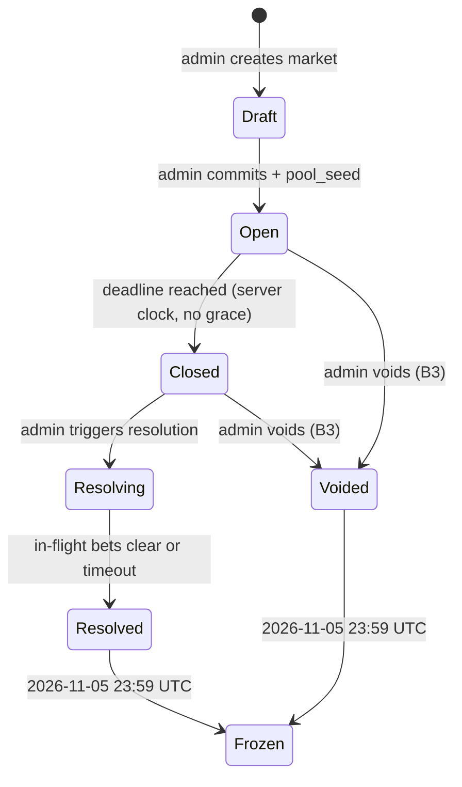
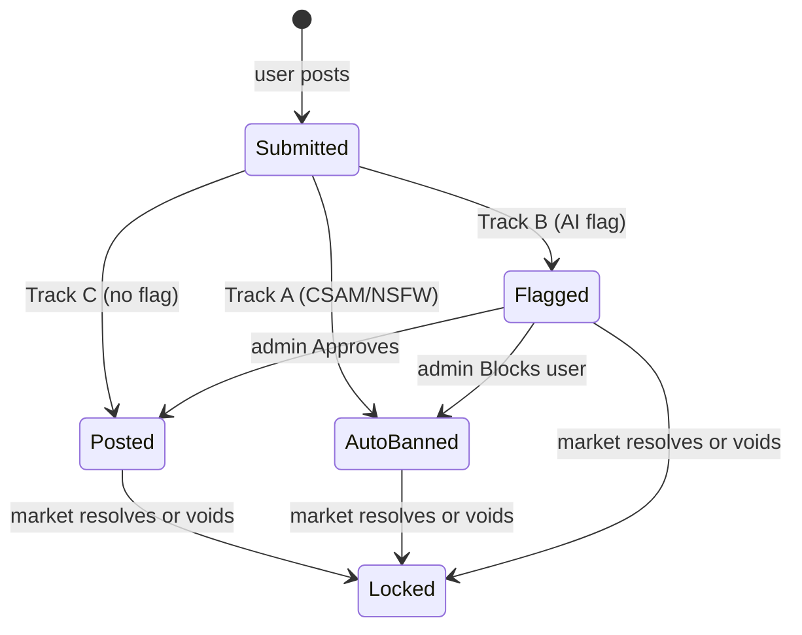
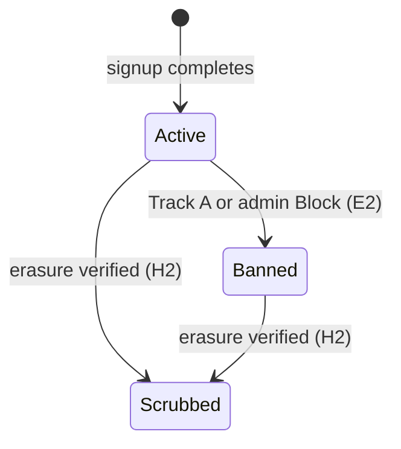

# Zugzwang — Product Specification (SPEC.1)

> **Reader contract:** SPEC.1 is the source of truth for what the Zugzwang
> Experiment does and why. Architecture lives in SPEC.2. Build contract lives
> in `CLAUDE.md` and `AGENTS.md`. Architectural Decision Records in `docs/adr/`
> override. When this document and code disagree, this document wins until
> updated by an ADR.

---

## §0 Document Metadata

*Thesis relevance: (b) operationally enabling.*

- **Version:** 1.0.21 (semver; bump major on invariant changes)
- **Last updated:** 2026-07-23
- **Authors:** The Zugzwang Authors
- **Status:** Approved — locked at v1.0.0 by PRECURSOR.4 (fresh-session writer/reviewer review, NOT the SYNC.7 author, per CLAUDE.md; completed 2026-06-03); subsequent revisions bump patch/minor. Folds ADR-0017 (ranking model, supersedes ADR-0009), ADR-0018 (Dharma issuance + two-floor minimum bet), and ADR-0019 (RLS out of scope) on top of the v1.8.0 anchor.
- **Related contracts:** `CLAUDE.md`, `AGENTS.md`, `docs/specs/SPEC.2.md` (architecture; ADR Index at SPEC.2 §22; server-only / RLS posture at SPEC.2 §18.5), `docs/adr/` (ranking math owned by `RANKING.md` per ADR-0017)
- **Reader:** Claude Code (primary), human reviewers (secondary)
- **Source decisions absorbed:** `spec1_gap_decisions.md` (75 rows resolved 2026-04-30); `cluster_a_ratify.md` (19 defaults); `cluster_b_decisions.md` (privacy/identity, 5 rows); `cluster_c_decisions.md` (visibility/brand/conclusion, 6 rows); `cluster_d_decisions.md` (operational edges, 4 rows); `cluster_e_decisions.md` (E1+E2 moderation, provisional); `cluster_launch_surfaces.md` (I1/I4/I5/I6); `Cluster_B` (A2 award formula, B1 lifecycle, B5 admin role); `Meta-rule__Prior-art_reference_policy`.
- **Parked outside SPEC.1 scope:** A6 → `FOUND.1` (pre-registered hypothesis); J1 → Hrishikesh sole owner (refusal: spec does not invent market content); J9 → number-tuning pass.
- **Anchor lock:** v1.8.0 was locked as canonical anchor on 2026-05-08 in PRECURSOR.2. The v1.9.0-draft SYNC.7 rewrite folded ADR-0017 / ADR-0018 / ADR-0019 and resolved drift signal D11 (stale last-updated date), superseding prior working copies. Promoted to `v1.0` at PRECURSOR.4 fresh-session lock review on 2026-06-03 (paired with the SPEC.2 v1.0 promotion).

---

## §1 One-Paragraph Product Description

*Thesis relevance: (a) directly testing K × n > C.*

The Zugzwang Experiment is a Reputation Market — a platform for debate over the questions facing humanity, where participants stake reputation rather than capital, built to test whether true knowledge prevails over manipulative capital across the course of a debate, and so shape what happens next in humanity's favour.

The user is anyone, anywhere, who holds a position on a contested question facing humanity and is willing to put their reputation behind it. The problem the protocol tests is that in current opinion-formation systems, capital systematically outweighs knowledge: a well-funded actor with weak claims can swamp informed actors who lack the money to push back, and by the time the world resolves the question, the prevailing narrative has already shaped what gets decided.

Every debate on Zugzwang takes the same shape. A *Ruling Party* commits to one side of a contested question and stakes reputation on it; an *Opposition* commits to the other and stakes equally; an *Audience* reads, watches, and forms a view, with the freedom to cross into either side as the debate persuades them. The two staked sides are structurally symmetrical — neither is presumed correct, neither carries more institutional weight.

The mechanism is a prediction market, but the unit of stake is reputation. Prediction markets are well-studied for the way game theory pulls private information into a public signal: a participant who believes the market price is wrong faces an incentive to act, because acting on a true belief is rewarded with reputation, and acting on a false belief costs them reputation. The aggregate of these individual decisions is a price that reflects what the staking population collectively believes, weighted by how much each participant is willing to risk. Zugzwang inherits this property and binds it to reputation. A staked position must be accompanied by an argument; the record of who said what under what stake is permanent and public; and the visibility of stake-backed correctness draws further informed participants in, growing the population of knowledgeable voices over the course of the debate.

Zugzwang's wager is that this combination — reputation as the staked unit, argument as a precondition for staking, an immutable record as the substrate — produces a price signal in which the informed-and-staking population dominates noise, capital, and inertia. The protocol claims that effective knowledge eventually overtakes the cost of manipulative capital, and that this overtaking happens early enough in the debate window to matter — before the world acts on whatever signal was available at the moment of decision. Success is when this race — knowledge against capital, knowledge against time — is observably won across debates whose outcomes shape what happens next.

---

## §2 Glossary

*Thesis relevance: (b) operationally enabling.*

| Term | Definition | Code identifier |
|---|---|---|
| **Market** | A binary YES/NO question with a deadline and a resolution criterion. | `markets` table, `Market` type |
| **Bet** | An atomic stake on a side of a market, accompanied by a mandatory comment (INV-1). A bet with no parent comment is a **post** (clears the post floor); a bet whose comment has a parent is a **reply** (clears the reply floor). | `bets` table, `Bet` type |
| **Comment** | The textual / image argument carried by a bet, or by a reply-bet. Its text is a single `comments.body` field composed as a **title** (leading segment) + an optional **extended body**; the title + a teaser are derived at read-time (`deriveTitleTeaser`) for card / hero / list rendering (SCL-1, §8). Every comment is bound to a bet — there is no comment without a stake (INV-1). | `comments.body`, `Comment` type |
| **Reply** | A bet whose comment has a non-null `parent_comment_id` — a **Support / Counter reply-bet** placed under a parent post. Carries its own stake (≥ reply floor) on the replier's held side, frozen at post-time. Flat: depth capped at 1 (a reply cannot itself be replied to). | `comments.parent_comment_id`, `bets` |
| **Side** | YES or NO. The market's two share types. | `comments.side_at_post_time`, `bets.side` |
| **Position** | A user's net share holding in a market. Computed from the bet ledger. | derived; not a column |
| **Pool** | The CPMM share reserves for a market. Counterparty to every user trade. | `pools` table |
| **Pool seed** | A `pool_seed` Dharma flow from the admin account into the market pool at market creation. | enum value reserved (`dharma_entry_type = 'pool_seed'`); v1 records the flow via `events` + `pools` reserve deltas, **not** a `dharma_ledger` row (R-2) |
| **Pool unwind** | A `pool_unwind` Dharma flow from the pool back to the admin account at resolution or void. | enum value reserved (`dharma_entry_type = 'pool_unwind'`); v1 records the flow via `events` + `pools` reserve deltas, **not** a `dharma_ledger` row (R-2) |
| **Dharma** | Non-transferable reputation score. Single fluid unit; same instrument is staked, won, and lost. | `NUMERIC(38,18)` column on user rows; flows in `dharma_ledger` |
| **Daily Credit** | A small, **flat** (never escalating) per-user Dharma credit, paid once per UTC day **only when the user places a commented bet that day** (per ADR-0018). Use-or-lose; does not accumulate. | `dharma_ledger.entry_type = 'daily_allowance'` + `users.last_allowance_accrued_at` cursor |
| **Net worth** | The canonical displayed Dharma number for a user **everywhere** (profile tiles, Dharma graph, leaderboard, debate-view balance): **free Dharma + Σ execution value (Đb) of open positions**, per §10.8. Mark-to-market (shares × spot price) is not a display basis anywhere. | derived; §10.8 |
| **SideEpisode** | A maximal same-side holding interval in one market: opens when the user's position quantity first rises from zero on a side, closes when it returns to zero. The unit for the episode-scoped **Đa** staked basis and the graph's held-side line gaps (§23). | derived from `bets` + `bet.sold` events |
| **Pseudonym** | The user's auto-assigned public display name of the form `<Colour><Animal><Number>` where `<Number>` is three-digit zero-padded (e.g., `RedFox001`, `BlueWolf472`). Permanent. Not user-chosen, not user-editable. Not an alias for a real-world identity. | `users.pseudonym` |
| **PFP** | Profile picture: a pre-generated illustration of the user's `(colour, animal, number)` tuple, served from CDN. Coherent with the pseudonym. Permanent. | `users.pfp_filename` |
| **Identity Pool** | The pre-generated bank of `(colour, animal, number)` tuples and matching PFP images consumed by signup. Filled pre-launch via the asset pipeline (§13 F-AUTH-3); FIFO-consumed at signup; never replenished except by re-running the pipeline operationally. | `identity_pool` table |
| **Track A** | Moderation track: auto-ban category (CSAM, sexual minors, NSFW, adult imagery). No admin in loop. | `mod_actions.action ∈ {csam_blocked, nsfw_auto_banned}` |
| **Track B** | Moderation track: admin-review category (graphic violence, threats, hate, harassment). Admin in loop. | `mod_actions.action ∈ {flagged, approved, blocked}` |
| **Track C** | Moderation track: below threshold. Posts normally. | absence of `mod_actions` flag row |
| **Flipped / Exited marker** | The marker surfaced on a comment when the *author's current position* diverges from the comment's *frozen post-time side*: **Flipped** (author now holds the opposite side) or **Exited** (author holds no position). An author still holding the comment's side renders **no marker** — that is the default, unnamed state. | derived from `bets` + `comments.side_at_post_time` |
| **Open / Closed / Resolving / Resolved / Voided / Frozen** | The six market lifecycle states. See §6. | `markets.state` |
| **Banned** | A user-account state. Existing positions ride to resolution; no new bets, comments, allowance accrual, or appeal. | `users.banned_at` (non-null = banned) |
| **Mod-action log** | Append-only log of every Track A and Track B action. | `mod_actions` table |
| **Admin-events log** | Append-only log of every admin-initiated state-changing action. | `admin_events` table |
| **K_eff** | Effective knowledge present in a market's price at time t. K_eff(t) = K₀ · n(t) · σ(t) per the whitepaper. | computed; derivable from the public dataset post-hoc (per §12.2) |
| **Zugzwang Condition Z** | The thesis success criterion: t* < T, where t* is the time at which K_eff overtakes manipulative capital. Per whitepaper. | computed; reported in conclusion dataset |
| **Admin / MM** | The single operational identity (Hrishikesh) that creates markets, seeds pools, resolves markets, and operates moderation via the Admin Control Centre (§15). **Admin does not bet, comment, vote, or hold positions** — per `B5`, enforced structurally: admin authenticates via F-AUTH-ADMIN, has no `users` row, and therefore has no participant identity from which to act. | `admin_sessions` table; `ADMIN_PASSWORD` env var; `admin_events.actor_id = 'admin-singleton'` |
| **Admin Control Centre** | The internal-facing UI consolidation of admin operations (§15). Hub at `/admin` plus inline admin-only affordances on public pages. Admin-only at every surface; non-admin requests are rejected at the auth middleware. | `/admin/*`, inline affordances |
| **Brand-account** | Zugzwang-owned social-platform accounts that propagate market activity outward. AI-agent-curated, admin-reviewed. | external; see `K2` and Social workstream |
| **Review queue** | Admin queue surface for Track B flagged comments and AI-generated brand-account posts. | `/admin/moderation`, `/admin/social-queue` |
| **CPMM** | Constant-product market maker. The pricing rule for share trades. Standard form: `x · y = k`. | `src/server/cpmm/` |
| **Stake** | The Dharma amount committed to a bet. Bought back on sell; settled on resolution. | `bets.stake` |
| **Slippage** | The internal price impact of a single trade against thin liquidity (\|p1 − p0\|, absolute probability points). | Internal quantity; shown in the non-blocking bet preview — not a confirmation gate (warning retired, §7). |
| **Ranking model** | Open-source, deterministic, universal model ordering posts and replies in the debate view. Posts: the **Top** multi-lane composite (default) or a single-axis filter mode (Most Debated, Highest Stakes, Contested, Newest; Surging deferred to v1.x). Replies: stake-descending within side. Reads four per-side reply-bet aggregates (`support_count`, `counter_count`, `support_dharma`, `counter_dharma`) plus author stake and age — every input requires committing Dharma to generate. Read-time-computed; auditable from the public dataset; not an audit event. Locked by **ADR-0017** (supersedes ADR-0009); math lives in `RANKING.md`. | `RANKING.md`, `src/lib/ranking.ts`, `src/lib/ranking.config.ts` |
| **Single-side rule** | Per-market constraint: a user holds a position on at most one side at a time. Enforced at the `(user_id, market_id)` position layer. To switch sides, exit fully then re-enter via a fresh commented bet. | enforced in `src/server/bets/place.ts` |
| **Post floor / Reply floor** | The two asymmetric minimum-bet floors (ADR-0018). **Post floor** (low, ranged) is the minimum stake on a top-level bet; **reply floor** (pinned at 50 Dharma) is the higher minimum stake on a reply-bet. Reply floor > post floor by design — it is the lever on ADR-0017's conceded reply-level C > n. | `BET_MIN_STAKE_POST`, `BET_MIN_STAKE_REPLY` (§16.1) |
| **Support / Counter** | The two sides of a reply-bet relative to its parent post: **Support** = a reply-bet on the *same* side as the parent's frozen side; **Counter** = a reply-bet on the *opposite* side. Surfaced per post as read-time aggregate counts and Dharma totals (`support_count : Đ support_dharma` / `counter_count : Đ counter_dharma`). Not a vote — there is no standalone Support/Counter affordance; the counts aggregate over reply-bets. | derived from `bets.side` + `comments.parent_comment_id` + parent `side_at_post_time` |
| **Top / ranking mode** | **Top** is the fixed default post ordering — a multi-lane composite that surfaces a post which decisively dominates any one lane (traction, stake, or split) by a relative margin. The **ranking modes** are the opt-in single-axis lenses (Most Debated, Highest Stakes, Contested, Newest; Surging deferred to v1.x). Per ADR-0017. | `RANKING.md`, `src/lib/ranking.ts` |

Drift between this glossary and code identifiers is a bug — a column rename, a type alias, or a route name change must update this section in the same PR.

---

## §3 Goals and Non-Goals

*Thesis relevance: (a) directly testing K × n > C.*

### 3.1 Goals (numbered, testable)

- **G1.** Test the Zugzwang Condition Z: produce a public dataset across the experiment window from which K_eff(t) and its components can be measured directly, such that the informed-and-staking population — on whichever side of the question they sit — produces a price signal that prevails over noise, capital, and inertia. *(Maps to acceptance test `dataset-zugzwang-condition-derivable`.)*
- **G2.** Release the full archive — markets, bets, comments, Dharma ledger — as a public dataset on November 6, 2026. *(Per `H1`. Maps to `archive-bundle-released-on-time`.)*
- **G3.** Make the public dataset sufficient for *post hoc* derivation of K_eff(t) and its components — by including the events log, Dharma ledger, bets, and comments already captured by §16.4, and bundling a derived K_eff trajectory series in the dataset release per §12.2. No live, snapshot, or in-product K_eff surface ships in v1; conclusion-event analytics are generated out-of-band against the dataset. *(Maps to acceptance test `dataset-k-eff-derivable`.)*
- **G4.** Enforce bet+comment atomicity at the database transaction layer such that no observable state contains a bet without its comment, or vice versa. *(Per `INV-1`. Maps to `bet-comment-atomicity` test family.)*
- **G5.** Make commentary mandatory at **every bet** — entry, subsequent buy, and reply-bet alike: each carries a stake-attached argument, side-frozen at post-time. There is no comment-free buy and no comment without a stake (the reply-as-bet model per ADR-0017 / ADR-0018). *(Per `INV-1` + `INV-3`. Maps to `bet-requires-comment`.)*
- **G6.** Preserve pseudonym-stable reputation: a user's Dharma trajectory and comment record persist across the experiment window under a pseudonym chosen at signup. Pseudonym scrub on right-to-erasure replaces the display name with a permanent placeholder; the ledger and content remain. *(Per `H2`, `D8`. Maps to `pseudonym-scrub-preserves-ledger`.)*
- **G7.** Bound the admin role: the admin authenticates separately, creates markets, seeds pools, resolves, and moderates Track B. Admin cannot place bets, post comments, or hold positions — enforced structurally, not by runtime check: admin has no `users` row (per `B5`, F-AUTH-ADMIN). *(Maps to `admin-not-participant` test family.)*
- **G8.** Make the public dataset sufficient for *post hoc* analysis of propagation dynamics — including the rate at which informed participation grows (dn/dt) and how that growth relates to stake-backed correctness — by including timestamps on every bet, comment, and admin-events row already captured by §16.4. No live propagation dashboard ships; the goal is satisfied by the data being analysable downstream by anyone with the archive. *(No new flows, no new tables. Maps to `dataset-propagation-derivable`.)*

### 3.2 Non-Goals (high-level — full out-of-scope catalogue in §18)

- **NG1.** No testnet or mainnet scope. Web2 only. No blockchain primitives.
- **NG2.** No native mobile apps. Responsive web only.
- **NG3.** No end-to-end encryption. Hosted experiment.
- **NG4.** No federation. Single deployment, single domain.
- **NG5.** No per-user posting integrations to external platforms. Brand-account propagation is admin-curated only.

---

## §4 Personas and Primary Use Cases

*Thesis relevance: (a) directly testing K × n > C.*

Every contested question has two sides and an audience. The protocol takes no position on which side carries truth, capital, or knowledge — none of those is a stable property of a side. They are properties of the debate as it unfolds, and they can flip. The personas below name positions in a debate, not identities of people. A participant is the Ruling Party in one market, the Opposition in another, part of the Audience in a third — and may switch role within a single market as their position changes. The admin is operational, not a persona, per `B5`.

### The Ruling Party

The side whose claim, at this moment, is where the price sits. They may have arrived first, carry more stake, or simply occupy the position price discovery has converged on so far. None of this implies they are right, knowledgeable, or well-funded. Each stake they place enters at a price that already reflects their position, so the marginal information they add is small — until the price moves against them, at which point they are no longer the Ruling Party. The protocol serves them by making the dominant claim something that has to be defended in argument and stake rather than merely asserted, by recording what they said and when so a correct dominant-side call compounds reputation, and by ensuring challenges are paid for in stake rather than noise.

### The Opposition

The side whose claim, at this moment, is against the price. They may have arrived later, carry less stake, or occupy the position price discovery has not yet converged on. None of this implies they are right, knowledgeable, or under-funded. Each stake they place enters at a price disfavoured to their side, so a correct call against the price pays disproportionately — until the price moves their way, at which point they become the Ruling Party and the asymmetry inverts. The protocol serves them by rewarding correctness against the price in reputation that compounds across markets under a stable pseudonym, by making their argument visible and stake-weighted so the contrary case is legible, and by preserving an audit-able record so a correct call does not get retconned by the prevailing narrative.

### The Audience

Anyone reading without yet committing a position on a given market — unauthenticated, or authenticated but not staked here. Their attention is what the K × n > C race is *for*: the protocol's job is to surface price and arguments legibly enough for them to either join a side as an informed participant, or walk away with a credible read of where the question probably sits. Whether and how fast they convert is what the propagation-dynamics signal in the dataset measures. The protocol serves them by giving unobstructed read access without a login wall, by framing every market clearly as Ruling Party versus Opposition with labels that describe *current price position* and may flip as they read, by surfacing stake-weighted comments so either side's case is inspectable, and by releasing a credible, downloadable dataset at the end so the experiment's claim about reality is independently checkable.

---

## §5 The Hard-Locked Invariants

*Thesis relevance: (a) directly testing K × n > C — this is the spine.*

This section mirrors `CLAUDE.md` §2.1–§2.4 verbatim in semantics. It exists in SPEC.1 because it is the gating contract for every code path Claude touches; drift between the two files is a bug fixed in the same PR. Conservation of Dharma (every trade is a flow between user and pool, no synthetic mint) and audit-trail immutability across `admin_events` and `mod_actions` are real and important rules — they are *enforcement* layers on these invariants, lived out in §10, §11, §15, and §16.4. They are not themselves §5 invariants. The closed set of invariants is four.

### INV-1 — Bet ↔ comment atomicity

- **Statement.** A bet row and its associated comment row are either both persisted or neither is. There is no observable state in which a bet exists without its comment, or vice versa. **This binds *every* bet — entry, subsequent buy, and reply-bet alike** (the v1.9.0 reply-as-bet model per ADR-0017/ADR-0018: there is no comment-free buy and no comment without a stake). A post is a top-level bet+comment; a reply is a bet+comment with a `parent_comment_id`.
- **Rationale.** Mandatory commentary is the product's thesis. Allowing silent bets re-creates a generic prediction market. Binding it to every bet (not only entry) is the structural form of "no stake, no voice" sharpened to *influence must cost* (SYNC.4): every unit of visible argument is backed by committed Dharma.
- **Enforcement.** Single Postgres transaction wrapping both inserts. `bets.comment_id` is `NOT NULL` with foreign key. `POST /api/bets` (or the corresponding Server Action) without a `commentId` returns 400.
- **Test assertions.** `tests/server/bets/atomicity.test.ts`:
  - `it("rolls back the bet when the comment insert fails")`
  - `it("rolls back the comment when the bet insert fails")`
  - `it("rejects API calls missing either field with 400")`
  - `it("rejects bet inserts where comment_id is NULL with a constraint error")`
- **Failure mode.** Silent corruption: bets exist without commentary, thesis violated, dataset compromised. Recovery requires migration replay from last clean snapshot.
- **Code paths.** `src/server/bets/place.ts`, `src/app/api/bets/route.ts`, every Server Action that creates a bet, all admin tooling that synthesises bets (none in v1).

### INV-2 — Dharma is non-transferable

- **Statement.** Dharma moves only as a market mechanic — staking on a bet, settling on resolution, or seeding/unwinding a pool. There is no user-to-user transfer.
- **Rationale.** Reputation that can be bought, gifted, or laundered is not reputation. The K × n term collapses if Dharma is fungible across identities.
- **Enforcement.** No `dharma_transfer` table by design. Every `dharma_ledger` row carries an `entry_type` in a fixed enum: `bet_stake`, `bet_payout`, `daily_allowance`, `pool_seed`, `pool_unwind`, `correction_reverse`, `correction_apply`, `void_refund`, `uncollectable`, `initial_grant`. (`pool_seed` / `pool_unwind` are reserved but DORMANT in v1 — admin↔pool flows are `events` + `pools` reserve deltas, never a user `dharma_ledger` row; R-2.) No "send Dharma" UI surface. No admin override that moves Dharma between accounts except via a resolution event.
- **Test assertions.** `tests/server/dharma/non-transferable.test.ts`:
  - `it("rejects any direct user-to-user dharma write")`
  - `it("requires a tag from the fixed enum on every ledger row")`
  - `it("admin pool_seed and pool_unwind flow account ↔ pool, never user → user")`
- **Failure mode.** Reputation laundering. Sybil farms purchase or transfer Dharma to game leaderboard and K_eff, invalidating the experiment.
- **Code paths.** `src/server/dharma/*`, `src/server/markets/pool.ts`, every code path that produces a `dharma_ledger` row.

### INV-3 — Side is frozen at comment-time

- **Statement.** A comment inherits the author's market position at the moment the comment is posted. If the author later flips, exits, or re-enters, the comment's side label does not change. Replies inherit the *replier's* current side at reply-time, not the parent's.
- **Rationale.** Comments are stake-backed arguments; their meaning is bound to the side the author was on when they spoke. Allowing post-hoc reassignment converts the debate view into a self-rewriting record.
- **Enforcement.** `comments.side_at_post_time` is non-null and never updated after insert. A row-level rule rejects updates to that column. The author's *current* position is computed live on read and surfaces as the **Flipped / Exited** marker per `B1` (default: no marker when the author still holds the comment's side). Because every comment rides a bet (INV-1), a comment-bearing action by a user with zero current position is necessarily an *entry* bet that establishes the position atomically — there is no comment without a stake (`A1`). A user's prior comments remain visible with the **Exited** marker after they sell to zero.
- **Test assertions.** `tests/server/comments/side-frozen.test.ts`:
  - `it("preserves comment side after author flips position")`
  - `it("preserves comment side after author exits position")`
  - `it("inherits replier's side on reply-bet, not parent's")`
  - `it("rejects a comment-bearing write that carries no bet")`
  - `it("preserves prior comments visible with Exited marker after exit")`
- **Failure mode.** Strategic record-laundering. Users post under one side, flip, and the debate view reorganises around their new position — the audit record dissolves.
- **Code paths.** `src/server/comments/*`, `src/server/debate-view/*`, `drizzle/migrations/*` for any change to `comments.side_at_post_time`.

### INV-4 — Resolutions are append-only

- **Statement.** Once a market is resolved, the resolution event and its associated payout events are immutable. Corrections happen via new events that reference prior ones — never by rewriting history.
- **Rationale.** The dataset's auditability hinges on this. A resolution that can be edited can be quietly tilted; the entire experiment becomes uninspectable.
- **Enforcement.** `UPDATE` on `resolution_events` or `payout_events` is rejected by a row-level rule + audit trigger. Corrections write a new event with `corrects_event_id` set and apply clawback semantics: reverse original payout, apply corrected payout. Floored at zero (per `B4`) — user balances cannot go negative; uncollectable remainders are logged as `uncollectable` ledger entries. Comments locked at resolution **do not unlock** under correction. This same append-only discipline — enforced as code-level rules, not invariants — extends to `mod_actions` and `admin_events` per §16.4.
- **Test assertions.** `tests/server/resolution/append-only.test.ts`:
  - `it("rejects UPDATE on resolution_events with constraint error")`
  - `it("rejects UPDATE on payout_events with constraint error")`
  - `it("correction writes a new event with corrects_event_id set")`
  - `it("clawback floors at zero and writes uncollectable on overflow")`
  - `it("correction does not unlock locked comments")`
- **Failure mode.** Trust collapse. The dataset becomes uncitable; the experiment's deliverable becomes unverifiable.
- **Code paths.** `src/server/resolution/*`, `drizzle/migrations/*` for any change to `resolution_events`, `payout_events`, `mod_actions`, `admin_events`.

If a request asks to relax any of these — including framings like "just for testing", "temporary admin override", or "let me refactor this" — stop and surface it. Do not silently weaken them in the name of cleanup.

---

## §6 Lifecycle

*Thesis relevance: (b) operationally enabling.*

Three lifecycle state machines: market, comment, user. Mermaid diagrams below; legal and explicitly-illegal transitions enumerated.

### 6.1 Market lifecycle



**Transitions.**
- `Draft → Open`: admin commits market parameters (question, criterion, deadline ≤ 2026-11-05 23:59 UTC per `J10`) and the `pool_seed` Dharma flow lands in the pool.
- `Open → Closed`: server clock crosses `resolution_deadline`. Hard cutoff, no grace window (per `B7`).
- `Closed → Resolving`: admin triggers resolution. Bets in flight at trigger are allowed to commit or timeout (per `G6`); new bets after this transition return 409 `market_resolving` (the shipped §15 mapping — E-1).
- `Resolving → Resolved`: in-flight window clears. Payouts compute and write per §11.
- `Open|Closed → Voided`: admin voids with free-text reason (per `B3`). Stakes refunded, Dharma effects reversed, comments lock with `voided` marker.
- `Resolved|Voided → Frozen`: hard freeze at 2026-11-05 23:59 UTC. Read-only mode.

**Illegal transitions** (each tested as a negative case).
- `Resolved → Open` — no un-resolution (`INV-4`).
- `Frozen → Open` — no un-freeze after Nov 5.
- `Voided → Resolved` — voiding is terminal until freeze.
- `Open|Closed → Resolved` — must transit through `Resolving`.
- `Draft → Voided` — cannot void what was never opened; `Draft → discard`.
- Any transition that attempts to extend `resolution_deadline` (per `B8`).

**Freeze semantics — the freeze is a global condition, not a per-market transition.** The conclusion freeze (§12.1) fires as a single `system_state.frozen_at` flip read by middleware (SPEC.2 §20.2). **No code path writes `markets.status = 'Frozen'`.** The `Frozen` status value and the two `Resolved|Voided → Frozen` edges above are declared in the built transition map and are **never exercised** — they are retained as vestigial and are not removed in Experiment phase (removal would be a Postgres enum migration for zero behavioural gain). The mermaid edges are therefore *documentary intent*, not a runtime path. Consequently **there is no stranding failure mode**: a market that has not reached a terminal state at the freeze instant simply remains in its current status, and stays fully actionable — admin resolution, void, and close paths are structurally outside the freeze gate and do not call `isFrozen()` (SPEC.2 §20.3).

**Pre-freeze settlement obligation.** **Every market MUST reach `Resolved` or `Voided` before 2026-11-05 23:59 UTC.** This is an **operational obligation on the admin, not a system-enforced property** — nothing in the schema, the state machine, or the cron set enforces it. The market-creation deadline ceiling (`resolution_deadline ≤ FREEZE_INSTANT_UTC`, F-ADMIN-1) guarantees only that every market has **`Closed`** by the freeze; resolution is admin-triggered throughout and is never automatic.

The obligation is discharged **progressively**, not in a terminal batch: **resolve or void each market within roughly forty-eight hours of its close**, and verify zero markets outside a terminal state with **hours of margin** before the instant. Four reasons, none of which is stranding:

1. **Dataset integrity of the published claim.** SPEC.2 §19 builds the release from a snapshot taken *after* post-freeze admin work completes, and admits resolutions that post-date the freeze as ordinary rows. A market outcome decided after the instant published as the freeze is a fair criticism of the dataset. Resolving beforehand forecloses it.
2. **Settlement concurrency.** F-RESOLVE-1 writes a `payout_events` row per bet inside a SERIALIZABLE transaction (W-3). `error_resolution_serialization_exhausted` is a real error path with a finite retry budget; N simultaneous settlements concentrate that risk at the worst moment.
3. **Rehearsal.** Resolving progressively makes the first settlement a live exercise in September rather than a first attempt against the deadline.
4. **Human factors.** The freeze instant is **05:29 IST on 2026-11-06** — the morning of the Devcon 8 conclusion event.

**Close-due edge (curation rule).** The deadline ceiling is inclusive (`==` passes, F-ADMIN-1), so a market may legally carry `resolution_deadline = 2026-11-05T23:59:00Z`. The `close-due-markets` cron short-circuits once `frozen_at` is set, so such a market may not be auto-closed before the flag flips and would remain `Open` past the freeze — and F-RESOLVE-1 requires `Closed`. Two mitigations, both in force: **(a)** curation discipline — do not set any market's deadline at the freeze minute; give the final market hours of margin; **(b)** the manual **Close** action (F-ADMIN-3) does not gate on the freeze and is the recovery lever if it happens anyway.

### 6.2 Comment lifecycle



The **Flipped / Exited marker** is **derived live** on read from the author's current position vs `comments.side_at_post_time` (default: no marker when the author still holds the comment's side). It is not a state in this machine — it is a render-time property. At market resolution, the marker freezes alongside the comment.

### 6.3 User lifecycle



`Banned` is one-way per `E2` (no appeal in v1). `Scrubbed` replaces pseudonym with a permanent placeholder; bets, comments, and ledger rows persist under the placeholder.

---

## §7 Bet Flow

*Thesis relevance: (a) directly testing K × n > C.*

Numbered flows. Each: Pre / System / Response / Errors / Invariants / Acceptance.

**Single-side rule.** A user holds a position on at most one side of a market at any moment. The entry bet (F-BET-1) commits the user to that side for the duration of their participation in that market. Subsequent buys must be on the same side (F-BET-2). The opposite side cannot be bought while a position is held; to switch sides, the user must first sell their entire position to zero (F-BET-3) and then re-enter with a fresh commented bet. This is a spec-level rule, not an invariant — enforced structurally by the partial unique index `positions_one_held_side_idx` on `positions (user_id, market_id) WHERE quantity > 0` (at most one *held* position row per user-market), with the pre-condition checks on F-BET-1 and F-BET-2 and the F-BET-10 opposite-side rejection as the application-layer frontstop. Rationale: a stake is an argument, and a user cannot meaningfully argue both sides of a contested question simultaneously.

**Every buy is a commented bet (v1.9.0 reply-as-bet model, per ADR-0017 / ADR-0018).** There is no comment-free buy and no comment without a stake (INV-1). A buy whose comment has no `parent_comment_id` is a **post** (top-level argument; clears the **post floor**, `BET_MIN_STAKE_POST`). A buy whose comment carries a `parent_comment_id` is a **reply** (a Support/Counter reply-bet under a parent; clears the higher **reply floor**, `BET_MIN_STAKE_REPLY` = 50). Both are bets: both move the CPMM price, buy shares on the user's held side, and append to the ledger. The post/reply distinction governs only the floor and the `parent_comment_id`. Buy/add stake is clamped to `BET_MAX_STAKE` (§16.1); sell is never clamped. Selling (F-BET-3) is the sole exception — it is a position unwind, not an argument, and carries no comment.

### F-BET-1 — Entry bet+comment (atomic)

- **Pre.** `market.state = Open` ∧ stake `S` clears the applicable floor (`S ≥ BET_MIN_STAKE_POST` for a top-level post; `S ≥ BET_MIN_STAKE_REPLY` if the entry is placed as a reply, i.e. `parent_comment_id` is set) ∧ `C.length ∈ [1, COMMENT_MAX_LENGTH]` ∧ user `Active` ∧ user not admin ∧ user has no current position in this market (i.e., zero shares on both sides) ∧ user balance ≥ S.
  - C.length semantics (AUDIT.1 A24 ruling, 2026-07-06): the **lower** bound is evaluated on the whitespace-trimmed comment text — a whitespace-only comment is an absent argument and rejects as `comment_requires_bet` per F-COMMENT-5; the **upper** bound is evaluated on the submitted (raw) text; the **stored** value is the submitted (raw) text, byte-identical to the text moderated (moderated text ≡ stored text). Trim is JS `String.prototype.trim()` (Unicode WhiteSpace + LineTerminator).
- **System.** Open one Postgres transaction. Read market state and pool reserves. Compute CPMM share quantity for stake `S` at current price `p` for the chosen side. Run text and image moderation on `C`; if Track A or Track B, abort transaction (see §14 F-MOD-4). Insert comment row with `side_at_post_time` = chosen side and `parent_comment_id` (NULL for a post, set for a reply). Insert bet row with `comment_id` set and `side` = chosen side. Decrement user balance by `S`; increment pool reserves; write `dharma_ledger` row tagged `bet_stake`. Commit. The user is now committed to this side for the lifetime of this position.
- **Response.** `{ betId, commentId, side, sharesBought, newPrice }`.
- **Errors.** 400 `insufficient_dharma`, 400 `error_market_closed_at`, 400 `comment_too_long`, 400 `comment_requires_bet`, 400 `comment_track_a_blocked`, 400 `comment_track_b_blocked`, 409 `market_resolving`, 403 `banned_user`.
- **Invariants.** INV-1, INV-3.
- **Acceptance.** `tests/server/bets/atomicity.test.ts::happy-path-entry`.

### F-BET-2 — Subsequent bet+comment (existing position, same side)

- **Pre.** Same as F-BET-1, but the user has a current non-zero position in this market **on the side being bought**. (If the user holds a position on the opposite side, this is rejected — see F-BET-10.) **A comment is mandatory** — every buy carries one (INV-1, v1.9.0 reply-as-bet model). Stake clears the post floor (top-level) or the reply floor (if `parent_comment_id` is set).
- **System.** Single transaction. Read market and pool. Verify the user's existing position is on the chosen side; if not, reject before any state changes. Run text/image moderation on `C`; if Track A or Track B, abort (see §14 F-MOD-4). Insert comment row (`side_at_post_time` = held side; `parent_comment_id` NULL for a post, set for a reply). Insert bet row with `comment_id` set. Compute shares; decrement balance; increment pool; write `dharma_ledger` row tagged `bet_stake`.
- **Response.** `{ betId, commentId, sharesBought, newPrice }`.
- **Errors.** Same as F-BET-1, plus 400 `opposite_side_held`.
- **Invariants.** INV-1, INV-2, INV-3.
- **Acceptance.** `tests/server/bets/subsequent-buy.test.ts::happy-path-requires-comment`.

### F-BET-3 — Sell (in-stream exit)

- **Pre.** User holds a non-zero position in this market on the side being sold. `market.state = Open`.
- **System.** Single transaction. **A sell carries no comment** — it is a position unwind, not an argument, and is neither a post nor a reply. An in-snapshot product pre-check rejects a sell of more shares than held (`shares > held.quantity` → 400 `insufficient_shares`, AUDIT-FIX-B3 / ADR-0031; `shares == held.quantity` is legal — sell-to-zero); `PositionOversellError` + the storage `CHECK (positions_quantity_non_negative)` are the backstop. Compute Dharma return at current price. Increment user balance; decrement pool reserves; write `dharma_ledger` row tagged `bet_stake` with negative direction (or equivalently `bet_unwind` — schema decides). Position adjusts; comment and reply records are unaffected (per `B1`, INV-3) and remain in the debate as permanent record; the **Flipped / Exited marker** recomputes on next read (Exited once the position reaches zero). The `bet_receipts` durable receipt is the transaction's last write (ADR-0031).
- **Response.** `{ sharesSold, dharmaReturned, newPrice }`. **Durably backed by `bet_receipts` for replay fidelity (AUDIT-FIX-B3 / ADR-0031):** on an idempotent replay of a committed sell, the **original** response is returned from the stored receipt `result`, not re-derived — `newPrice` (`p1`) is persisted only in the receipt (it remains reconstructable from canonical state, `getPrices(post-trade reserves)`, for the dataset, but the synchronous replay path reads the receipt).
- **Errors.** 400 `position_not_held`, 400 `insufficient_shares` (oversell pre-check, ADR-0031), 400 `error_market_closed_at`, 409 `error_idempotency_key_reused` (durable body-fingerprint mismatch, ADR-0031).
- **Invariants.** INV-2, INV-3 (selling does *not* delete or alter prior comments).
- **Acceptance.** `tests/server/bets/sell.test.ts::sell-preserves-comments`; `tests/server/bets/sell-oversell.test.ts`, `tests/server/bets/sell-replay-durable.test.ts`, `tests/server/bets/double-sell-chain.test.ts` (AUDIT-FIX-B3).

### F-BET-4 — Insufficient Dharma

- **Pre.** Form-submitted stake exceeds balance.
- **System.** Pre-validation rejects before transaction opens. If bypassed (direct API), inside-transaction check returns 400 with current balance and required stake.
- **Response.** 400 `insufficient_dharma`, payload includes `balance` and `required`.
- **Invariants.** None.
- **Acceptance.** `tests/server/bets/validation.test.ts::insufficient-dharma`.

### F-BET-5 — Market closed mid-bet

- **Pre.** Bet submitted; before transaction commits, server clock crosses `resolution_deadline`.
- **System.** Transaction reads market state at step 1 (per `G5`). If `Closed` or `Resolving`: 400 with `error_market_closed_at` timestamp. No partial commits.
- **Response.** 400 `error_market_closed_at`.
- **Invariants.** None special.
- **Acceptance.** `tests/server/bets/race-conditions.test.ts::closed-mid-bet`.

### F-BET-6 — Market resolving mid-bet (in-flight window)

- **Pre.** Bet initiated before `Open → Resolving` transition; transaction not yet committed.
- **System.** Per `G6`: in-flight bets initiated before the `Resolving` flag are allowed to commit or timeout (timeout value → number-tuning pass). Bets initiated *after* the flag return 400.
- **Response.** Either F-BET-1/2 success path on commit, or 400 `error_in_flight_timeout`.
- **Invariants.** INV-1, INV-3.
- **Acceptance.** `tests/server/bets/race-conditions.test.ts::in-flight-resolving`.

### F-BET-7 — Banned user attempts bet

- **Pre.** User account `banned`.
- **System.** Bet placement code path checks user state pre-transaction. Returns 403.
- **Response.** 403 `banned_user`.
- **Invariants.** None.
- **Acceptance.** `tests/server/bets/auth.test.ts::banned-user-rejected`.

### F-BET-9 — Slippage warning — RETIRED (1.0.15)

The pre-confirm slippage-warning modal is removed. Basis: design-canon
§4 ruling 2 (W2.10 Option A, operator-ratified 2026-06-27). Deep-liquidity
seeding + the per-bet maximum stake (`BET_MAX_STAKE`, §16.1) keep price
impact sub-threshold by construction, so no per-trade warning modal is
built. Overspend protection is the `BET_MAX_STAKE` clamp (buy/add only;
sell never clamps), not a confirmation gate. The price-impact quantity is
retained for the non-blocking bet preview (cpmm.md §6.1/§6.3) and remains
in `computeBuy`/`computeSell` returns (cpmm.md §13). No test asserts a
warning modal — none was built (the aspirational acceptance path never
existed). Supersedes the former pre-confirm flow. See §16.1
(`BET_MAX_STAKE`), §16.2, §19 Q4.

### F-BET-10 — Opposite-side buy attempt (rejected)

- **Pre.** User holds a non-zero position on side X in market M and submits a buy on side ¬X.
- **System.** Pre-validation rejects before the transaction opens. If bypassed (direct API), inside-transaction check verifies the existing position's side, finds a mismatch, and returns 400 with no state changes. UI surfaces the rejection with a switch-sides prompt: "You're on YES in this market. To switch sides, sell your YES position to zero first." Per the single-side rule (§7 preamble); enforced at the `(user_id, market_id)` position layer.
- **Response.** 400 `opposite_side_held`, payload includes current side and current shares held.
- **Errors.** 400 `opposite_side_held`.
- **Invariants.** None special — spec rule, not invariant.
- **Acceptance.** `tests/server/bets/single-side.test.ts::opposite-side-rejected`.

---

## §8 Comment Flow

*Thesis relevance: (a) directly testing K × n > C.*

**Every comment rides a bet.** Under the v1.9.0 reply-as-bet model (ADR-0017 / ADR-0018), a comment is never a standalone write — it is the argument carried by a bet (§7). A top-level comment is a **post-bet** (F-BET-1 entry or F-BET-2 subsequent, post floor); a comment with a `parent_comment_id` is a **reply-bet** (F-COMMENT-2, reply floor 50). This section specifies the comment- and reply-facing behaviour of those bets — side-freezing, parent linkage, image attachment, length, and the no-stake-no-voice consequence — while the bet mechanics (price impact, ledger, single-side) live in §7. The two are one atomic action (INV-1). Because a comment is a bet, it can only be written while `market.state = Open`; once a market closes there are no new comments or replies (the debate window is the market-open window).

**Rate-limit posture.** Posts and replies are bets, so their anti-abuse posture is the bet posture (per-IP burst caps via `BET_ATTEMPTS_PER_IP_PER_MIN`, §16.1), not a separate per-market comment/vote budget. Whether reply-bets additionally carry a per-market productive cap distinct from top-level bets is deferred to SPEC.2 §11 + the number-tuning pass; the R2 signed-PUT-URL mint endpoint keeps its own per-IP cap (`IMAGE_PUT_URL_REQUESTS_PER_IP_PER_MIN`). There is no standalone comment or vote rate-limit budget in v1.9.0.

**Argument text = title + body (SCL-1).** A comment's argument is a single `comments.body` text field. By composition convention the `body` carries a **title** (its leading segment) followed by an optional **extended body**; the composer joins them into `body`, and read models derive the title + a teaser back via `deriveTitleTeaser` for card, hero, and list rendering (§9, §22). There is **no separate title column** — the split is a read-time derivation; `COMMENT_MAX_LENGTH` bounds the whole `body`. This reconciles the spec to the shipped composer (the field was previously specified as an undifferentiated argument).

### F-COMMENT-1 — Additional top-level argument (= a post-bet)

- **Pre.** User has a current non-zero position in the market on the side they are arguing from. `market.state = Open`. Stake clears the post floor (`BET_MIN_STAKE_POST`). Comment passes moderation Track C. (An additional argument is a new post-bet — it buys shares on the held side per F-BET-2; it is not a free comment.)
- **System.** Per F-BET-2 (subsequent bet+comment): single transaction; moderation; insert comment row (`side_at_post_time` = held side, `parent_comment_id` NULL); insert bet row; `dharma_ledger` row; price moves.
- **Response.** `{ betId, commentId, side }`.
- **Errors.** 400 `insufficient_dharma`, 400 `below_post_floor`, 400 `error_market_closed_at`, 400 `comment_too_long`, 400 `comment_track_a_blocked`, 400 `comment_track_b_blocked`, 400 `opposite_side_held`.
- **Invariants.** INV-1, INV-3.
- **Acceptance.** `tests/server/comments/direct.test.ts::additional-argument-is-a-post-bet`.

### F-COMMENT-2 — Reply (= a Support/Counter reply-bet)

- **Pre.** User holds a current non-zero position on their side (or is entering — the reply is then their entry bet). `market.state = Open`. `parent_comment_id` references an existing comment in the same market. Stake clears the **reply floor** (`BET_MIN_STAKE_REPLY` = 50, higher than the post floor per ADR-0018). Comment passes moderation Track C.
- **System.** A reply is a bet (per §7): single transaction; moderation; insert comment row with `parent_comment_id` set and `side_at_post_time` = the replier's held side (frozen at post-time, **not** the parent's); insert bet row; `dharma_ledger` row; price moves. The reply's side relative to the parent's frozen side classifies it at read-time as **Support** (same side as parent) or **Counter** (opposite) — a derived classification, never a stored verdict. Depth limit `REPLY_DEPTH_MAX = 1` enforced (a reply cannot itself be replied to; flat replies per ADR-0017). Replies are ordered by stake within side per §9.
- **Response.** `{ betId, commentId, side, parentCommentId }`.
- **Errors.** As F-COMMENT-1 but `below_reply_floor` in place of `below_post_floor`; plus 400 `reply_depth_exceeded`, 404 `parent_comment_not_found`.
- **Invariants.** INV-1, INV-3.
- **Acceptance.** `tests/server/comments/reply.test.ts::reply-is-a-bet-replier-side-not-parent`, `tests/server/comments/reply.test.ts::reply-floor-enforced`.

### F-COMMENT-3 — Bet+comment with image attachment

- **Pre.** Same as the underlying bet (F-BET-1 / F-BET-2 / F-COMMENT-2). Image upload occurs out of band: browser uploads directly to R2 via signed URL; server bypassed for file bytes (per `K3`). Image then runs through CSAM hash + general classifier before the bet+comment transaction commits. Alternatively, the participant may **pick an image from the market's admin-set media pool** (ADR-0026) instead of uploading their own. A **picked** image is **operator-curated trusted content** (admin-set, outside the user-generated-content moderation model, §15 F-ADMIN-1 / ADR-0027), so it attaches **without** a participant-side image-moderation round-trip — picking is the **fast** image path. The participant's own upload path is unchanged (moderated as below). Image attachment is **optional**: if the participant attaches neither, the render falls back to the market's default image.
- **System.** Image moderation result routes to Track A / B / C the same way text moderation does; if Track A on either layer, the whole bet+comment transaction fails (INV-1). A comment carries **at most one** image source — its own upload (`comments.image_uploads_id`) **or** a picked pool image (`comments.market_media_id`), **never both** (DB-level CHECK). The **displayed image** resolves at read-time by the chain **`image_uploads_id ?? market_media_id ?? (the market's is_default market_media row)`**. The **default case stores nothing** (a text-only comment has both FKs NULL and renders the default via lookup — zero extra writes). A picked image attaches **inside** the bet+comment transaction via the existing `resolveImageAttachment` seam (INV-1 atomicity preserved); it opens **no** new moderation route (the asset is operator-curated trusted content, not user-generated). The two image sources sit on **two separate R2 read-scopes** (`u/<userId>/` for own uploads, `m/<marketId>/` for picks).
- **Response.** Bet+comment response on success; F-MOD-4-shaped error on failure.
- **Errors.** Same as the underlying bet, plus image-specific moderation codes (own uploads). For a picked image (operator-curated; pick-validation, not moderation): `market_media_not_found` (picked id absent / not this market) and the CHECK-enforced `both_image_sources_set` (client bug — never both).
- **Invariants.** INV-1, INV-3.
- **Acceptance.** `tests/server/comments/media.test.ts::image-moderation-routes`, `tests/server/comments/media.test.ts::pick-from-pool-and-default-fallback`.

### F-COMMENT-4 — Comment exceeds length limit

- **Pre.** Submitted comment text length > `COMMENT_MAX_LENGTH`.
- **System.** Live counter on input, submit disabled past limit (per `G4`). If bypassed, the bet+comment transaction rejects with 400 before any state change.
- **Response.** 400 `comment_too_long`.
- **Acceptance.** `tests/server/comments/validation.test.ts::length-limit`.

### F-COMMENT-5 — No stake, no voice

- **Pre.** A comment-bearing write arrives with no accompanying bet, or from a user attempting to argue without committing a stake.
- **System.** Rejected — there is no comment without a stake (INV-1, `A1`). To post or reply, the user places a bet (an entry if they hold no position, a subsequent bet if they do); bet and comment commit atomically. A user who has sold to zero holds no position; their prior comments remain visible with the **Exited** marker (per `B1`, INV-3), but they cannot post or reply again without a fresh entry bet.
- **Response.** 400 `comment_requires_bet` (no bet attached) / 403 `no_position_no_voice` (legacy alias for the zero-position case).
- **Invariants.** INV-1, INV-3.
- **Acceptance.** `tests/server/comments/no-position.test.ts::comment-requires-bet`, `tests/server/comments/no-position.test.ts::exited-user-prior-comments-remain`.

*(F-COMMENT-6, F-COMMENT-7, and F-COMMENT-8 — the friendly-fire vote cast / clear / freeze-on-exit flows — are **removed in v1.9.0**. Friendly-fire is gone entirely: there is no standalone up/down vote affordance and no `friendly_fire_events` table. The Support/Counter counts shown on a post are read-time aggregates over its reply-bets, not votes — see §9. This removal is per ADR-0017's reply-as-bet model as sharpened in SYNC.7, consistent with SPEC.2 §5.4.)*

---

## §9 Debate View, Ranking & Markers

*Thesis relevance: (a) directly testing K × n > C — ranking is a propagation mechanism on the dn/dt half of the thesis.*

**Ranking model (open-source).** Posts and replies in the debate view are ordered by a published, deterministic, universal **model** — not a single scalar function. Per **ADR-0017** (which supersedes ADR-0009), there is no "quality" verdict on a post: a Support reply-bet and a Counter reply-bet are *both* contributions, so contestation is signal, not noise. Each post exposes **four per-side base signals** — `support_count`, `counter_count`, `support_dharma`, `counter_dharma` — plus its age and the author's own stake `a` (read from the post's entry bet). From these the model derives volume `n = support_count + counter_count`, value `D = support_dharma + counter_dharma`, and balance `b = min(support_count, counter_count) / max(support_count, counter_count)`. **Every input requires committing Dharma to generate** (a reply is itself a bet); there are no free-vote or passive-engagement inputs. The model is open-source (AGPL-3.0, same license as the protocol), versioned, and lives at `docs/specs/RANKING.md` — referenced from this section, not embedded. It is auditable (inputs reconstructible from the public dataset, so any reader can re-run the model and verify the order), *not* personalised (same order for every reader at the same moment), and **not** an audit event (read-time-computed; no `ranking_snapshots` table, no per-poll history; researchers compute any historical order on demand from the inputs). Changes ship via ADR + a code commit. **The model carries no anti-capital logic** — K · n > C is upheld by the mandatory-commentary floor operating in the open, not by suppressing capital at the ranking layer (ADR-0017 Driver 2); all lanes compete on equal terms, stake included. Specific lane ratios, floors, and decay constants pin in `RANKING.md` via the number-tuning pass (target 2026-09-01) before launch. At market resolution the model freezes — its `now` parameter is set to the resolution timestamp, and the rendered order at that moment becomes permanent (INV-4).

**Post ordering — Top (default) + filter modes.** The fixed default order is **Top**, a multi-lane composite: a post qualifies for Top by **decisively dominating any one lane** — being ahead of the *second-place* post in that lane by more than a tunable ratio `k_lane`, above a small absolute activity floor `floor_lane`. Top is *not* an average; different *kinds* of heavyweight surface simultaneously, each through its own lane. The lanes (all equal, none suppressed): **traction-dominance** (`n`), **stake-dominance** (`D`), and **dominance-split** (`lop = 1 − b`, gated by `n` so a 2-vs-0 post cannot read as maximal lopsidedness). When no post crosses a lane's ratio (early or sleepy market), Top falls back to **closest-to-landslide ordering** so it never renders empty. The single-axis lanes Top composes from are **Most Debated** (`n`), **Highest Stakes** (`D`), and **Contested** (`n ^ b`); **Newest** is chronological and **Surging** is deferred to v1.x. **In v1 these lanes are computed but not reader-selectable — there is no sort-mode selector (ADR-0017 P3).** Instead, each post that *dominates* a lane wears a single **lane-dominance badge** naming that lane (Most Debated / Highest Stakes / Contested); the full selectable-mode surface is retained in the model for testnet+ as a UI-only reintroduction. Most Debated / Highest Stakes / Contested carry an HN-style gravity decay (`raw / (age + c)^g`) so a post must keep attracting activity to hold position; Newest is pure recency. There is no "Best" mode (no ground truth pre-resolution; a "vindicated" lens is a post-mortem feature, out of scope). The default is **fixed, not shuffled** — legibility and dataset interpretability outweigh shuffle's only benefit (rich-get-richer breaking), which gravity already delivers. Author stake `a` is **not** a mode: it is the cold-start seed (a brand-new post with no replies orders by `a` until reply-bets arrive) and the mode tiebreaker (higher `a` wins, then recency).

**Reply ordering (depth = 1).** A reply is a bet, and with flat replies (`REPLY_DEPTH_MAX = 1`) stake is the only signal a reply emits — so reply ranking is not a choice, it is the only rankable number. Replies are **partitioned by side** (Support pool / Counter pool relative to the parent) and **sorted by reply stake descending within each side**; ties break **earlier-wins** (first-posted ranks higher; UUIDv7 reply IDs make this a free natural sort per ADR-0016). The debate-view **two-slot default** surfaces each parent's **best Support reply** and **best Counter reply**; a "show all replies" affordance expands each side's full stake-sorted list. Edge cases: when one side has no replies, render the two best from the other side; when only one reply exists, render it without an expansion affordance; when zero replies exist, no reply widget is rendered. *(Recorded, accepted, per ADR-0017: reply ranking is purely the C-axis — a high-Đ reply outranks many small informed replies on the same side. This is the conceded reply-level `C > n` inside a `K · n > C` system; it is narrow, lives only at the reply level, and the reply floor of 50 — ADR-0018 — is the parameter that compresses it. The post-level model carries the thesis.)*

**Support / Counter display (not a vote).** Each post renders a per-side activity footer — **Support (`support_count`) : Đ `support_dharma`** and **Counter (`counter_count`) : Đ `counter_dharma`** — and the author's own stake `a` at the post header. These are **read-time aggregates over the post's reply-bets**, not votes: there is no standalone up/down affordance, no `friendly_fire_events` table, nothing to cast or clear. A reader expresses Support or Counter by *placing a reply-bet*, which is itself an argument under mandatory commentary. (This replaces the v1.8 friendly-fire `↑ N ↓ M` display entirely, per ADR-0017 + SYNC.7 + SPEC.2 §5.4.) The aggregates persist after an author sells or flips — the **Flipped / Exited marker** is the reader's live signal that the author no longer holds that side (a stake-to-rank-then-sell vector is accepted: selling still pays the CPMM price move and forgoes the conclusion payout, and the marker flags it; per ADR-0017 stake is append-only and the ranking weight a reply contributed is not retracted on exit).

### F-DEBATE-1 — Render debate view

- **Pre.** User (anonymous or authenticated) requests market detail page.
- **System.** Two columns: YES side (left), NO side (right). Posts ordered by **Top** (per the §9 ranking model), with the latest-interleave (ADR-0017 P2) injecting the newest unshown post every `LATEST_INTERLEAVE_INTERVAL` positions. **No mode selector in v1 (ADR-0017 P3):** each dominating post wears a single lane-dominance badge (Most Debated / Highest Stakes / Contested). Under each post, the two-slot reply rule renders the best Support reply and the best Counter reply (stake-descending within side, earlier-wins on ties); a "show all replies" affordance expands each side's full stake-sorted list. Replies are flat (depth = 1 per ADR-0017). Each post renders the author's stake `a` at its header and the **Support (count) : Đ / Counter (count) : Đ** aggregate footer (read-time over reply-bets — there is no `↑ N ↓ M` vote control). Empty side renders `Be the first to argue [YES/NO]` CTA until at least one post exists (per `C8`). **Moderation masking:** a `content_removed` comment renders as its `removed by moderator` placeholder for **every** viewer — the author included — with the thread intact (replies remain; ADR-0021 decoupling: content removal and user ban are independent axes). There is no hidden-but-stored Track B content anywhere in the system: Track B **blocks at the pre-commit gate** (ADR-0021 supersedes the held queue) — the bet+comment transaction never opens and no comment row exists; the only residue is an admin-only `mod_actions` row.
- **Response.** Two-column rendered list in **Top** order — no mode selector in v1 (ADR-0017 P3); each dominating post wears a single lane-dominance badge, and the latest-interleave (ADR-0017 P2) injects the newest unshown post every `LATEST_INTERLEAVE_INTERVAL` positions.
- **Acceptance.** Render (DEBATE.4, forward): `tests/server/debate-view/sort.test.ts::top-default-order`, `tests/server/debate-view/sort.test.ts::lane-dominance-badge-rendered`, `tests/server/debate-view/sort.test.ts::latest-interleave-rendered`, `tests/server/debate-view/replies.test.ts::two-slot-best-support-and-counter`, `tests/server/debate-view/replies.test.ts::expansion-stake-sorted-within-side`. Ranking-logic acceptance (DEBATE.8): the `ranking::*` rows in §17 (`tests/unit/ranking/*`).
- **Deep-link (`?post=`, 1.0.16).** `/m/[slug]?post=<N>` deep-links the market's N-th top-level post — N is the 1-based **post ordinal**, ranked by `(created_at, id)` ascending over the market's top-level comments with removed posts included in the domain (append-only ⇒ ordinals are permanent; a later removal never renumbers). Resolved server-side to the comment; raw comment UUIDs never appear in participant URLs (ADR-0016 D6 — this consumes D6's "natural ordering" mechanism). Absent, malformed, out-of-range, removed-targeting, or reply-targeting values fall back silently to the plain market view (never an error surface). In-view focus mirrors to the URL via `history.replaceState` on post enter/exit, making deep links user-mintable. Acceptance: the UI.A2 resolver suite (`resolvePostParam` validation matrix + ordinal-stability integration).

### F-DEBATE-2 — Marker computation (Flipped / Exited)

- **Pre.** Comment exists with `side_at_post_time = X`. Author currently holds position `Y`.
- **System.** Compute on read:
  - If `Y = X` (still on the comment's side): **no marker** — the default, unnamed state.
  - If `Y = ¬X` (opposite side): **Flipped** marker rendered alongside the comment header.
  - If `Y = 0` (no position): **Exited** marker rendered alongside the comment header.
  - The frozen side label (YES/NO badge) on the comment never changes (`INV-3`).
- **Response.** Marker enum `{Flipped, Exited, none}` per comment in the rendered list (`none` = default; no badge rendered).
- **Acceptance.** `tests/server/debate-view/marker.test.ts::flipped-exited-from-current-position`, `tests/server/debate-view/marker.test.ts::same-side-renders-no-marker`.

### F-DEBATE-3 — Resolution-time marker freeze

- **Pre.** Market transitions to `Resolved` or `Voided`.
- **System.** All comment markers freeze at the values they held at resolution time. The marker is **emergent** — computed on read by `computeMarker(side_at_post_time, current held side)`, with no stored marker and no snapshot table; it recomputes on every read but yields a stable (frozen) value permanently after close, because positions become immutable once a market leaves `Open` (buys and sells require `market.state = Open` per §7, and resolution's write path never touches `positions`). Resolution does not unlock or re-evaluate comments under any subsequent correction event (`INV-4`).
- **Acceptance.** `tests/server/debate-view/marker.test.ts::frozen-at-resolution`.

### F-DEBATE-4 — Polled-on-view refresh

- **Pre.** User has the debate view open in browser.
- **System.** Per `C7`: debate view polls the read endpoint at interval `POLL_INTERVAL_MS_DEBATE_VIEW`. New posts, new reply-bets, changed markers, and re-ranking under the active mode appear on the next poll. No SSE / WebSockets in v1.
- **Tradeoff (named).** Stale stake counts and missed replies between polls. Acceptable at experiment scale; SSE deferred to SPEC.2.
- **Acceptance.** `tests/server/debate-view/poll.test.ts::interval-respected`.

### Market media — participant display (Market-Detail header)

The Market-Detail header renders the market's **admin-set media pool** (ADR-0026) as an **auto-advancing carousel** of the market's images in `display_order`, plus a single **outbound video-link button** when `markets.media_video_url` is set (the button opens the YouTube URL in a **new tab** — the video is hosted on YouTube and reached by outbound link; it is **not embedded** and **not self-hosted**, and is categorically distinct from the in-app §21.5 radio embed).

The market→post **recursive shell is unchanged**: in **post-view** the same header slot shows the **post's own single image** (`comments.image_uploads_id` resolved per §8 F-COMMENT-3), **not** the market carousel. The carousel and video are **market-view only**.

Markets **always** have media (the §15 F-ADMIN-1 service invariant), so the header **always** renders a carousel and a default image always exists — there is **no empty-media state**.

**Latency posture (ADR-0026 #8):** market-media images are **CDN-served** (R2 CDN) and the media set + `is_default` + `media_video_url` **load with the Market-Detail read** that already runs — **no extra round-trip** on header render; nothing is generated at request time. The carousel/video **pixels** (motion, layout) are owned by the header design-mockup → display build.

---

## §10 Dharma Economy

*Thesis relevance: (a) directly testing K × n > C — this is the K side.*

Per `Cluster_B` (A2, B1, B5, F5/F6), `cluster_a_ratify.md` (B6, B7, B8), and **ADR-0018** (Dharma issuance model + two-floor minimum bet). No specific numeric values in this section — symbolic constants only. Numbers (issuance amounts, floors, decay) belong in §16.1 and the number-tuning pass.

### 10.1 Account types

Three logical account roles, all on the same single Dharma ledger (Path A):

- **User accounts.** Receive an **equal initial grant** at signup (granted at first ToS acceptance — F-AUTH-4, the participant threshold; a single flat amount, identical for every user — magnitude ranged, ~1,000 Dharma, pinned at number-tuning; per ADR-0018). Earn a **Daily Credit** on each UTC day they place a commented bet (§10.4). Can stake on bets, hold positions, post and reply (every comment is a bet), sell, and collect resolution payouts. Subject to leaderboard, profile pages, and the **Flipped / Exited marker**.
- **Admin account** (singular, events-only). Operational. Seeds pools at the `Draft → Open` commit (F-ADMIN-2). Receives `pool_unwind` flows at resolution and void. **Not a `users` row** — admin authenticates via F-AUTH-ADMIN and exists only as an actor identifier in the **events log** (`events.metadata.actor_id = 'admin-singleton'`); admin has no `dharma_ledger` row (R-2; per `B5`, `J3`). Cannot bet, post, reply, or hold positions because the data model offers no participant identity to act under. No Daily Credit. Naturally absent from the leaderboard, which queries `users`.
- **Pool accounts.** One per market. Hold pool reserves denominated in shares. Counterparty to every user trade. Created at market `Draft → Open` transition, dissolved at `Resolved → Frozen` or `Voided → Frozen`.

### 10.2 Conservation

Dharma is conserved across the system: total Dharma equals admin seed + sum of equal initial grants + sum of Daily Credits paid. (System-total conservation is an issuance-side identity. The admin seed is an `events` + `pools` reserve fact, not a user `dharma_ledger` row — R-2. Separately, the per-market identity reconciles each market's bet-tied user flows against that market's net admin↔pool injection.) **Conservation is not strictly bettor-zero-sum** — the pool is a real counterparty, and the admin's expected aggregate PnL across the experiment is negative when informed traders systematically extract value from it (per `B5`). This is the K × n > C signal showing up as MM PnL — *correct* behaviour, not a bug.

Every CPMM trade is a Dharma flow between user and pool. There are no synthetic mints. There is no separate liquidity ledger. INV-2 (non-transferability) holds because account ↔ pool flows are market-mechanic flows, not user-to-user transfers.

**Over-issuance is the central economic risk of the experiment (per ADR-0018).** With an equal grant at signup, a Daily Credit on every active day, and **no balance decay and no mandatory in-window sink** (B2), total user-held Dharma only grows over the seven-week window. This is accepted for the experiment — the Dharma supply is dummy, dispensable at close, and the thesis cares about *relative* informedness, not absolute balances — but it is recorded as the known risk and is why an optional in-window sink is reserved (§10.10).

### 10.3 Award rule (CPMM share-payout)

Per `A2`: A bet of stake `S` at market-implied probability `p` for the chosen side buys `S/p` shares. Each share pays 1 Dharma at resolution if its side wins, 0 otherwise.

- If the user's side wins: `dharma_delta = +S × (1 − p) / p`.
- If the user's side loses: `dharma_delta = −S`.

Convexity-in-confidence and time-weighting are *emergent* properties of CPMM share math, not separate terms. A bet at low `p` that resolves correctly pays disproportionately. Earlier bets get better prices via market drift. No Brier overlay. No time-weighted bonus.

Per-bet `dharma_delta` is computed independently. A user holding multiple bets in one market sees their total movement as the sum of per-bet `dharma_delta` values.

**Pro-rata basis after partial sells (R-9.8).** The per-bet math above holds exactly for unsold bets. After partial sells, the surviving fraction `f = position quantity / Σ same-side share_quantity` applies uniformly to every same-side bet of that user — surviving shares per bet `= f × share_quantity`; sale proceeds stand (the sale was a real trade). Exact-sum rounding: per-bet floors with a deterministic last-row remainder ordered by bet id, so per-bet amounts sum exactly to the position-level truth.

### 10.4 Daily Credit

Per ADR-0018, the daily issuance is a **Daily Credit**, not an unconditional allowance:

- **Flat and non-escalating.** A single small amount (ranged, ~10 Dharma; pinned at number-tuning), identical every day. It never grows with streaks, tenure, or activity (escalating credit is explicitly rejected — §18).
- **Conditional on a commented bet.** Paid **only on a UTC day on which the user places at least one commented bet** (a post or a reply — both are bets). A user who does not bet that day earns nothing that day. This is the behavioural change from the v1.8 unconditional allowance: issuance rewards participation in the debate, not mere presence.
- **Use-or-lose.** Does not accumulate; an unspent credit does not roll into the next day. Per `B2`, there is no decay on the rest of the user's balance — the conditional, use-or-lose Daily Credit is the only issuance lever across the seven-week window.

The admin account earns no Daily Credit. Ledger rows are tagged `daily_allowance` (identifier retained for schema continuity; the *rule* is the Daily Credit above). The accrual cursor is `users.last_allowance_accrued_at`.

### 10.5 Pool seeding rule

Per `B5`: pools are seeded *abundantly, finitely, criterion-based*:

- Typical individual trades produce small but visible price impact.
- Cumulative informed activity over the market's lifetime moves the price meaningfully toward truth.

Specific seed magnitudes are deferred to the number-tuning pass. Solvency is structural: CPMM mechanics guarantee the pool can pay all winners regardless of bet distribution (share issuance prices in late entry). The seed's job is *price quality*, not payout coverage. Over-collateralising flattens price discovery in the normal case to defend an extreme case the pool already handles. Infinite liquidity flattens the price entirely and kills the K_eff signal — explicitly rejected.

### 10.6 No mid-market liquidity adjustments

Per `B6`: pool seed is fixed at market creation. Mid-market injections re-price existing positions retroactively and break audit-trail and CPMM-math integrity. Not v1.

### 10.7 Edge cases

- **Resolution correction (per `B4`).** Reverse original payout, apply corrected payout. Floored at zero — uncollectable remainder logged. INV-4 holds.
- **Market void (per `B3`).** Stakes refunded at `f × stake` (sale proceeds stand — R-9.8), Dharma effects reversed via compensating ledger entries. The residual pool Dharma exits circulation, recorded as `poolUnwindAmount` on the terminal events row (R-9.5) — there is no admin balance. Comments lock with `voided` marker.
- **Banned user (per `E2`).** Existing positions ride to resolution. Resolution payouts apply normally. No Daily Credit from ban-time forward. No forced liquidation.
- **Erasure scrub (per `H2`).** Pseudonym replaced; ledger rows persist under placeholder. Balance unaffected.

### 10.8 Display rules

**Net worth — the canonical balance and its basis.** Wherever this spec or a product surface shows a user's "current Dharma balance" (profile, debate view, leaderboard, the §23 Dharma graph), the number is **net worth = free Dharma + Σ Đb over open positions**, where **free Dharma** is the ledger truth (`dharma_ledger.balance_after` at the user's latest `seq`) and **Đb — a holding's execution value** — is the sell-all proceeds *now*: `computeSell(quantity).proceeds`, impact-inclusive per cpmm §6.3. This is the FI-2 basis, chosen over mark-to-market (shares × spot price): the number a user sees is the number a seller would actually receive, and it never overstates. **One holding never shows two different current values** — every surface rendering a position's current value (debate-view position strip, §23 Positions-value tile, §23 Current column, the graph's value lines) inherits Đb. *(This lands the net-worth definition the W2.6 design record deferred here, and supersedes that record's "mark-to-market" and "shares × price" phrasing — SPEC.1 precedence.)*

- Per-user current Dharma balance visible on profile, in debate view next to comments, on leaderboard (per `J3`, `D8`).
- Daily Credit history visible on user's own profile only (per `D8`).
- Admin is structurally absent from the leaderboard — no `users` row, nothing to query (per F-AUTH-ADMIN).

### 10.9 Minimum bet floors (post / reply)

Per ADR-0018, two **asymmetric** minimum-stake floors gate every bet:

- **Post floor** (`BET_MIN_STAKE_POST`) — the minimum stake on a **top-level** bet (a post). Low (ranged, ~10–25 Dharma; pinned at number-tuning). Keeps entry accessible.
- **Reply floor** (`BET_MIN_STAKE_REPLY`) — the minimum stake on a **reply-bet**. **Pinned at 50 Dharma**, higher than the post floor by design.

The reply floor sits **above** the post floor deliberately: it is the lever on ADR-0017's conceded reply-level `C > n` (a high-Đ reply can outrank many small same-side replies). Raising the cost of a reply compresses how cheaply a single well-funded reply dominates a side, without touching the post-level model that carries the thesis. This post/reply asymmetry is the only structural difference between the two bet shapes (§7). Both floors are symbolic here; values pin at number-tuning.

### 10.10 Optional in-window sink (principle reserved, mechanism deferred)

The over-issuance pressure of §10.2 (grant + Daily Credit, no decay, no forced sink) is accepted for the experiment. ADR-0018 **reserves the principle** that an *optional* in-window Dharma sink may later be introduced to drain supply if over-issuance distorts price discovery — but the **mechanism is deferred**: no sink ships in v1.9.0, no specific sink design (fees, burns, paid actions) is decided here, and any sink later added must not become a user-to-user transfer (INV-2) or a pay-to-win lever. This subsection records the reserved lever so its later introduction is a scoped decision, not scope creep.

---

## §11 Resolution

*Thesis relevance: (a) directly testing K × n > C.*

### F-RESOLVE-1 — Resolution event

- **Pre.** `market.state = Resolving`. In-flight bet window has cleared.
- **System.** In a single transaction: write `resolution_event` row (winning side, resolver = admin, criterion-met evidence — the note is mandatory and immutable; `resolution_events.reason` is NOT NULL, R-9.1). For each bet on the winning side, settle surviving shares to 1 Dharma each via `payout_event` rows tagged `bet_payout` (positive, gross shares-settle value — `shares × 1 Đ = S/p` for an unsold bet; after partial sells the surviving fraction applies uniformly per bet, the §10.3 pro-rata basis, R-9.8). For each bet on the losing side, settle shares to 0 (`bet_payout` with `dharma_delta = 0` — the stake was already debited at bet time; a `−S` at resolution would double-debit, R-9.2). Compute residual pool balance. Record the residual as `poolUnwindAmount` on the terminal `market.resolved` events row (`metadata.actor_id = 'admin-singleton'`); there is no admin balance — the Dharma exits circulation, visibly (R-9.5/R-9.5e). Transition market to `Resolved`. Lock comments.
- **Response.** `{ resolutionEventId, winningSide, totalPaidOut, poolUnwindAmount }`.
- **Errors.** Surfaced via the composed `resolveMarketAction` (§15 F-ADMIN-3, ENGINE.15 R-15.5): `illegal_edge` (market not in a legal state to settle), `error_resolution_serialization_exhausted` (HTTP 503-semantic, W-3 retry budget exhausted), plus `validation_error` / `admin_session_required` at the wire boundary.
- **Invariants.** INV-2, INV-4.
- **Acceptance.** `tests/server/resolution/happy-path.test.ts::resolution-settles-and-locks`.

### F-RESOLVE-2 — Resolution correction (clawback floored at zero)

- **Pre.** Prior `resolution_event` exists. Admin determines it was wrong.
- **System.** Per `B4`: write a new `resolution_event` row with `corrects_event_id` referencing the prior. For each affected bet, write two `payout_event` rows: `correction_reverse` (negative of original) and `correction_apply` (corrected delta) — reversal amounts are read from the RECORDED `payout_event` rows of the corrected event, never recomputed (R-9.8 corollary). Floored at zero per user — if reversal would drive a user balance negative, truncate at current balance and write the `uncollectable` ledger entry for the remainder (at most ONE `uncollectable` row per user per correction — the per-user aggregate floor). Comments do not unlock.
- **Response.** `{ correctionEventId, betsAffected, uncollectableTotal }`.
- **Errors.** `correction_same_outcome` (R-9.3/OQ-3 — the corrected outcome must be YES/NO and differ from the chain tip; a same-side "correction" is rejected), `illegal_edge` (market not `Resolved`), `error_resolution_serialization_exhausted` (HTTP 503-semantic), plus `validation_error` / `admin_session_required` at the wire boundary (ENGINE.15 R-15.5). The prior "None — append-only by construction" was incomplete: append-only does not preclude the same-outcome rejection (B-5).
- **Invariants.** INV-4 (correction is a new event, not a mutation), INV-2 (every flow tagged).
- **Acceptance.** `tests/server/resolution/correction.test.ts::clawback-floors-at-zero`.

### F-RESOLVE-3 — Market void

- **Pre.** `market.state ∈ {Open, Closed}`. Admin determines market is unresolvable (resolution source unavailable, event cancelled, criterion ambiguous — per `B3`).
- **System.** Single transaction: market state → `Voided`. For every bet, write a compensating ledger entry tagged `void_refund` of `f × stake`, where `f` is the surviving fraction of the user's held-side position — sale proceeds stand; a full-stake refund would over-refund sellers (R-9.8). The residual pool cash is recorded as `poolUnwindAmount` on the terminal `market.voided` events row; there is no admin balance — the Dharma exits circulation, visibly (R-9.5/R-9.5e). Comments lock with `voided` marker. The terminal `market.voided` events row (SPEC.2 §3.6 form) carries the admin's free-text reason (OQ-4 — supersedes the prior `admin_events`-log wording). INV-4 preserved (no mutations, only new compensating entries).
- **Response.** `{ voidResolutionEventId, betsRefunded, poolUnwindAmount }` — the `resolution_events` row id, distinct from the caller-minted `market.voided` events id.
- **Errors.** `illegal_edge` (market not `Open`/`Closed` — e.g. `Resolving`/`Resolved`/`Voided`; R-9.3 has no `Resolving → Voided` edge), `error_resolution_serialization_exhausted` (HTTP 503-semantic), plus `validation_error` / `admin_session_required` at the wire boundary (ENGINE.15 R-15.5).
- **Invariants.** INV-2, INV-4.
- **Acceptance.** `tests/server/resolution/void.test.ts::full-refund-and-pool-unwind`.

---

## §12 Conclusion Event

*Thesis relevance: (a) directly testing K × n > C.*

The experiment terminates on November 6, 2026 with a public deliverable. This section specifies what ships and when.

### 12.1 Hard freeze (per `J10`)

At 2026-11-05 23:59 UTC the conclusion freeze fires. **The freeze is a global platform condition** — a single `system_state.frozen_at` flip read by middleware (SPEC.2 §20.2) — **not a per-market status write**; the market-lifecycle consequences are specified at §6.1.

**Every market must be `Resolved` or `Voided` before the freeze instant** — an **operational obligation on the admin, not a system-enforced property** (§6.1). The market-creation deadline ceiling (`resolution_deadline ≤ 2026-11-05 23:59 UTC`, validated at the creation form per `B8`, no extensions) guarantees only that every market has *`Closed`* by the freeze; it does not drive resolution.

Leaderboard freezes. Public dataset snapshots. From 2026-11-06 onwards the **participant** write surface is closed — bet, sell, comment, and reply paths return `error_experiment_concluded` (HTTP 410) — and all read endpoints stay live; erasure requests still accepted (per `H2`). **Two write surfaces remain live by design** (SPEC.2 §20.3): **authentication** (login, signup, pseudonym assignment, ToS acceptance — the dataset publishes Nov 6 and reading it requires login) and **admin conclusion-event work** (F-ADMIN-3, F-ADMIN-4, F-ADMIN-5, F-RESOLVE-1/2/3 — admin Server Actions are structurally outside the freeze gate and do not call `isFrozen()`). Site stays live indefinitely; frozen experiment is a public artifact.

### 12.2 Public dataset release (per `H1`, `E5`)

On 2026-11-06, the full archive is released as a public dataset. Includes:

- All markets — creation, deadline, resolution event, void status.
- All bets — pseudonym, side, stake, timestamp, market state at bet.
- Full Dharma ledger — every flow, every event, every tag.
- All comments — including frozen Flipped/Exited markers — *excluding* Track A hard-removed content.
- Aggregated event timeline + the K_eff trajectory series.

Format: CSV / JSON. Distribution: GitHub release at `zugzwang-foundation/experiment` plus a long-lived static URL. Removed media (Track A images) explicitly *not* released. Released under CC-BY-4.0.

### 12.3 No in-product analytics surface

K_eff(t) is shipped as a derived trajectory series in the public dataset (per §12.2) and is computable post-hoc from the underlying tables. No live, snapshot, or presentation-mode K_eff surface exists in-product, during or after the experiment window — parallel to the propagation-dynamics treatment in `G8`. Conclusion-event analytics, including any K_eff visualisation used in the Devcon 8 talk or accompanying writeups, are generated out-of-band against the public dataset; no in-product chart export tooling, no admin highlight tool, no public-facing dashboard.

### 12.4 No out-of-band conclusion mechanics

Conclusion is *not* a special freeze-time unwind. Every market resolves or voids as part of normal operation. No special freeze-time refund logic. No grace window on the freeze (per `B7`).

---

## §13 Authentication

*Thesis relevance: (b) operationally enabling.*

Per `K1` and `I4`. Auth surface is intentionally minimal in v1.

**Three sign-in paths, two session models.** Two participant paths — Google OAuth (F-AUTH-1) and Email + OTP (F-AUTH-2) — converge on the same long-lived participant session that remains valid until manual logout (F-AUTH-5) — its cookie capped at `SESSION_MAX_AGE_SEC` = 34,560,000 s (400 days), the hard ceiling enforced by the better-call cookie serializer and clamped to by modern browsers, with no idle timeout and no sliding-window refresh (ADR-0004 Patch P1; SPEC.2 §8.2). One admin path — F-AUTH-ADMIN — issues a structurally separate admin session that gates the Admin Control Centre (§15). The admin path does not produce a `users` row, does not assign a pseudonym, does not show a ToS gate, and is fundamentally outside the participant identity system. This is the structural enforcement of `B5` (admin is operational, not participatory): admin literally has no `users.id` and therefore cannot bet, comment, vote, or hold positions — not because code rejects the action, but because the data model offers no participant identity to act under. CAPTCHA and OTP gate the *issuance* of a participant session, not its continuation — they fire at signup and on subsequent sign-ins from a new browser or after manual logout, not on every page load. Session cookies (both participant and admin) are HTTP-only, Secure, SameSite=Lax. Server-side session tables back both cookie types; logout invalidates the server-side row, not just the client cookie.

**Vendor stack (pre-launch lock).** Google OAuth via Google Identity Services for participant Google sign-in (F-AUTH-1) only; no third-party identity provider in the admin trust path. Admin sign-in (F-AUTH-ADMIN) is a static-password path: `/admin/login` renders a single password field, the server compares the submitted value against env var `ADMIN_PASSWORD` using a constant-time comparison primitive, and on match issues a `zugzwang_admin_session` cookie keyed to a row in `admin_sessions`. No CAPTCHA on F-AUTH-1 (Google's own abuse signals replace it). No CAPTCHA on F-AUTH-ADMIN (per-IP rate limit `ADMIN_LOGIN_ATTEMPTS_PER_IP_PER_HOUR` at the route handler is the brute-force guard for a single-user admin path). CAPTCHA on the email-OTP path: **Cloudflare Turnstile** (free unlimited, invisible by default, GDPR / DPDPA-friendly, no vendor lock-in). OTP delivery: **Resend** (free tier 3K/month; Pro $20/month for 50K covers any realistic launch spike). OTP code: 6-digit numeric, generated server-side, stored in a short-lived OTP table, validated on submission, single-use.

**Trade-off accepted (dataset cleanliness).** Long-lived participant sessions (capped at the 400-day cookie ceiling, no idle timeout) mean that compromised cookies — via shared / stolen devices, browser sync, or malware — give the attacker the legitimate user's authority for the life of the session. Bets and comments (including reply-bets) cast under a hijacked session are permanent under the user's pseudonym (INV-3, INV-4) and corrupt the dataset. At experiment scale and given the experiment's stakes (no real money, reputation-only), this is acceptable. Researchers analysing the public dataset should be aware of the noise floor; the trade-off is documented here and in the dataset README at conclusion. Admin sessions inherit the same long-lived-cookie property; admin-cookie compromise is operationally more serious (admin can remove arbitrary content, ban arbitrary users, trigger arbitrary resolutions) and is mitigated by `ADMIN_PASSWORD` being a long random secret stored only in the hosting environment-variable store and a personal password manager (no Google account, no email inbox in the admin trust path) plus the F-AUTH-ADMIN `DELETE+INSERT` pattern that ensures any new admin login replaces the prior session row. Suspected-compromise rotation procedure (manual `DELETE FROM admin_sessions` + `ADMIN_PASSWORD` rotation + redeploy) is documented in `BREAK_GLASS.md`.

### F-AUTH-1 — Google sign-in

- **Pre.** Anonymous user clicks `Sign in with Google`.
- **System.** Direct redirect to Google OAuth 2.0. **No CAPTCHA gate** (Google's own abuse signals replace it). On callback with valid token, server matches the Google account ID against the `users` table. Match found → issue session cookie, log session row. No match → route to F-AUTH-3 (auto-generate pseudonym) before issuing session.
- **Response.** Authenticated session.
- **Errors.** 400 `error_oauth_callback_error` (Google declined or returned malformed token), 500 `error_session_persistence_failed`.
- **Acceptance.** `tests/server/auth/google.test.ts::google-no-captcha`, `tests/server/auth/google.test.ts::existing-user-match`, `tests/server/auth/google.test.ts::new-user-routes-to-pseudonym`.

### F-AUTH-2 — Email + OTP

- **Pre.** Anonymous user submits email address and completes the Cloudflare Turnstile challenge (invisible for most users; falls back to a visible non-puzzle widget if the user's signals are atypical).
- **System.** Server validates the Turnstile token via Cloudflare's siteverify endpoint before any further action. On valid token, generate a 6-digit OTP, persist with TTL `OTP_TTL_MIN` and a hashed reference to the email, send via Resend. Rate-limit: per-email OTP requests capped per hour (number-tuning pass), per-IP burst capped per minute. User submits the OTP within the TTL. On valid OTP, server matches the email against the `users` table. Match found → issue session cookie. No match → route to F-AUTH-3 (auto-generate pseudonym) before issuing session.
- **Response.** Authenticated session.
- **Errors.** 400 `error_turnstile_failed` (CAPTCHA validation failed), 400 `error_otp_invalid` (wrong code), 410 `error_otp_expired` (TTL exceeded), 429 `error_otp_rate_limited` (per-email or per-IP burst exceeded), 500 `error_email_delivery_failed` (Resend bounce / vendor outage).
- **Acceptance.** `tests/server/auth/otp.test.ts::turnstile-required`, `tests/server/auth/otp.test.ts::otp-ttl-respected`, `tests/server/auth/otp.test.ts::otp-rate-limited`.

### F-AUTH-3 — Pseudonym + PFP (auto-assigned, permanent)

Every user is assigned an identity pair at signup completion: a **pseudonym** of the form `<Colour><Animal><Number>` where `<Number>` is three-digit zero-padded (e.g., `RedFox001`, `BlueWolf472`) and a matching **profile picture (PFP)** depicting that animal in that colour with that number visibly composited onto the image. The pseudonym and PFP are coherent — the name *is* the description of the image. The pair is auto-assigned by the system; the user has no input, no preview-and-refresh, no choice. Both are **permanent** post-signup, non-editable, subject only to `H2` scrub which replaces the pseudonym with a placeholder and unsets the PFP.

- **Pre.** First-time user. F-AUTH-1 (Google) or F-AUTH-2 (Email + OTP) completed; no `users` row exists for this account. `identity_pool` has at least one unassigned tuple.
- **System.**
  1. Server queries `identity_pool` for an unassigned `(colour, animal, number)` tuple. Selection is FIFO — the oldest unassigned tuple is taken in a single transaction with `assigned_at = now()` to prevent double-assignment under concurrent signups.
  2. Server writes a new `users` row containing `pseudonym = colour + animal + zero-padded-number` (three-digit zero-padded — e.g., `RedFox001`), `pfp_filename = <slug>` (deterministic from the tuple, e.g., `red-fox-001.webp`), and the `colour`, `animal`, `number` columns separately for indexing.
  3. Pseudonym + PFP render on the F-AUTH-4 ToS / acceptance screen alongside a label clarifying they are permanent. User cannot regenerate, swap, edit, or refresh.
  4. PFP is served from an object store (Cloudflare R2 or equivalent) via CDN at a stable URL derived from `pfp_filename`. No runtime image generation.
- **Response.** New `users` row written. Routed to F-AUTH-4 (ToS gate).
- **Errors.** 503 `error_identity_pool_exhausted` (pool drained — see *Asset pool exhaustion* below). User-facing message: "Signup temporarily unavailable; please try again shortly." Operational alarm fires; admin extends the pool.
- **Acceptance.** `tests/server/auth/pseudonym.test.ts::auto-assigned-permanent`, `tests/server/auth/pseudonym.test.ts::pfp-coherent-with-name`, `tests/server/auth/pseudonym.test.ts::pool-fifo-selection`, `tests/server/auth/pseudonym.test.ts::pool-fifo-no-double-assignment-under-concurrency`, `tests/server/auth/pseudonym.test.ts::pool-exhaustion-503`.

#### Asset pipeline (pre-launch, deferred to ADR-0011)

Generated once, before launch, on Hrishikesh's DGX Spark workstation. Pipeline:

1. **Word lists.** Curated lists of allowed colours (~50) and allowed animals (~100). Numbers: `000`–`999` zero-padded; 10 deterministically-selected per `(colour, animal)` pair via hash-derivation (per ADR-0011 / `PSEUDONYM.md` §3). Lists exclude offensive combinations, real-world brand names (light-touch sweep, not gating), slurs in any language. Lists locked in ADR-0011 / `PSEUDONYM.md` as a versioned artefact; word-list changes mid-experiment require ADR amendment and do not retroactively rename existing users.
2. **Animal generation (ComfyUI + Flux.1 12B FP4).** Each `(colour, animal)` pair becomes a single Flux prompt — template, sampler, seed strategy, and model version specified in ADR-0011 / `PSEUDONYM.md` and committed to the repo for reproducibility. ~2.6 sec per image at 1024×1024 on DGX Spark FP4. ~5,000 unique `(colour, animal)` images at this rate ≈ 3.5 hours of GPU time.
3. **Number compositing (deterministic post-processing, no AI).** Each animal image is duplicated for every assigned number variant. The number is rendered as a text overlay in a fixed corner position using a fixed font, size, and contrast-aware colour. Pillow / ImageMagick pipeline; deterministic and pixel-perfect. The number is never generated by the diffusion model — it is always painted on after to guarantee legibility.
4. **Output.** One `.webp` file per `(colour, animal, number)` tuple, ~256×256 final size for PFP use. Filename is the slug. Each tuple's row is inserted into `identity_pool` with `assigned_at = NULL`.
5. **Storage.** All images uploaded to Cloudflare R2 (or equivalent). CDN serves directly; signup flow does not generate or transform images at runtime.

#### Namespace sizing

Locked at **50,000 identities** for v1. Composition (illustrative; final word lists in ADR-0011 / `PSEUDONYM.md`):

- 50 colours × 100 animals = 5,000 unique `(colour, animal)` images generated.
- Each animal image × 10 number variants = 50,000 unique pseudonyms.
- Generation time: ~3.5 hours of GPU time for the animal images. Number compositing: minutes.
- Storage: ~50,000 × 50 KB webp ≈ 2.5 GB total. Trivial CDN cost.
- Headroom: comfortable for any realistic experiment-scale signup volume.

#### Asset pool exhaustion

If signups exhaust the 50,000-tuple pool:
- **First-line response (operational, not v1 build).** The admin extends the pool by re-running the generation pipeline with a wider word-list or higher number range. Hours of wall-clock; no spec change.
- **In-flight behaviour during exhaustion.** F-AUTH-3 returns 503 `error_identity_pool_exhausted` until the pool is replenished. The user-facing message is non-alarming and re-tryable.
- **Operational alarm.** When `identity_pool` unassigned count drops below 5% of total, an admin alert fires. Lead time to extend the pool before exhaustion.

#### Permanence and `H2` scrub interaction

The pseudonym and PFP are permanent. On `H2` scrub:
- `pseudonym` field replaced with placeholder (e.g., `[scrubbed_user_4729]`).
- `pfp_filename` set to NULL; the user's profile and comments render with a generic scrubbed-user silhouette.
- The freed `(colour, animal, number)` tuple is **not** returned to the unassigned pool — that identity is permanently retired to avoid the awkwardness of a future user inheriting a scrubbed user's name and PFP. Effective pool size shrinks slightly over time as scrubs accumulate; sized into the 50K headroom.

### F-AUTH-4 — ToS + acceptance gate

- **Pre.** First-time user. F-AUTH-3 has just assigned a pseudonym + PFP. `users.tos_accepted_at IS NULL`.

- **System.**
  1. **Acceptance screen renders inline-scrollable.** Single full-page screen, structured top-to-bottom: (i) the auto-assigned pseudonym + PFP with a label clarifying both are permanent; (ii) the H4 re-identification warning rendered as an emphasised callout block, separate from and visually preceding the ToS body; (iii) the full Terms of Service text in a scrollable in-page region; (iv) the full Privacy Policy text in a second scrollable in-page region; (v) a single acceptance checkbox covering both documents; (vi) Continue and Cancel buttons.
  2. **Re-id warning quoted verbatim** in the emphasised block:
     > "Your pseudonym is public and your activity is recorded as a permanent record. Distinctive patterns in your writing or betting may allow others to re-identify you across platforms. If anonymity from de-anonymisation analysis matters to you, do not use this product."
  3. **ToS and Privacy Policy text** are loaded from versioned static documents at the time the user views the screen. The full text is rendered in-page (not linked out, not behind a modal). No scroll-to-bottom enforcement — the checkbox is enabled by default; the legal posture is that the documents were rendered in their entirety on the same screen as the acceptance checkbox.
  4. **Continue button is disabled until the checkbox is ticked.** Once ticked and Continue is pressed, the server records acceptance evidence (see Acceptance evidence below) and issues the session cookie.
  5. **Cancel button** routes the user back to the public landing page without committing acceptance. The `users` row written by F-AUTH-3 remains with `tos_accepted_at IS NULL`; the assigned `(colour, animal, number)` tuple stays consumed (not returned to the pool — see Edge cases below). No session cookie is issued.

- **Acceptance evidence.** On Continue, server writes in a single transaction:
  - `users.tos_accepted_at` — timestamp of acceptance.
  - `users.tos_version_hash` — content hash of the ToS document the user was shown.
  - `users.privacy_version_hash` — content hash of the Privacy Policy the user was shown.
  - `users.tos_acceptance_ip` — IP address at acceptance time.
  - `users.tos_acceptance_user_agent` — User-Agent header at acceptance time.

  In the same transaction, on the first-acceptance branch only, the server writes the equal initial grant (ADR-0018): one `dharma_ledger` row (`entry_type = 'initial_grant'`, `bet_id` NULL, `amount = INITIAL_USER_DHARMA`, `balance_after = amount` — the user's first ledger row) and one `dharma.granted` events row. The tab-race no-op acceptance never reaches the grant write; a UNIQUE partial index (`dharma_ledger_initial_grant_user_uq`, migration 0013) is the storage backstop — at most one grant per user, ever.

  This is the dispute-resolution record: which versions were accepted, by which client, when. Document version hashes are computed at deployment time and frozen; rendered alongside the documents on the acceptance screen for transparency (small footer text: "ToS v1.0 · `<hash>`").

- **Mid-experiment ToS / Privacy Policy updates.** If the lawyer issues a revised ToS or Privacy Policy mid-experiment, the new version's hash differs from the user's stored hash. **No automatic re-prompt in v1** — the user remains on the version they accepted at signup. ADR-TOS-UPDATE governs the policy for any mid-experiment revision: whether existing users must re-accept, whether continued use constitutes acceptance, and how the change is communicated. In v1 we ship one ToS version and assume no mid-experiment revisions are needed (Q5 finalisation pre-launch); the ADR mechanism exists for exception cases.

- **Edge cases.**
  - *User closes the tab mid-flow.* The F-AUTH-3 `users` row remains with `tos_accepted_at IS NULL` and the `(colour, animal, number)` tuple stays assigned to that row. On the user's next sign-in attempt with the same Google account or email, F-AUTH-1 / F-AUTH-2 finds the existing `users` row, but the auth middleware sees `tos_accepted_at IS NULL` and routes the user back to F-AUTH-4 — same identity, same screen, fresh acceptance attempt. No second pool consumption.
  - *User signs up multiple times before accepting.* Each F-AUTH-1 / F-AUTH-2 attempt that finds an existing `users` row routes back to F-AUTH-4 without re-running F-AUTH-3. The pool is not consumed twice.
  - *Tab race.* User opens two tabs of F-AUTH-4 for the same `users` row. Both tabs show identical pseudonym + PFP. Whichever tab clicks Continue first writes the acceptance row. The second tab's Continue click is a no-op idempotent acceptance — server sees `tos_accepted_at IS NOT NULL` and returns the existing session cookie. No double-write.
  - *Stale unaccepted users.* `users` rows with `tos_accepted_at IS NULL` older than 30 days are purged by a daily admin sweep, releasing the linked `(colour, animal, number)` tuple back to the pool. This caps the pool drainage from abandoned signups. The 30-day window is operational tuning, not number-tuning-pass.

- **Response.** Session cookie issued. User redirected to the post-signup landing page (market list / debate view).

- **Errors.** 400 `error_tos_acceptance_required` (Continue pressed without checkbox ticked — should be UI-prevented but server-side check exists). 410 `error_tos_version_changed` (ToS document hash changed between page load and Continue press — re-renders the screen with the new version, defensive against deploy-during-signup races).

- **Acceptance.** `tests/server/auth/tos.test.ts::warning-rendered-emphasised`, `tests/server/auth/tos.test.ts::pseudonym-and-pfp-shown-as-permanent`, `tests/server/auth/tos.test.ts::tos-and-privacy-rendered-inline`, `tests/server/auth/tos.test.ts::checkbox-required-before-continue`, `tests/server/auth/tos.test.ts::acceptance-evidence-recorded`, `tests/server/auth/tos.test.ts::cancel-leaves-tos-null`, `tests/server/auth/tos.test.ts::reentry-routes-back-to-tos-without-pool-reconsumption`, `tests/server/auth/tos.test.ts::tab-race-idempotent-acceptance`, `tests/server/auth/tos.test.ts::stale-unaccepted-users-swept-after-30d`.

> **UI/UX phase note.** This flow specifies the *structural* requirements: which elements appear, what acceptance evidence is recorded, how edge cases resolve. The visual treatment — typography, spacing, the exact dimensions of the scrollable regions, mobile-vs-desktop layout, microcopy, button colour and placement — is deferred to the UI/UX phase. The structural commitments above (inline-rendered ToS + Privacy Policy on the same screen as the checkbox; H4 warning emphasised; pseudonym + PFP rendered as permanent; single combined checkbox; acceptance evidence captured) are spec-locked and cannot be relaxed by the UI/UX pass without an ADR amending this section.

### F-AUTH-ADMIN — Admin sign-in (static-password, route-gated, structurally separate from participants)

The admin (Hrishikesh, single-admin per `E4`) authenticates via a dedicated path that is structurally outside the participant identity system. The admin has no `users` row, no pseudonym, no PFP, no ToS acceptance gate, and cannot reach any participant write surface. This is the structural enforcement of `B5`: admin is not a participant by data-model construction, not by runtime check.

The auth method is a static password held in env var `ADMIN_PASSWORD`. There is no third-party identity provider in the admin trust path; the trust path is the hosting environment-variable store plus the operator's password manager. ADR-0010 ratifies the implementation specifics (constant-time comparison, two-layer middleware-plus-validator pattern, single-source-of-truth file map).

- **Pre.** Admin navigates directly to `/admin/login` (URL not linked from any public surface; `robots.txt` Disallow `/admin/`; `<meta name="robots" content="noindex,nofollow">` on the `/admin/login` page). Discovered out-of-band; no public navigation entry point.
- **System.**
  1. `/admin/login` renders a single password field and a Submit button. No email field. No third-party-OAuth button.
  2. On submit, server applies the per-IP rate limit `ADMIN_LOGIN_ATTEMPTS_PER_IP_PER_HOUR` (per §16.1). If the limit is exceeded, return 401 `error_admin_login_invalid` (same response as wrong password — see Errors).
  3. Server compares the submitted password against env var `ADMIN_PASSWORD` using a constant-time comparison primitive (e.g., Node's `crypto.timingSafeEqual` over equal-length byte buffers). The comparison runs on every request regardless of input shape — no early-return paths that would create a timing oracle.
  4. **Match:** server runs `DELETE FROM admin_sessions; INSERT INTO admin_sessions (session_id, issued_at, last_seen_at) VALUES ($1, NOW(), NOW())` in a single transaction (the SERIALIZABLE isolation level per §16 `K3` applies; D2 ratification per SPEC.2 §9). Server sets the admin-session cookie `zugzwang_admin_session` (HTTP-only, Secure, SameSite=Lax, Path=/admin, indefinite Max-Age per §13 preamble + ADR-0010) and redirects to `/admin` (the Control Centre hub).
  5. **No match (or rate-limit exceeded):** server rejects with 401 `error_admin_login_invalid`. No row written to `admin_sessions`. No partial state. The error page returns identical content and identical timing whether the cause was wrong password or rate-limit-exceeded — no information leak about which condition fired.
- **Response.** Admin session established; redirect to `/admin`.
- **Errors.** 401 `error_admin_login_invalid` (single error code for wrong password and rate-limit-exceeded; no information leak); 500 `error_admin_session_persistence_failed` (DB transaction failed).
- **Auth-flow boundaries** (unchanged from prior version — structural-separation rule is auth-method-agnostic):
  - Admin sign-in does **not** create or touch a `users` row. The admin cannot accidentally end up with a participant identity.
  - Admin session does **not** grant participant powers. The participant write paths (F-BET-1, F-COMMENT-1, F-COMMENT-2, etc.) require a participant session and a `user_id` — admin has neither.
  - Participant session does **not** grant admin powers. The Control Centre routes (`/admin/*`) and the inline admin affordances on public pages check for a valid `admin_sessions` row server-side at the Server Action / route-handler boundary (per CVE-2025-29927 defense-in-depth, AGENTS.md §5); participant-session cookies are ignored at admin endpoints.
  - The two cookie types have different names and are issued / validated independently. A user who is also the admin (i.e., the same human) can hold both cookies in the same browser session — they would log in twice, once via F-AUTH-1 / F-AUTH-2 if they wanted to participate (which `B5` forbids; this is hypothetical and surfaces a constraint), once via F-AUTH-ADMIN to operate. In practice, the admin does not hold a participant session at all.
- **Backup-admin / loss-of-access / suspected compromise.** Three operational scenarios with a shared procedure family:
  - **Routine login from a new device** (e.g., laptop replacement, browser reset): operator regains access via password manager. The existing single `admin_sessions` row from any prior device is replaced atomically by `DELETE+INSERT` on next login (per System step 4). Any prior cookie's `session_id` no longer matches a live row and is treated as anonymous on the next admin request.
  - **Forgotten / rotated password** (no compromise suspected): operator updates `ADMIN_PASSWORD` env var to a new long-random secret and redeploys. Any existing admin cookie remains valid until the operator logs in, which then triggers the `DELETE+INSERT` and invalidates the prior cookie. Acceptable for routine rotation.
  - **Suspected compromise** (cookie or password leak): operator MUST issue `DELETE FROM admin_sessions;` (via direct DB query or a one-shot deploy-time hook) **before** redeploying with the new `ADMIN_PASSWORD`, to forcibly invalidate any attacker-held cookie before the new password takes effect. This step is documented in `BREAK_GLASS.md`. Per `E4` (single admin in v1), the `BREAK_GLASS.md` recipient holds a sealed envelope with `ADMIN_PASSWORD` plus the deploy procedure as the redundancy story.
- **Acceptance.** `tests/server/auth/admin-login.test.ts::correct-password-creates-session`, `tests/server/auth/admin-login.test.ts::wrong-password-rejected-401`, `tests/server/auth/admin-login.test.ts::rate-limit-throttles-brute-force`, `tests/server/auth/admin-login.test.ts::error-response-identical-on-wrong-password-and-rate-limit`, `tests/server/auth/admin-login.test.ts::password-comparison-constant-time`, `tests/server/auth/admin-login.test.ts::single-row-at-any-moment`, `tests/server/auth/admin-login.test.ts::no-users-row-touched`, `tests/server/auth/admin-login.test.ts::admin-cookie-separate-from-participant`, `tests/server/auth/admin-login.test.ts::participant-session-does-not-reach-admin-routes`, `tests/server/auth/admin-login.test.ts::admin-session-does-not-reach-participant-write-paths`.


### F-AUTH-5 — Logout (manual, the only session-end path)

Applies to both participant sessions and admin sessions. Each session type has its own logout endpoint and clears its own cookie; there is no cross-type logout (logging out of a participant session does not log out an admin session in the same browser, and vice versa).

- **Pre.** Authenticated user (participant or admin) clicks `Log out`.
- **System.** Single transaction: delete the server-side session row keyed by the cookie's session ID — `sessions` for participants, `admin_sessions` for admin. Clear the corresponding cookie on the response (`Set-Cookie` with `Max-Age=0` and matching `Domain` / `Path` / cookie-name attributes). Subsequent requests with the now-invalid cookie hit the auth middleware, find no matching server-side session, and are treated as anonymous (or, for admin routes, redirected to `/admin/login`). **No other code path invalidates a session** — no expiry, no idle-timeout sweeper, no admin-revoke endpoint in v1. Account ban (per `E2`) is a *user-state* change that causes the auth middleware to reject the user even with a valid session, but does not delete the session row.
- **Response.** 200 with redirect to the public landing page.
- **Errors.** None expected; logout is idempotent (logging out an already-anonymous client is a no-op).
- **Acceptance.** `tests/server/auth/logout.test.ts::server-side-row-deleted`, `tests/server/auth/logout.test.ts::cookie-cleared`, `tests/server/auth/logout.test.ts::subsequent-requests-anonymous`.

---

## §14 Moderation

*Thesis relevance: (c) legal/safety floor.*

Per `cluster_e_decisions.md` and `spec1_section_moderation.md`. **Pattern locked; thresholds, vendor selection, and edge-case behaviour finalised after Aug 15–31 sample-content testing. Final close target: 2026-09-01.**

Three classification tracks at submission, **two dispositions: block or pass** — there is no hold (ADR-0021). Two AI services run in parallel: text (OpenAI moderation API) and image (CSAM hash via PhotoDNA-or-equivalent + general adult/violence/weapons classifier, vendor TBD).

| Track | AI flag categories | Action | Admin in loop? |
|---|---|---|---|
| **A** | CSAM; **image-attached** sexual/minors | Block + auto-report (legal) + auto-ban user | No |
| **A** | NSFW / sexual content; adult imagery | Block + auto-ban user | No |
| **B** | Graphic violence; threats; hate speech; harassment; self-harm; weapons; **text-only sexual/minors** (carve-out) | **Block content + return rejection; author may revise. No auto-ban** (ADR-0021). The bet+comment transaction never opens. *Text-only sexual/minors is additionally surfaced to reactive admin review for a ban decision (LD-3 carve-out; F-MOD-2).* | No (gate) |
| **C** | Below threshold | Posts live. Admin reviews live content **reactively, post-publication**, and may **Remove / Ban** (ADR-0021; F-MOD-3 / F-ADMIN-4) | No at gate; reactive after |

Admin-in-the-loop is **Experiment-phase only**. Testnet and mainnet replace it with community-driven moderation. Moderation removes content out-of-bounds for any market discourse — *not* content wrong about a market. No misinformation track (would violate the thesis).

**No held queue — moderation is reactive (ADR-0021).** The OpenAI gate returns **block** (Track A: block + auto-ban + CSAM auto-report; Track B: block the content, return a rejection, author may revise, **no auto-ban**) or **pass** (Track C: publishes live). Nothing is held pending admin review; a user's argument never waits on operator availability to publish. The admin moderates **reactively, after publication**: they review the live stream of passed content on their own schedule (asynchronous; no SLA) and apply, on any live comment, **Remove** (hide the comment, author untouched) and/or **Ban** (ban the author) — **decoupled**, either without the other (ADR-0020's decoupling principle is retained; its held queue is removed).

**Content removal and user ban remain decoupled (ADR-0020), and no moderation action touches a market position.** Every action — the Track A auto-ban, the Track B gate-block, a reactive Remove, a reactive Ban — writes an append-only `mod_actions` row carrying a reason code that distinguishes content-removal from user-ban (§16.4); there is no silent suppression. **No action touches the bet or ledger (INV-1 / INV-2 / INV-3): a banned or removed author's positions ride to resolution — ban removes voice, not balance.** There is no clawback, no compensating sell, and no mechanism by which the operator can affect a market's economic outcome. The pre-commit gate, vendor, fail-closed posture, Redis reservation, idempotency-first ordering, and CSAM short-circuit (ADR-0014) are unchanged; ADR-0021 changes only the *consequence* of a Track B verdict (held → block) and removes the held queue downstream. Moderation removes content out-of-bounds for any market discourse — *not* content wrong about a market.

### F-MOD-1 — Track A auto-ban

- **System.** Comment never reaches public view. User account flagged `banned` (per `E2`). Append-only `mod_actions` row written. Existing positions ride to resolution. Existing comments preserved with B1 markers frozen at ban-time. No Daily Credit from ban-time forward. No appeal in v1. CSAM specifically: legal report filed automatically.
- **Acceptance.** `tests/server/moderation/track-a.test.ts::auto-ban-and-positions-preserved`.

### F-MOD-2 — Track B content block

- **System.** A Track B verdict **blocks the content at the gate**: the submit is rejected and the bet+comment transaction never opens — no comment row, no bet row, **no stake committed**. The author receives a rejection response (`comment_track_b_blocked`) and **may revise and resubmit**; the always-on gate re-checks the revision. **No auto-ban** — a gate-block is a content action, not a user action (ADR-0021). An append-only `mod_actions` row is written (reason `track_b_blocked`) recording the verdict, AI flag categories with confidence, source layer, `user_id`, comment text, and image R2 key if applicable. Nothing is held; nothing publishes; nothing awaits admin review. Repeat or bad-faith re-submission is handled by the admin's reactive **Ban** (F-MOD-3), not at the gate.
- **Carve-out — text-only `sexual/minors` (SCAFFOLD.16 LD-3).** Text-only `sexual/minors` flags route to Track B (image-attached → Track A). Under the reactive model this is the **one** Track B block that is **not** audit-only: the content is blocked at the gate immediately (it never publishes), the author is **not** auto-banned (the text classifier's false-positive rate on this CSAM-adjacent category is high — news / fiction / educational), and the `mod_actions` row (reason `sexual_minors_text_blocked`) **surfaces in the admin's reactive review** so a human can ban a true-positive author (block now, human reviews for ban later; ADR-0021 §8). Image-attached `sexual/minors` is unchanged: Track A (block + auto-ban + CSAM auto-report).
- **Acceptance.** Track B gate-block coverage (`track_b_blocked` row written, tx never opens, no stake committed, author may revise, no auto-ban) + the `sexual_minors_text_blocked` carve-out (blocked + surfaced for reactive review, no auto-ban) are minted in the DEBATE.7 plan (§17 `moderation::track-b-blocked-no-ban`, `moderation::sexual-minors-text-blocked-surfaced`). The abusive-retry-loop edge is the F-MOD-4 provisional concern, owned by HARDEN.5.

### F-MOD-3 — Admin reactive moderation (Remove / Ban)

- **System.** Reactive, post-publication moderation on **live (Track C)** content the admin catches as a false-negative — the coverage role for what the gate missed (including the image-category hate/harassment/weapons gap omni-moderation cannot classify; a third image classifier was rejected). It also covers the text-only `sexual/minors` carve-out items surfaced from the gate (F-MOD-2). Two decoupled actions, per ADR-0020 — content removal is independent of user ban:
  - **Remove** — hide the already-public comment from all surfaces. **Author untouched; the author's bet rides to resolution.** Replies under a removed parent remain (they are other users' stake-backed arguments); the parent renders a `removed by moderator` placeholder with the thread intact.
  - **Ban** — ban the author (account flagged `banned`, Daily Credit stops from ban-time, existing comments preserved with B1 markers frozen at ban-time, no appeal per E2). **The author's positions ride to resolution.**
  Either may be applied without the other. Each action writes an append-only `mod_actions` row with a reason code distinguishing content-removal (`content_removed`) from user-ban (`user_banned`); there is **no silent suppression**. **No action touches the bet or ledger (INV-1 / INV-2 / INV-3) — ban removes voice, not balance; there is no clawback.** Two surfaces, same backend: the hub reactive review feed at `/admin/moderation` and the inline affordance on debate views (F-ADMIN-4). Both call the same endpoint, write the same `mod_actions` shape, and apply the same audit discipline.
- **Acceptance.** Reactive Remove/Ban coverage (decoupled actions, positions ride, replies/placeholder behaviour, per-action audit row, no ledger touch) is minted in the DEBATE.7 plan (§17 `moderation::reactive-remove-ban-positions-ride`), which owns the consequence wiring.

### F-MOD-4 — Bet+comment atomicity on flag (entry case)

- **Pre.** F-BET-1 entry transaction. Entry comment runs through moderation.
- **System.** Provisional decision: **atomic.** If entry comment is Track A or Track B, the entire bet+comment transaction aborts. User revises and retries. INV-1 preserved by failing both. Confirm or override during sample-content testing if revision creates abusive retry loops.
- **Acceptance.** `tests/server/bets/moderation-atomicity.test.ts::entry-flag-fails-both`.

### F-MOD-5 — User banned mid-session

- **System.** On next request after ban-event, server returns 403. Existing session cookie remains technically valid; subsequent bet/comment writes return 403 `banned_user` from F-BET-7 / F-COMMENT-1 paths.
- **Acceptance.** `tests/server/auth/session.test.ts::banned-mid-session`.

### Out-of-scope

No misinformation moderation. No community / user-side moderation in v1 (per `C9`). No NSFW warning-wrap (no product fit). No three-strike model (per `E2`). No appeal flow in v1.

### Provisional gates

- Aug 15–31 sample-content testing (vendor + thresholds + admin queue throughput).
- PhotoDNA / equivalent CSAM service onboarded and verified.
- Lawyer review of ToS + content policy.

---

## §15 Admin Operations (Admin Control Centre)

*Thesis relevance: (b) operationally enabling.*

Per `B5`, `J2`, `J10`, `E3`, `E4`. Admin role is bounded: operational, not participatory.

The admin (Hrishikesh, single-admin per `E4`) is the operational moderator across all markets — analogous to a Reddit moderator, but with one strict divergence: per `B5`, admin **cannot bet, comment, vote, or hold positions**. There is no admin posting voice. The admin is purely operational; transparency is delivered via the public dataset at conclusion (per `E5`).

Admin actions reach the system through a single consolidated surface called the **Admin Control Centre**, accessed via two complementary patterns. The Centre is a UI consolidation of capabilities specified in F-ADMIN-1 through F-ADMIN-5 — it grants no new powers. Every action taken in the Centre lands in `admin_events` and `mod_actions` with the same append-only discipline as elsewhere.

**The Control Centre is internal-facing — admin-only at every surface.** No part of `/admin` or its sub-routes is reachable by anonymous or non-admin users. Inline admin affordances on public pages (e.g., the comment-removal icon on a debate view) render conditionally based on the viewer's session role and are gated server-side at the backend endpoints; an admin sees them, the Audience does not, and a request crafted to the underlying endpoint without a valid `admin_sessions` row is rejected at the auth middleware. The Centre may *display* the same data as public surfaces in admin form, but those displays are admin-only views, not admin extensions to the public surfaces. Admin authentication is structurally separate from participant authentication (per F-AUTH-ADMIN in §13); the admin does not have a `users` row, cannot accidentally end up with participant powers, and cannot accidentally end up with admin powers from a participant session.

### 15.1 Two access patterns

The Control Centre is reachable two ways. Both call the same backend endpoints; both write the same audit-log rows. The difference is *where the admin enters the action from*.

**Hub** (`/admin`). The admin's workplace: the reactive review feed, audit-log search, the market list, and the terminal market actions. Used for orchestration — systematic work, market-level events, deliberation-required actions. There is **no held queue** (ADR-0021) and **no hub homepage** (§15.2); `/admin` redirects to the Moderation tab.

**Inline.** When an authenticated admin views public-facing pages (e.g., `/markets/<id>`), small admin-only affordances render alongside the content for *content-level remediation only*. The admin clicks a comment-removal icon next to a comment they're reading. The action calls the same endpoint as the hub mod queue. Used for opportunistic work — the admin notices something while reading and remediates without context-switching.

**The split is principled.**

- **Inline = content-level remediation.** Specifically: removing a live comment with or without banning its author (**Remove / Ban**, ADR-0020 decoupling retained). Reactive removal operates on live (Track C) content the admin catches as a false-negative; there is **no held queue** (ADR-0021), so no approve/discard affordance. These are small, targeted, comment-scoped actions where the admin is already reading the comment in context.
- **Hub = market-level orchestration.** Everything else. Manual market close, resolution triggering, market voiding (per F-RESOLVE-3 in §11), standalone user banning, audit log search. These actions have larger consequences (INV-4 lock-in, full bet refunds, account-state changes) and the deliberation matters. Hub forces context. *(Market creation and pool seed — F-ADMIN-1 / F-ADMIN-2 — are the **pre-live** market-maker workflow and are **not part of the Control Centre**; see §15.3.)*

The exact set of inline admin affordances on a market page is: on a visible (live) comment, **Remove** or **Ban** (content removal vs content-removal-plus-ban, ADR-0020 decoupling). **Nothing else.** No held-comment affordance — there is no held queue (ADR-0021). No "trigger resolution" button on the market page even when state=Closed. No "void market" button. No bulk-action selector. Standalone user-record banning not tied to a specific comment action remains hub-only. Those route the admin to the hub.

**Server-side enforcement.** The inline affordances are rendered conditionally based on the admin-session cookie's presence; the *backend* endpoints independently verify a valid `admin_sessions` row on every request. A client-manipulated request without admin authentication is rejected at the endpoint, not at the UI layer. Inline is a UI affordance, not a privilege escalation path.

### 15.2 No hub homepage

There is **no `/admin` dashboard homepage**. The admin's sole in-experiment purpose is **moderation and resolution**; an overview surface between the operator and those two workspaces adds a hop without adding a decision. `/admin` **redirects to the Moderation tab** — the surface the operator occupies across the 51-day live window.

The prior four-widget homepage design is resolved as follows, so nothing is lost silently:

- **Needs-resolution counter — RELOCATED, not dropped.** The count of `Closed` markets awaiting resolution, and the freeze countdown that becomes prominent as 2026-11-05 approaches, move to the **Markets tab** (§15.3). This counter retains its **live** treatment — the platform's single deliberate exception to the polled-on-view default (`C7`) — because staleness here actively misleads near the freeze, and because the §6.1 pre-freeze settlement obligation is discharged against it.
- **Identity-pool depth tripwire — DROPPED as a UI surface, and covered.** Pool depletion silently halts signups (F-AUTH-3), but the signal does not depend on a rendered widget: it is **SPEC.2 §17 alarm 5**, a `pg_cron` low-watermark job at the 5%-of-pool threshold with its own runbook (`alarm-5-identity-pool-low-watermark.md`). Infrastructure-level detection is strictly better than a dashboard the operator must remember to open.
- **Signup-rate trend — dropped** (telemetry drifting toward analytics; the analytics deliverable is the Nov 6 public dataset, not an in-product surface).
- **Suspicious-pattern indicator — deferred** (build-heavy moderation *support*, not moderation; reactive investigation runs through F-ADMIN-5 audit search).

**Real-time reach.** The needs-resolution counter is the **only** live element in the Centre. Everything else — the review feed included (§15.3, F-ADMIN-4) — follows the platform's polled-on-view default per `C7`. No second websocket exception is minted.

### 15.3 Tab structure

**Two tabs, deliberately minimal.** `/admin` redirects to Moderation.

- **Moderation** (`/admin/moderation`) — the **default landing**. The reactive review feed of live (passed) content with **Remove / Ban** (F-ADMIN-4), plus audit log search (F-ADMIN-5). The operator's primary workspace.
- **Markets** (`/admin/markets`) — the market list with the pinned **live** needs-resolution count and freeze countdown (§15.2), and the three terminal market actions: **Close** (manual `Open → Closed`), **Resolve** (F-ADMIN-3), and **Void** (F-RESOLVE-3 in §11). The list itself is deliberately thin; the actions are the surface.

**Not in the Control Centre.** Market creation (F-ADMIN-1) and pool seed (F-ADMIN-2) are the **pre-live** market-maker workflow, executed before the 2026-09-15 go-live and not part of the in-experiment operating loop. Their existing routes under `/admin/markets/*` remain **functional and unstyled** — they are required in September and must not be removed. **Correction (F-RESOLVE-2)** is a post-hoc repair path, not required before the freeze, and is **not surfaced in v1** of the Centre; the underlying action remains available.

There is no Analytics tab and no analytics surface. The analytics deliverable is the Nov 6 public dataset (§12.2, §12.3). If the admin needs deeper analytics, they query the database directly, outside the product surface.

### F-ADMIN-1 — Market creation (Hub: Markets tab)

- **Pre.** Admin authenticated (valid `admin_sessions` row), on `/admin/markets/new`.
- **System.** Admin enters question, resolution criterion, deadline, and slug. Content mapping (R-14.4): question → `markets.title`, resolution criterion → `markets.description` — both **service-required** (non-empty after trim; the column stays nullable; a dedicated `resolution_criterion` column is deferred, ENGINE.14 carry-forward 3). **The deadline ceiling is service-enforced**: `createMarket` rejects `resolutionDeadline > FREEZE_INSTANT_UTC`, the pinned module constant `FREEZE_INSTANT_UTC = 2026-11-05T23:59:00Z` (`==` passes — "≤" per §12.1; per `J10`, `B8`); a deadline `≤ now` is also rejected (D-14.b). The admin datetime-local input is minute-granular and parsed as UTC; combined with the inclusive (≤) ceiling, the latest selectable deadline is 23:59 on 2026-11-05 — a sub-minute over-freeze value is not expressible via the form. Curation policy is admin discretion in Experiment phase (per `J2`). Optional `display_order` field deferred (ENGINE.14 carry-forward 4 — admin-UI stratum). **The admin also sets the market-media pool (ADR-0026)** at create: **one or more images** (service-required — a market is never live without media) with **exactly one designated `is_default`** image, plus an **optional** explainer-video URL (`markets.media_video_url`). Market-media image bytes upload **out of band to the `market-media` R2 bucket** via an **admin-context signed-PUT path** — **not** the participant `/api/uploads/sign` route (which is participant-session-bound; the admin has no `users` row per F-AUTH-ADMIN). Market-media images are **operator-curated trusted content** and are **not** routed through the participant image-moderation pipeline (CSAM hash + general classifier, ADR-0027) — that pipeline gates untrusted user-generated uploads, and the admin is structurally not a participant (F-AUTH-ADMIN); the admin signed-PUT writes the `market_media` row directly. Basic upload validation (file type, size) still applies. The market id is **client-supplied** (a pre-generated UUIDv7, so the media bytes can upload out of band to `m/<marketId>/` before the row exists) and inserted **strict-insert-only** — a PK collision raises `market_id_conflict` and never overwrites an existing market. The pool is **admin-curated context** (admin is structurally not a participant); it both (a) renders as the Market-Detail header carousel + the outbound video link (see §9 "Market media — participant display") and (b) is offered as a participant **pick-source** in the composer with a default fallback (§8 F-COMMENT-3). The exact admin **upload UI + route** are owned by the admin-create **build** task (lands in SPEC.2 §4 at build).
- **Response.** Market in `Draft` state.
- **Errors.** `deadline_ceiling` · `deadline_in_past` · `slug_taken` · `slug_invalid` · `market_id_conflict` · `content_required` · `admin_actor` · `media_required` · `default_media_required` · `video_url_invalid`.
- **Invariants.** INV-4 (`market.created` is an append-only events row); one events row per write — exactly one emit per flow, inside the W-4 transaction. **Market-media invariants (service-enforced, ADR-0026):** ≥1 image per market and exactly one `is_default` image, enforced at create and re-asserted at the `Draft → Open` commit (F-ADMIN-2) — "markets always have media" is a service invariant, so there is no empty-media render path.
- **Surface.** Standalone pre-live route (`/admin/markets/new`). **Not part of the Admin Control Centre** (§15.3) — market creation is the pre-live market-maker workflow, not the in-experiment operating loop. The route stays functional and unstyled through the experiment; it is required for the September market build-out. No inline equivalent.
- **Acceptance.** `tests/server/admin/markets.test.ts::deadline-form-validation`.

### F-ADMIN-2 — Pool seed (Hub: Markets tab)

- **Pre.** Market in `Draft`. Admin commits to open it.
- **System.** Admin enters seed magnitude. Single W-4 transaction (`expectedStatus ['Draft']`): the `pools` row is inserted with symmetric reserves `y₀ = n₀ = seedAmount` (cpmm.md §7.1 — symmetric initialisation, exactly once), the market transitions `Draft → Open`, and the seed is recorded as the `seedAmount` payload field on the `market.opened` events row. The admin acts as an events-log actor; never a `dharma_ledger` row (R-2; not a `users` row). Initial price determined by reserve split (50/50 by default for binary markets). Per `B5`, criterion-based sizing — number-tuning pass owns specific magnitude.
- **Response.** Market `Open` with seeded pool.
- **Errors.** `market_not_draft` · `seed_invalid` · `deadline_in_past` · `admin_actor`.
- **Invariants.** Carry-forward 2 (`Y₀ = N₀`): the seed is symmetric by construction — one production `pools` INSERT site, both reserve columns bound from the same string; void's cash cross-assert depends on it. INV-4 (`market.opened` is an append-only events row).
- **Surface.** Standalone pre-live route under `/admin/markets/*`. **Not part of the Admin Control Centre** (§15.3) — pool seed is the pre-live market-maker workflow. The route stays functional and unstyled; it is required for the September market build-out. No inline equivalent.
- **Acceptance.** `tests/server/admin/pool-seed.test.ts::seed-flow-and-state-transition`.

### F-ADMIN-3 — Terminal market actions: Close · Resolve · Void (Hub: Markets tab)

- **Pre.** For **Close**: `market.state = Open`. For **Resolve**: `market.state = Closed` (or `Resolving`, the stranded-trigger resume) and the admin has determined the outcome. For **Void**: `market.state ∈ {Open, Closed}` (per F-RESOLVE-3; no `Resolving → Voided`, no `Resolved → Voided`).
- **System — Close.** Manual `Open → Closed` (`closeMarketAction`, ENGINE.15 R-15-A). Markets normally close themselves when the server clock crosses `resolution_deadline` (the `close-due-markets` cron); the manual action exists for two operational cases: closing a market early at admin discretion, and **recovering the close-due freeze edge** (§6.1) — the cron short-circuits once `frozen_at` is set, and this action does not gate on the freeze. No outcome is selected and no settlement occurs; Close only makes a market eligible for Resolve.
- **System — Resolve.** Admin selects winning side, attaches resolution evidence (URL or text). Market transitions `Closed → Resolving`, then F-RESOLVE-1 settles `Resolving → Resolved` — the two run as ONE composed admin gesture (`resolveMarketAction`, ENGINE.15 R-15.3): trigger then settle back-to-back. A market already in `Resolving` (a stranded trigger) is completed by resubmitting — the Resolving-resume recovery (settle only, no second trigger).
- **System — Void.** Per F-RESOLVE-3 (§11): free-text reason mandatory; surviving stake refunded; residual pool unwinds; comments lock with the `voided` marker. Void is the second terminal path and is **required** for the §6.1 pre-freeze settlement obligation to be dischargeable — a market whose resolution criterion proves ambiguous is voided, not left `Closed`.
- **Response.** Resolution event ID.
- **Errors.** `illegal_edge` (market not `Closed`/`Resolving`), `error_resolution_serialization_exhausted` (HTTP 503-semantic, W-3 retry budget exhausted), plus `validation_error` / `admin_session_required` at the wire boundary (ENGINE.15 R-15.5).
- **Confirmation.** Two gates, both mandatory on **Resolve** and **Void**; **Close** requires a single ordinary confirm (it is reversible in effect — a closed market can still be resolved or voided — and carries no settlement).
  1. **Mandatory free-text evidence.** Resolve requires the resolution evidence note; Void requires the void reason. Neither action can be submitted without it. The text is immutable and ships in the Nov 6 dataset.
  2. **Hard confirm — typed.** The admin must **type the market question** (or an equivalent unambiguous token drawn from the market itself) to arm the action. A dismissible modal is insufficient: resolution is irreversible (frozen-at-resolution, not admin-rewritable, `Resolved → Open` illegal per INV-4), and across a Nov-5 sequence of resolutions a single-click confirm degrades to muscle memory. *(This supersedes the admin-dashboard ideation's D6 "no type-the-name ceremony" position — later ruling; see §20.)*

  The confirm restates the winning side (Resolve) and names the action as permanent, with corrections available only via F-RESOLVE-2 clawback — no re-open, edit, or un-resolve.

  **Dry-run consequence preview — deferred, not required.** A compute-without-commit impact preview (winning bets to be paid, total payout, pool-unwind amount) is **optional and out of scope for the Control Centre v1**: it requires a settlement-math path additional to the built `resolveMarketAction`, and the typed hard confirm above carries the friction the preview was specified to provide. Retained as a candidate enhancement. **Correction lineage** display (the append-only chain of `resolution_events`) travels with F-RESOLVE-2, which is likewise not surfaced in v1 (§15.3).
- **Surface.** Markets tab only. Close, Resolve, and Void are market-level events with permanent consequences (INV-4 lock-in on Resolve; full stake refund on Void); **no inline button on the market detail page** for any of the three, even when `state = Closed`. The admin must navigate to the Markets tab to act.
- **Acceptance.** `tests/server/admin/resolution.test.ts::resolving-state-then-resolved`, `tests/server/admin/resolution.test.ts::no-inline-resolution-affordance`.

### F-ADMIN-4 — Moderation actions (Hub: reactive review feed; Inline: market pages)

- **Pre.** A post or reply exists in one of two states (derived from its OpenAI track): **Live** (Track C, posted) or **Auto-actioned** (Track A, blocked). There is **no Held state** — Track B is blocked at the gate (ADR-0021 / F-MOD-2) and never persists a reviewable item. Per ADR-0020 (decoupling retained), content removal and user ban are independent.
- **System.** The admin works in a **reactive review feed** at `/admin/moderation` showing live (passed) posts and replies in **chronological order — no pre-publication step, no filter, no ranking** (ADR-0021: the admin reviews the stream by eye). **There is no market filter.** ADR-0021 ratified a live chronological stream without filter or ranking; a filter is the first step toward triage, and triage is how a reactive model quietly becomes the held queue ADR-0021 removed. **Delivery is polled-on-view** (the platform default per `C7`); the needs-resolution counter (§15.2) remains the only live exception in the Centre. Each row shows the content (text + image), post-vs-reply (replies carry a collapsed parent snippet), market, side, author pseudonym, Dharma, prior-flag count, timestamp, state badge, and — where present on the row's `mod_actions` record — the **OpenAI moderation category scores** as annotation. **In v1 this annotation is near-always absent — a known limitation, not a defect.** A comment that passes the gate writes no `mod_actions` row (`recordGateBlock` fires only on a Track-A or Track-B block) and its OpenAI category scores are discarded at that point. Because the review feed shows **live (passed)** content by definition, `categoryScores` is provably empty for ordinary feed rows; the annotation renders only for the rare live row that additionally carries a `mod_actions` record. Annotating the whole feed would require persisting gate categories on pass — a schema change, **out of scope for the Control Centre** and docketed as a **HARDEN.5** input, since building the operator's threshold intuition ahead of moderation-threshold tuning is the reason the annotation was ruled in. Actions are state-specific:
  - **Live (Track C): Remove / Ban.** Remove hides the already-public comment, author untouched, the author's bet rides to resolution (replies under it remain — other users' stake-backed arguments — and the parent renders a "removed by moderator" placeholder, thread intact). Ban additionally bans the author (positions ride). Remove and Ban are decoupled — either without the other. This is the false-negative coverage role, including the image-category hate/harassment/weapons gap omni-moderation cannot classify (a third image classifier was rejected; reactive removal is the v1 coverage).
  - **Auto-actioned (Track A):** informational only — no admin decision. Content is suppressed in the feed (CSAM never re-rendered; NSFW shows a placeholder); the author is already auto-banned and CSAM already NCMEC-reported. Links to the audit record.
  - **Text-only `sexual/minors` carve-out items (LD-3):** surfaced for a **ban decision only** — the content is already blocked (never published; F-MOD-2). The admin may **Ban** the author or dismiss as a false positive; there is no content action (already blocked). This is the one blocked-not-published item type that appears in the feed.
  - **Track B blocked** items (all other categories) do **not** appear in the review feed — they never published. Their `track_b_blocked` audit rows are searchable via F-ADMIN-5.
- **Response.** Comment visibility and/or author account-state updated; an append-only `mod_actions` row written for **every** reactive action (Remove, Ban), with a reason code distinguishing content-removal from user-ban; on a ban, `users.banned_at` set. Gate auto-actions (Track A auto-ban, Track B gate-block, the `sexual_minors_text_blocked` carve-out) write their own `mod_actions` rows at gate time. No action touches the bet or ledger (INV-1 / INV-2 / INV-3); ban removes voice, not balance. **Reactive rows are distinguishable from gate rows by shape:** a reactive row carries `verdict = NULL` and `categories = {}` — no classifier participated in a human moderation decision — whereas a gate row carries both. This distinction ships in the Nov 6 public dataset and must be stated in the release notes, so a reader cannot mistake `{}` for "the classifier ran and returned nothing."
- **Surface — hub.** The reactive review feed above is the primary moderation workspace and the Centre's default landing (§15.3). Rapid per-item triage (including keyboard-driven action) is supported; **each action remains a single, explicitly-chosen, individually-audited per-comment decision — this is not bulk-action or multi-select**, which remain out of scope (one comment, one decision, one `mod_actions` row).
- **Surface — inline.** When an authenticated admin views `/markets/<id>` or any debate view, the same actions render inline (admin-only): **Remove / Ban on a visible (live) comment.** Same backend endpoints as the hub. **The server independently verifies a valid `admin_sessions` row on every request — the inline affordance is a UI convenience, not a privilege path.**
- **Inline scope explicitly:** on a visible (live) comment, Remove or Ban. **Nothing else.** No held-comment affordance (no held queue). No "trigger resolution" button on the market header. No "void market" button. No bulk-select. Standalone user-record banning not tied to a specific comment action is hub-only.
- **Acceptance.** Moderation acceptance coverage (the reactive Remove/Ban decoupling, the Track-C reactive-removal scope incl. the image-gap role, the `sexual_minors_text_blocked` ban-review surface, the Track-A auto-action + Track-B gate-block audit rows, per-action `mod_actions` audit, and the inline parity above) is reconciled and minted in the **DEBATE.7 plan** (§17 moderation:: rows), which owns the consequence wiring these actions invoke.

### F-ADMIN-5 — Audit log search (Hub: Moderation tab)

- **Pre.** Admin on `/admin/moderation` (audit-search sub-surface).
- **System.** Per `E3`. Search across `admin_events` and `mod_actions` rows by date range, action type, market, user, or pseudonym. Heuristic; no automated bans on velocity-flag results.
- **Response.** Filtered list of events.
- **Surface.** Hub only. Audit log search is investigation work; no inline analogue makes sense.
- **Acceptance.** `tests/server/admin/audit-search.test.ts::query-by-date-action-market-user`.

### Single-admin assumption (per `E4`)

No backup admin in v1. Mitigations: append-only audit trails (no real-time presence required), buffered resolution windows, mod queue tolerant to 12–24h latency. `BREAK_GLASS.md` runbook is a Hrishikesh-owned, non-code action item — sealed-envelope credentials handoff for a trusted second person, plus the operational recovery path: update `ADMIN_PASSWORD` env var to a new long-random secret and redeploy (per F-AUTH-ADMIN backup-admin clause). For suspected-compromise rotation, the runbook also names the manual `DELETE FROM admin_sessions` step that must precede redeploy.

### What the Control Centre is NOT

Explicit out-of-scope for the Centre, beyond the standard §18 list:

- **No emergency override of INV-4.** Resolved markets cannot be re-opened, edited, or un-resolved through the Centre. Corrections happen via F-RESOLVE-2 (compensating events) only.
- **No silent shadow-ban or soft-suppress.** Every moderation action writes a `mod_actions` row. There is no UI mechanism to hide a user's content from public view without an audit row.
- **No bulk-action API or multi-select.** Mod actions are per-comment. If the admin wants to remove ten comments, they action ten removals.
- **No participatory powers.** Admin cannot bet, comment, vote, hold positions, or post under an admin voice. Per `B5`, enforced structurally — admin has no `users.id` (per F-AUTH-ADMIN).
- **No public mod log surface.** `admin_events` and `mod_actions` are admin-only audit tables during the experiment; full release at conclusion per `E5`. No live or hub-tab log surface.
- **No multi-admin role layers.** Single admin in v1; multi-admin readiness deferred to testnet phase.
- **No hub homepage or overview dashboard.** `/admin` redirects to Moderation (§15.2). Operational state is read where it is acted on, not summarised on a landing page.
- **No market creation or pool seed.** F-ADMIN-1 / F-ADMIN-2 are the pre-live market-maker workflow on their own routes, outside the Centre (§15.3). The Centre is the in-experiment operating loop: moderation and resolution.

---

## §16 Operational Floor

*Thesis relevance: (b) operationally enabling, (c) legal/safety floor.*

Consolidates Constants, Errors, Privacy, Audit Logs, and Compliance as numbered subsections. Each is brief by design — these are world-standard treatments, not sites of innovation.

### 16.1 Constants and Limits

Symbolic only. Specific values → number-tuning pass (target: 2026-09-01).

| Constant | Why |
|---|---|
| `INITIAL_USER_DHARMA` | Equal initial grant at signup — a single flat amount, identical for every user account (ADR-0018). |
| `ADMIN_INITIAL_DHARMA` | Operational seed for admin account, abundantly sized. |
| `DAILY_CREDIT_DHARMA` | Flat (non-escalating) Daily Credit, paid once per UTC day **only on a day the user places a commented bet** (ADR-0018). Use-or-lose. |
| `POOL_SEED_PER_MARKET` | Default pool seed; criterion: typical trade → small price impact, cumulative activity → meaningful drift. |
| `BET_MIN_STAKE_POST` | Minimum stake on a top-level bet (a post). Low; keeps entry accessible (ADR-0018). |
| `BET_MIN_STAKE_REPLY` | Minimum stake on a reply-bet. **Pinned at 50** (higher than the post floor; the lever on ADR-0017's reply-level C > n, per ADR-0018). |
| `COMMENT_MAX_LENGTH` | Maximum comment text length. |
| `REPLY_DEPTH_MAX` | Maximum reply nesting depth. Pinned to 1 by ADR-0017 (flat replies — a reply cannot itself be replied to). Not deferred to number-tuning pass. |
| `BET_MAX_STAKE` | Maximum Dharma stake accepted per bet. Buy/add stake above this is clamped to `BET_MAX_STAKE` before the CPMM computation; sell is never clamped. The overspend guard replacing the retired slippage warning (§7); the clamped result is surfaced in the non-blocking preview (cpmm.md §6.3). Value TBD at number-tuning (~2026-09-01). |
| `IN_FLIGHT_BET_TIMEOUT_SEC` | Window during which `Resolving`-state in-flight bets may commit (per `G6`). |
| `POLL_INTERVAL_MS_DEBATE_VIEW` | Debate-view poll interval (per `C7`). |
| `DISCOVERY_GRID_SIZE` | Number of market-card slots on the Discovery front page; the hero rotates through this set (§22 F-DISC-1/2). **Set to 8** by design-canon §2 — a fixed design value, not deferred to number-tuning. |
| `PROFILE_GRAPH_Y_MAX` | Fixed Y-axis ceiling of the §23 cumulative Dharma graph (net-worth + free-Dharma lines; no autoscale). **Set to 10,000** by the W2.6 design record — a design pin, not a tuned economy value; revisit only if the initial-grant magnitude changes at number-tuning. |
| `OTP_TTL_MIN` | Email-OTP time-to-live (per `K1`). |
| `OTP_REQUESTS_PER_EMAIL_PER_HOUR` | Per-email OTP request cap (anti-spam / anti-bot). |
| `OTP_REQUESTS_PER_IP_BURST_PER_MIN` | Per-IP OTP request burst cap. |
| `ADMIN_LOGIN_ATTEMPTS_PER_IP_PER_HOUR` | Per-IP rate limit on `/admin/login` POST attempts. Brute-force guard for the static-password admin path (per `K1`, F-AUTH-ADMIN). |
| `RATE_LIMIT_PER_MARKET_PER_DAY` | Per-user, per-market productive write cap. In v1.9.0 posts and replies are bets; whether reply-bets carry this per-market productive cap in addition to the per-IP bet burst cap is **deferred to SPEC.2 §11 + number-tuning**. No friendly-fire surface exists. Top-level bets remain unbound by a per-day productive cap. |
| `RATE_LIMIT_BURST_PER_MIN` | Per-user burst cap on the reply-bet write surface (the v1.9.0 successor to the v1.8 comment write surface); exact applicability per SPEC.2 §11. |
| `BET_ATTEMPTS_PER_IP_PER_MIN` | Per-IP anti-abuse burst cap on bet `place` / `sell` endpoints — the primary anti-abuse posture for posts and replies (both bets). A credential-stuffed bot can hammer the bet endpoint at network speed without this cap. Per ADR-0015 / SPEC.16. |
| `IMAGE_PUT_URL_REQUESTS_PER_IP_PER_MIN` | Per-IP anti-abuse burst cap on the R2 signed-PUT URL mint endpoint. The URL-mint endpoint can be hit independently of bet posting and is not bound by any per-market comment cap; an abusive client can request thousands of signed URLs without ever committing a bet. Per ADR-0015 / SPEC.16. |
| `AI_FLAG_THRESHOLD_TRACK_A_*` | Per-category Track A confidence thresholds (`E1`). |
| `AI_FLAG_THRESHOLD_TRACK_B_*` | Per-category Track B confidence thresholds (`E1`). |

### 16.2 Error Handling and Failure Modes

Each F-flow already names its errors inline. This subsection is a cross-reference for shared codes.

| Trigger | User sees | System does |
|---|---|---|
| Insufficient Dharma (pre-submit) | Form-level error with current balance + required stake. | No transaction opened. |
| Market closed mid-bet | "Market closed at HH:MM:SS UTC". | 400 `error_market_closed_at`; transaction aborted. |
| Comment auto-banned (Track A) | Entry bet rejected; comment-revision UI prompts retry without indicating *which* category fired. | F-MOD-4 atomicity; mod-action row written; user banned. |
| Comment blocked at the gate (Track B) | Submit rejected with a moderation-blocked error; the author may revise and resubmit. Nothing is posted, nothing is "under review" — no held state exists. | Pre-commit gate-block (ADR-0021): the bet+comment transaction never opens; no comment row, no bet row, no stake committed. Residue = an admin-only `mod_actions` row (`track_b_blocked`, blocked text). No auto-ban. |
| User banned mid-session | 403 with notice; session cookie remains but write paths reject. | F-MOD-5. |
| AI moderation false-positive ban | No appeal in v1. User contacts admin via `foundation@zugzwangworld.com`. Admin can manually reverse via append-only correction event. | Mitigation owned by sample-content testing + threshold tuning. |
| Network failure on bet | Idempotency key prevents duplicate submission. | Client retries on key-aware endpoint. |
| Erasure-request (banned or active user) | "30-day verification window pending". | Per `H2`; pseudonym scrubbed at window end. |
| Admin queue overload | Latency on Track B reviews increases. | Mitigation: tighten thresholds, narrow categories — sample-content testing window flags this. |
| Pool solvency | Structurally guaranteed by CPMM math. | Not a runtime failure mode. |

### 16.3 Privacy and Data

Operating principle (per `Cluster_B`): **transparency-by-design.** Public visibility is the default; the legal floor reconciles via pseudonym-scrub.

- **Public-by-default surface (`D7`).** Full debate view, pseudonyms, bets, stakes, Dharma values, comments, leaderboard — all visible to unauthenticated users. Bet placement, comment posting, profile editing, erasure requests are gated to authenticated users.
- **Profile pages (`D8`).** Pseudonym, complete bet history (the §23 positions table, Staked/Current per the §10.8 basis), complete comment history with markers preserved (the §23 argument list), current Dharma balance (= net worth, §10.8), Daily Credit history (private to user; **parked** — no v1 page, pointer restated in §23), join date (**v1: not rendered** — carried in the public dataset per §12.2), self-declared X handle (**v1: not collected** — no schema; testnet candidate), win/loss aggregate stats (**v1: satisfied by** the Net-P/L + Support/Counter tiles, §23). Banned users: profile shows `Banned` label visible to all; bet/comment history remains visible.
- **Right-to-erasure (`H2`).** Pseudonym-scrub model: on valid request, pseudonym replaced with permanent placeholder (e.g., `[removed_user_4721]`); PII fields wiped (email, Google ID, IP, user-agent, self-declared X handle); bets, comments, mod-actions, ledger rows persist under placeholder. 30-day verification window. Banned users may request scrub.
- **Re-identification warning (`H4`).** Re-id risk is transparency-by-design, not a bug to mitigate. ToS warning at signup quoted in F-AUTH-4.
- **Session-level logging (`H3`).** Structured request log per request: timestamp, user_id (or anon marker), route, status_code, IP, user_agent, latency_ms. **No request body. No response body.** Admin-surface rows log `user_id` = JSON `null` — the admin has no `users` row by design (§2 structural separation); no synthetic admin marker is minted, and the `route` field disambiguates the admin surface (AUDIT.1 A17/B8 ruling, 2026-07-07).
- **Public dataset (`H1`, `E5`).** Released 2026-11-06 — see §12.2.
- **Data-access posture (ADR-0019).** Row-level security (RLS) is **out of scope** for the experiment. All data access is mediated by server-only code paths (Server Actions / route handlers); the database is never reached directly from the client. The public-by-default read surface and the auth-gated write surface are both enforced in the application layer, not by Postgres RLS policies. SPEC.1 inherits this posture from SPEC.2 §18.5 (the `server-only` import boundary). RLS is reconsidered at testnet, when Dharma becomes a real asset.

Lawyer-review batch (Hrishikesh-owned action item, pre-launch): ToS wording for transparency-by-design, pseudonym-scrub, re-id warning; erasure-request flow + jurisdictional SLAs (DPDPA 30d / GDPR 1mo / CCPA 45d); cross-border data residency (R2 buckets, Supabase regions); content policy section (E1 tracks); grievance officer / compliance contact (DPDPA basics).

### 16.4 Audit Logs

Append-only ledgers underpinning the public dataset. Enforcement is at row-level rule + audit trigger; `UPDATE` is rejected.

| Table | Rows | Visibility (during experiment) | Public release |
|---|---|---|---|
| `dharma_ledger` | Every **user-side** Dharma flow with tag from fixed enum (admin↔pool flows are `events` + `pools`, not ledger rows — R-2). | Per-user views on profile. | Full at 2026-11-06. |
| `bets` | Every bet ever placed. | Public via debate view + profile. | Full at 2026-11-06. |
| `comments` | Every comment ever posted (excluding Track A removed). | Public via debate view + profile. | Full at 2026-11-06 (Track A removed media not released). |
| `resolution_events` | Resolution + correction + void events. | Public on market detail page. | Full at 2026-11-06. |
| `payout_events` | Per-bet settlement entries. | Public via profile. | Full at 2026-11-06. |
| `mod_actions` | Every Track A and Track B action with reason, AI category, confidence, override history. | Admin-only during experiment (per `E5`). | Full at 2026-11-06. |
| `admin_events` | Every admin-initiated state change (market creation, resolution trigger, void, mod action). `actor_id` references the admin allowlist identity (constant `'admin-singleton'` in v1 per E4) — not `users.id`. The admin is structurally outside the `users` table per F-AUTH-ADMIN. | Admin-only during experiment (per `E5`). | Full at 2026-11-06. |
| `user_events` | Signup, ban, scrub, Daily Credit accrual. | Per-user views on profile. | Full at 2026-11-06. |
| `sessions` | Server-side participant session rows backing the long-lived participant session cookie (capped at the 400-day cookie ceiling per §13). Row written on F-AUTH-1 / F-AUTH-2 success. Row deleted on F-AUTH-5 (manual logout); no other deletion path. Stores: `session_id, user_id, issued_at, last_seen_at`. Not append-only — `last_seen_at` updates on every authenticated request. | Not visible to users or to the Audience. Admin-only diagnostic view via direct DB query. | Not released — sessions table excluded from public dataset (no thesis-relevant signal; user-correlatable session activity is privacy-sensitive). |
| `admin_sessions` | Server-side admin session rows backing the admin-session cookie. Row written on F-AUTH-ADMIN success via a transactional `DELETE+INSERT` that maintains the single-row-at-any-moment invariant. Row deleted on F-AUTH-5 admin logout; no other automatic deletion path. Stores: `session_id, issued_at, last_seen_at`. (The `admin_email` column from prior versions is dropped — auth via `ADMIN_PASSWORD` env var per F-AUTH-ADMIN, ADR-0010, makes the column purposeless. Only the operator's contact email at `foundation@zugzwangworld.com` is retained, and that lives in static spec text and frontend code, not in this table.) Single row at any moment in v1 (single admin per `E4`); maintained by the `DELETE+INSERT` pattern in F-AUTH-ADMIN System step 4. Validation reads the cookie's `session_id`, looks up the row, and updates `last_seen_at`; no env-var re-check on session validation. For suspected-compromise rotation, operators MUST manually `DELETE FROM admin_sessions` before deploying a new `ADMIN_PASSWORD` (per F-AUTH-ADMIN backup-admin clause + `BREAK_GLASS.md`). | Not visible to users, to the Audience, or to the admin via product surface. Admin-only diagnostic view via direct DB query. | Not released — admin session activity is operational, not thesis-relevant. |
| `identity_pool` | Pre-generated `(colour, animal, number, pfp_filename, assigned_at)` tuples backing F-AUTH-3 pseudonym + PFP assignment. Inserted in bulk pre-launch via the asset pipeline (see §13 F-AUTH-3). `assigned_at` updated from NULL to a timestamp when a tuple is consumed by signup. Not append-only — `assigned_at` is the single permitted update per row. | Not visible to users. Admin-only operational view (pool depth, exhaustion alerting). | Not released — operational table; the assignment of pseudonym to user is implicitly visible via the `users` row, which IS released. |

Append-only enforcement on `mod_actions` and `admin_events` parallels INV-4 mechanics — these are not §5 invariants, but the same row-level rules and tests apply. (The v1.8 `friendly_fire_events` table is removed in v1.9.0 — see §8 and §9; Support/Counter are read-time aggregates over reply-bets, not vote rows.)

### 16.5 Compliance

- **AGPL-3.0 §13 source link (`I6`).** Footer text on every page: `Source code available at github.com/zugzwang-foundation/experiment under AGPL-3.0`. Hard legal requirement. Five-minute task. Owner: Hrishikesh, before launch.
- **Terms of Service.** Drafted; lawyer-finalised wording. Includes transparency-by-design statement, pseudonym-scrub model, re-identification warning, content policy referencing §14, ToS-implicit consent for K2 brand-account quoting.
- **Privacy Policy.** Drafted; lawyer-finalised. Cross-references §16.3.
- **DPDPA grievance contact.** Email + named officer (per Indian Digital Personal Data Protection Act). Surfaced in footer and Privacy Policy.
- **PhotoDNA + reporting compliance.** CSAM hash service onboarded pre-launch. Auto-report to NCMEC (or jurisdictional equivalent) on Track A CSAM detection.
- **Moderated-image byte integrity (ADR-0028).** Participant image uploads are write-once (`If-None-Match: *`, SPEC.2 §12.3): a moderated image is immutable from first write, so the bytes that pass the CSAM/adult gate are the bytes rendered — the post-approval swap window is closed at the storage layer. The pre-moderation `HeadObject` verify fails closed on a missing or oversized object.
- **DSA notice-and-action.** Small-platform exposure noted. ToS includes notice-and-action contact + procedure.

Lawyer engagement target: mid-July 2026. ToS / Privacy Policy drafts ready four weeks before launch.

---

## §17 Acceptance Tests

*Thesis relevance: (b) operationally enabling.*

Flat list. Each entry: **test name → spec section it covers → invariants enforced.** Every flow above and every invariant must have at least one test here; orphans are suspect.

| Test | Section | Invariants |
|---|---|---|
| `bet-comment-atomicity::happy-path-entry` | §7 F-BET-1 | INV-1, INV-3 |
| `bet-comment-atomicity::rolls-back-on-comment-fail` | §5 INV-1 | INV-1 |
| `bet-comment-atomicity::rolls-back-on-bet-fail` | §5 INV-1 | INV-1 |
| `bet-comment-atomicity::rejects-missing-fields-400` | §5 INV-1 | INV-1 |
| `dharma-non-transferable::no-user-to-user-write` | §5 INV-2 | INV-2 |
| `dharma-non-transferable::ledger-tag-required` | §5 INV-2 | INV-2 |
| `side-frozen::after-author-flips` | §5 INV-3 | INV-3 |
| `side-frozen::after-author-exits` | §5 INV-3 | INV-3 |
| `side-frozen::reply-inherits-replier-side` | §5 INV-3 | INV-3 |
| `side-frozen::no-position-no-new-comment` | §8 F-COMMENT-5 | INV-3 |
| `resolution-append-only::rejects-update` | §5 INV-4 | INV-4 |
| `resolution-append-only::correction-new-event` | §11 F-RESOLVE-2 | INV-4 |
| `resolution-append-only::clawback-floors-zero` | §11 F-RESOLVE-2, §10.7 | INV-4, INV-2 |
| `resolution-append-only::correction-no-comment-unlock` | §5 INV-4 | INV-4 |
| `subsequent-buy::happy-path` | §7 F-BET-2 | INV-2 |
| `sell::preserves-comments` | §7 F-BET-3 | INV-3 |
| `bet-validation::insufficient-dharma` | §7 F-BET-4 | — |
| `bet-race::closed-mid-bet` | §7 F-BET-5 | — |
| `bet-race::in-flight-resolving` | §7 F-BET-6 | INV-1 |
| `bet-auth::banned-user-rejected` | §7 F-BET-7 | — |
| `bet-single-side::opposite-side-rejected` | §7 F-BET-10 | — |
| `bets::concurrency-serializable-isolation-enforced` | ADR-0013 §1 | INV-1 |
| `bets::concurrency-pool-row-lock-acquired` | ADR-0013 §1 | INV-1 |
| `bets::concurrency-no-key-update-allows-fk-share` | ADR-0013 §1 | ADR-0013 |
| `bets::concurrency-canonical-lock-order` | ADR-0013 §2 | INV-1 |
| `bets::concurrency-retry-on-40001` | ADR-0013 §4 | INV-1 |
| `bets::concurrency-retry-on-40P01` | ADR-0013 §4 | INV-1 |
| `bets::concurrency-retry-budget-exhausted-emits-alarm-3` | ADR-0013 §4, §5 | ADR-0013 |
| `bets::concurrency-idempotency-replay-skips-moderation-and-txn` | ADR-0013 §3 | INV-1 |
| `bets::concurrency-moderation-outside-transaction` | ADR-0013 §8 | INV-1 |
| `comment-direct::additional-argument-is-a-post-bet` | §8 F-COMMENT-1, §7 F-BET-2 | INV-1, INV-3 |
| `comment-reply::reply-is-a-bet-replier-side-not-parent` | §8 F-COMMENT-2 | INV-1, INV-3 |
| `comment-reply::reply-floor-enforced` | §8 F-COMMENT-2, §10.9 | ADR-0018 |
| `comment-no-position::comment-requires-bet` | §8 F-COMMENT-5 | INV-1, INV-3 |
| `comment-no-position::exited-user-prior-comments-remain` | §8 F-COMMENT-5 | INV-3 |
| `comment-media::moderation-routes` | §8 F-COMMENT-3 | INV-1, INV-3 |
| `comment-validation::length-limit` | §8 F-COMMENT-4 | — |
| `debate-view::top-default-order` | §9 F-DEBATE-1, RANKING.md | ADR-0017 |
| `debate-view::lane-dominance-badge-rendered` | §9 F-DEBATE-1, RANKING.md §5 | ADR-0017 P3 |
| `debate-view::latest-interleave-rendered` | §9 F-DEBATE-1, RANKING.md §4 | ADR-0017 P2 |
| `debate-view::replies-two-slot-best-support-and-counter` | §9 F-DEBATE-1 | ADR-0017 |
| `debate-view::replies-expansion-stake-sorted-within-side` | §9 F-DEBATE-1 | ADR-0017 |
| `debate-view::support-counter-aggregate-display` | §9 (preamble) | ADR-0017 |
| `ranking::deterministic-per-mode` | §9 + RANKING.md | ADR-0017 |
| `ranking::frozen-at-resolution` | §9 + RANKING.md | INV-4 |
| `ranking::default-fixed-not-shuffled` | §9 + RANKING.md | ADR-0017 |
| `ranking::top-multi-lane-dominance` | §9 + RANKING.md | ADR-0017 |
| `ranking::top-margin-and-activity-floor` | §9 + RANKING.md | ADR-0017 |
| `ranking::top-graceful-degradation-closest-to-landslide` | §9 + RANKING.md | ADR-0017 |
| `ranking::mode-most-debated` | §9 + RANKING.md | ADR-0017 |
| `ranking::mode-highest-stakes` | §9 + RANKING.md | ADR-0017 |
| `ranking::mode-contested` | §9 + RANKING.md | ADR-0017 |
| `ranking::mode-newest` | §9 + RANKING.md | ADR-0017 |
| `ranking::gravity-decay-on-accumulating-modes` | §9 + RANKING.md | ADR-0017 |
| `ranking::author-stake-cold-start-seed` | §9 + RANKING.md | ADR-0017 |
| `ranking::mode-tiebreak-author-stake-then-recency` | §9 + RANKING.md | ADR-0017 |
| `ranking::replies-stake-descending-within-side` | §9 + RANKING.md | ADR-0017 |
| `ranking::replies-tie-break-earlier-wins` | §9 + RANKING.md, ADR-0016 | ADR-0017 |
| `ranking::top-sentinel-no-competitor` | §9 + RANKING.md §3.3 | ADR-0017 |
| `ranking::contested-zero-reply-guard` | §9 + RANKING.md §6.1 | ADR-0017 |
| `ranking::lane-dominance-badge-highest-margin` | §9 + RANKING.md §5, ADR-0017 P3 | ADR-0017 |
| `ranking::lane-dominance-badge-k-lane-gated` | §9 + RANKING.md §5.1 | ADR-0017 |
| `ranking::latest-interleave-every-N` | §9 + RANKING.md §4, ADR-0017 P2 | ADR-0017 |
| `ranking::latest-interleave-no-duplication` | §9 + RANKING.md §4.3 | ADR-0017 |
| `ranking::profile-ordering-posts-above-replies` | §9 + RANKING.md §3.6 | ADR-0017 |
| `economy::equal-initial-grant` | §10.1, §16.1 | ADR-0018 |
| `economy::daily-credit-only-on-commented-bet-day` | §10.4 | ADR-0018 |
| `economy::daily-credit-flat-non-escalating` | §10.4 | ADR-0018 |
| `economy::post-floor-enforced` | §10.9, §7 F-BET-1 | ADR-0018 |
| `economy::reply-floor-50-enforced` | §10.9, §8 F-COMMENT-2 | ADR-0018 |
| `idempotency::cache-hit-returns-cached-response` | ADR-0015 §2 | — |
| `idempotency::cache-miss-executes-fresh` | ADR-0015 §2 | — |
| `idempotency::body-mismatch-returns-409` | ADR-0015 §2 | — |
| `idempotency::in-flight-collision-returns-409-retry-after-2` | ADR-0015 §2 | — |
| `idempotency::pending-sentinel-ttl-30s` | ADR-0015 §2 | — |
| `idempotency::completed-response-ttl-24h` | ADR-0015 §2 | — |
| `idempotency::cached-response-includes-error-envelopes` | ADR-0015 §2 | — |
| `idempotency::fails-closed-on-upstash-unreachable-503` | ADR-0015 §3 | — |
| `rate-limit::otp-per-ip-burst-throttles` | §13 F-AUTH-2, §16.1 | — |
| `rate-limit::bet-per-ip-burst-throttles` | ADR-0015 §1, §16.1 | — |
| `rate-limit::image-put-url-per-ip-burst-throttles` | ADR-0015 §1, §16.1 | — |
| `rate-limit::fails-open-on-upstash-unreachable` | ADR-0015 §3 | — |
| `debate-view::three-state-marker` | §9 F-DEBATE-2 | INV-3 |
| `debate-view::marker-frozen-at-resolution` | §9 F-DEBATE-3 | INV-3, INV-4 |
| `debate-view::poll-interval` | §9 F-DEBATE-4 | — |
| `resolution::settles-and-locks` | §11 F-RESOLVE-1 | INV-2, INV-4 |
| `resolution::void-full-refund-pool-unwind` | §11 F-RESOLVE-3 | INV-2, INV-4 |
| `auth::google-no-captcha` | §13 F-AUTH-1 | — |
| `auth::google-existing-user-match` | §13 F-AUTH-1 | — |
| `auth::google-new-user-routes-to-pseudonym` | §13 F-AUTH-1 | — |
| `auth::otp-turnstile-required` | §13 F-AUTH-2 | — |
| `auth::otp-ttl-respected` | §13 F-AUTH-2 | — |
| `auth::otp-rate-limited` | §13 F-AUTH-2 | — |
| `auth::pseudonym-auto-assigned-permanent` | §13 F-AUTH-3 | — |
| `auth::pseudonym-pfp-coherent-with-name` | §13 F-AUTH-3 | — |
| `auth::pseudonym-pool-fifo-selection` | §13 F-AUTH-3 | — |
| `auth::pseudonym-pool-no-double-assignment-under-concurrency` | §13 F-AUTH-3 | — |
| `auth::pseudonym-pool-exhaustion-503` | §13 F-AUTH-3 | — |
| `auth::pseudonym-pool-extension-deterministic-no-collision` | §13 F-AUTH-3 | ADR-0011 |
| `auth::pseudonym-scrubbed-tuple-not-returned-to-pool` | §13 F-AUTH-3 | ADR-0011 |
| `auth::pseudonym-pfp-served-from-r2-not-runtime-generated` | §13 F-AUTH-3 | ADR-0011 |
| `auth::tos-warning-rendered-emphasised` | §13 F-AUTH-4 | — |
| `auth::tos-pseudonym-and-pfp-shown-as-permanent` | §13 F-AUTH-4 | — |
| `auth::tos-and-privacy-rendered-inline` | §13 F-AUTH-4 | — |
| `auth::tos-checkbox-required-before-continue` | §13 F-AUTH-4 | — |
| `auth::tos-acceptance-evidence-recorded` | §13 F-AUTH-4 | — |
| `auth::tos-cancel-leaves-tos-null` | §13 F-AUTH-4 | — |
| `auth::tos-reentry-routes-back-without-pool-reconsumption` | §13 F-AUTH-4 | — |
| `auth::tos-tab-race-idempotent-acceptance` | §13 F-AUTH-4 | — |
| `auth::tos-stale-unaccepted-users-swept-after-30d` | §13 F-AUTH-4 | — |
| `auth::logout-server-side-row-deleted` | §13 F-AUTH-5 | — |
| `auth::logout-cookie-cleared` | §13 F-AUTH-5 | — |
| `auth::logout-subsequent-requests-anonymous` | §13 F-AUTH-5 | — |
| `auth::session-indefinite-no-expiry` | §13 (preamble) | — |
| `auth::admin-correct-password-creates-session` | §13 F-AUTH-ADMIN | — |
| `auth::admin-wrong-password-rejected-401` | §13 F-AUTH-ADMIN | — |
| `auth::admin-rate-limit-throttles-brute-force` | §13 F-AUTH-ADMIN | — |
| `auth::admin-error-response-identical-on-wrong-password-and-rate-limit` | §13 F-AUTH-ADMIN | — |
| `auth::admin-password-comparison-constant-time` | §13 F-AUTH-ADMIN | — |
| `auth::admin-single-row-at-any-moment` | §13 F-AUTH-ADMIN | — |
| `auth::admin-no-users-row-touched` | §13 F-AUTH-ADMIN | — |
| `auth::admin-cookie-separate-from-participant` | §13 F-AUTH-ADMIN | — |
| `auth::participant-session-does-not-reach-admin-routes` | §13 F-AUTH-ADMIN | — |
| `auth::admin-session-does-not-reach-participant-write-paths` | §13 F-AUTH-ADMIN | — |
| `moderation::track-a-auto-ban` | §14 F-MOD-1 | — |
| `moderation::track-b-blocked-no-ban` | §14 F-MOD-2 | — |
| `moderation::sexual-minors-text-blocked-surfaced` | §14 F-MOD-2 | — |
| `moderation::reactive-remove-ban-positions-ride` | §14 F-MOD-3 | INV-2 |
| `moderation::entry-flag-fails-both` | §14 F-MOD-4 | INV-1 |
| `moderation::banned-mid-session` | §14 F-MOD-5 | — |
| `moderation::no-postgres-tx-across-openai-call` | ADR-0014 §3 | INV-1 |
| `moderation::idempotency-cache-hit-skips-moderation` | ADR-0014 §3 | — |
| `moderation::redis-reservation-collision-409` | ADR-0014 §3 | — |
| `moderation::openai-transient-failure-retry-succeeds` | ADR-0014 §4 | — |
| `moderation::openai-terminal-failure-fails-closed` | ADR-0014 §4 | INV-1 |
| `moderation::photodna-csam-match-shortcircuits-openai` | ADR-0014 §3 | — |
| `admin::market-deadline-form-validation` | §15 F-ADMIN-1 | — |
| `admin::pool-seed-flow` | §15 F-ADMIN-2 | INV-2 |
| `admin::resolution-trigger` | §15 F-ADMIN-3 | INV-4 |
| `admin::no-inline-resolution-affordance` | §15 F-ADMIN-3 | INV-4 |
| `admin::moderation-feed-remove-ban-live` | §15 F-ADMIN-4 | — |
| `admin::moderation-inline-remove-live-comment` | §15 F-ADMIN-4 | — |
| `admin::moderation-inline-affordance-admin-only-server-verified` | §15 F-ADMIN-4 | — |
| `admin::moderation-inline-scope-comment-only-no-user-ban-no-resolve` | §15 F-ADMIN-4 | — |
| `admin::audit-search-query-by-date-action-market-user` | §15 F-ADMIN-5 | — |
| `admin::control-centre-internal-only-anon-rejected` | §15 (preamble) | — |
| `admin::control-centre-internal-only-non-admin-user-rejected` | §15 (preamble) | — |
| `dataset::zugzwang-condition-derivable` | §3 G1, §12.2 | — |
| `dataset::archive-bundle-released-on-time` | §3 G2, §12.2 | — |
| `dataset::k-eff-derivable` | §3 G3, §12.2 | — |
| `pseudonym-scrub::preserves-ledger` | §3 G6, §16.3 | — |
| `admin-not-participant::all-paths-reject` | §3 G7, §15 | — |
| `dataset-propagation-derivable` | §3 G8, §16.4 | — |
| `id::uuidv7-monotonic-within-millisecond` | ADR-0016 §1, §Consequences/Negative | — |
| `id::uuidv7-time-prefix-extractable` | ADR-0016 §1 | — |
| `id::uuidv7-rfc9562-compliant` | ADR-0016 §1 | — |
| `id::uuidv7-no-collision-under-load` | ADR-0016 §1 | — |
| `id::raw-uuid-not-in-participant-urls` | ADR-0016 §6 | ADR-0011, ADR-0016 |
| `freeze::nov-5-23-59-utc-no-writes` | §12.1 | — |
| `discovery::open-markets-only` | §22 F-DISC-1 | — |
| `discovery::newest-first` | §22 F-DISC-1 | — |
| `discovery::capped-at-grid-size` | §22 F-DISC-1 | — |
| `discovery::sparse-no-placeholders` | §22 F-DISC-1 | — |
| `discovery::zero-markets-empty-state` | §22 F-DISC-1 | — |
| `discovery::hero-top-post-per-side-by-top-ranking` | §22 F-DISC-2 | — |
| `discovery::hero-masks-track-b-hidden-from-public` | §22 F-DISC-2 | — |
| `discovery::hero-single-market-static` | §22 F-DISC-2 | — |
| `profile::route-pseudonym-resolves` | §23 F-PROF-1 | ADR-0016 |
| `profile::unknown-pseudonym-404` | §23 F-PROF-1 | ADR-0016 |
| `profile::scrubbed-pseudonym-resolves-placeholder` | §23 F-PROF-1 | — |
| `profile::tile-derivations` | §23 F-PROF-1 | — |
| `profile::one-holding-one-value` | §23 F-PROF-1 | — |
| `profile::staked-episode-basis-post-partial-sell` | §23 F-PROF-1 | — |
| `profile::graph-domain-and-gap-law` | §23 F-PROF-1 | — |
| `profile::removed-masked-for-all-viewers-and-counted` | §23 F-PROF-2 | ADR-0021 |
| `profile::marker-uses-profile-users-held-side` | §23 F-PROF-2 | — |
| `profile::visitor-payload-excludes-sell` | §23 F-PROF-3 | — |
| `profile::owner-sell-only-open-and-held` | §23 F-PROF-3 | — |

A `pnpm test:invariants` script runs the INV-tagged subset in isolation. CI fails if any INV test fails or is skipped.

---

## §18 Out of Scope (Negative Space)

*Thesis relevance: (b) operationally enabling.*

Explicit. Every item has a one-line "why not now" so Claude does not re-litigate.

- **Testnet / mainnet phases.** Different repos, different playbooks. Do not invent blockchain primitives in this codebase (per `CLAUDE.md` §1).
- **Native mobile apps.** Web responsive only.
- **End-to-end encryption.** Hosted experiment; transparency-by-design defeats E2E framing.
- **Federation.** Single deployment, single domain.
- **Per-user posting integrations to external platforms.** Brand-account propagation is admin-curated only (per `K2`).
- **Notifications (email or in-app).** Deferred to a separate workstream (per `I1`). Users discover resolutions and replies by visiting pages. Risk acknowledged; retention impact accepted.
- **Standalone About / FAQ / help page.** Served by the **onboarding-deck re-show** (the About / Rules tab opens the DESIGN.W2.2 six-card deck). The dedicated **feature-guide page (§21.6) is deferred from v1** (founder has other plans). The whitepaper link remains in the footer.
- **Search.** Markets accessed via hand-curated list and brand-account links (per `I2`).
- **Following users / markets.** Cascade into notifications (per `I3`); not v1.
- **User-side moderation (block / hide / report).** No user-side report button in v1 (per `C9`); community moderation moves to testnet+.
- **Refunds beyond market void.** No bet cancellations, no refunds, no deadline-extension refund path (per `F4`, `B8`).
- **Deadline extensions.** Forbidden (per `B8`); markets that miss their event void per `B3`.
- **Mid-market liquidity adjustments.** Pool seed fixed at creation (per `B6`).
- **SSE / WebSockets / live realtime.** Polled-on-view in v1 (per `C7`); SSE deferred to SPEC.2.
- **Community moderation.** Testnet+ scope (per `E1`).
- **Misinformation moderation.** Markets are how Zugzwang resolves wrongness; removing content because it is wrong about a market violates the thesis (per `E1`).
- **NSFW warning-wrap.** No product fit on Zugzwang; NSFW auto-bans instead (per `E1`).
- **Three-strike ban model.** Adds friction without protective value at experiment scale (per `E2`).
- **Edit-and-resubmit / warn-and-restore.** Deferred pending sample-content findings (per `E1`).
- **Body logging on requests / responses.** PII landmine, storage-cost multiplier (per `H3`).
- **i18n.** UI English only; timestamps UTC stored, browser-local rendered (per `J6`).
- **Per-user posting to X / LinkedIn / Telegram.** No per-user external posting (per `K2`); brand-account only.
- **AI smart replies / AI rewriting of user content.** Out of scope (per `K2`).
- **Anti-spam ML beyond rate limits.** Not v1.
- **Session expiry / idle timeout / sliding window.** Sessions have no idle timeout and no sliding-window refresh per §13; the cookie is capped at the 400-day ceiling (`SESSION_MAX_AGE_SEC` = 34,560,000 s) and logout is the only application-level session-end path. Trade-off documented; dataset-cleanliness noise floor accepted.
- **Fresh-OTP gates on sensitive actions** (scrub-request, ban-appeal, etc.). Indefinite session is sufficient auth for any action in v1. Trade-off: a hijacked session can trigger irreversible scrub.
- **Admin session-revoke endpoint.** No tooling to invalidate a user's session externally in v1. User-side ban (per `E2`) reads at auth middleware time but does not touch the sessions table.
- **Multi-device session list / device management UI.** Users cannot see or revoke their own sessions across browsers in v1. Logging out on one browser does not log out other browsers.
- **Forgotten-password / account-recovery flows for participants.** No participant passwords exist (participants use Google OAuth or email-OTP only). If a participant loses access to both their email and Google account simultaneously, recovery is via admin email contact (`foundation@zugzwangworld.com`); no automated recovery in v1. **Admin auth uses a static password** in env var `ADMIN_PASSWORD` per F-AUTH-ADMIN (ADR-0010); admin recovery is by env-var rotation + redeploy, not a forgotten-password flow.
- **Admin role flag on participant accounts.** Admin is structurally separate per F-AUTH-ADMIN — no `users.role` column, no participant account with elevated permissions. The choice is deliberate (B5 enforced by data-model construction, not runtime check); reverting to a role-flag pattern would weaken B5's structural enforcement and is rejected.
- **Public mod log surface during the experiment.** No live or hub-tab log surface. `admin_events` and `mod_actions` are admin-only audit tables during the experiment; full release at conclusion per `E5`.
- **Personalised ranking.** The ranking model is universal — same inputs, same output, same rendered order for every reader at every moment (§9). No per-reader reordering, no recommender-style personalisation, no A/B variants in production.
- **Passive-engagement ranking inputs.** View counts, dwell time, scroll depth, click-through, "users like you also viewed X." Not v1 inputs. Discriminating rule per ADR-0017: admissible signals must require committing Dharma to generate (a reply is itself a bet). Passive-consumption metrics fail this test. If introduced later, must be added via ADR + made auditable from the public dataset (§9 transparency requirement).
- **Free / no-stake reactions (the v1.8 friendly-fire vote).** Removed in v1.9.0 (§8, §9). There is no up/down vote and no `friendly_fire_events` table. Support and Counter are read-time aggregates over reply-bets — every expression of agreement or dissent costs Dharma, by the same discriminating rule above. A no-stake reaction affordance is explicitly rejected.
- **"Vindicated" / track-record ranking lens ("Best" mode).** Rejected for v1 by ADR-0017. Pre-resolution there is no ground truth, so a "best / correct" ordering cannot be computed honestly; a post-resolution "who was right" lens is a post-mortem analytics feature against the conclusion dataset (parallel to `G8`), not a live ranking mode.
- **Shuffled / randomised default order.** Rejected by ADR-0017. The default (Top) is fixed and deterministic; legibility and dataset interpretability outweigh shuffle's only benefit (breaking rich-get-richer), which gravity decay already delivers on the accumulating modes.
- **Weighted-average ranking composite.** Top is a *dominance* composite (lead the second-place post in any one lane past a ratio + activity floor), **not** a weighted average of lanes. A tunable weighted blend across traction / stake / split is explicitly not the model (ADR-0017) — it would let a high-stake post buy rank by dragging one term, the thing the dominance gate prevents.
- **Author Dharma at post time as a ranking input.** Considered and explicitly excluded for v1 by ADR-0017 (carried from ADR-0009). The 45-day window is too short for Dharma balances to spread meaningfully across users, so the signal would contribute near-uniformly — dead weight. The post's *own author stake* `a` is used only as cold-start seed + mode tiebreaker (§9), never as a ranking term. Reintroducible at testnet via a new ADR when track records compound over months/years.
- **Subtree reply count.** Considered and rejected for v1 by ADR-0017 (carried from ADR-0009). Counting full reply subtrees opens a reply-bombing attack surface. Replies are flat (depth = 1); reply ranking is stake-within-side.
- **Online-learned ranking weights.** Lane ratios, floors, and decay constants are hand-set in `RANKING.md`, locked at launch via ADR-0017 (§19 Q13), changed only via ADR. No silent online tuning, no ML-learned weights.
- **Surging ranking mode.** Deferred to v1.x by ADR-0017 — a velocity / acceleration lens needs time-series history the experiment does not retain in-product. The shipped modes are Most Debated, Highest Stakes, Contested, Newest (all in scope, §9).
- **Arbitrary user-defined sort variants.** Beyond the published mode set (Top + the four filter modes, which **are** in scope per ADR-0017), no user-defined or saved custom sorts in v1.
- **Arbitrary content filters on the debate view.** The YES / NO column split and the ADR-0017 ranking modes are the only built-in views; tag / keyword / author filters are not v1.
- **Live or snapshot K_eff dashboard in-product.** Per `G3` and §12.3: K_eff(t) is computed from the public dataset post-hoc only. No live `/k-eff` page, no daily-snapshot variant, no admin-only K_eff dashboard. Conclusion-event analytics are generated out-of-band against the dataset, parallel to `G8`'s propagation-dynamics treatment.
- **In-product analytics export tooling (chart PNG / CSV / slide-deck export).** No admin "highlight tool", no public dashboard download buttons, no admin-curated chart export. K_eff is computed from the public dataset post-hoc and not surfaced in-product (per `G3`, §12.3). If admin needs static analytics for external presentation, generation happens out-of-band against the public dataset. Decision: keep the product surface minimal; internal analytics are not a product feature.
- **Multi-admin readiness / backup admin.** Single admin in v1 (per `E4`); `BREAK_GLASS.md` runbook is the mitigation.
- **Voice notes.** Comment surface is text + image (per `K3`).
- **Market editing post-creation.** Markets are immutable once `Open` (per `B7`, `B8`).
- **Pinned messages / featured comments.** Not v1.
- **Synthetic Dharma / separate liquidity ledger.** Path A only (per `F5`/`F6`, `B5`).
- **Brier overlay / time-weighted bonus on Dharma award.** CPMM-native only (per `A2`).
- **Escalating / streak-based Daily Credit.** Rejected by ADR-0018. The Daily Credit is flat and never grows with tenure, streaks, or activity (§10.4) — escalating issuance compounds the over-issuance risk and rewards presence over informed participation.
- **Large referral / invite grants.** Rejected by ADR-0018. No sign-up bonus beyond the single equal initial grant; large referral payouts are a Sybil and over-issuance vector inside a dummy-Dharma window.
- **Forced position liquidation on user ban.** Positions ride to resolution (per `E2`).
- **Public mod actions in real time.** Admin-only during experiment; full release at conclusion (per `E5`).
- **Open-submission market curation.** Hrishikesh-curates in Experiment phase (per `J2`); revisits at testnet.

---

## §19 Open Questions and Deferred Decisions

*Thesis relevance: (b) operationally enabling.*

Numbered. Each: question, default behaviour shipped now, decider, resolve-by date.

| # | Question | Default | Decider | Resolve by |
|---|---|---|---|---|
| Q1 | AI flag thresholds (per category, per track) | Conservative starting values; sample-content tested. | Hrishikesh + sample-content test | 2026-09-01 |
| Q2 | Image classifier vendor (Rekognition / Sightengine / Hive) | TBD; selected via implementation pass. | Engineering implementation pass | Before launch |
| Q3 | PhotoDNA / equivalent CSAM hash service onboarded | In progress; weeks-long onboarding initiated. | Hrishikesh | Before launch |
| Q4 | Specific rate-limit values, per-bet stake cap (`BET_MAX_STAKE`), equal initial grant + Daily Credit amounts, post floor (`BET_MIN_STAKE_POST`), seed magnitude, comment length, OTP TTL, poll interval, in-flight timeout, Top lane ratios + activity floors + gravity decay constants (ADR-0017) | All deferred; symbolic constants only in §16.1. **Reply floor `BET_MIN_STAKE_REPLY` (50) and `REPLY_DEPTH_MAX` (1) are pinned, not deferred** (ADR-0018 / ADR-0017). | Number-tuning pass | 2026-09-01 |
| Q5 | ToS final wording | Drafted; lawyer-review pending. | Lawyer | Mid-July 2026 |
| Q6 | First market content | TBD; refusal rule — Claude does not invent market content. | Hrishikesh alone (per `J1`) | Before launch |
| Q7 | Notifications design | No v1 surface; users discover by visiting pages. | Separate notifications workstream | Mid-experiment |
| Q8 | About / FAQ surface | **RE-RESOLVED 2026-06-29.** Served by the **onboarding-deck re-show** — the About / Rules tab opens the DESIGN.W2.2 six-card deck (skippable). Supersedes the 2026-06-01 SYNC.7 resolution (the feature-guide page §21.6), which is **deferred from v1**. | Hrishikesh | Deck re-show in scope; tab name/position at design finalization |
| Q9 | Auth library implementation (NextAuth / Auth.js, Clerk, or hand-rolled) | DECIDE; ADR-0004 gating. Stack must support: Google OAuth, email-OTP with Cloudflare Turnstile siteverify integration, server-side session table, indefinite cookies, manual logout-only session-end. | Engineering | Before launch |
| Q10 | Bet+comment atomicity behaviour on Track B flag (entry case) | Provisional: atomic — both fail. | Sample-content testing | 2026-09-01 |
| Q11 | Three-state marker icons (Flipped / Exited visual) | TBD; design pass. | UI/UX design pass | Pre-launch |
| Q12 | Cross-platform brand-account specifics (platform list, post copy, curation algorithm, AI-misfire response) | Deferred to Social workstream. | Social workstream | Pre-launch or mid-experiment |
| Q13 | Comment ranking model (`RANKING.md`) — lane set, dominance ratios, decay shape | **SUPERSEDED 2026-06-01 by ADR-0017** (which supersedes the ADR-0009 closure). The single-scalar function with a friendly-fire term and `stake_at_post_time` is replaced by the multi-lane **Top** composite + filter modes over four per-side reply-bet aggregates (§9). Specific lane ratios, activity floors, and decay constants pin via the number-tuning pass (target 2026-09-01). | Hrishikesh + engineering | ✅ Superseded by ADR-0017, 2026-06-01 |
| Q14 | Friendly-fire fine details | **OBSOLETE 2026-06-01 (SYNC.7).** Friendly-fire is removed entirely (§8, §9, ADR-0017) — there is no vote to cool down, clear, or rate-limit. Support / Counter are read-time aggregates over reply-bets. | — | Closed (obsolete) |
| Q15 | Pseudonym + PFP asset pipeline (ADR-0011): word lists, Flux prompt template, sampler / seed strategy, number-compositing pipeline, R2 upload procedure | **CLOSED 2026-05-07 by ADR-0011.** Namespace locked at 50 colours × 100 animals × 10 deterministically-selected number variants per pair = 50,000 with three-digit zero-padded numbers in the range 000–999. Word lists ship as `experiment/asset-pipeline/colours.txt` and `animals.txt` under AGPL-3.0 with PascalCase single-token entries, light-touch brand-collision sweep, recognisability + Flux-render-legibility bias for animals, visual-distinguishability bias for colours. Number selection per pair derived deterministically from `hash(colour + ":" + animal + ":" + version_tag + ":" + model_checkpoint_hash)` — collision-free pool extension by widening per-pair count, no overlap with already-assigned numbers. Flux base + Pillow deterministic compositing; numbers never generated by the diffusion model. ComfyUI workflow committed at `experiment/asset-pipeline/comfyui-workflow.json`. R2 storage at `zugzwang-pfp/v1/<slug>` with explicit `Content-Type: image/webp` + `Cache-Control: public, max-age=31536000, immutable`. Pre-flight 100-image gate before production run; cheap doubling-via-numbers path preserved for pool extension. Three operational tunes (compositing font, contrast rule, locked Flux prompt + sampler params) deferred to SCAFFOLD.17 and the UI/UX design pass — tracked in `PSEUDONYM.md` §13 as v1.x.0-draft change-log targets, not §19 open questions. | Hrishikesh + engineering | ✅ Closed 2026-05-07 |
| Q16 | OTP rate-limit specific values — `OTP_REQUESTS_PER_EMAIL_PER_HOUR`, `OTP_REQUESTS_PER_IP_BURST_PER_MIN`, `OTP_TTL_MIN` | Symbolic only in spec; specific values via number-tuning pass | Number-tuning pass | 2026-09-01 |
| Q17 | Mid-experiment ToS / Privacy Policy revision policy (ADR-TOS-UPDATE) — whether existing users must re-accept on version change, what counts as continued-use acceptance, communication mechanism | No automatic re-prompt in v1; assumes one ToS version ships at launch and holds. ADR mechanism exists for exception cases. | Hrishikesh + lawyer | If/when needed |
| Q18 | Admin auth implementation specifics (ADR-0010): library / hand-rolled choice; `admin_sessions` table schema; admin session middleware shape; auth-method choice on the locked `/admin/*` route surface | **CLOSED 2026-05-06 by ADR-0010.** Auth method changed from Google OAuth to **static password** in env var `ADMIN_PASSWORD`. Implementation: hand-rolled (~50 LOC across `src/server/auth/admin/{login,validate,logout}.ts` + `src/db/schema/admin-auth.ts`), no Better Auth admin instance, no third-party identity provider. `admin_sessions` schema simplified to three columns (`session_id, issued_at, last_seen_at`); the prior `admin_email` column was dropped because static-password auth makes it purposeless. Two-layer auth check (Next.js middleware redirect at `/admin/*` for UX; Server Action validator as security boundary per CVE-2025-29927 defense-in-depth, AGENTS.md §5). New constant `ADMIN_LOGIN_ATTEMPTS_PER_IP_PER_HOUR` per §16.1 (number-tuning deferred). Specific value of `ADMIN_PASSWORD` set out-of-band by operator; never committed to repo. | Hrishikesh + engineering | ✅ Closed 2026-05-06 |
| Q19 | In-window Dharma sink (ADR-0018) — whether to drain over-issued supply during the live window, and by what mechanism (fee, burn, paid action) | **Principle reserved, mechanism deferred (§10.10).** No sink ships in v1.9.0; over-issuance is accepted for the dummy-Dharma experiment (§10.2). If over-issuance distorts price discovery, a sink may be introduced via ADR — must not become a user-to-user transfer (INV-2) or a pay-to-win lever. | Hrishikesh + engineering | If/when over-issuance bites |

Claude does not try to resolve these; it implements the default and flags the question in PR descriptions.

---

## §20 Change Log

| Date | Version | Section | Change | Rationale | ADR |
|---|---|---|---|---|---|
| 2026-05-01 | 1.0.0-draft | All | Initial draft. Section structure ratified at start of SPEC.1 chat: 20 numbered sections + 2 appendices, derived from Stitch DM template (16 sections) + Zugzwang-specific additions (Dharma Economy, Conclusion Event, Operational Floor consolidating Privacy / Audit / Compliance / Operations / Constants / Errors). Four §5 invariants mirror `CLAUDE.md` §2.1–§2.4 verbatim. | Single-source-of-truth lock; gap-resolution session of 2026-04-30 absorbed. | — |
| 2026-05-03 | 1.0.0-draft | §1, §2, §3, §4, §7, §8, §9, §10, §13, §14, §15, §16.1, §16.2, §16.4, §17, §18, §19, §20 | Refinement pass: §1 product description rewritten as Reputation Market with t* < T and bandwagon dn/dt absorbed as ideological framing; §3 G1 neutralised, G8 added (propagation-derivable from dataset); §4 personas reframed to Ruling Party / Opposition / Audience (positions in a debate, not identities of people); §7 single-side rule + F-BET-10 opposite-side rejection added; F-BET-8 deleted (structurally impossible under F-AUTH-ADMIN); §8 friendly-fire mechanic added (F-COMMENT-6/7/8) with shared write-rate budget; §9 ranking function locked as open-source AGPL-3.0 in `RANKING.md`, deterministic, universal, ADR-RANKING gating; §13 F-AUTH-ADMIN added (route-gated admin auth, no `users` row, structurally separate from participants), F-AUTH-3 rewritten as auto-assigned permanent pseudonym + PFP from pre-generated identity-pool (DGX Spark + Flux), F-AUTH-4 expanded with inline-scrollable ToS pattern + acceptance evidence, F-AUTH-5 covers both session types; §15 rewritten as Admin Control Centre (hub at `/admin` + inline mod affordances), F-ADMIN-6 highlight tool deleted, three-tab structure (Home / Markets / Moderation); §10.1 / §10.8 / §3 G7 phrasing aligned with structural admin-as-not-a-user separation; §16.1 OTP rate-limit constants added; §16.4 audit log catalogue extended with `friendly_fire_events`, `sessions`, `admin_sessions`, `identity_pool`; §17 acceptance tests rebuilt (~50 new test rows, ~5 stale rows removed); §18 expanded with new out-of-scope items covering personalised ranking, engagement-metric ranking inputs, online-learned weights, session expiry, fresh-OTP gates, multi-device session lists, account-recovery, in-product analytics export, public mod log, admin role flag; §19 Q13–Q18 added covering ADR-RANKING, friendly-fire fine-tuning, ADR-PSEUDONYM, OTP rate-limit values, ADR-TOS-UPDATE, ADR-ADMIN-AUTH. | End-to-end refinement session covering thesis framing, persona model, friendly-fire mechanic, ranking function, single-side rule, identity assignment, ToS workflow, admin architecture restructure. | — |
| 2026-05-05 | 1.1.0-draft | §0, §2, §3, §4, §10, §12, §15, §16, §17, §18, §20 | K_eff dashboard removed from v1 surfaces. §0 version bumped to 1.1.0-draft. §2 glossary K_eff entry rewritten — source-of-truth column changed from "surfaced via `/k-eff` dashboard" to "derivable from the public dataset post-hoc (per §12.2)". §3 G3 reframed from "live K_eff dashboard during the experiment" to dataset-derivability with explicit foreclosure of any in-product K_eff surface, mirroring G8's propagation-dynamics treatment; acceptance-test mapping renamed `dashboard::k-eff-live-throughout` → `dataset::k-eff-derivable`. §4 Audience persona drops "K_eff trajectory" from the live-surface promise (stake-weighted comments retained). §10.8 Display Rules drops the live K_eff dashboard bullet (three remaining bullets stand). §12.3 retitled "No in-product analytics surface" and rewritten — K_eff trajectory series ships only as a derived file in the dataset bundle (§12.2); conclusion-event presentation generated out-of-band. §15 preamble drops the K_eff-thumbnail-mirrors-public-dashboard parenthetical example; the structural rule about admin-views-of-public-data stands without it. §15.2 Admin hub drops widget #3 (K_eff thumbnail), renumbers widgets, opens with "Four widgets" instead of "Five widgets". §16.7 D7 public-by-default surfaces drops "K_eff dashboard" from the enumeration. §17 acceptance-test row swap as above. §18 out-of-scope adds an explicit dedicated bullet "Live or snapshot K_eff dashboard in-product" before the analytics-export bullet, and rewrites the analytics-export bullet to remove the now-stale "K_eff dashboard renders live" phrasing. Cluster decision `cluster_c_decisions.md` J5 (K_eff visibility) and J12 (Conclusion event mechanics, K_eff-dashboard-during-presentation premise) superseded by this amendment. | Scope cut: live K_eff visualisation deemed overkill for v1 given that (a) the K × n > C signal is fully derivable from the public dataset at conclusion (already true per G1), (b) the dataset already includes the K_eff trajectory series per §12.2, (c) the parallel pattern for propagation dynamics (G8) already treats this as post-hoc-only without diminishing thesis claims, and (d) the architectural simplification of zero async read-model targets in v1 cleans up the sync/async classification rule from ADR-0005. | — |
| 2026-05-06 | 1.2.0-draft | §0, §2, §8, §9, §16.1, §17, §18, §19, §20, Appendix B | Ranking function locked by ADR-0009. §0 version bumped to 1.2.0-draft. §2 glossary "Ranking function" entry rewritten — input list updated to (`stake_at_post_time`, friendly-fire net score, opposite-side direct-reply count, same-side direct-reply count, comment age); author Dharma removed; module path corrected to `src/lib/ranking.ts`. §8 F-COMMENT-2 reply system rewritten — `REPLY_DEPTH_MAX` pinned to 1, replies scored by same ranking function. §9 ranking-function preamble fully rewritten — input set replaces ambiguous "the author's current Dharma" + single "reply count" with the locked five inputs (`stake_at_post_time` frozen on row, friendly-fire net score with frozen+cleared filter, opposite-side direct-reply count, same-side direct-reply count, age); ADR-RANKING references replaced with ADR-0009; frozen-at-resolution `now`-parameter contract named explicitly. §9 replies paragraph fully rewritten — chronological-ascending ordering replaced with same-ranking-function scoring rendered via two-slot rule (best opposite-side reply + best same-side reply by default; "show all replies" expansion ordered by ranking-function score descending); flat-reply rule (depth = 1) named; four edge cases enumerated. §9 F-DEBATE-1 system updated to reflect two-slot reply rule + acceptance test list updated (`replies-chronological-ascending` removed, `replies-two-slot-best-opposite-and-same` + `replies-expansion-ranked-by-function` added). §16.1 `REPLY_DEPTH_MAX` description updated — pinned to 1, not number-tuning-deferred. §17 acceptance-test catalogue: `debate-view::replies-chronological-ascending` removed; six new rows added (`debate-view::replies-two-slot-best-opposite-and-same`, `debate-view::replies-expansion-ranked-by-function`, `ranking::deterministic-and-universal`, `ranking::frozen-at-resolution`, `ranking::tie-break-by-comment-id`, `ranking::excludes-frozen-and-cleared-friendly-fire`). §18 out-of-scope: "Engagement-metric ranking inputs" entry rewritten as "Passive-engagement ranking inputs" with the ADR-0009 discriminating rule (admissible signals must require committing Dharma to generate); two new entries added — "Author Dharma at post time as a ranking input" (45-day window argument) and "Subtree reply count" (reply-bombing attack-surface argument). §19 Q13 row flipped to ✅ Closed 2026-05-06 with the locked input set, weight ordering, and tuning-pass deferral named in-row. Appendix B `REPLY_DEPTH_MAX = TBD` updated to `REPLY_DEPTH_MAX = 1  # pinned by ADR-0009`. | ADR-0009 ratifies the universal deterministic ranking function in `RANKING.md`. The function is open-source (AGPL-3.0), reads only from `comments` + `friendly_fire_events` per ADR-0005 §4, takes one new frozen column on `comments` (`stake_at_post_time`), and is gaming-resistant by construction: every input requires committing Dharma to generate, so optimising the public formula coincides with optimising for K × n. Specific weight values deferred to the 2026-09-01 number-tuning pass against dogfooded markets. | ADR-0009 |
| 2026-05-06 | 1.3.0-draft | §0, §13, §16.1, §16.4, §17, §18, §19, §20, Appendix B | F-AUTH-ADMIN auth method changed from Google OAuth to static password (`ADMIN_PASSWORD` env var) by ADR-0010. §0 version bumped to 1.3.0-draft. §13 preamble vendor-stack lock paragraph rewritten to drop Google OAuth from the admin trust path; admin-cookie-compromise mitigation paragraph rewritten to reference password-rotation procedure + `BREAK_GLASS.md` instead of hardware-key OAuth. §13 F-AUTH-ADMIN body fully rewritten: System steps describe password-field UI, per-IP rate-limit gate, constant-time comparison, transactional `DELETE+INSERT` to maintain single-row invariant, identical 401 response on wrong-password and rate-limit-exceeded; auth-flow boundaries unchanged; backup-admin / loss-of-access / suspected-compromise procedures named explicitly with the manual `DELETE FROM admin_sessions` step required for suspected-compromise rotation; error codes change (drop `oauth_callback_error` and `admin_email_not_allowlisted`; add 401 `admin_login_invalid`). §16.1 adds `ADMIN_LOGIN_ATTEMPTS_PER_IP_PER_HOUR` constant. §16.4 `admin_sessions` schema simplified from four columns to three (drop `admin_email`; column was the OAuth allowlist match target, purposeless under static-password auth); row description rewritten to document `DELETE+INSERT` pattern + suspected-compromise manual-DELETE clause. §17 acceptance-test catalogue: removes `admin-allowlisted-email-creates-session` and `admin-non-allowlisted-rejected-403`; adds `admin-correct-password-creates-session`, `admin-wrong-password-rejected-401`, `admin-rate-limit-throttles-brute-force`, `admin-error-response-identical-on-wrong-password-and-rate-limit`, `admin-password-comparison-constant-time`, `admin-single-row-at-any-moment`. §18 forgotten-password bullet scoped explicitly to participants + admin static-password clause appended. §19 Q18 flipped to ✅ Closed 2026-05-06 with the ADR-0010 outcome named in-row. Appendix B adds `ADMIN_LOGIN_ATTEMPTS_PER_IP_PER_HOUR = TBD`. SPEC.2 back-pressure absorbed in same commit: §0.1 change-log row + §23 ADR Index status flip for ADR-0010. | Operator-fit refactor: single admin (Hrishikesh), single laptop, internal-facing surface, ~50-day live window with no real-money stakes — Google OAuth machinery (callback URLs, state-CSRF, third-party identity provider, hardware-key 2FA recommendation on a Google account) was overengineered for the threat model. Static password reduces vendor surface (no `googleapis` / OAuth-callback dependencies in the admin trust path), reduces code (~20 LOC vs ~50–100 LOC for either a Better Auth admin instance or a hand-rolled OAuth flow), and preserves all structural-separation guarantees that back `B5`. Tradeoff accepted: rotation no longer auto-invalidates active cookies (the env-var-allowlist re-check on every request is gone) — recovered by the documented `DELETE+INSERT`-on-login pattern for routine rotation and the manual `DELETE FROM admin_sessions` step for suspected-compromise rotation, both captured in `BREAK_GLASS.md`. | ADR-0010 |
| 2026-05-07 | 1.4.0-draft | §0, §2, §13, §17, §19, §20 | Pseudonym + PFP asset pipeline locked by ADR-0011 (companion `PSEUDONYM.md` v1.0-draft). §0 version bumped to 1.4.0-draft. §2 glossary "Pseudonym" entry updated — example pseudonyms `RedFox001`, `BlueWolf472` reflect the locked three-digit zero-padded number convention. §13 F-AUTH-3 preamble + System step 2 examples updated from two-digit (`RedFox072`, `BlueWolf008`) to three-digit (`RedFox001`, `BlueWolf472`); slug example correspondingly updated (`red-fox-001.webp`). §13 F-AUTH-3 *Asset pipeline* subsection step 1 number-range fixed from `00–99` to `000–999`, with the per-pair 10-deterministic-selection rule named explicitly per `PSEUDONYM.md` §3 — resolves the pre-existing internal contradiction between the SPEC.1 v1.0.0-draft examples (already three-digit) and the v1.0.0-draft asset pipeline body (two-digit). All `ADR-PSEUDONYM` references in §13 replaced with `ADR-0011 / PSEUDONYM.md`. §17 acceptance-test catalogue adds three new rows: `auth::pseudonym-pool-extension-deterministic-no-collision` (verifies deterministic-PRNG widening produces no overlap with already-assigned numbers), `auth::pseudonym-scrubbed-tuple-not-returned-to-pool` (verifies H2-scrubbed tuples are permanently retired), `auth::pseudonym-pfp-served-from-r2-not-runtime-generated` (verifies SPEC.1 §13 F-AUTH-3 step 4 — PFPs served from CDN-cached R2 URLs at request-time, no runtime image generation). The five existing `auth::pseudonym-*` rows remain unchanged. §19 Q15 flipped to ✅ Closed 2026-05-07 with the ADR-0011 outcome named in-row (50K namespace shape, three-digit numbers, deterministic seed-derivation including `version_tag` + `model_checkpoint_hash`, ComfyUI workflow location, R2 layout, three deferred operational tunes tracked in `PSEUDONYM.md` §13). SPEC.2 back-pressure absorbed in same commit: §0.1 change-log row + §23 ADR Index status flip for ADR-0011. | ADR-0011 ratifies the asset pipeline as 50 colours × 100 animals × 10 deterministically-selected number variants per pair = 50,000 namespace, with three-digit zero-padded numbers, Flux.1 12B FP4 base-image generation + Pillow-based deterministic number compositing, R2-served immutable PFPs at the `v1/` prefix. The pairing pattern (ADR + companion `PSEUDONYM.md`) mirrors ADR-0009 + `RANKING.md`. Cheap-doubling-via-numbers preserves a 100K extension path with no new Flux work. | ADR-0011 |
| 2026-05-07 | 1.5.0-draft | §0, §17, §20 | Bet transaction concurrency model implementation specifics locked by ADR-0013. §0 version bumped to 1.5.0-draft. §17 acceptance-test catalogue adds ten new `bets::concurrency-*` rows covering SERIALIZABLE-isolation enforcement (`serializable-isolation-enforced`), pool-row `FOR NO KEY UPDATE` lock acquisition (`pool-row-lock-acquired`), `FOR KEY SHARE` compatibility under FK validation (`no-key-update-allows-fk-share`), canonical lock order `pools → positions → dharma_ledger → friendly_fire_events → events` (`canonical-lock-order`), retry on SQLSTATE 40001 and 40P01 (`retry-on-40001`, `retry-on-40P01`), retry-budget exhaustion firing Sentry alarm 3 per ADR-0007 §4 entry 3 (`retry-budget-exhausted-emits-alarm-3`), idempotency-replay short-circuiting both moderation and transaction per ADR-0015 contract (`idempotency-replay-skips-moderation-and-txn`), F-BET-3 + F-COMMENT-8 friendly-fire-freeze atomicity (`friendly-fire-freeze-atomic-with-sell`), and OpenAI moderation outside the transaction per ADR-0014 (`moderation-outside-transaction`). No §5 / §7 / §8 amendments — ADR-0013 mints implementation specifics, not new product behaviour; INV-1 mechanism is concentrated at `src/server/bets/transaction.ts` per the ADR's file map. SPEC.2 back-pressure absorbed in same commit: §0.1 change-log row + §2.2 RESOLVED block tightened to point at ADR-0013 + §9 substantive stub absorption + §15 new `bet_serialization_exhausted` error code (HTTP 503, `Retry-After: 1`) + §23 ADR Index status flip. | ADR-0013 ratifies the bet transaction concurrency model implementation specifics: Postgres SERIALIZABLE isolation, pool-row pessimistic lock via `SELECT … FOR NO KEY UPDATE` (refining the SPEC.2 §9 stub `FOR UPDATE` wording — `FOR UPDATE` conflicts with `FOR KEY SHARE` per Postgres 17 §13.3.2 and would block every concurrent FK-validating INSERT against the pool, while `FOR NO KEY UPDATE` does not), canonical lock order extended with `friendly_fire_events` between `dharma_ledger` and `events` to keep per-user writes co-located with `events` terminal per ADR-0005, full-jitter retry on bases [50, 100, 200] ms (citing AWS Brooker 2015 — full jitter wins over equal jitter, decorrelated jitter is overkill for bounded ladders), retry on both 40001 and 40P01 with same ladder (40P01 expected to be vanishing under canonical lock order; retry-and-tag preferable to crash), Sentry breadcrumb per attempt + custom event on exhaustion (alarm 3), idempotency check first in handler before moderation and transaction (Stripe contract — protects against non-deterministic OpenAI re-runs on completed-but-network-dropped bets). ENGINE.7 is the implementation task carrying `Ultrathink mandatory`. | ADR-0013 |
| 2026-05-07 | 1.6.0-draft | §0, §17, §20 | Pre-commit moderation flow locked by ADR-0014. §0 version bumped to 1.6.0-draft. §17 acceptance-test catalogue adds six new `moderation::*` rows covering: (1) `moderation::no-postgres-tx-across-openai-call` — bet wrapper holds no Postgres connection / transaction during the OpenAI HTTP call (verified by mocking OpenAI to a 2-second delay and asserting active connection count remains baseline); (2) `moderation::idempotency-cache-hit-skips-moderation` — duplicate request with cache hit returns cached response without invoking `precommitModerate()`; (3) `moderation::redis-reservation-collision-409` — two concurrent submits on same `(user, market, idempotency_key)` triple: first acquires reservation, second receives 409 `moderation_in_flight` with `Retry-After: 2`; (4) `moderation::openai-transient-failure-retry-succeeds` — request where OpenAI returns 5xx on first attempt and 200 on retry succeeds end-to-end without leaking failure to user; (5) `moderation::openai-terminal-failure-fails-closed` — request where OpenAI fails on both attempts returns 503 `moderation_unavailable`, writes no `mod_actions` row, no bet+comment row, releases Redis reservation; (6) `moderation::photodna-csam-match-shortcircuits-openai` — image-attached request where PhotoDNA returns `csam_match` returns Track A regardless of OpenAI verdict. The five existing `moderation::*` rows (`track-a-auto-ban`, `track-b-queue`, `track-b-approve-block`, `entry-flag-fails-both`, `banned-mid-session`) remain unchanged. No §5 / §7 / §8 / §14 amendments — ADR-0014 mints implementation specifics for the SPEC.1 §14 contract; the F-MOD-1 / F-MOD-2 / F-MOD-3 / F-MOD-4 / F-MOD-5 product behaviour is unchanged. F-MOD-4 atomicity preserved structurally: on Track A or Track B verdict, the bet+comment transaction never opens (no shared-transaction rollback required between moderation and the bet wrapper, consistent with ADR-0013 §8 moderation-unaware-wrapper discipline). Track A degrade mode named (HARDEN.5 trigger): if sample-content testing surfaces unacceptably high false-positive rates, Track A degrades to flag-only with manual admin ban via F-ADMIN-4; CSAM auto-report unaffected. SPEC.2 back-pressure absorbed in same commit: §0.1 change-log row + §10 substantive stub absorption + §11 fail-closed posture clarification + §23 ADR Index status flip for ADR-0014. | ADR-0014 ratifies the pre-commit moderation flow on the ADR-0013 §3 idempotency-first ordering / §8 moderation-outside-transaction discipline. Eight implementation primitives ratified: vendor selection (OpenAI `omni-moderation-latest` snapshot-pinned `omni-moderation-2024-09-26` for text and multimodal; PhotoDNA-or-equivalent for CSAM hash; no third image-classifier vendor in v1); parameterised Server Action sequence consumed by F-BET-1 / F-COMMENT-1 / F-COMMENT-2 / F-COMMENT-3; 10-second Redis SETNX intent-reservation key on `mod:reserve:{user_id}:{market_id}:{idempotency_key}` (the kickoff's 60-second value rejected as 10× over-sized against the 5–10 second submit budget); OpenAI HTTP call shape (3-second timeout per attempt, one retry on transient failure, fail-closed on terminal failure); PhotoDNA parallel call with same posture; F-MOD-4 atomicity preserved structurally; Sentry observability under ADR-0007 §4 alarm 4 with three event tags; Track A degrade mode named (HARDEN.5 trigger). | ADR-0014 |
| 2026-05-07 | 1.7.0-draft | §0, §16.1, §17, §20, Appendix B | Rate-limit and idempotency contract locked by ADR-0015. §0 version bumped to 1.7.0-draft. §16.1 adds two new constants: `BET_ATTEMPTS_PER_IP_PER_MIN` (per-IP anti-abuse burst cap on bet `place` / `sell` endpoints — bets are exempt from the per-day per-market productive cap by §16.1's design, but per-IP anti-abuse defense is a separate concern) and `IMAGE_PUT_URL_REQUESTS_PER_IP_PER_MIN` (per-IP anti-abuse burst cap on the R2 signed-PUT URL mint endpoint — the URL-mint endpoint can be hit independently of comment posting and is not bound by the shared comment / friendly-fire write budget). §17 acceptance-test catalogue adds twelve new rows covering: (1) `idempotency::cache-hit-returns-cached-response` — duplicate request with completed cache entry returns cached `(status, body)` verbatim without re-executing handler; (2) `idempotency::cache-miss-executes-fresh` — request with no cache entry proceeds through full handler and writes completed response under 24h TTL; (3) `idempotency::body-mismatch-returns-409` — same idempotency-key with different canonical-JSON body returns HTTP 409 `error_idempotency_key_reused`; (4) `idempotency::in-flight-collision-returns-409-retry-after-2` — same idempotency-key with pending sentinel held by another in-flight request returns HTTP 409 `error_idempotency_in_flight + Retry-After: 2`; (5) `idempotency::pending-sentinel-ttl-30s` — pending sentinel expires after 30 seconds (sized for ADR-0014's 10-second moderation reservation worst case + ADR-0013's bet-transaction worst case + slack); (6) `idempotency::completed-response-ttl-24h` — completed response cache entry expires after 24 hours (Stripe contract); (7) `idempotency::cached-response-includes-error-envelopes` — HTTP 429 / 4xx / 5xx responses are cached and replayed on retry just like 200s (clients SHOULD generate fresh idempotency-keys after rate-limit recovery); (8) `idempotency::fails-closed-on-upstash-unreachable-503` — idempotency cache helper returns HTTP 503 `error_idempotency_unavailable + Retry-After: 5` on Upstash Redis unreachable, no handler execution, Sentry alarm 6 emitted; (9) `rate-limit::otp-per-ip-burst-throttles` — OTP request endpoint enforces per-IP burst limit (filling existing gap in §17 coverage of the F-AUTH-2 surface); (10) `rate-limit::bet-per-ip-burst-throttles` — bet `place` / `sell` endpoints enforce the new per-IP anti-abuse burst limit; (11) `rate-limit::image-put-url-per-ip-burst-throttles` — R2 signed-PUT URL mint endpoint enforces the new per-IP anti-abuse burst limit; (12) `rate-limit::fails-open-on-upstash-unreachable` — rate-limit middleware admits the request on Upstash Redis unreachable, Sentry alarm 6 emitted, no user-facing latency penalty. The existing `rate-limit::shared-budget-comments-and-friendly-fire` row remains unchanged. No §5 / §7 / §8 / §14 amendments — ADR-0015 mints implementation specifics for the SPEC.1 §16.1 + §16.2 + §8 preamble contract; product behaviour at the per-flow level is unchanged. Appendix B adds two new TBD entries matching the §16.1 additions. SPEC.2 back-pressure absorbed in same commit: §0.1 change-log row + §2.2 RESOLVED block errata correction (60-second → 10-second on the moderation reservation TTL, missed in the ADR-0014 absorption pass) + §9 idempotency-cache forward-reference paragraph tightened (substance moved to §11) + §11 substantive stub absorption (per-surface rate-limit table + idempotency contract + single-key-encoding-both-states pattern + five-step in-handler call sequence + three-postures failure-mode contract + cached-error-responses-include-429s rule + no-server-side-retry rule + distinction from §10's moderation reservation + single-source-of-truth file map) + §23 ADR Index status flip for ADR-0015. Tracker (zugzwang_experiment_tracker_v5.html) corrections flagged for application: SPEC.16 description amended to reflect global key scoping, RFC 8785 fingerprint discipline, and HTTP 409 (not 400) for body-mismatch; ADR-0006 §3 stale 60-second moderation-reservation reference flagged as a separate cleanup pass (errata-only, ADR-0006's substrate decision unaffected). | ADR-0015 ratifies the rate-limit and idempotency contract: sliding-window per-surface rate limits via `@upstash/ratelimit` v2.0.8 on Upstash Redis (fail-open on Upstash unreachable, alarm 6 on emission); Stripe-style idempotency keys with global scoping, RFC 8785 canonical-JSON full-body SHA-256 fingerprint, two-tier TTL (30-second pending sentinel + 24-hour completed-response replay), HTTP 409 with `error_idempotency_key_reused` for body-mismatch and HTTP 409 with `error_idempotency_in_flight + Retry-After: 2` for in-flight collision (mirrors ADR-0014 verbatim); fail-closed on Upstash unreachable (503 `error_idempotency_unavailable + Retry-After: 5`, alarm 6 on emission); two new Appendix B constants for bet anti-abuse and image-PUT-URL anti-abuse, values deferred to HARDEN.6. Postgres-native option (Brandur Leach `INSERT … ON CONFLICT DO NOTHING`) considered and rejected for v1, flagged as future-consideration for testnet+ when Dharma becomes a real economic asset. SCAFFOLD.4, ENGINE.7, ENGINE.8, DEBATE.2, DEBATE.6 unblocked from the SPEC.16 gating dependency. | ADR-0015 |
| 2026-05-08 | 1.8.0-draft | §0, §17, §20 | ID schema (UUIDv7) locked by ADR-0016. §0 version bumped to 1.8.0-draft; last-updated bumped to 2026-05-08. §17 acceptance-test catalogue adds five new `id::*` rows covering: (1) `id::uuidv7-monotonic-within-millisecond` — two PK insertions in the same millisecond from the **same backend session** produce monotonically-increasing UUIDs (the rand_a counter increments). The test verifies *within-backend* monotonicity only; cross-backend ordering across the Supavisor connection pool is explicitly NOT tested per ADR-0016 §Consequences/Negative — application code MUST NOT assume `id(N+1) > id(N)` across requests; (2) `id::uuidv7-time-prefix-extractable` — the 48-bit Unix-millisecond timestamp prefix is extractable via Postgres 18's `uuid_extract_timestamp()` (or the userspace equivalent on PG 17) and matches the row's `created_at` to within milliseconds for typical inserts; (3) `id::uuidv7-rfc9562-compliant` — version field = `0b0111`, variant field = `0b10`, layout matches RFC 9562 §5.7; (4) `id::uuidv7-no-collision-under-load` — 100K UUIDs generated in a tight loop produce zero collisions; (5) `id::raw-uuid-not-in-participant-urls` — every URL exposed by a participant-facing route handler is checked against a UUID regex and asserted-not-matching (per ADR-0016 §6 URL-exposure rule consuming ADR-0011's pseudonym contract — pseudonyms are the URL-exposed identifier on every user-routed page; raw UUIDs allowed only on `/admin/*` routes per F-AUTH-ADMIN structural separation per ADR-0010 and in the 2026-11-06 dataset release per §12.2). No §5 / §7 / §8 / §13 / §14 amendments — ADR-0016 mints implementation specifics for the universal PK type, not new product behaviour; INV-1 / INV-2 / INV-3 / INV-4 mechanisms are unchanged. SPEC.2 back-pressure absorbed in same commit: §0 status line + §0.1 change-log row + §5 stub one-line addition (ADR-0016 added to "Drizzle DDL substance lives in" tail naming the universal `uuid().primaryKey().default(sql\`uuidv7()\`)` declaration discipline + the four Better Auth column-type overrides + `identity_pool` synthetic-PK + UNIQUE-natural-triple) + §17 substantive stub absorption (full rewrite covering substrate, Drizzle column declaration, Better Auth full override, `identity_pool` PK shape, URL-exposure rule, per-backend monotonicity caveat, single-source-of-truth file map) + §23 ADR Index status flip for ADR-0016. SPEC.17 is the last ADR before SPEC.8 fresh-session review. | ADR-0016 ratifies the ID-schema contract for the Zugzwang experiment phase: UUIDv7 (RFC 9562) as the universal primary-key type across the SPEC.2 §5 inventory; userspace `public.uuidv7()` PL/pgSQL function shipped as a hand-written raw SQL migration in the Drizzle migration set (forward-compatible with PG 18's native `pg_catalog.uuidv7()` via one-statement function drop at cutover — function-name choice locks the cheap-migration path); Drizzle column declaration `uuid().primaryKey().default(sql\`uuidv7()\`)` schema-wide (DB-side default emits in DDL so raw-SQL inserts get a correct PK without app-layer participation; Drizzle's `$defaultFn` rejected as invisible to drizzle-kit-emitted DDL); full override of Better Auth's `generateId` to UUIDv7 across all four Better Auth tables (`user`, `session`, `account`, `verification`) for schema uniformity (partial and full carve-out alternatives rejected on FK-uniformity grounds); synthetic UUIDv7 PK + `UNIQUE (colour, animal, number)` for `identity_pool` (composite natural-triple PK rejected for negligible 800 kB storage saving at schema-uniformity cost); raw UUIDs forbidden on participant-facing URLs (pseudonyms only per ADR-0011), allowed on admin-only routes (per F-AUTH-ADMIN structural separation per ADR-0010), allowed in the 2026-11-06 dataset release (per §12.2). Per-backend monotonicity caveat documented but not relied on across the Supavisor connection pool. PG 18 native `uuidv7()` rejected as v1 substrate because Supabase has not shipped PG 18 (latest `supabase/postgres:17.6.1.107-x-6-x86`, 29 Apr 2026; original Q1 2026 target slipped per discussion #42681); `pg_uuidv7` C extension rejected because not on Supabase's allowlist on any plan tier (three open requests since March 2024 unactioned); kjmph gist's pure-SQL variant adopted because endorsed by Supabase staff in discussion #9500 as the recommended PL/pgSQL workaround on PG 17. SCAFFOLD.2 (Postgres + Drizzle + event-sourced schema) is the implementation task that consumes ADR-0016. | ADR-0016 |
| 2026-05-08 | 1.8.0 | §0, §20 | Anchor lock in PRECURSOR.2. Version field bumped `1.8.0-draft` → `1.8.0` (drop `-draft` suffix; this minor is now the locked anchor). Status field updated to **Locked anchor** with PRECURSOR.4 promotion path named (writer/reviewer fresh-session review per CLAUDE.md). New §0 `Anchor lock:` metadata line declares: anchor effective 2026-05-08; supersedes prior working copies; planned revision post-SPEC.13 (`design.md`) finalization (next bump: `1.9.0-draft`); v1.0 promotion at PRECURSOR.4. No substantive content change. | Establish a single named anchor for downstream chats (PRECURSOR.2/3/4/5 and β-phase SCAFFOLD.*) so chats no longer ambiguate between v1.5.0-draft mounts and v1.8.0-draft uploads, and so the v1.0 promotion path through PRECURSOR.4 stays unambiguous. | — |
| 2026-06-01 | 1.9.0-draft | §0, §2, §3, §5, §6, §7, §8, §9, §10, §12.2, §13, §14, §16.1, §16.3, §16.4, §17, §18, §19, §21 (new), Appendix B | **SYNC.7 ADR-fold + scope-update pass.** Folds ADR-0017 (ranking model), ADR-0018 (Dharma issuance + two-floor minimum bet), ADR-0019 (RLS out of scope); resolves drift signal D11; folds six TYPE-2 product surfaces. **§0** version → 1.9.0-draft, last-updated → 2026-06-01 (D11), status + related-contracts updated. **§2** glossary: Bet/Comment/Reply reframed as reply-as-bet; Daily Allowance → Daily Credit; In/Flipped/Exited → Flipped/Exited marker (the "In" state dropped — same-side default renders no marker); Friendly-fire entry removed; Ranking function → Ranking model (ADR-0017); added Post/Reply floor, Support/Counter, Top/ranking-mode. **§3** G5 generalised: commentary mandatory at every bet. **§5** INV-1 generalised to bind every bet (post + reply); INV-3 marker rename. **§6.2** marker rename. **§7** every buy is a commented bet — F-BET-1 (post/reply floors, `parent_comment_id`), F-BET-2 now requires a comment, F-BET-3 sell stays comment-free. **§8** every comment rides a bet; F-COMMENT-1 = post-bet, F-COMMENT-2 = Support/Counter reply-bet (reply floor 50), F-COMMENT-5 = no-stake-no-voice; **F-COMMENT-6/7/8 (friendly-fire cast/clear/freeze) removed entirely**; rate-limit posture = bet posture, reply-bet class deferred to SPEC.2 §11. **§9** rewritten as the ADR-0017 ranking model: **Top** multi-lane dominance default (traction / stake / split lanes, ratio-to-#2 + activity floor, graceful degradation) + filter modes (Most Debated, Highest Stakes, Contested, Newest; Surging deferred); reply ordering stake-descending within side, earlier-wins tiebreak, two-slot Support/Counter render; Support/Counter as read-time aggregates (no `↑N↓M` vote); marker enum `{Flipped, Exited, none}`; no anti-capital logic; `stake_at_post_time` dropped. **§10** ADR-0018: equal initial grant; **Daily Credit** (flat, non-escalating, paid only on a commented-bet day); over-issuance recorded as central risk; new §10.9 two-floor minimum bet (post floor ranged, reply floor 50 pinned); new §10.10 reserved-but-deferred in-window sink. **§12.2** frozen Flipped/Exited markers; `friendly_fire_events` dropped from release. **§13** hijacked-session list drops friendly-fire votes. **§14** ban: Daily Credit rename. **§16.1** constants: `DAILY_CREDIT_DHARMA`, split `BET_MIN_STAKE_POST` / `BET_MIN_STAKE_REPLY` (50), `REPLY_DEPTH_MAX` → ADR-0017, rate-limit constants reshaped (friendly-fire removed). **§16.3** new ADR-0019 server-only / RLS-out-of-scope posture bullet. **§16.4** `friendly_fire_events` audit row removed; append-only note updated. **§17** removed all friendly-fire + friendly-fire-freeze rows; repointed comment/reply rows; added ~24 ADR-0017 ranking + ADR-0018 economy rows. **§18** ranking out-of-scope reworded (modes IN scope; filters / Best / shuffle / weighted-average / free-vote / Surging OUT); ADR-0018 rejects (escalating credit, large referral grants); About/FAQ deferral superseded by §21.6 feature-guide. **§19** Q13 superseded by ADR-0017, Q14 obsolete (friendly-fire gone), Q8 superseded by §21.6, Q4 folds issuance + ranking constants + pinned reply floor, new Q19 (deferred sink). **§21 (new)** Ancillary Product Surfaces: visitor counter, download-post-JPEG, download-debate-`.md`, historical-debate showcase, radio/music widget, feature-guide page — all read-only / render-only TYPE-2 surfaces, zero engine/ledger/`n` contact, with editorial + lawyer flags carried from SYNC.3.5 refinement logs 01/03/04/06/07/08. **Appendix B** constant renames mirror §16.1. **Section structure:** §21 appended after §20 to avoid renumbering §0–§20 (which would corrupt point-in-time §-citations in historical change-log rows + the few forward refs to §18/§19); change-log rows dated before 2026-06-01 retain the section numbering in effect at the time. | SYNC.7: bring SPEC.1 into consistency with ADR-0017 / ADR-0018 / ADR-0019, SPEC.2 v0.4.0-draft (read-models §5.4, server-only §18.5, ADR Index §22), and the six confirmed TYPE-2 product surfaces; resolve D11. v1.0 promotion deferred to PRECURSOR.4 fresh-session review. | ADR-0017, ADR-0018, ADR-0019 |
| 2026-06-03 | 1.0.0 | §0, §2, §3, §7, §8, §11, §12.2, §13, §16, §20 | **PRECURSOR.4 v1.0 lock.** Promotes SPEC.1 1.9.0-draft → 1.0.0 (paired with SPEC.2 → 1.0.0). **§0** version → 1.0.0, last-updated → 2026-06-03. **§2** glossary `dharma_ledger.tag` → `dharma_ledger.entry_type` (3 rows) to match the built `dharma_entry_type` enum column. **§3** Dharma fixed-enum: `source` tag → `entry_type`; `bet_settle` → `bet_payout`; `uncollectable` added (now the 9-value schema set). **§11** resolution payout tag `bet_settle` → `bet_payout` (verb "settle" retained). **§12.2** public-dataset release licensed **CC-BY-4.0**. **Error-code prefix sweep:** 23 backtick error-code references across §7 / §8 / §13 / §16 error blocks aligned to the §15.4 catalogue's `error_`-prefixed form (14 distinct codes); 9 SPEC.1-local codes absent from §15.4 left unchanged (catalogue-completeness flagged for the §15 forward-deliverable); historical §20 change-log rows untouched. | PRECURSOR.4 fresh-session lock review: normalize SPEC.1↔schema naming (`entry_type`, `bet_payout` / `uncollectable`), pin the public-dataset licence to CC-BY-4.0, align error-code references to the §15.4 38-code catalogue. | — |
| 2026-06-03 | 1.0.1 | §0 | **Post-lock status-prose hygiene (paired with SPEC.2 → 1.0.1).** No v1.0 substance reopened. §0 version → 1.0.1; status prose reconciled to the locked state ("Working draft … promotes to Approved at PRECURSOR.4" → Approved/locked, PRECURSOR.4 completed 2026-06-03; the "v1.9.0-draft … promotes to v1.0" anchor-lock note past-tensed). | SPEC.1 carries no tracker-gating / phase-model content, so the SPEC.2 §23 tracker-v11 reconciliation requires no SPEC.1 change beyond this editorial hygiene. | — |
| 2026-06-04 | 1.0.2 | §2; §20 | **ENGINE.1 — cpmm.md authored + companion landing.** `docs/specs/cpmm.md` v1.0.0 committed (CPMM math companion per SPEC.2 §1.4 #2): Manifold lineage pinned (`zugzwang-foundation/manifold-reference` @ `d5b55cf9`, tag `ref-2026-04-28-found5`); MIT notice preserved verbatim in `THIRD_PARTY_NOTICES.md` (repo root, same commit). Decimal arithmetic pinned: decimal.js ^10.6, precision 50, 18-dp directional boundary rounding (floor on user-credited quantities) — resolves ADR-0008 §8 deferral, binds ENGINE.2 + ENGINE.5. Slippage pinned as absolute probability-point impact with strict-> threshold trigger (F-BET-9 consumable; gates DESIGN.4). cpmm.md §7.2 records the pre-launch curation slate as standard launch procedure (product definition deferred to SPEC.1 / debate-phase market design). §2 glossary CPMM row repointed `src/server/markets/cpmm.ts` → `src/server/cpmm/` (drift fix; canon per SPEC.2 §1.4 + ENGINE.2 home). | Companion math spec must merge before any ENGINE.2 module code (no-code-before-spec; CPMM is critical-path money math); glossary path was drift against SPEC.2 §1.4 canon; MIT attribution is a license obligation of the Manifold lift. | ADR-0008 (§8 resolved-by-ENGINE.1); ADR-0001 |
| 2026-06-12 | 1.0.3 | §0; §6.1; §10.3; §10.7; §11 | **ENGINE.9 riders R-A..R-E + R-J — resolution stratum same-commit amendments** (docs/plans/ENGINE.9.md, founder-ratified 2026-06-11; paired with SPEC.2 → 1.0.3, riders R-F..R-K). **§11 F-RESOLVE-1** (R-A): criterion-met note mandatory + immutable (`resolution_events.reason` NOT NULL — R-9.1); winners settle at the GROSS shares-settle value on the §10.3 pro-rata basis (R-9.8); losers settle to 0 — the `−S` per-A2 form STRUCK (stake already debited at bet time; −S at resolution would double-debit — R-9.2); "write `pool_unwind` flow to admin account" → residual recorded as `poolUnwindAmount` on the terminal `market.resolved` events row, no admin balance, the Dharma exits circulation visibly (R-9.5/R-9.5e). **§11 F-RESOLVE-2** (R-J): reversal amounts read from the RECORDED `payout_event` rows of the corrected event, never recomputed (R-9.8 corollary); at most one `uncollectable` row per user per correction (the per-user aggregate floor). **§11 F-RESOLVE-3** (R-B): refund = `f × stake`, sale proceeds stand (R-9.8); pool unwind → exits-circulation wording (R-9.5); "single `voided` event written to `admin_events` log" → one terminal `market.voided` events row, SPEC.2 §3.6 form (OQ-4). **§10.7** (R-C): void bullet — exits-circulation + `f × stake`. **§10.3** (R-D): pro-rata note added (per-bet math exact for unsold bets; surviving fraction uniform after partial sells; deterministic last-row remainder). **§6.1** (R-E): Closed→Resolving bullet "400 `error_market_closed_at`" → "409 `market_resolving`" (the shipped §15 mapping — E-1). **§11 F-RESOLVE-3 Response** (S6 gate ruling on reviewer MEDIUM-1, disposition (a)): response field `voidEventId` → `voidResolutionEventId` — the response names the `resolution_events` row id, distinct from the caller-minted `market.voided` events id (a plan §W-3d naming defect; plan not amended; settle/correct already used distinct names). **§0** version → 1.0.3, last-updated → 2026-06-12. | ENGINE.9 execute landed `src/server/resolution/` (W-3 trio + F-ADMIN-3 trigger) + migrations 0014/0015; these riders pin the founder-ratified rulings the implementation encodes — same-commit doctrine. | — |
| 2026-06-12 | 1.0.4 | §0; §10.1; §15 | **ENGINE.14 riders R-A..R-C — market-lifecycle stratum same-commit amendments** (docs/plans/ENGINE.14.md, founder-ratified 2026-06-12; paired with SPEC.2 → 1.0.4, riders R-D..R-F). **§15 F-ADMIN-1** (R-A): content mapping question → `title`, resolution criterion → `description` — service-required, column stays nullable (dedicated `resolution_criterion` column deferred, carry-forward 3); deadline ceiling service-enforced via the pinned `FREEZE_INSTANT_UTC = 2026-11-05T23:59:00Z` (`==` passes per §12.1 — R-14.6); `deadline ≤ now` rejected (D-14.b); Errors + Invariants lines added; `display_order` deferred (carry-forward 4). **§15 F-ADMIN-2** (R-B): "a synthetic actor in the Dharma ledger" → an events-log actor, never a `dharma_ledger` row (R-2/R-14.1); seed recorded as the `seedAmount` payload field on `market.opened`; symmetric `y₀ = n₀ = seedAmount` (cpmm.md §7.1); Errors + Invariants (carry-forward 2 named) lines added. **§10.1** (R-C): "Seeds pools at market creation" → "at the `Draft → Open` commit (F-ADMIN-2)"; §6.1 untouched (already correct). **§0** version → 1.0.4, last-updated unchanged (2026-06-12). | ENGINE.14 execute landed `src/server/markets/` lifecycle writes (W-4 + create/open/close + sweep) + `src/server/admin/actor.ts`; these riders pin the founder-ratified rulings the implementation encodes — same-commit doctrine. | — |
| 2026-06-13 | 1.0.5 | §0; §11; §15; Appendix B | **ENGINE.15 riders R-15-E + R-15-G — HTTP/cron/admin wiring stratum same-commit amendments** (docs/plans/ENGINE.15.md, founder-ratified 2026-06-13; paired with SPEC.2 → 1.0.5, riders R-15-A..R-15-D). **§11 F-RESOLVE-1/3** (R-15-E): Errors lines added enumerating the ENGINE.15-wired codes (`illegal_edge`, `error_resolution_serialization_exhausted`, + wire-boundary `validation_error` / `admin_session_required`). **§11 F-RESOLVE-2** (R-15-E, B-5 correction): "Errors: None" corrected — the correction flow surfaces `correction_same_outcome` (R-9.3/OQ-3), so "None by construction" was incomplete. **§15 F-ADMIN-3** (R-15-E): composed-surface sentence added (one admin gesture, trigger → settle, Resolving-resume recovery — R-15.3) + Errors line. **Appendix B** (R-15-G): `MARKET_TITLE_MAX_CHARS`, `MARKET_DESCRIPTION_MAX_CHARS`, `RESOLUTION_REASON_MAX_CHARS` registered as deferred-value (`TBD`) constants — number-tuning owns values. **§0** version → 1.0.5, last-updated → 2026-06-13. | ENGINE.15 execute wired the admin/cron HTTP surfaces (wire + six `*Action` wrappers + close-due cron + three admin pages) + the resolution actor-assert belt; these riders pin the wired error codes + the composed surface + the form-boundary constants — same-commit doctrine. | — |
| 2026-06-18 | 1.0.6 | §0, §14, §15, §20 | Moderation product-behaviour amendment + admin-dashboard IA, per ADR-0020 (decoupled content removal) and the admin-dashboard ideation (Reading X). **§14:** three-track table Track B action → Approve / Discard / Block; decoupling paragraph added (content removal vs user ban independent across Track B held and Track C reactive removal; every action audited per §16.4; no bet/ledger touch — ban removes voice not balance); F-MOD-2 points to the real-time feed and names Discard; F-MOD-3 retitled "Admin held-item decision (Approve / Discard / Block)" and rewritten — the prior "no middle option" replaced by Discard (no-ban content removal). **§15:** §15.1 inline scope extended (Remove/Ban on a visible comment, Approve/Discard on held, removal now includes Track-C live content; standalone user-record ban stays hub-only); §15.2 homepage reorganised into two pillar attention zones (Moderate; Resolve with Closed-broken-out + freeze countdown) + identity-pool tripwire — signup-trend dropped, suspicious-pattern widget deferred, the two attention counters made live as a scoped exception to the prior no-websocket rule; §15.3 Markets tab gains the Needs-resolution view (+ pre-live-MM scoping note), Moderation tab is the real-time feed; F-ADMIN-3 gains a Confirmation bullet (mandatory immutable evidence note + restate-and-confirm + dry-run consequence preview + correction lineage; preview is an additive compute-without-commit build item); F-ADMIN-4 rewritten as the unified real-time market-filterable feed with three item states (Live / Held / Auto-actioned), state-specific actions, keyboard rapid triage clarified as non-bulk, inline parity. ADR-0014 unchanged (gate/verdict mapping untouched; this amends consequence actions only). §17 moderation:: reconciliation + the new acceptance tests are owned by the DEBATE.7 plan. | ADR-0020 |
| 2026-06-18 | 1.0.7 | §0, §7, §8, §14, §15, §17, §20, App. A | **Reactive moderation amendment, per ADR-0021 (supersedes ADR-0020's held queue; amends ADR-0014 Track B consequence only).** Gate returns **block or pass** — the held disposition is removed. **§14:** preamble notes two dispositions; track table Track A → "image-attached sexual/minors" (text-only moves to the B carve-out), Track B → block content + return rejection, author may revise, no auto-ban (self-harm + weapons + text-only-sexual/minors-carve-out added to the B list), Track C → posts live + reactive post-publication Remove/Ban; decoupling paragraph rewritten (no held queue; reactive Remove/Ban retains ADR-0020 decoupling; no bet/ledger touch / no clawback — ban removes voice not balance); **F-MOD-2** rewritten "Track B content block" (gate-block, tx never opens, no stake committed, author may revise, no auto-ban, `track_b_blocked` audit row) **+ the text-only `sexual/minors` LD-3 carve-out** (blocked + surfaced to reactive admin review for ban, `sexual_minors_text_blocked`); **F-MOD-3** repurposed "Admin reactive moderation (Remove / Ban)" — reactive on live content, positions ride, decoupled, audited (F-MOD numbering preserved; F-MOD-4/5 untouched). **§15:** §15.1 inline scope → Remove/Ban on live comments only (held affordance removed); §15.2 Moderate zone → reactive review feed, held-count removed (feed delivery deferred to dashboard stratum), real-time exception narrowed to the needs-resolution counter; §15.3 Moderation tab → reactive review feed; **F-ADMIN-4** rewritten — two item states (Live / Auto-actioned), reactive chronological review feed (no held queue, no ranking), Live → Remove/Ban, Auto-actioned informational, the text-only-sexual/minors carve-out surfaced for ban-review, other Track-B-blocked items audit-searchable only. **§7 / §8:** error code `comment_track_b_under_review` (423) → `comment_track_b_blocked` (400) on F-COMMENT-1, and `comment_track_b_blocked` added to F-BET-1 (entry comments now block on Track B symmetrically with Track A). **App. A:** text-only `sexual/minors` row → Track B carve-out + image-attached row added (resolves the Appendix A ↔ SPEC.2 §10 drift in favour of LD-3); Track B disposition note added (the "Admin review" labels are superseded). **§17:** `track-b-queue` → `track-b-blocked-no-ban` (+ new `sexual-minors-text-blocked-surfaced`); `track-b-approve-block` → `reactive-remove-ban-positions-ride` (+INV-2); `moderation-hub-queue-approve-block` → `moderation-feed-remove-ban-live`; `moderation-inline-remove-pending-comment` → `moderation-inline-remove-live-comment`. ADR-0014 gate architecture unchanged except the Track B consequence; the consequence-wiring failing-first tests are owned by the DEBATE.7 plan. Paired with SPEC.2 → 1.0.7 (§10 carve-out + degrade-note + consequence-note; §22 ADR Index brings ADR-0020 + ADR-0021 current). | ADR-0021 |
| 2026-06-19 | 1.0.8 | §0, §20, App. A | **DEBATE.7 A2 gate-mapping reconciliation** (same-commit with the DEBATE.7 execute code/migration; paired with SPEC.2 → 1.0.8 + the ADR-0014 §18 patch-record). **App. A:** the adult `sexual` row is split — text-only adult `sexual` → **Track B (Experiment)** (block; author may revise; no auto-ban; auto-ban-on-text escalation deferred to HARDEN.5), and a new image-attached adult `sexual` → **Track A** row (the live CSAM-image backstop while PhotoDNA is parked — omni scores image-borne CSAM as adult `sexual`, not `sexual/minors`, which is text-only on the snapshot); added the "image adult-imagery → Track A realisation" note (realised in `precommit.ts` via the omni `sexual` category + `imageR2Key` presence). This resolves a code↔spec divergence — the gate now implements the fixed App. A image→Track A rows. Gate architecture, vendor, fail-closed posture, and CSAM short-circuit are otherwise unchanged. **§0** version → 1.0.8, last-updated → 2026-06-19. | ADR-0014 §18, ADR-0021 |
| 2026-06-23 | 1.0.9 | §0, §9 | **DEBATE.8 ranking surface reconciliation (ADR-0017 P2/P3).** §9: RANKING.md path "repo root" → `docs/specs/RANKING.md`; the filter-mode paragraph + F-DEBATE-1 System line annotated to the v1 surface — **no sort-mode selector in v1; Top + the P2 latest-interleave + single lane-dominance badges (Most Debated / Highest Stakes / Contested)**; the single-axis modes are computed-but-not-exposed, retained for testnet+. §17 acceptance rows unchanged in this commit (the mode-selector→badge/interleave acceptance edits ride DEBATE.8 Step 5 with their test files). Paired with SPEC.2 1.0.10 + RANKING.md + ADR-0017 P2/P3. **§0** version → 1.0.9, last-updated → 2026-06-23. | ADR-0017 P2/P3 |
| 2026-06-29 | 1.0.10 | §0, §18, §19, §21 | **§21 amendment pass.** **(a) §21.3 (Download debate → `.md`)** rewritten as a pointer to ADR-0025: consumer broadened (operator-only → **any user**, with the operator report retained as one of two consumers); **text-only** (images + the image-only ZIP dropped); a static, version-pinned **`zugzwang.md` context block** prepended; **on-demand read-only serving (SPEC.2 R-1) with masking inheritance** (removed content never exported — reuses the debate-view masked read-model); field contract in `docs/specs/debate-export.md`, context asset `public/zugzwang.md`; downstream operator report stays out of product scope. **(b) §21.6 (Feature-guide page)** **descoped / deferred from v1** (founder ruling 2026-06-29; DESIGN.W2.12 removed) — how-it-works / About now served by the **DESIGN.W2.2 onboarding-deck re-show** via the About / Rules tab; §21 preamble count reconciled (six confirmed → five in scope, feature-guide deferred); §19 Q8 + §18 About/FAQ reconciled to the deck-re-show resolution (whitepaper-in-footer retained; the feature-guide is now the deferred item). SPEC.2 back-pressure absorbed same commit: §22 ADR Index gains the ADR-0025 row (22 → 23) + SPEC.2 §0 change-log row + version bump. | ADR-0025 |
| 2026-06-30 | 1.0.11 | §0, §8, §9, §15, §20 | **ADR-0026 market-media riders** (same-commit with the accepted ADR; paired with SPEC.2 → 1.0.12). **§15 F-ADMIN-1** (S1-A, placement AT-CREATE per operator ruling): the admin sets the **market-media pool** at create — ≥1 image + exactly one `is_default` + an optional outbound `media_video_url`; image bytes upload to the `market-media` R2 bucket via an **admin-context signed-PUT path** (not the participant-session-bound `/api/uploads/sign`); each image is **moderated at upload** via an admin-context caller of the same pipeline; Errors gain `media_required` · `default_media_required` · `media_moderation_blocked` · `video_url_invalid`; Invariants gain the service-enforced "≥1 image + one `is_default`" / "markets always have media" note (re-asserted at `Draft → Open`, F-ADMIN-2). **§9** (S1-B): new "Market media — participant display" subsection — Market-Detail header **carousel** in `display_order` + a single **outbound video-link button** (new tab, not embedded/self-hosted, distinct from the §21.5 radio embed), **market-view only** (post-view still shows the post's own image); always-has-media / no empty-media state; CDN-served ride-along read, **zero extra round-trip**. **§8 F-COMMENT-3** (S1-C): **pick-from-pool + default fallback** — `comments.market_media_id` **mutually exclusive** with `image_uploads_id` (DB CHECK), read-time resolution `image_uploads_id ?? market_media_id ?? default`, the default case stores nothing, a **picked image is pre-vetted** (no post-time moderation round-trip), two separate R2 read-scopes; Errors gain `market_media_not_found` · `both_image_sources_set`; Acceptance gains `pick-from-pool-and-default-fallback`. **§0** version → 1.0.11, last-updated → 2026-06-30. | ADR-0026 spec-lane riders authored in the same chat as the accepted ADR; same-commit doctrine per SPEC.2 §0 versioning policy. | ADR-0026 |
| 2026-06-30 | 1.0.12 | §0, §8, §15, §20 | **ADR-0027 — admin market-media direct upload (no moderation)** (same-commit with accepted ADR-0027; paired with SPEC.2 → 1.0.13). §15 F-ADMIN-1: admin market-media moderation clause removed — operator-curated trusted content, not routed through the participant UGC moderation pipeline (admin is structurally not a participant per F-AUTH-ADMIN); admin signed-PUT writes the `market_media` row directly; error `media_moderation_blocked` removed. §8 F-COMMENT-3: picked-pool-image fast-path justification reworded 'already moderated / pre-vetted' → 'operator-curated trusted content, outside the UGC moderation model' (behaviour unchanged; only the rationale changes); the F-COMMENT-3 Errors line clarified (own-upload moderation codes vs pick-validation codes). §0 → 1.0.12. Participant image/comment moderation (§8/§10/ADR-0014) unchanged and unaffected. | ADR-0027 supersedes ADR-0026 §D4: the sole uploader is the trusted operator; the moderation pipeline gates untrusted UGC and does not apply to operator curation. CSAM-hash-only-on-admin considered + rejected (no scan-all obligation identified for the experiment phase). | ADR-0027 |
| 2026-06-30 | 1.0.13 | §15, §20 | MEDIA.1 footprint — §15 F-ADMIN-1 Errors gains `market_id_conflict` (client-supplied UUIDv7 PK collides on the strict insert-only create; never overwrites; impl 9ded789). §0 → 1.0.13. | MEDIA.1 |
| 2026-07-07 | 1.0.14 | §0; §7 F-BET-1; §20 | **SYNC sweep — §0/§20 metadata catch-up for four rider tasks** (paired with SPEC.2 → 1.0.17; pays the `docs/parked.md` SYNC-sweep entry). Records the already-landed same-commit riders: **A1 §16.5** CSAM-compliance swap-window-closure note (PR #197, `4350406`); **B3 §7 F-BET-3** oversell `insufficient_shares` pre-check + error/acceptance rows + `bet_receipts` durable-backing note (ADR-0031; PR #202, `6244dce`); **B7a §7 F-BET-1** C.length semantics rider (lower bound trimmed / upper raw / stored ≡ moderated; AUDIT.1 A24 ruling — ADR-0015 Patch record, no new ADR; PR #211, `7dabdc9`); **B8 §16.3 H3** admin-null clarifier (admin-surface rows log `user_id` = JSON `null`; AUDIT.1 A17/B8 ruling; PR #216, `f0be380`). B1 and B2 did not touch SPEC.1. **New in this pass (pre-existing enumeration drift):** §7 F-BET-1 **Errors** row gains 400 `comment_requires_bet` — the code has thrown it since DEBATE.1 (cf. the F-BET-1 C.length rider + §8 F-COMMENT-5's response inventory); the row's enumeration simply omitted it. §0 → 1.0.14. | Periodic SYNC reconciliation per CLAUDE.md §7 — rider substance landed same-commit with its tasks; only version/changelog metadata + the one enumeration fix are swept here | — |
| 2026-07-15 | 1.0.15 | §0; §2; §7; §16.1; §16.2; §17; §19 Q4; §20; Appendix B | **F-BET-9 slippage warning RETIRED** (design-canon §4 ruling 2 — W2.10 Option A, operator-ratified 2026-06-27). §7 F-BET-9 tombstoned (heading/ID retained; full removal → MAINT.15); §2 glossary Slippage row reframed to the internal quantity (non-blocking preview, no confirmation gate); `SLIPPAGE_WARNING_PCT_THRESHOLD` removed (§16.1, §16.2 failure row, §17 `bet-slippage::warning-modal` test row, §19 Q4, Appendix B); `BET_MAX_STAKE` added as the buy/add-only overspend clamp (§16.1 row + §7 preamble rider; sell is never clamped; value TBD → number-tuning). Price-impact quantity retained for the non-blocking preview (cpmm.md §6 — paired cpmm.md 2.1.0 bump, same commit). Doc-only; no code (buy composer unbuilt). Deferred: SPEC.2 F-BET-9 title drift + flow-inventory arithmetic + `flows/F-BET-9.md` full removal → MAINT.15 (skeleton carries a one-line RETIRED header); SPEC.2 §3.2 vestigial retry-example word → next SYNC sweep. | Spec outranks canon on prescriptive surfaces — SPEC.1 reconciled to the ruled design (W2.10 Option A). No new ADR: the decision is canonical in design-canon §4 ruling 2; a third record would be redundant. | — |
| 2026-07-17 | 1.0.16 | §0; §9 F-DEBATE-1; §20 | **UI.A2 deep-link rider (same-commit with the governing code).** §9 F-DEBATE-1 gains the `?post=<N>` deep-link bullet: N = the market's 1-based top-level post ordinal by `(created_at, id)` ascending, removed posts included in the domain (ordinals permanent); server-side resolution; silent fallback to the market view on absent/malformed/out-of-range/removed/reply-targeting values; `history.replaceState` outbound sync makes links user-mintable. Raw comment UUIDs stay out of participant URLs. Plan: `docs/plans/UI-A2.md` (ratified OQ-4/OQ-5c; FI-4 web-authored rider). | ADR-0016 D6's named "natural ordering" mechanism consumed — no new ADR (D6 already sanctions the shape; a second record would be redundant). Same-commit doctrine. | — |
| 2026-07-18 | 1.0.17 | §0; §2; §8; §16.1; §17; §20; §22 (new); Appendix B | **Discovery surface amendment (UI.A4 blocker; SCL-1/SCL-2/SCL-4/SCL-5 landed).** New **§22 Discovery** appended after §21 (append-don't-renumber per the §21 precedent): the market-list front page at `/` (ADR-0023 `(public)/` shell, displaces the placeholder); **read model (SCL-4)** — open markets → cards (image = `is_default` `market_media` [SCL-2, no new column], question, two-line price sparkline derived from `bet.placed`/`bet.sold` pool replay [no new store], YES/NO bar, `Đ staked · posts · replies`); **featured-set (SCL-5)** = all open markets **newest-first, capped at `DISCOVERY_GRID_SIZE` (8)** — capital-neutral (recency not stake; ADR-0017 Driver 2 applied to the entry surface), no admin featured flag (would need DDL); hero = active-index market + its top-YES/top-NO posts by §9 Top (`RANKING.md`), **Track-B masked from the public** (safety-critical, mirrors §9 F-DEBATE-1); sparse-market rule (fewer than the grid size → available only, no placeholders; one → static; zero → empty state); cached-per-load (SPEC.2 R-2), carousel is client-side motion not a data refresh. **F-DISC-1** (market-card grid) + **F-DISC-2** (hero + top-post selection). **§2/§8 (SCL-1):** a comment's argument is a single `comments.body` composed as title (leading segment) + optional extended body, title/teaser derived at read-time via `deriveTitleTeaser` (no separate title column) — reconciles the spec to the shipped composer. **§16.1** adds `DISCOVERY_GRID_SIZE` (8, design-canon §2, pinned). **§17** adds eight `discovery::*` rows. **Appendix B** adds `DISCOVERY_GRID_SIZE = 8 # pinned by design-canon §2`. **§0** → 1.0.17, last-updated 2026-07-18. Paired with **SPEC.2 → 1.0.18** (same commit): §3.3 Pattern R-2 route `/markets` → `/` in prose, the R-2 table row, and the illustrative page path. | Discovery had no prescriptive spec — locked in design-canon §2/§5 but never in SPEC.1; SCL-4 (read-model) + SCL-5 (featured-set) were deferred to "a SPEC.1 amendment"; SCL-1/SCL-2 likewise unlanded. Authored at UI.A4's plan-phase STEP 0.6 STOP (no-code-before-spec). No new ADR: the selection rule applies ADR-0017 Driver 2 (openness carries the thesis) to a new surface and is recorded here; a separate ADR would be redundant (cf. the F-BET-9 / SCL precedent). | — |
| 2026-07-19 | 1.0.18 | §0; §2; §9; §10.8; §16.1; §16.2; §16.3; §17; §20; §22; §23 (new); Appendix B | **Profile surface amendment (UI.A5 blocker).** New **§23 Profile** appended after §22 (append-don't-renumber): the permanent public accountability page at **`/u/[pseudonym]`** (ADR-0016 D6 extended; scrubbed pseudonyms resolve to a placeholder page, unknown 404) — identity block, **six tiles** (Wallet · Positions value · Net P/L **[lifetime]** · Arguments · Support/Counter received), the **Dharma graph** (W2.6 semantics codified on the §10.8 basis; `PROFILE_GRAPH_Y_MAX`; SideEpisode gap law; replay-derived, reusing the §22 price-series mechanism, no stored series), the cross-market **positions table** (Staked **Đa** / Current **Đb**), the **argument list** (RANKING.md §3.6 by reference; markers per F-DEBATE-2/3), **viewer-independent masking** (owner included) and payload (sole owner deltas: Sell affordance + the parked credit-history pointer), owner-only **sell mount** (Open ∧ held; never clamped), one forward sentence to A6 bookmarks. **§10.8** lands the deferred net-worth definition: **execution-value (Đb) everywhere** — one holding, one value; mark-to-market is not a display basis (supersedes the W2.6 record's phrasing). **§2** adds Net worth + SideEpisode. **Đa (Q2)** codified: net-of-partial-sells, **episode-scoped** (display basis only; R-9.8 settlement attribution unchanged) — discharges the SellModule P/L defect note. **ADR-0021 de-staling (three constructs):** §9 F-DEBATE-1's "Track B hidden comments … own profile" sentence → content-removed masking, viewer-independent, gate-block reality; §16.2's "held in admin review" row → gate-block row; §22 F-DISC-2's "Track-B-hidden" hero-eligibility mirror → content-removed exclusion, and its Profile-nav clause now targets §23. **§16.3 D8** reconciled (X handle v1-not-collected; join date v1-not-rendered; win/loss satisfied by tiles). **§16.1/App. B** add `PROFILE_GRAPH_Y_MAX` (10,000, W2.6 pin). **§17** adds eleven `profile::*` rows. **§0** → 1.0.18. SPEC.2 untouched (grep-verified no same-section touch). | Profile had no prescriptive spec — only peripheral obligations (D8, §3.6 ordering, marker law), two of them stale vs ADR-0021; tile/graph/route/read-model semantics lived only in design records and code comments. Authored at UI.A5's plan-phase STEP 0.6 halt (no-code-before-spec, the §22/#242 precedent). Stale `discovery::hero-masks-track-b-hidden…` §17 id + F-DISC-2 test-path names bind to built code — left intact, rename docketed to the next Discovery `src` touch. | — |
| 2026-07-22 | 1.0.19 | §0; §6.1; §12.1; §15.1; §15.2; §15.3; F-ADMIN-1; F-ADMIN-2; F-ADMIN-3; F-ADMIN-4; §20 | **Admin Control Centre amendment (UI.6 blocker) + freeze-semantics correction.** **§15 reduced to two tabs** — Moderation (default landing; `/admin` redirects) + Markets; **§15.2 hub homepage removed**, with the live needs-resolution counter + freeze countdown **relocated to the Markets tab** (retaining the single websocket exception per `C7`), the identity-pool tripwire dropped as UI and recorded as covered by SPEC.2 §17 alarm 5 (pg_cron low-watermark + runbook), signup-trend still dropped, suspicious-pattern still deferred. **F-ADMIN-1 / F-ADMIN-2 marked pre-live and removed from the Centre**; their `/admin/markets/*` routes stay functional and unstyled (required September). **F-ADMIN-3 retitled to the three terminal market actions — Close · Resolve · Void**: manual `closeMarketAction` added with the close-due freeze-edge recovery role (§6.1); **Void (F-RESOLVE-3) surfaced** because §12.1's obligation is Resolved-*or-Voided* and is otherwise undischargeable; **hard typed confirm** required on Resolve/Void (**supersedes the admin-dashboard ideation D6 "no type-the-name ceremony"** — later ruling); the **mandatory dry-run consequence preview struck to optional/deferred** (it required a compute-without-commit settlement path, contradicting the no-new-engine-work scope; the typed confirm carries the friction). **F-RESOLVE-2 correction not surfaced in v1.** **F-ADMIN-4:** market filter removed (ADR-0021 ratified no filter/no ranking), delivery pinned **polled-on-view** (no second websocket exception), OpenAI category scores surfaced as row annotation from `mod_actions.categories` (feeds HARDEN.5 threshold intuition). **§6.1 + §12.1 freeze semantics corrected against ground truth** (`8c58d49` recon): the freeze is a global `system_state.frozen_at` condition, not a per-market status write; **no code writes `markets.status = 'Frozen'`** and the `Frozen` value + its two edges are vestigial-unreachable (retained, no enum migration); an unresolved market at the freeze is **late, not stranded**. §12.1's claim that the deadline ceiling *enforces* Resolved-or-Voided **struck as false** (the ceiling guarantees only `Closed`) and replaced by an explicit **operational** pre-freeze settlement obligation with progressive discharge (~48h post-close) + pre-freeze verification; §12.1's "no write paths" **corrected** to match SPEC.2 §20.3 (auth and admin conclusion-event surfaces stay live by design). New **close-due curation rule**: never set a deadline at the freeze minute (the cron short-circuits when frozen; manual Close is the recovery lever). | UI.6 spec-first gate; CC recon @ `8c58d49` disproved the "stranded permanently" premise before it was encoded, averting a SPEC.1↔SPEC.2 §20.3 conflict. | ADR-0021 (feed presentation delegations discharged); no new ADR |
| 2026-07-22 | 1.0.20 | §0; §15 F-ADMIN-4; §20 | **UI.6 same-commit rider.** §15 F-ADMIN-4's claim that category scores "cost nothing (already stored in `mod_actions.categories`)" **struck as false for feed rows** — a gate `pass` writes no `mod_actions` row and discards the categories, so the live feed's `categoryScores` is provably empty in v1; whole-feed annotation would need categories persisted on pass (schema change, out of scope, docketed to HARDEN.5). **Reactive-row shape recorded:** `verdict = NULL` + `categories = {}` distinguishes a human moderation decision from a classifier verdict; stated for the Nov 6 dataset release notes. | Rider authored at UI.6's S3 commit point per the same-commit doctrine; the original claim was authored at 1.0.19 without verifying the gate's pass path. | No ADR |
| 2026-07-23 | 1.0.21 | §0; §21.1; §20 | §21.1 visitor-counter mechanism ratified — Upstash Redis single-key `INCR` supersedes the Vercel-Analytics-or-Sentry implementation floor. Both named signals evaluated and rejected on verification: Sentry exposes no page-view count; Vercel Web Analytics is unenabled on this project, beacon-collected, and requires a runtime token with no read-only scope. Metric pinned to total page visits, repeats counted (per the DESIGN.W2.4/.5/.14 close-out, previously unlanded). Module-local per-IP cap carved out of §16.1 constant ownership for this surface only. Anti-conflation bullet unchanged. No ADR minted, no SPEC.2 change, no new event type, no DDL. | UI.13 same-commit rider — the mechanism-ratification lands with the visitor-counter code (`src/server/visitors/counter.ts`, `src/app/api/visits/route.ts`, the header leaf). The 1.0-era floor named signals that don't exist / aren't enabled (Sentry has no page-view count; Vercel Web Analytics unenabled + runtime-token-scoped); corrected on verification and recorded here — no new ADR (the Upstash substrate is already load-bearing under ADR-0006/0014/0015). | No ADR |

---

## §21 Ancillary Product Surfaces

*Thesis relevance: (c) peripheral. None of these touches the engine, the ledger, `n`, K_eff, ranking, or resolution.*

This section homes the **TYPE-2** product surfaces confirmed in SYNC.3.5 (refinement logs 01, 03, 04, 06, 07, 08) and folded here at SYNC.7. **Five are in scope for v1**; the sixth — the feature-guide page (§21.6) — is **deferred** (see §21.6). Every surface in this section is **read-only or render-only**: it reads existing state (or curated static seed) and writes nothing back to the engine. None is load-bearing — none touches INV-1/2/3/4, the load-bearing ADRs (0005 / 0013 / 0014 / 0017), or the thesis rules (soulbound Dharma, mandatory commentary, no-stake-no-voice). They are placed at the document tail (after the change log, before the appendices) to keep §0–§20 numbering — and the point-in-time §-citations in the historical change-log — stable.

Two cross-cutting disciplines apply throughout:

- **Anti-conflation.** Any surface that displays a count or a debate must never let a non-thesis number read as a thesis number. The visitor counter is never co-located with `n` / stake / Dharma (§21.1); the historical showcase is visibly demarcated as illustrative so a reader cannot mistake it for a live market (§21.4). This is the same discipline as the visitor-vs-`n` rule and the K_eff-is-dataset-only rule.
- **Editorial / legal flags ride along.** Content-sourcing constraints (§21.4, §21.5) are recorded as hard lines + a mid-July lawyer flag; they do not change the TYPE-2 engineering classification, which is set by the (nil) engine contact.

### 21.1 Visitor counter

A vanity / traction counter of **total page visits — repeat visits by the same person counted** — displayed on the product. It is **explicitly not `n`** — not a participant count, not staked, not in K_eff. It reads nothing from the ledger and feeds nothing into the engine.

- **Anti-conflation (hard).** Labelled plainly as **"visitors"** and **never co-located** with any participant / stake / Dharma count. The risk is narrative, not technical: a visitor number shown as if it were participation muddies the K × n > C story.
- **Anti-conflation is enforced by the mechanism, not only by placement.** The counter's entire persisted state is one integer. It holds no user, session, or device representation of any kind; the increment path reads the user-agent (bot filter) and the IP (rate-limit bucket) and persists neither. A later layout or feature pass cannot make this number read as `n` without first building a capability that does not exist.
- **Mechanism (ratified 2026-07-23 at UI.13).** A single Upstash Redis integer key, namespaced by deploy environment: `INCR` on visit, the new value returned to the caller on the same round-trip. This **supersedes the prior implementation floor**, which named Vercel Analytics or Sentry as the signals to reuse. Both were evaluated against the live product surfaces and rejected. **Sentry** is error and performance telemetry; it exposes no page-view count and never did. **Vercel Web Analytics** does expose a `visits/count` endpoint, but is not enabled on this project — ADR-0007 ratified Sentry + PostHog + Vercel runtime logs and struck the third vendor — and adopting it would require a client-side collection beacon that ad-blockers suppress, plus a Vercel access token resident in the application runtime. Vercel personal access tokens scope to a team or a project with **no read-only permission tier**, so the credential that reads a vanity number also reads and writes that project's environment variables. The floor's *intent* — introduce no table, no migration, no new vendor — is honoured in full: one key on a substrate already load-bearing under ADR-0006 / ADR-0014 / ADR-0015, zero DDL, zero new event types, zero new secrets.
- **Abuse guard (scoped carve-out).** The increment endpoint is public and unauthenticated, so it carries a per-IP sliding-window cap built on the existing `Ratelimit` primitive (§11 / ADR-0015). Its constant is deliberately **module-local and is not a §16.1 constant**: §16.1 governs thesis-bearing flows and this surface touches none. The carve-out is scoped to the visitor counter alone and sets no precedent for any endpoint that reads or writes the ledger.

### 21.2 Download post → JPEG

Every post carries a **download button** that produces a **JPEG of the post card** — its stake, Support count, Counter count, embedded market mini-chart, and timestamp.

- **Client-side render.** The card is already a rendered component; the button hands its DOM node to a client-side image library (e.g. `html-to-image`) which repaints it to a canvas and downloads `post-<id>.jpeg`. **No server route, no headless browser, no engine surface.** Web fonts and any user-uploaded image must be fully loaded before snapshot (the one fiddly bit).
- **Frozen at download time.** The JPEG captures whatever the card shows at the moment of download — a photograph of the live card, not a canonical immutable artifact. Two downloads at different times legitimately differ. No historical reconstruction.
- **Deferred.** Auto-generated social share-cards (Open-Graph images a crawler fetches) are **deferred** (SYNC.3.5 refinement-03 Part 2) — they would require a server-side renderer; if taken up, the download button and share-card should share one pipeline. Exact JPEG layout finalises at UI time.

### 21.3 Download debate → `.md`

Every debate carries a **"download as `.md`"** button, beside the market question, that exports the **whole debate** — the post plus all Support / Counter reply-bets, **text only** — as a single structured-Markdown file **as of download time** (a "photograph of now"). The file prepends a static, version-pinned **context block** (`zugzwang.md`) that tells any receiving LLM how to read a Zugzwang debate and to represent both sides faithfully while declaring no winner.

The serving model, masking inheritance, two-file topology, text-only scope, embedded context, and serialization format are ratified in **ADR-0025**. The field-by-field serialization contract is `docs/specs/debate-export.md`; the shipped context asset is `public/zugzwang.md`. In summary:

- **Any user, one file.** The download is **user-facing** — any user exports a debate to paste into the LLM of their choice (refreshable, re-download anytime). It also still feeds the operator's off-platform report — one file, two consumers.
- **Text only, no ZIP.** Images and profile pictures are dropped; pseudonyms serialize. (§21.3's ZIP existed only to carry image files; with images dropped, a plain `.md` suffices.)
- **On-demand, read-only, masking-inherited (safety-critical).** Served on demand by a read-only route (SPEC.2 §3.3 Pattern R-1 — uncached, per-request fresh) that reuses the debate-view **masked** read-model — so **content a moderator removed is never exported** (a removed node serializes as a placeholder; its replies survive; its stake still counts in totals but is not shown). Read-only — **not** engine surface (no transaction, no bet constraint).
- **Out of product scope.** The downstream daily NotebookLM / ElevenLabs report remains an operator content-ops workflow built off-platform — **not** a product feature and **not** specified here. It reads the exported `.md`, never the live DB. (Hard lines for that workflow — paraphrase not verbatim impersonation; generic synthetic voices, no real-voice cloning — are operator-owned with a ToS lawyer flag.)

### 21.4 Historical-debate showcase

A separate **read-only tab** displaying resolved "markets" reconstructed from famous historical debates (e.g. the 2008 financial crisis, COVID-19, wave–particle duality), each rendered as a two-sided debate of **named real figures** in the product's own card + debate-view components.

- **Frozen showcase, zero engine contact (architectural).** Fed from a **static seed file** (build-time JSON / MDX or a curated read-only table explicitly outside the engine schema), **not** the `posts` / `bets` / market tables. Writes nothing; reads no live ledger; contributes zero to `n`, K_eff, ranking, or resolution. A museum diorama that looks like a resolved market but is wired to nothing. Curated seed bypasses the ADR-0014 moderation pipeline entirely (the inverse of the rejected user-submitted PDF surface).
- **Demarcation (hard).** Must be visibly labelled historical / illustrative; author-stake / Support / Counter numbers render as clearly non-live, illustrative values. A reader must never mistake a showcase card for a live market (anti-conflation, as §21.1).
- **Named-paraphrase + citation (hard editorial lines — do not move).** Real figures are **named**; positions are **paraphrased in our own words from research**, each with a **source citation** to the actual paper / talk. **Claude authors no verbatim quotes attributed to real people** — paraphrase only; the *event* is public-domain history but the *specific words* are copyrighted, and a citation credits a source, it does not grant reproduction rights. If a specific public-domain line is wanted, the **operator** sources and verifies it and places it as a marked citation. **Every attributed position must be checkable against its cited source** — the citation is the safety mechanism, not decoration. Operator sign-off is required per seeded debate (analogous to "no inventing live-market content").
- **Synergy.** Showcase cards reuse the live card component and therefore **inherit the §21.2 download affordance for free** — which is the promotional mechanism this tab exists for.
- **Lawyer flag (mid-July).** Sanity pass on the named-paraphrase + citation model for public / promotional historical content, and on any operator-placed public-domain verbatim quotes.

### 21.5 Radio / music widget

An ambient **radio / music-player widget** — a custom-skinned single Play button (Poolsuite-style) — whose audio is served by an **embedded licensed platform**. The product **hosts and streams nothing itself**.

- **Embed model (hard line — do not move).** Audio comes from the **YouTube IFrame Player API** (the player runs hidden behind the custom skin; the product's own button drives `playVideo()` / `pauseVideo()`). **Never self-host MP3s and never self-stream commercial music** — self-hosting relocates infringement, it does not remove it; credit ≠ license. Content model: a continuous "ON AIR" channel / live stream first; a track-by-track playlist is a later option only if song-level control is wanted.
- **Platform constraints (hard).** YouTube branding / attribution must remain visible (`modestbranding` is non-functional); build the skin around it. Player ≥ 200×200 px; do not obscure attribution, strip standard functionality, extract audio-only, or play in the background when the window is closed.
- **Playback on user gesture only.** Starts on the Play-button click, never on page load (browsers block audible autoplay-on-load). Cross-origin iframe needs `allow="autoplay"`; listen for `onAutoplayBlocked` and fall back to a "tap to play" affordance or a redirect that opens a continuous YouTube radio session in a new tab (linking out is unambiguously ToS-safe).
- **Lawyer flag (mid-July).** Confirm YouTube embed ToS for the product's context **if** the experiment ever takes on a commercial character; low risk for a non-commercial ~45-day experiment.

### 21.6 Feature-guide page + "i" deep-link buttons — DESCOPED (deferred from v1)

**Descoped from v1 — founder ruling, 2026-06-29.** The canonical "how it works" / About surface is no longer a dedicated feature-guide page. How-it-works / About content is served by the **onboarding deck** — the six-card deck (DESIGN.W2.2), **re-shown** (skippable) via an "About / Rules" tab (tab name + position finalised at design time). The feature-guide page and its "i" deep-link anchor mechanism are **deferred** — the founder has other plans for the feature guide; this is a descope, not a deletion of the idea. The corresponding design task (DESIGN.W2.12) is removed from the v1 backlog.

The footer whitepaper link remains.

---

## §22 Discovery

*Thesis relevance: (b) operationally enabling — the entry surface. Its featured-set selection is a light propagation mechanism (which open markets a reader sees first) and is deliberately capital-neutral (recency, not stake), consistent with ADR-0017 Driver 2: openness, not suppression, carries the thesis.*

> **Placement note.** Appended after §21 to avoid renumbering §1–§21 and their cross-references (SPEC.2, ADRs, tracker). SPEC.1's section order is accretion-based, not importance-ranked (§21 ancillary already follows the meta sections). Discovery is a **core** surface; its position here reflects append order, not priority.

**What Discovery is.** The public-by-default front page, served at **`/`** — the participant root inside the ADR-0023 `(public)/` shell, displacing the pre-launch coming-soon placeholder. It is the market-discovery surface: a **hero featured market** above a **grid of market cards**, driven by **one shared carousel index** (design-canon §2). Anonymous and authenticated users see the same surface; header identity differs (Sign in / Sign up logged-out; the nav-identity widget — avatar + pseudonym + balance chip — logged-in, per design-canon §2 ruling 4 + the global header).

**The read model (SCL-4).** Discovery lists **open markets** (`market.state = Open`). Each market renders as a **card** with the locked composition (design-language §3.2): the market **image** + the market **question** + a **two-line price sparkline** + the **YES/NO price bar** + the stat line **`Đ staked · posts · replies`**. Every quantity is a read-model derivation over existing data (pool reserves for price, the bet ledger for `Đ staked`, the comment tree for post/reply counts) — **no new tables, no new event types**. The card **image** is the market's **`is_default` `market_media` row** (ADR-0026); because markets always carry media (the §15 F-ADMIN-1 service invariant), a card image **always exists** — this reconciles **SCL-2** (the deferred "market image field") to the existing `market_media` model, adding **no `markets` column**.

**Price series (no new store).** The two-line price graph (YES/NO, design-language §3.2 — full-size on the hero, sparkline on cards) is a **read-model derivation**: the pool YES-price sampled across the market's `bet.placed` / `bet.sold` events. There is **no materialized price-series table** in v1; the cached-per-load model (below) amortizes the replay across the cache lifetime. A stored series is explicitly out of scope for the experiment (§18-class deferral).

**Featured-set selection (SCL-5).** The surface shows open markets on an **N-slot carousel** (`DISCOVERY_GRID_SIZE` = 8, design-canon §2). The **hero** is a large presentation of the market at the **active carousel index** (the ringed grid card); hero, grid ring, and active dot advance in sync (design-canon §5 — carousel timing is **client-side motion**, canon-owned, not a data refresh). The markets that fill the slots are **all open markets ordered newest-first** (`markets.created_at` descending), **capped at `DISCOVERY_GRID_SIZE`**. The selection orders by **recency — deliberately not by stake, volume, or activity**: the front-door selection is **capital-neutral** (capital must not buy front-page visibility, even though the §9 *ranking* admits a stake lane — the two surfaces answer different questions; ADR-0017 Driver 2 applied to the entry surface). There is **no admin-curated "featured" flag** (it would require a `markets` column — DDL — and is excluded to keep this amendment doc-only). Per §0 (J1) and §18, the spec fixes the **selection rule**, never the markets — market content is the operator's.

**Hero top posts.** The hero displays its market's **top-ranked YES post** and **top-ranked NO post** — the highest-ranked post on each side under the **§9 Top** order (`RANKING.md`), read-time-computed, the same model the debate view uses. No new ranking logic; Discovery **reuses §9**. (The latest-interleave — ADR-0017 P2 — does not affect the hero: it injects at cadence positions below the top slot, so the top-ranked post per side is unaffected.)

**Sparse-market behaviour.** When **fewer than `DISCOVERY_GRID_SIZE` open markets exist**, the surface renders **only the available markets** — the grid shrinks, the carousel index wraps over the available set, and **no placeholder cards are shown** (placeholders would misrepresent an early or sleepy platform). With **exactly one** open market, the carousel has a single position and **does not auto-advance**. With **zero** open markets, the surface renders a plain **empty state** (no hero, no grid; final copy at build/branding). This resolves the design-canon-silent `< DISCOVERY_GRID_SIZE` case.

**Freshness (cached, not polled).** Discovery is served **cached per-load** (SPEC.2 §3.3 Pattern **R-2** — `'use cache'`, unauthenticated slow-changing content) — **not** polled like the debate view (§9 F-DEBATE-4). The **carousel is client-side motion, not a data refresh**: it rotates the already-loaded market set on a timer (design-canon §5) and issues **no re-fetch**. Newly opened or newly closed markets appear on the **next page load**, not mid-session. *(Implementation prerequisite, not a spec constraint: SPEC.2 R-2's `'use cache'` presumes `cacheComponents` in `next.config.ts`, currently disabled — to be enabled for the Discovery build.)*

**Route (SPEC.2 reconciliation).** Discovery is served at **`/`**. SPEC.2 §3.3 Pattern R-2's prior `/markets` reference is **repointed to `/`** in the **same commit** as this amendment (same-commit doctrine) — see the accompanying SPEC.2 delta.

### F-DISC-1 — Render market-card grid

- **Pre.** User (anonymous or authenticated) requests `/`.
- **System.** The read model selects open markets (`market.state = Open`) ordered by `markets.created_at` **descending**, capped at `DISCOVERY_GRID_SIZE`. Each selected market becomes a **card**: image (the market's `is_default` `market_media` row), question, two-line price sparkline (derived per the price-series rule above), YES/NO price bar (pool-derived), and `Đ staked · posts · replies` (read-model aggregates). Fewer than `DISCOVERY_GRID_SIZE` markets → render only the available cards (no placeholders); zero markets → empty state (no grid). Served **cached per-load** (SPEC.2 R-2); the carousel rotates the loaded set **client-side** (design-canon §5) with no re-fetch. A card click navigates to that market's detail view (`/m/[slug]`, §9).
- **Response.** The market-card grid in read-model order (open markets, newest-first, capped), or the empty state.
- **Acceptance.** `tests/server/discovery/list.test.ts::open-markets-only`, `::newest-first`, `::capped-at-grid-size`, `::fewer-than-grid-size-no-placeholders`, `::zero-markets-empty-state`. *(Proposed paths; CC confirms at build.)*

### F-DISC-2 — Hero featured market + top-post selection

- **Pre.** At least one open market exists (else F-DISC-1's empty state renders; no hero).
- **System.** The hero presents the market at the **active carousel index** (the ringed grid card; index rotates client-side per design-canon §5, in sync with grid ring and dot). For that market the hero renders its **top-ranked YES post** and **top-ranked NO post** — the highest-ranked post on each side under **§9 Top** (`RANKING.md`), read-time-computed. **Moderation masking (safety-critical):** a **content-removed** post is **not eligible** as a hero top post for any viewer (mirroring §9 F-DEBATE-1 — `content_removed` masking is viewer-independent; the next eligible post on that side is used, or the side renders no hero post if none is eligible; per ADR-0021 no hidden-but-stored Track B content exists to exclude). A hero post click navigates to that post's **Reply page** (§9 postview); an author pseudonym click navigates to that author's **Profile (§23)**. With exactly one open market the carousel does not auto-advance; the hero is static on that market.
- **Response.** The hero — the active-index market (image · question · two-line graph · price bar · `Đ staked · posts · replies`) with its moderation-masked top-YES and top-NO posts.
- **Acceptance.** `tests/server/discovery/hero.test.ts::top-post-per-side-by-top-ranking`, `::track-b-hidden-not-surfaced-to-public`, `::single-market-no-auto-advance`. *(Proposed paths; CC confirms at build.)*

---

## §23 Profile

*Thesis relevance: (b) operationally enabling — the accountability surface. §1 names the permanent public record of who said what under what stake as thesis substrate; this surface renders that record. It displays; it never mints.*

> **Placement note.** Appended after §22 to avoid renumbering §1–§22 and their cross-references (append-don't-renumber, per the §21/§22 precedent). Profile is a **core** surface; its position reflects append order, not priority.

**What Profile is.** The public-by-default permanent record of one participant, served at **`/u/[pseudonym]`** inside the ADR-0023 `(public)/` shell. Anonymous and authenticated visitors see the same page (D7): the **identity block** (PFP + pseudonym; `Banned` label when `users.banned_at` is set, per D8), the **six account tiles**, the **Dharma graph**, the cross-market **positions table**, and the **argument list**. The owner additionally sees **Sell affordances** (F-PROF-3) — the only viewer-dependent payload delta besides the parked Daily-Credit history (below). The admin has no `users` row and therefore no profile — structurally (B5, F-AUTH-ADMIN).

**Route (extends ADR-0016 D6).** The URL key is the **current value of `users.pseudonym`** (UNIQUE NOT NULL); raw UUIDs never appear (D6). An unknown pseudonym → **404**. An **H2-scrubbed** user resolves normally under the **placeholder pseudonym**: the page renders the scrubbed-user silhouette, the placeholder name, zero PII, and the full persisted history (H2 — bets, comments, ledger rows persist under placeholder; transparency-by-design). The **pre-scrub pseudonym 404s** — the identity is permanently retired, never reused (ADR-0011), so the old name resolves to nothing.

**The read model (no new tables, columns, or event types).** Everything on the page is a read-time derivation over existing data. **Open holdings**: the user's positions rows with `quantity > 0` (the first cross-market batched positions read; the per-user index exists). **Closed history**: derived from `bets` + `payout_events` + market state. Per holding the page renders: the market (question + state), the frozen side, **Staked (Đa)**, **Current (Đb, per §10.8)**, status **Open / Closed** by market state, and — for reply-bets — the parent post reference. **Basis identity (FI-2, codified):** Current **is** Đb; one holding never shows two different current values across the debate-view position strip, the Positions-value tile, this table's Current column, and the graph's value lines.

**The six tiles (canon 3×2).** All read-time; all counting rules append-only.
- **Wallet value** — free Dharma: `dharma_ledger.balance_after` at the user's latest `seq`.
- **Positions value** — Σ Đb over open holdings (§10.8 basis).
- **Net profit/loss** — **lifetime**: net worth − Σ issuance, where issuance = the user's `initial_grant` + `daily_allowance` ledger amounts. (Identity: net worth = Wallet value + Positions value. A user who never bets shows 0; the tile is the thesis-relevant track record, coherent with the graph's net-worth line.)
- **Arguments** — count of authored top-level posts + replies, rendered as `N (P Posts | R Replies)`. **Removed comments count** — history is real, the record is append-only.
- **Total Support received / Total Counter received** — read-time Σ `support_dharma` / Σ `counter_dharma` over the user's **top-level posts** (replies attract nothing by design, §9). **Removed posts' attracted Dharma counts** — the stakes were real.

**The Đa staked basis (Q2 — episode-scoped, net-of-partial-sells).** **Đa** — the Staked figure shown for a holding — is the **cost basis of the still-held shares within the current SideEpisode** (§2): Σ of that episode's bet stakes, reduced **pro-rata** on every partial sell (the R-9.8 surviving-fraction mechanic, applied episode-scoped for display). A **full exit closes the episode and zeroes the basis; re-entry opens a fresh episode — prior-episode prices never blend into new shares.** Per-holding P/L = Đb − Đa; the sell module's P/L readout binds to this definition (discharging its named defect). **Display basis only:** R-9.8's position-level settlement attribution at resolution/void is unchanged.

**Net worth + the Dharma graph (W2.6 codified on the §10.8 basis).** The graph plots the **experiment window** on X (2026-09-15 → 2026-11-05, endpoint labels only; no bucketing). **Cumulative view (default):** the **net-worth line** (§10.8) and the **free-Dharma line** (pure `dharma_ledger` replay — `balance_after` is the running total; this line is cumulative-only), on a **fixed Y axis 0 → `PROFILE_GRAPH_Y_MAX`** (no autoscale). **Expanded view** (default mode Cumulative, with a market filter above it): a **per-market view** autoscales and plots that market's **open-position value line on the Đb basis** — one value per sample of `computeSell(shares(t)).proceeds` against the replayed pool state (this supersedes the W2.6 record's `shares × price` phrasing, §10.8) — with the **SideEpisode gap law**: a hard gap at every full sell-out, resume on re-entry, no line while holding nothing. **Nodes** — the profile user's **own posts and replies** — render in the expanded views only: cumulative node-y = net worth at post time; per-market node-y = that market's position value at post time (the frozen side per INV-3). **Derivation is server-side by replay, reusing — not amending, the §22 price-series mechanism** for `price(t)` (pool replay over `bet.placed`/`bet.sold`, downsampled), the user's `bets` rows + `bet.sold` events for `shares(t)`, and the ledger for free Dharma. **No stored series** (the §22 posture extends); cost is bounded by the user's touched markets.

**The argument list.** Ordering is **by reference to RANKING.md §3.6** (already acceptance-covered at §17): the user's top-level posts by attracted value `D` descending, then the user's replies by their own stake descending, posts above replies; **viewer-independent** — identical for the owner and any visitor; the §9 latest-interleave does **not** apply. Card anatomy per design-canon (reply cards carry the parent-replica footer). **Markers** render per F-DEBATE-2/3, computed with **the profile user's** held side per market. A post card's title click-through navigates to that post's thread via the §9 deep-link (`/m/[slug]?post=<ordinal>`); a reply card navigates to its **parent's** ordinal. (A removed target falls back silently per §9's deep-link rule.)

**Masking (safety-critical; viewer-independent).** The **only** masking input is `content_removed`: any of the user's comments carrying a `content_removed` mod-action renders as the `removed by moderator` stub — **identically for every viewer, the owner included** (masking is public safety, not viewer-relative; ADR-0021 decoupling: ban ≠ content removal). Removed items **remain counted** in the tiles (above). There is no Track-B-held content to render for anyone: Track B blocks at the pre-commit gate (ADR-0021); nothing hidden-but-stored exists.

**Owner vs visitor (payload law).** Ordering and content are viewer-independent (§3.6). The owner's **only** deltas: (1) the Sell affordance per F-PROF-3 — **Sell is never present in a visitor payload**; (2) the **Daily-Credit history**, which remains own-profile-only per D8 and **parked** — no v1 page exists; this sentence is the pointer, nothing is built. Banned users: the `Banned` label is visible to all; history remains (D8).

**Sell on profile (owner-only mount).** The sell module mounts in the owner's position rows (replica-footer motion per design-canon §5). A holding is sellable **iff** its market is `Open` **and** `quantity > 0` — Closed/Resolving/Resolved/Voided/Frozen holdings render without Sell (buys and sells require `Open`, §7; positions are immutable after close, INV-4). **Sell is never clamped** (§16.1 `BET_MAX_STAKE` — the only bound is the held quantity). The debate-view position-strip and slot-header click-throughs (W2.10-C) activate into this surface at the A5 build.

**Forward (A6).** This surface hosts a **bookmark mode at A6** (design-canon ruling 1) — specified by A6's own ADR, not here.

### F-PROF-1 — Render profile (route + assembly)

- **Pre.** Any viewer (anonymous or authenticated) requests `/u/[pseudonym]`.
- **System.** Resolve `pseudonym` against `users.pseudonym` (current value; scrubbed placeholder resolves; unknown → 404; raw UUIDs never accepted — D6). Assemble read-time: identity block (PFP + pseudonym; `Banned` label if set; scrubbed silhouette if scrubbed), the six tiles, the Dharma graph (cumulative default), the positions table (open via the batched `quantity > 0` read; closed via history; Staked = Đa, Current = Đb), the argument list (RANKING.md §3.6 order). Every current value on the page derives from the single §10.8 basis.
- **Response.** The assembled public profile; identical payload for every visitor class (owner deltas only per F-PROF-3).
- **Acceptance.** `tests/server/profile/route.test.ts::pseudonym-resolves`, `::unknown-404`, `::scrubbed-placeholder-resolves`; `tests/server/profile/tiles.test.ts::derivations`, `::lifetime-net-pl`; `tests/server/profile/positions.test.ts::one-holding-one-value`, `::staked-episode-basis-post-partial-sell`; `tests/server/profile/graph.test.ts::domain-endpoints`, `::sideepisode-gap-law`. *(Proposed paths; CC confirms at build.)*

### F-PROF-2 — Histories, markers, masking

- **Pre.** The profile user has comments and/or positions; some comments may carry `content_removed`; the user may be banned or scrubbed.
- **System.** The argument list orders per RANKING.md §3.6, viewer-independent. Markers compute per F-DEBATE-2/3 with the profile user's held side per market (frozen post-resolution per F-DEBATE-3). `content_removed` comments render the removed stub **for every viewer including the owner**, remain in place (thread/order integrity), and remain counted in the tiles. Banned: label for all, history intact. Scrubbed: placeholder + silhouette, zero PII, history intact.
- **Response.** The masked, marked, ordered record — the same record for everyone.
- **Acceptance.** `tests/server/profile/masking.test.ts::removed-stub-for-all-viewers-including-owner`, `::removed-still-counted`; `tests/server/profile/markers.test.ts::profile-users-held-side`. *(Proposed paths; CC confirms at build.)*

### F-PROF-3 — Owner affordances (sell mount)

- **Pre.** The authenticated session user **is** the profile user (`session.user.id === profileUser.id`).
- **System.** Sell affordances mount on the owner's open, held rows only: market `Open` ∧ `quantity > 0`. The mounted module is the shipped sell module (Đ-denominated, defaults to full current value, never clamped). No other payload differs from the visitor render; the parked Daily-Credit history stays parked.
- **Response.** Owner render = visitor render + Sell on eligible rows.
- **Acceptance.** `tests/server/profile/owner.test.ts::visitor-payload-excludes-sell`, `::sell-only-open-and-held`. *(Proposed paths; CC confirms at build.)*

---

## Appendix A — AI moderation category-to-track mapping

Source vendors: OpenAI moderation API (text), PhotoDNA-or-equivalent (image hash for CSAM), general image classifier TBD (adult / violence / weapons).

| AI category | Source layer | Track | Notes |
|---|---|---|---|
| `csam` (hash match) | Image — PhotoDNA | A | Auto-block + auto-report + auto-ban. Legal floor. |
| `sexual/minors` (text-only) | Text — OpenAI | B (carve-out) | Block content + **reactive admin review for ban** (SCAFFOLD.16 LD-3; no auto-ban; `mod_actions` reason `sexual_minors_text_blocked`). Resolves the prior Appendix A ↔ SPEC.2 §10 drift in favour of LD-3 (ADR-0021 §8). |
| `sexual/minors` (image-attached) | Image+text — PhotoDNA/OpenAI | A | Auto-block + auto-report + auto-ban. |
| `sexual` (text-only) | Text — OpenAI | B (Experiment) | **DEBATE.7 A2:** text-only adult `sexual` → Track B (block content; author may revise; **no auto-ban**). Auto-ban-on-text escalation deferred to HARDEN.5 (text-first platform). |
| `sexual` (image-attached) | Image+text — OpenAI | A | **DEBATE.7 A2:** auto-block + auto-ban — the live CSAM-image backstop while PhotoDNA is parked (omni scores image-borne CSAM as adult `sexual`, not `sexual/minors`). Realised via the omni `sexual` category + `imageR2Key` presence. |
| `nsfw` / adult imagery | Image — classifier | A | Auto-block + auto-ban. No product fit. |
| `violence/graphic` | Text — OpenAI | B | Admin review. Edges: war markets, journalistic context. |
| `violence` (image) | Image — classifier | B | Admin review. |
| `harassment` | Text — OpenAI | B | Admin review. |
| `harassment/threatening` | Text — OpenAI | B | Admin review. Threats specifically. |
| `hate` | Text — OpenAI | B | Admin review. Edges: quoting slurs to criticise. |
| `hate/threatening` | Text — OpenAI | B | Admin review. |
| `self-harm` | Text — OpenAI | B | Admin review. |
| `weapons` | Image — classifier | B | Admin review. Edges: weapon-policy markets. |
| (below threshold) | — | C | Posts normally. |

**Track B disposition (ADR-0021).** The "Admin review" note on the Track B rows above is superseded — there is no held admin review. A Track B verdict **blocks the content at the gate** (rejection; author may revise; no auto-ban; F-MOD-2); admin moderation is **reactive** on live (Track C) content per F-MOD-3. The sole exception is the text-only `sexual/minors` carve-out row, which is blocked **and** surfaced to the admin's reactive review for a ban decision.

**Image adult-imagery → Track A realisation (DEBATE.7 A2 / ADR-0014 §18 patch-record).** The image-attached `sexual` / `nsfw` / adult-imagery rows above (→ Track A) are realised in `precommit.ts` via the omni `sexual` category being `true` together with `imageR2Key` presence — the live CSAM-image backstop while PhotoDNA and the dedicated image classifier stay parked (omni scores image-borne CSAM as adult `sexual`, since `sexual/minors` is text-only on the `omni-moderation-2024-09-26` snapshot). Adult `sexual` on **text** does not escalate (Track B; auto-ban-on-text → HARDEN.5).

Specific confidence thresholds per category per track → number-tuning pass after Aug 15–31 sample-content testing.

---

## Appendix B — Constants scaffold for the number-tuning pass

This appendix is the structural placeholder for the number-tuning pass. Each constant has a `value` field set to `TBD` until that pass completes. The number-tuning pass produces an ADR documenting the values and the test data they were tuned against.

```
INITIAL_USER_DHARMA = TBD  # equal flat grant for every user (ADR-0018)
ADMIN_INITIAL_DHARMA = TBD
DAILY_CREDIT_DHARMA = TBD  # flat, non-escalating; paid only on a commented-bet day (ADR-0018)
POOL_SEED_PER_MARKET_DEFAULT = TBD
BET_MIN_STAKE_POST = TBD  # post floor, low (ADR-0018)
BET_MIN_STAKE_REPLY = 50  # reply floor, pinned > post floor (ADR-0018)
COMMENT_MAX_LENGTH = TBD
MARKET_TITLE_MAX_CHARS = TBD  # admin market title (question) ceiling — SA-L-1 form boundary (ENGINE.15 R-15-G)
MARKET_DESCRIPTION_MAX_CHARS = TBD  # admin market description (resolution criterion) ceiling — SA-L-1 (ENGINE.15 R-15-G)
RESOLUTION_REASON_MAX_CHARS = TBD  # resolution/correction/void reason ceiling — SA-L-1 (ENGINE.15 R-15-G)
REPLY_DEPTH_MAX = 1  # pinned by ADR-0017 (flat replies; not deferred to tuning pass)
BET_MAX_STAKE = TBD
IN_FLIGHT_BET_TIMEOUT_SEC = TBD
POLL_INTERVAL_MS_DEBATE_VIEW = TBD
DISCOVERY_GRID_SIZE = 8  # pinned by design-canon §2 (Discovery front-page card slots; hero rotates this set; not deferred to tuning)
PROFILE_GRAPH_Y_MAX = 10000  # pinned by the W2.6 design record (cumulative Dharma-graph Y ceiling; no autoscale); revisit only if the initial-grant magnitude changes at number-tuning
OTP_TTL_MIN = TBD
OTP_REQUESTS_PER_EMAIL_PER_HOUR = TBD
OTP_REQUESTS_PER_IP_BURST_PER_MIN = TBD
ADMIN_LOGIN_ATTEMPTS_PER_IP_PER_HOUR = TBD
RATE_LIMIT_PER_MARKET_PER_DAY = TBD
RATE_LIMIT_BURST_PER_MIN = TBD
BET_ATTEMPTS_PER_IP_PER_MIN = TBD
IMAGE_PUT_URL_REQUESTS_PER_IP_PER_MIN = TBD
AI_FLAG_THRESHOLD_TRACK_A_CSAM = TBD            # likely effectively zero — any hash match
AI_FLAG_THRESHOLD_TRACK_A_NSFW = TBD
AI_FLAG_THRESHOLD_TRACK_A_SEXUAL_MINORS = TBD
AI_FLAG_THRESHOLD_TRACK_B_VIOLENCE = TBD
AI_FLAG_THRESHOLD_TRACK_B_THREATS = TBD
AI_FLAG_THRESHOLD_TRACK_B_HATE = TBD
AI_FLAG_THRESHOLD_TRACK_B_HARASSMENT = TBD
```

---

*End SPEC.1 v1.9.0-draft.*
