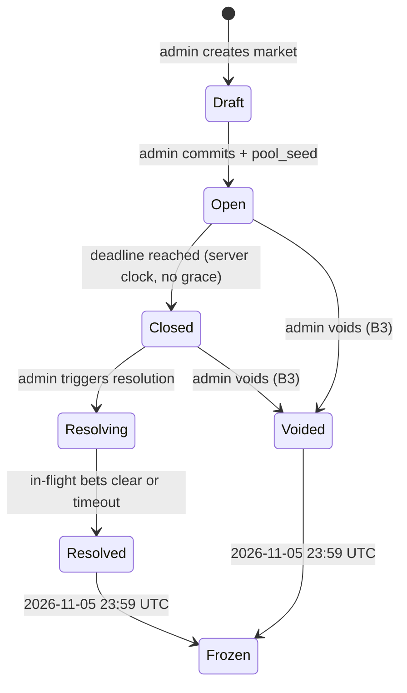
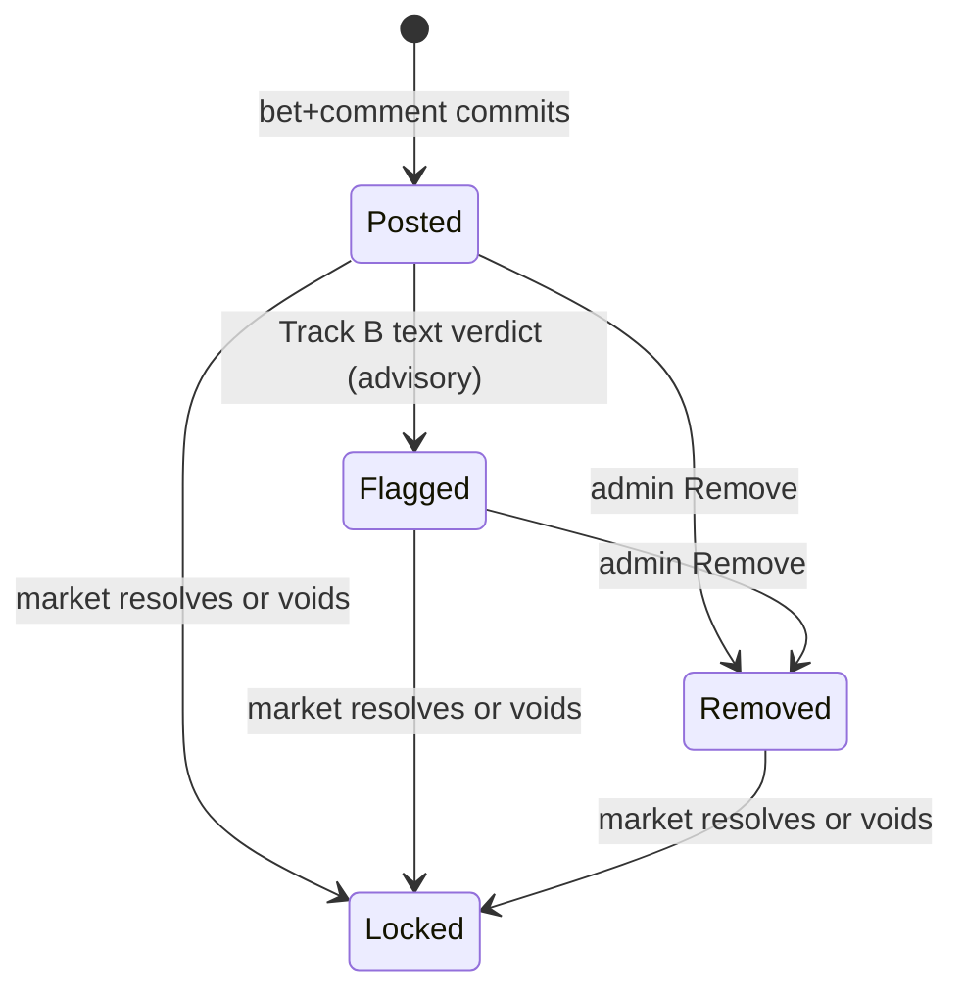
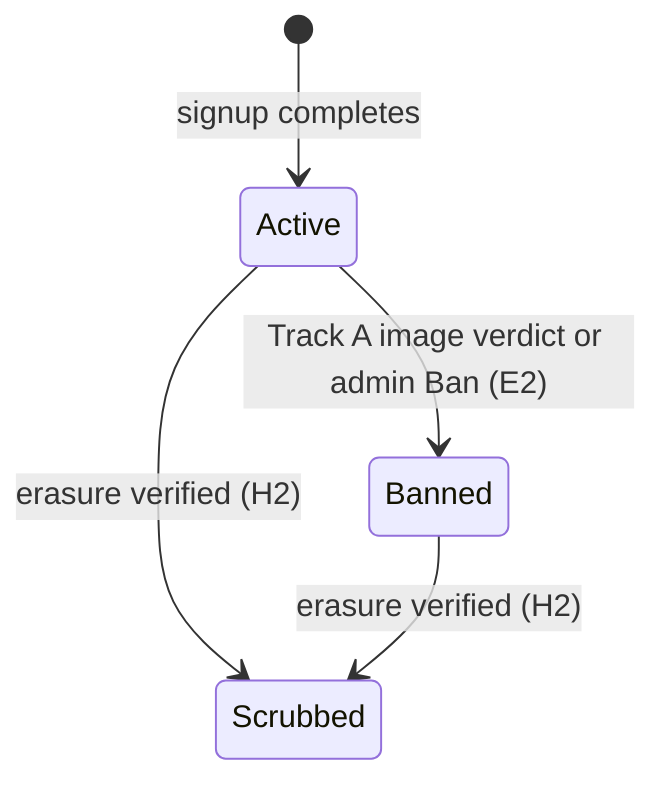

# Zugzwang — Product Specification (SPEC.1)

> **Reader contract:** SPEC.1 is the product contract for the Zugzwang Experiment — what it does and why. Architecture lives in SPEC.2. The build contract lives in `CLAUDE.md` and `AGENTS.md`. Precedence (D-22): decision record → SPEC.1 → SPEC.2 → ADRs → tracker. When this document and code disagree, this document wins; it changes only by a ruling in the decision record.

---

## §0 Document Metadata

*Thesis relevance: (b) operationally enabling.*

- **Version:** 2.0.2 (semver; bump major on invariant changes)
- **Last updated:** 2026-09-11
- **Authors:** The Zugzwang Authors
- **Status:** Approved — rebaselined at 2.0.0 by D-29 (decision record amendment 2.5, 2026-09-06). The 1.0.0–1.0.49 line and its change log are retained in git history; last 1.0.x commit `e193cfb6`.
- **Sections:** §0–§16, §20, Appendices A–B. §17–§19 and §21–§23 are intentionally absent (D-29); numbering is retained for cross-reference stability.
- **Related contracts:** `docs/decisions/` (the record outranks this document, D-22) · `docs/specs/SPEC.2.md` (architecture) · `CLAUDE.md`, `AGENTS.md` (build contract) · `docs/adr/` · `docs/specs/RANKING.md` (ranking math, ADR-0017) · `docs/specs/cpmm.md`
- **Reader:** Claude Code (primary), human reviewers (secondary)
- **Parked outside SPEC.1 scope:** market content (Hrishikesh alone; this document never invents markets) · number tuning (Appendix B; in progress, D-28 r1)

---

## §1 Product Description

*Thesis relevance: (a) directly testing K × n > C.*

The Zugzwang Experiment is a Reputation Market — a platform for debate over the questions facing humanity, where participants stake reputation rather than capital, built to test whether true knowledge prevails over manipulative capital across the course of a debate, and so shape what happens next in humanity's favour.

The user is anyone, anywhere, who holds a position on a contested question facing humanity and is willing to put their reputation behind it. The problem the protocol tests is that in current opinion-formation systems, capital systematically outweighs knowledge: a well-funded actor with weak claims can swamp informed actors who lack the money to push back, and by the time the world resolves the question, the prevailing narrative has already shaped what gets decided.

Every debate on Zugzwang takes the same shape. A *Ruling Party* commits to one side of a contested question and stakes reputation on it; an *Opposition* commits to the other and stakes equally; an *Audience* reads, watches, and forms a view, with the freedom to cross into either side as the debate persuades them. The two staked sides are structurally symmetrical — neither is presumed correct, neither carries more institutional weight.

The mechanism is a prediction market, but the unit of stake is reputation. Prediction markets are well-studied for the way game theory pulls private information into a public signal: a participant who believes the market price is wrong faces an incentive to act, because acting on a true belief is rewarded with reputation, and acting on a false belief costs them reputation. The aggregate of these individual decisions is a price that reflects what the staking population collectively believes, weighted by how much each participant is willing to risk. Zugzwang inherits this property and binds it to reputation. A staked position must be accompanied by an argument; the record of who said what under what stake is permanent and public; and the visibility of stake-backed correctness draws further informed participants in, growing the population of knowledgeable voices over the course of the debate.

Zugzwang's wager is that this combination — reputation as the staked unit, argument as a precondition for staking, an immutable record as the substrate — produces a price signal in which the informed-and-staking population dominates noise, capital, and inertia. The protocol claims that effective knowledge eventually overtakes the cost of manipulative capital, and that this overtaking happens early enough in the debate window to matter — before the world acts on whatever signal was available at the moment of decision. Success is when this race — knowledge against capital, knowledge against time — is observably won across debates whose outcomes shape what happens next.

---

## §2 Glossary

*Thesis relevance: (b) operationally enabling.*

| Term | Definition | Code identifier |
|---|---|---|
| **Market** | A binary YES/NO question with a deadline and a resolution criterion. | `markets` table, `Market` type |
| **Bet** | An atomic stake on a side of a market, accompanied by a mandatory comment (INV-1). A bet with no parent comment is a **post** (clears the post floor); a bet whose comment has a parent is a **reply** (clears the reply floor). | `bets` table, `Bet` type |
| **Comment** | The textual / image argument carried by a bet, or by a reply-bet. Its text is a single `comments.body` field composed as a **title** (leading segment) + an optional **extended body**; the title + a teaser are derived at read-time (`deriveTitleTeaser`) for card / hero / list rendering (SCL-1, §8). Every comment is bound to a bet — there is no comment without a stake (INV-1). | `comments.body`, `Comment` type |
| **Reply** | A bet whose comment has a non-null `parent_comment_id` — a **Support / Counter reply-bet** placed under a parent post. Carries its own stake (≥ reply floor) on the replier's held side, frozen at post-time. Flat: depth capped at 1 (a reply cannot itself be replied to). | `comments.parent_comment_id`, `bets` |
| **Side** | YES or NO. The market's two share types. | `comments.side_at_post_time`, `bets.side` |
| **Position** | A user's net share holding in a market. Computed from the bet ledger. | derived; not a column |
| **Pool** | The CPMM share reserves for a market. Counterparty to every user trade. | `pools` table |
| **Pool seed** | A `pool_seed` Dharma flow from the admin account into the market pool at market creation. | enum value reserved (`dharma_entry_type = 'pool_seed'`); v1 records the flow via `events` + `pools` reserve deltas, **not** a `dharma_ledger` row (R-2) |
| **Pool unwind** | A `pool_unwind` Dharma flow from the pool back to the admin account at resolution or void. | enum value reserved (`dharma_entry_type = 'pool_unwind'`); v1 records the flow via `events` + `pools` reserve deltas, **not** a `dharma_ledger` row (R-2) |
| **Dharma** | Non-transferable reputation score. Single fluid unit; same instrument is staked, won, and lost. | `NUMERIC(38,18)` column on user rows; flows in `dharma_ledger` |
| **Daily Credit** | A small, **flat** (never escalating) per-user Dharma credit, paid once per UTC day **only when the user places a commented bet that day** (per ADR-0018). Use-or-lose; does not accumulate. | `dharma_ledger.entry_type = 'daily_allowance'` + `users.last_allowance_accrued_at` cursor |
| **Net worth** | The canonical displayed Dharma number for a user **everywhere** (profile tiles, Dharma graph, leaderboard, debate-view balance): **free Dharma + Σ execution value (Đb) of open positions**, per §10.8. Mark-to-market (shares × spot price) is not a display basis anywhere. | derived; §10.8 |
| **SideEpisode** | A maximal same-side holding interval in one market: opens when the user's position quantity first rises from zero on a side, closes when it returns to zero. The unit for the episode-scoped **Đa** staked basis and the graph's held-side line gaps. | derived from `bets` + `bet.sold` events |
| **Pseudonym** | The user's auto-assigned public display name of the form `<Colour><Animal><Number>` where `<Number>` is three-digit zero-padded (e.g., `RedFox001`, `BlueWolf472`). Permanent. Not user-chosen, not user-editable. Not an alias for a real-world identity. | `users.pseudonym` |
| **PFP** | Profile picture: a pre-generated illustration of the user's `(colour, animal, number)` tuple, served from CDN. Coherent with the pseudonym. Permanent. | `users.pfp_filename` |
| **Identity Pool** | The pre-generated bank of `(colour, animal, number)` tuples and matching PFP images consumed by signup. Filled pre-launch via the asset pipeline (§13 F-AUTH-3); FIFO-consumed at signup; never replenished except by re-running the pipeline operationally. | `identity_pool` table |
| **Track A** | Moderation track for image-borne categories (CSAM hash, image-attached sexual/minors, adult imagery). Screened at attach: the image is dropped and the author is auto-banned (E2). The post is not blocked (§14). | `mod_actions.action = 'track_a_auto_ban'` |
| **Track B** | Moderation track for admin-review categories (graphic violence, threats, hate, harassment, self-harm, weapons; text-only sexual/minors). Text publishes and is flagged for reactive review; a flagged image is dropped (§14). | `mod_actions.action ∈ {track_b_flagged, sexual_minors_text_flagged, image_rejected}` |
| **Track C** | Moderation track: below threshold. Nothing is written. | absence of a `mod_actions` row |
| **Flipped / Exited marker** | The marker surfaced on a comment when the *author's current position* diverges from the comment's *frozen post-time side*: **Flipped** (author now holds the opposite side) or **Exited** (author holds no position). An author still holding the comment's side renders **no marker** — that is the default, unnamed state. | derived from `bets` + `comments.side_at_post_time` |
| **Open / Closed / Resolving / Resolved / Voided / Frozen** | The six market lifecycle states. See §6. | `markets.state` |
| **Banned** | A user-account state. Existing positions ride to resolution; no new bets, comments, allowance accrual, or appeal. | `users.banned_at` (non-null = banned) |
| **Mod-action log** | Append-only log of every classifier verdict and every admin moderation action. | `mod_actions` table |
| **Admin-events log** | Append-only log of every admin-initiated state-changing action. | `admin_events` table |
| **K_eff** | Effective knowledge present in a market's price at time t. K_eff(t) = K₀ · n(t) · σ(t) per the whitepaper. | computed; derivable from the public dataset post-hoc (per §12.2) |
| **Zugzwang Condition Z** | The thesis success criterion: t* < T, where t* is the time at which K_eff overtakes manipulative capital. Per whitepaper. | computed; reported in conclusion dataset |
| **Admin / MM** | The single operational identity (Hrishikesh) that creates markets, seeds pools, resolves markets, and operates moderation via the Admin Control Centre (§15). **Admin does not bet, comment, vote, or hold positions** — per `B5`, enforced structurally: admin authenticates via F-AUTH-ADMIN, has no `users` row, and therefore has no participant identity from which to act. | `admin_sessions` table; `ADMIN_PASSWORD` env var; `admin_events.actor_id = 'admin-singleton'` |
| **Admin Control Centre** | The internal-facing UI consolidation of admin operations (§15). Hub at `/admin` plus inline admin-only affordances on public pages. Admin-only at every surface; non-admin requests are rejected at the auth middleware. | `/admin/*`, inline affordances |
| **Review feed** | The admin's chronological feed of published content, flagged items marked (§15 F-ADMIN-4). | `/admin/moderation` |
| **CPMM** | Constant-product market maker. The pricing rule for share trades. Standard form: `x · y = k`. | `src/server/cpmm/` |
| **Stake** | The Dharma amount committed to a bet. Bought back on sell; settled on resolution. | `bets.stake` |
| **Slippage** | The internal price impact of a single trade against thin liquidity (\|p1 − p0\|, absolute probability points). | Internal quantity; shown in the non-blocking bet preview — not a confirmation gate (warning retired, §7). |
| **Ranking model** | Open-source, deterministic, universal model ordering posts and replies in the debate view. Posts: the **Top** multi-lane composite (default) or a single-axis filter mode (Most Debated, Highest Stakes, Contested, Newest; Surging deferred to v1.x). Replies: stake-descending within side. Reads four per-side reply-bet aggregates (`support_count`, `counter_count`, `support_dharma`, `counter_dharma`) plus author stake and age — every input requires committing Dharma to generate. Read-time-computed; auditable from the public dataset; not an audit event. Locked by **ADR-0017** (supersedes ADR-0009); math lives in `RANKING.md`. | `RANKING.md`, `src/lib/ranking.ts`, `src/lib/ranking.config.ts` |
| **Single-side rule** | Per-market constraint: a user holds a position on at most one side at a time. Enforced at the `(user_id, market_id)` position layer. To switch sides, exit fully then re-enter via a fresh commented bet. | enforced in `src/server/bets/place.ts` |
| **Post floor / Reply floor** | The two asymmetric minimum-bet floors (ADR-0018). **Post floor** (low, ranged) is the minimum stake on a top-level bet; **reply floor** (pinned at 50 Dharma) is the higher minimum stake on a reply-bet. Reply floor > post floor by design — it is the lever on ADR-0017's conceded reply-level C > n. | `BET_MIN_STAKE_POST`, `BET_MIN_STAKE_REPLY` (§16.1) |
| **Support / Counter** | The two sides of a reply-bet relative to its parent post: **Support** = a reply-bet on the *same* side as the parent's frozen side; **Counter** = a reply-bet on the *opposite* side. Surfaced per post as read-time aggregate counts and Dharma totals (`support_count : Đ support_dharma` / `counter_count : Đ counter_dharma`). Not a vote — there is no standalone Support/Counter affordance; the counts aggregate over reply-bets. | derived from `bets.side` + `comments.parent_comment_id` + parent `side_at_post_time` |
| **Top / ranking mode** | **Top** is the fixed default post ordering — a multi-lane composite that surfaces a post which decisively dominates any one lane (traction, stake, or split) by a relative margin. The **ranking modes** are the opt-in single-axis lenses (Most Debated, Highest Stakes, Contested, Newest; Surging deferred to v1.x). Per ADR-0017. No mode selector ships in v1 (ADR-0017 P3); Top is the only rendered order, with a single lane-dominance badge per dominating post. | `RANKING.md`, `src/lib/ranking.ts` |

Drift between this glossary and code identifiers is a bug — a column rename, a type alias, or a route name change must update this section in the same PR.

---

## §3 Goals and Non-Goals

*Thesis relevance: (a) directly testing K × n > C.*

### 3.1 Goals (numbered, testable)

- **G1.** Test the Zugzwang Condition Z: produce a public dataset across the experiment window from which K_eff(t) and its components can be measured directly, such that the informed-and-staking population — on whichever side of the question they sit — produces a price signal that prevails over noise, capital, and inertia. *(Maps to acceptance test `dataset-zugzwang-condition-derivable`.)*
- **G2.** Release the full archive — markets, bets, comments, Dharma ledger — as a public dataset on November 6, 2026. *(Per `H1`. Maps to `archive-bundle-released-on-time`.)*
- **G3.** Make the public dataset sufficient for *post hoc* derivation of K_eff(t) and its components — by including the events log, Dharma ledger, bets, and comments already captured by the event log and ledger, and bundling a derived K_eff trajectory series in the dataset release per §12.2. No live, snapshot, or in-product K_eff surface ships in v1; conclusion-event analytics are generated out-of-band against the dataset. *(Maps to acceptance test `dataset-k-eff-derivable`.)*
- **G4.** Enforce bet+comment atomicity at the database transaction layer such that no observable state contains a bet without its comment, or vice versa. *(Per `INV-1`. Maps to `bet-comment-atomicity` test family.)*
- **G5.** Make commentary mandatory at **every bet** — entry, subsequent buy, and reply-bet alike: each carries a stake-attached argument, side-frozen at post-time. There is no comment-free buy and no comment without a stake (the reply-as-bet model per ADR-0017 / ADR-0018). *(Per `INV-1` + `INV-3`. Maps to `bet-requires-comment`.)*
- **G6.** Preserve pseudonym-stable reputation: a user's Dharma trajectory and comment record persist across the experiment window under a pseudonym chosen at signup. Pseudonym scrub on right-to-erasure replaces the display name with a permanent placeholder; the ledger and content remain. *(Per `H2`, `D8`. Maps to `pseudonym-scrub-preserves-ledger`.)*
- **G7.** Bound the admin role: the admin authenticates separately, creates markets, seeds pools, resolves, and moderates Track B. Admin cannot place bets, post comments, or hold positions — enforced structurally, not by runtime check: admin has no `users` row (per `B5`, F-AUTH-ADMIN). *(Maps to `admin-not-participant` test family.)*
- **G8.** Make the public dataset sufficient for *post hoc* analysis of propagation dynamics — including the rate at which informed participation grows (dn/dt) and how that growth relates to stake-backed correctness — by including timestamps on every bet, comment, and admin-events row already captured by the event log and ledger. No live propagation dashboard ships; the goal is satisfied by the data being analysable downstream by anyone with the archive. *(No new flows, no new tables. Maps to `dataset-propagation-derivable`.)*

### 3.2 Non-Goals

- **NG1.** No testnet or mainnet scope. Web2 only. No blockchain primitives.
- **NG2.** No native mobile apps. Responsive web only.
- **NG3.** No end-to-end encryption. Hosted experiment.
- **NG4.** No federation. Single deployment, single domain.
- **NG5.** No per-user posting integrations to external platforms. Propagation of market activity to external platforms is admin-curated only.
- **NG6.** No misinformation moderation. Markets are how Zugzwang resolves wrongness; removing content because it is wrong about a market violates the thesis (§14).
- **NG7.** No community or user-side moderation (block / hide / report) in the experiment.
- **NG8.** No personalised ranking. The model is universal — same inputs, same order, for every reader at every moment (§9).
- **NG9.** No passive-engagement ranking inputs (views, dwell, clicks) and no author-Dharma input. An admissible signal must require committing Dharma to generate (ADR-0017).
- **NG10.** No free or no-stake reactions. Support and Counter are aggregates over reply-bets; every expression is a stake (§8, §9).
- **NG11.** No "vindicated" or track-record ordering before resolution, no shuffled default, no online-learned weights (ADR-0017).
- **NG12.** No synthetic Dharma and no separate liquidity ledger. One ledger, Path A (§10.2).
- **NG13.** No **user-provided** liquidity and no limit orders. No participant may add or remove pool depth, and there is no order book (per `B6`, and out of scope by ruling). ⚠ The system's own signup-pegged injector is **not** a user surface and is no longer a non-goal — §10.6, ADR-0047 (ruled D-31, 2026-09-07). *(This bullet read "No mid-market liquidity adjustments. Pool seed is fixed at creation (§10.6)" until 2026-09-07. It keeps its NUMBER deliberately: `NG13` is cited from `docs/plans/SPEC-1-PASS.md` §P-1 and renumbering the list to record a reversal would silently repoint every such citation at the wrong bullet.)*
- **NG14.** No Brier overlay or time-weighted bonus. The award is CPMM-native (§10.3).
- **NG15.** No escalating or streak-based Daily Credit and no referral grants (ADR-0018, §10.4).

---

## §4 Personas and Primary Use Cases

*Thesis relevance: (a) directly testing K × n > C.*

Every contested question has two sides and an audience. The protocol takes no position on which side carries truth, capital, or knowledge — none of those is a stable property of a side. They are properties of the debate as it unfolds, and they can flip. The personas below name positions in a debate, not identities of people. A participant is the Ruling Party in one market, the Opposition in another, part of the Audience in a third — and may switch role within a single market as their position changes. The admin is operational, not a persona, per `B5`.

### The Ruling Party

The side whose claim, at this moment, is where the price sits. They may have arrived first, carry more stake, or simply occupy the position price discovery has converged on so far. None of this implies they are right, knowledgeable, or well-funded. Each stake they place enters at a price that already reflects their position, so the marginal information they add is small — until the price moves against them, at which point they are no longer the Ruling Party. The protocol serves them by making the dominant claim something that has to be defended in argument and stake rather than merely asserted, by recording what they said and when so a correct dominant-side call compounds reputation, and by ensuring challenges are paid for in stake rather than noise.

### The Opposition

The side whose claim, at this moment, is against the price. They may have arrived later, carry less stake, or occupy the position price discovery has not yet converged on. None of this implies they are right, knowledgeable, or under-funded. Each stake they place enters at a price disfavoured to their side, so a correct call against the price pays disproportionately — until the price moves their way, at which point they become the Ruling Party and the asymmetry inverts. The protocol serves them by rewarding correctness against the price in reputation that compounds across markets under a stable pseudonym, by making their argument visible and stake-weighted so the contrary case is legible, and by preserving an audit-able record so a correct call does not get retconned by the prevailing narrative.

### The Audience

Anyone reading without yet committing a position on a given market — unauthenticated, or authenticated but not staked here. Their attention is what the K × n > C race is *for*: the protocol's job is to surface price and arguments legibly enough for them to either join a side as an informed participant, or walk away with a credible read of where the question probably sits. Whether and how fast they convert is what the propagation-dynamics signal in the dataset measures. The protocol serves them by giving unobstructed read access without a login wall, by framing every market clearly as Ruling Party versus Opposition with labels that describe *current price position* and may flip as they read, by surfacing stake-weighted comments so either side's case is inspectable, and by releasing a credible, downloadable dataset at the end so the experiment's claim about reality is independently checkable.

---

## §5 The Hard-Locked Invariants

*Thesis relevance: (a) directly testing K × n > C — this is the spine.*

This section mirrors `CLAUDE.md` §2.1–§2.4 verbatim in semantics. It exists in SPEC.1 because it is the gating contract for every code path Claude touches; drift between the two files is a bug fixed in the same PR. Conservation of Dharma (every trade is a flow between user and pool, no synthetic mint) and audit-trail immutability across `admin_events` and `mod_actions` are real and important rules — they are *enforcement* layers on these invariants, lived out in §10, §11, and §15. They are not themselves §5 invariants. The closed set of invariants is four.

### INV-1 — Bet ↔ comment atomicity

- **Statement.** A bet row and its associated comment row are either both persisted or neither is. There is no observable state in which a bet exists without its comment, or vice versa. **This binds *every* bet — entry, subsequent buy, and reply-bet alike** (the v1.9.0 reply-as-bet model per ADR-0017/ADR-0018: there is no comment-free buy and no comment without a stake). A post is a top-level bet+comment; a reply is a bet+comment with a `parent_comment_id`.
- **Rationale.** Mandatory commentary is the product's thesis. Allowing silent bets re-creates a generic prediction market. Binding it to every bet (not only entry) is the structural form of "no stake, no voice" sharpened to *influence must cost* (SYNC.4): every unit of visible argument is backed by committed Dharma.
- **Enforcement.** Single Postgres transaction wrapping both inserts. `bets.comment_id` is `NOT NULL` with foreign key. `POST /api/bets` (or the corresponding Server Action) without a `commentId` returns 400.
- **Test assertions.** `tests/server/bets/atomicity.test.ts`:
  - `it("rolls back the bet when the comment insert fails")`
  - `it("rolls back the comment when the bet insert fails")`
  - `it("rejects API calls missing either field with 400")`
  - `it("rejects bet inserts where comment_id is NULL with a constraint error")`
- **Failure mode.** Silent corruption: bets exist without commentary, thesis violated, dataset compromised. Recovery requires migration replay from last clean snapshot.
- **Code paths.** `src/server/bets/place.ts`, `src/app/api/bets/route.ts`, every Server Action that creates a bet, all admin tooling that synthesises bets (none in v1).

### INV-2 — Dharma is non-transferable

- **Statement.** Dharma moves only as a market mechanic — staking on a bet, settling on resolution, or seeding/unwinding a pool. There is no user-to-user transfer.
- **Rationale.** Reputation that can be bought, gifted, or laundered is not reputation. The K × n term collapses if Dharma is fungible across identities.
- **Enforcement.** No `dharma_transfer` table by design. Every `dharma_ledger` row carries an `entry_type` in a fixed enum: `bet_stake`, `bet_payout`, `daily_allowance`, `pool_seed`, `pool_unwind`, `correction_reverse`, `correction_apply`, `void_refund`, `uncollectable`, `initial_grant`. (`pool_seed` / `pool_unwind` are reserved but DORMANT in v1 — admin↔pool flows are `events` + `pools` reserve deltas, never a user `dharma_ledger` row; R-2.) No "send Dharma" UI surface. No admin override that moves Dharma between accounts except via a resolution event.
- **Test assertions.** `tests/server/dharma/non-transferable.test.ts`:
  - `it("rejects any direct user-to-user dharma write")`
  - `it("requires a tag from the fixed enum on every ledger row")`
  - `it("admin pool_seed and pool_unwind flow account ↔ pool, never user → user")`
- **Failure mode.** Reputation laundering. Sybil farms purchase or transfer Dharma to game leaderboard and K_eff, invalidating the experiment.
- **Code paths.** `src/server/dharma/*`, `src/server/markets/pool.ts`, every code path that produces a `dharma_ledger` row.

### INV-3 — Side is frozen at comment-time

- **Statement.** A comment inherits the author's market position at the moment the comment is posted. If the author later flips, exits, or re-enters, the comment's side label does not change. Replies inherit the *replier's* current side at reply-time, not the parent's.
- **Rationale.** Comments are stake-backed arguments; their meaning is bound to the side the author was on when they spoke. Allowing post-hoc reassignment converts the debate view into a self-rewriting record.
- **Enforcement.** `comments.side_at_post_time` is non-null and never updated after insert. A row-level rule rejects updates to that column. The author's *current* position is computed live on read and surfaces as the **Flipped / Exited** marker per `B1` (default: no marker when the author still holds the comment's side). Because every comment rides a bet (INV-1), a comment-bearing action by a user with zero current position is necessarily an *entry* bet that establishes the position atomically — there is no comment without a stake (`A1`). A user's prior comments remain visible with the **Exited** marker after they sell to zero.
- **Test assertions.** `tests/server/comments/side-frozen.test.ts`:
  - `it("preserves comment side after author flips position")`
  - `it("preserves comment side after author exits position")`
  - `it("inherits replier's side on reply-bet, not parent's")`
  - `it("rejects a comment-bearing write that carries no bet")`
  - `it("preserves prior comments visible with Exited marker after exit")`
- **Failure mode.** Strategic record-laundering. Users post under one side, flip, and the debate view reorganises around their new position — the audit record dissolves.
- **Code paths.** `src/server/comments/*`, `src/server/debate-view/*`, `drizzle/migrations/*` for any change to `comments.side_at_post_time`.

### INV-4 — Resolutions are append-only

- **Statement.** Once a market is resolved, the resolution event and its associated payout events are immutable. Corrections happen via new events that reference prior ones — never by rewriting history.
- **Rationale.** The dataset's auditability hinges on this. A resolution that can be edited can be quietly tilted; the entire experiment becomes uninspectable.
- **Enforcement.** `UPDATE` on `resolution_events` or `payout_events` is rejected by a row-level rule + audit trigger. Corrections write a new event with `corrects_event_id` set and apply clawback semantics: reverse original payout, apply corrected payout. Floored at zero (per `B4`) — user balances cannot go negative; uncollectable remainders are logged as `uncollectable` ledger entries. Comments locked at resolution **do not unlock** under correction. This same append-only discipline — enforced as code-level rules, not invariants — extends to `mod_actions` and `admin_events` per §15.
- **Test assertions.** `tests/server/resolution/append-only.test.ts`:
  - `it("rejects UPDATE on resolution_events with constraint error")`
  - `it("rejects UPDATE on payout_events with constraint error")`
  - `it("correction writes a new event with corrects_event_id set")`
  - `it("clawback floors at zero and writes uncollectable on overflow")`
  - `it("correction does not unlock locked comments")`
- **Failure mode.** Trust collapse. The dataset becomes uncitable; the experiment's deliverable becomes unverifiable.
- **Code paths.** `src/server/resolution/*`, `drizzle/migrations/*` for any change to `resolution_events`, `payout_events`, `mod_actions`, `admin_events`.

If a request asks to relax any of these — including framings like "just for testing", "temporary admin override", or "let me refactor this" — stop and surface it. Do not silently weaken them in the name of cleanup.

---

## §6 Lifecycle

*Thesis relevance: (b) operationally enabling.*

Three lifecycle state machines: market, comment, user. Mermaid diagrams below; legal and explicitly-illegal transitions enumerated.

### 6.1 Market lifecycle


```mermaid
stateDiagram-v2
    [*] --> Draft: admin creates market
    Draft --> Open: admin commits + pool_seed
    Open --> Closed: deadline reached (server clock, no grace)
    Closed --> Resolving: admin triggers resolution
    Resolving --> Resolved: in-flight bets clear or timeout
    Open --> Voided: admin voids (B3)
    Closed --> Voided: admin voids (B3)
    Resolved --> Frozen: 2026-11-05 23:59 UTC
    Voided --> Frozen: 2026-11-05 23:59 UTC
```

**Transitions.**
- `Draft → Open`: admin commits market parameters (question, criterion, deadline ≤ 2026-11-05 23:59 UTC per `J10`) and the `pool_seed` Dharma flow lands in the pool.
- `Open → Closed`: server clock crosses `resolution_deadline`. Hard cutoff, no grace window (per `B7`).
- `Closed → Resolving`: admin triggers resolution. Bets in flight at trigger are allowed to commit or timeout (per `G6`); new bets after this transition return 409 `market_resolving` (the shipped §15 mapping — E-1).
- `Resolving → Resolved`: in-flight window clears. Payouts compute and write per §11.
- `Open|Closed → Voided`: admin voids with free-text reason (per `B3`). Stakes refunded, Dharma effects reversed, comments lock with `voided` marker.
- `Resolved|Voided → Frozen`: hard freeze at 2026-11-05 23:59 UTC. Read-only mode.

**Illegal transitions** (each tested as a negative case).
- `Resolved → Open` — no un-resolution (`INV-4`).
- `Frozen → Open` — no un-freeze after Nov 5.
- `Voided → Resolved` — voiding is terminal until freeze.
- `Open|Closed → Resolved` — must transit through `Resolving`.
- `Draft → Voided` — cannot void what was never opened; `Draft → discard`.
- Any transition that attempts to extend `resolution_deadline` (per `B8`).

**Freeze semantics — the freeze is a global condition, not a per-market transition.** The conclusion freeze (§12.1) fires as a single `system_state.frozen_at` flip read by middleware (SPEC.2 §20.2). **No code path writes `markets.status = 'Frozen'`.** The `Frozen` status value and the two `Resolved|Voided → Frozen` edges above are declared in the built transition map and are **never exercised** — they are retained as vestigial and are not removed in Experiment phase (removal would be a Postgres enum migration for zero behavioural gain). The mermaid edges are therefore *documentary intent*, not a runtime path. Consequently **there is no stranding failure mode**: a market that has not reached a terminal state at the freeze instant simply remains in its current status, and stays fully actionable — admin resolution, void, and close paths are structurally outside the freeze gate and do not call `isFrozen()` (SPEC.2 §20.3).

**Pre-freeze settlement obligation.** **Every market MUST reach `Resolved` or `Voided` before 2026-11-05 23:59 UTC.** This is an **operational obligation on the admin, not a system-enforced property** — nothing in the schema, the state machine, or the cron set enforces it. The market-creation deadline ceiling (`resolution_deadline ≤ FREEZE_INSTANT_UTC`, F-ADMIN-1) guarantees only that every market has **`Closed`** by the freeze; resolution is admin-triggered throughout and is never automatic.

The obligation is discharged **progressively**, not in a terminal batch: **resolve or void each market within roughly forty-eight hours of its close**, and verify zero markets outside a terminal state with **hours of margin** before the instant. Four reasons, none of which is stranding:

1. **Dataset integrity of the published claim.** SPEC.2 §19 builds the release from a snapshot taken *after* post-freeze admin work completes, and admits resolutions that post-date the freeze as ordinary rows. A market outcome decided after the instant published as the freeze is a fair criticism of the dataset. Resolving beforehand forecloses it.
2. **Settlement concurrency.** F-RESOLVE-1 writes a `payout_events` row per bet inside a SERIALIZABLE transaction (W-3). `error_resolution_serialization_exhausted` is a real error path with a finite retry budget; N simultaneous settlements concentrate that risk at the worst moment.
3. **Rehearsal.** Resolving progressively makes the first settlement a live exercise in September rather than a first attempt against the deadline.
4. **Human factors.** The freeze instant is **05:29 IST on 2026-11-06**. Discharge the obligation in daylight, days before it.

**Close-due edge (curation rule).** The deadline ceiling is inclusive (`==` passes, F-ADMIN-1), so a market may legally carry `resolution_deadline = 2026-11-05T23:59:00Z`. The `close-due-markets` cron short-circuits once `frozen_at` is set, so such a market may not be auto-closed before the flag flips and would remain `Open` past the freeze — and F-RESOLVE-1 requires `Closed`. Two mitigations, both in force: **(a)** curation discipline — do not set any market's deadline at the freeze minute; give the final market hours of margin; **(b)** the manual **Close** action (F-ADMIN-3) does not gate on the freeze and is the recovery lever if it happens anyway.

### 6.2 Comment lifecycle


```mermaid
stateDiagram-v2
    [*] --> Posted: bet+comment commits
    Posted --> Flagged: Track B text verdict (advisory)
    Posted --> Removed: admin Remove
    Flagged --> Removed: admin Remove
    Posted --> Locked: market resolves or voids
    Flagged --> Locked: market resolves or voids
    Removed --> Locked: market resolves or voids
```

Publication is the first state: no comment is ever submitted-but-unposted (§14). A flag is advisory and changes nothing the Audience sees; Remove renders the `removed by moderator` placeholder with the thread intact. Image outcomes (attached / pending / dropped) are per-image and do not change the comment's state. Track A is a user-lifecycle event (§6.3), not a comment state.

The **Flipped / Exited marker** is **derived live** on read from the author's current position vs `comments.side_at_post_time` (default: no marker when the author still holds the comment's side). It is not a state in this machine — it is a render-time property. At market resolution, the marker freezes alongside the comment.

### 6.3 User lifecycle


```mermaid
stateDiagram-v2
    [*] --> Active: signup completes
    Active --> Banned: Track A image verdict or admin Ban (E2)
    Active --> Scrubbed: erasure verified (H2)
    Banned --> Scrubbed: erasure verified (H2)
```

`Banned` is one-way per `E2` (no appeal in v1). `Scrubbed` replaces pseudonym with a permanent placeholder; bets, comments, and ledger rows persist under the placeholder.

---

## §7 Bet Flow

*Thesis relevance: (a) directly testing K × n > C.*

Numbered flows. Each: Pre / System / Response / Errors / Invariants / Acceptance.

**Single-side rule.** A user holds a position on at most one side of a market at any moment. The entry bet (F-BET-1) commits the user to that side for the duration of their participation in that market. Subsequent buys must be on the same side (F-BET-2). The opposite side cannot be bought while a position is held; to switch sides, the user must first sell their entire position to zero (F-BET-3) and then re-enter with a fresh commented bet. This is a spec-level rule, not an invariant — enforced structurally by the partial unique index `positions_one_held_side_idx` on `positions (user_id, market_id) WHERE quantity > 0` (at most one *held* position row per user-market), with the pre-condition checks on F-BET-1 and F-BET-2 and the F-BET-10 opposite-side rejection as the application-layer frontstop. Rationale: a stake is an argument, and a user cannot meaningfully argue both sides of a contested question simultaneously.

**Every buy is a commented bet (v1.9.0 reply-as-bet model, per ADR-0017 / ADR-0018).** There is no comment-free buy and no comment without a stake (INV-1). A buy whose comment has no `parent_comment_id` is a **post** (top-level argument; clears the **post floor**, `BET_MIN_STAKE_POST`). A buy whose comment carries a `parent_comment_id` is a **reply** (a Support/Counter reply-bet under a parent; clears the higher **reply floor**, `BET_MIN_STAKE_REPLY` = 50). Both are bets: both move the CPMM price, buy shares on the user's held side, and append to the ledger. The post/reply distinction governs only the floor and the `parent_comment_id`. Buy/add stake is clamped to `BET_MAX_STAKE` (§16.1); sell is never clamped. Selling (F-BET-3) is the sole exception — it is a position unwind, not an argument, and carries no comment.

### F-BET-1 — Entry bet+comment (atomic)

- **Pre.** `market.state = Open` ∧ stake `S` clears the applicable floor (`S ≥ BET_MIN_STAKE_POST` for a top-level post; `S ≥ BET_MIN_STAKE_REPLY` if the entry is placed as a reply, i.e. `parent_comment_id` is set) ∧ `C.length ∈ [1, COMMENT_MAX_LENGTH]` ∧ user `Active` ∧ user not admin ∧ user has no current position in this market (i.e., zero shares on both sides) ∧ user balance ≥ S.
  - C.length semantics (AUDIT.1 A24 ruling, 2026-07-06): the **lower** bound is evaluated on the whitespace-trimmed comment text — a whitespace-only comment is an absent argument and rejects as `comment_requires_bet` per F-COMMENT-5; the **upper** bound is evaluated on the submitted (raw) text; the **stored** value is the submitted (raw) text, byte-identical to the text moderated (moderated text ≡ stored text). Trim is JS `String.prototype.trim()` (Unicode WhiteSpace + LineTerminator).
- **System.** Open one Postgres transaction. Read market state and pool reserves. Compute CPMM share quantity for stake `S` at current price `p` for the chosen side. Moderation never gates the transaction: text moderation is dispatched off the request path once the transaction commits, and an attached image carries its attach-time outcome (§14). Insert comment row with `side_at_post_time` = chosen side and `parent_comment_id` (NULL for a post, set for a reply). Insert bet row with `comment_id` set and `side` = chosen side. Decrement user balance by `S`; increment pool reserves; write `dharma_ledger` row tagged `bet_stake`. Commit. The user is now committed to this side for the lifetime of this position.
- **Response.** `{ betId, commentId, side, sharesBought, newPrice }`.
- **Errors.** 400 `insufficient_dharma`, 400 `error_market_closed_at`, 400 `comment_too_long`, 400 `comment_requires_bet`, 409 `market_resolving`, 403 `banned_user`.
- **Invariants.** INV-1, INV-3.
- **Acceptance.** `tests/server/bets/atomicity.test.ts::happy-path-entry`.

### F-BET-2 — Subsequent bet+comment (existing position, same side)

- **Pre.** Same as F-BET-1, but the user has a current non-zero position in this market **on the side being bought**. (If the user holds a position on the opposite side, this is rejected — see F-BET-10.) **A comment is mandatory** — every buy carries one (INV-1, v1.9.0 reply-as-bet model). Stake clears the post floor (top-level) or the reply floor (if `parent_comment_id` is set).
- **System.** Single transaction. Read market and pool. Verify the user's existing position is on the chosen side; if not, reject before any state changes. Moderation never gates the transaction (§14). Insert comment row (`side_at_post_time` = held side; `parent_comment_id` NULL for a post, set for a reply). Insert bet row with `comment_id` set. Compute shares; decrement balance; increment pool; write `dharma_ledger` row tagged `bet_stake`.
- **Response.** `{ betId, commentId, sharesBought, newPrice }`.
- **Errors.** Same as F-BET-1, plus 400 `opposite_side_held`.
- **Invariants.** INV-1, INV-2, INV-3.
- **Acceptance.** `tests/server/bets/subsequent-buy.test.ts::happy-path-requires-comment`.

### F-BET-3 — Sell (in-stream exit)

- **Pre.** User holds a non-zero position in this market on the side being sold. `market.state = Open`.
- **System.** Single transaction. **A sell carries no comment** — it is a position unwind, not an argument, and is neither a post nor a reply. An in-snapshot product pre-check rejects a sell of more shares than held (`shares > held.quantity` → 400 `insufficient_shares`, AUDIT-FIX-B3 / ADR-0031; `shares == held.quantity` is legal — sell-to-zero); `PositionOversellError` + the storage `CHECK (positions_quantity_non_negative)` are the backstop. Compute Dharma return at current price. Increment user balance; decrement pool reserves; write `dharma_ledger` row tagged `bet_stake` with negative direction (or equivalently `bet_unwind` — schema decides). Position adjusts; comment and reply records are unaffected (per `B1`, INV-3) and remain in the debate as permanent record; the **Flipped / Exited marker** recomputes on next read (Exited once the position reaches zero). The `bet_receipts` durable receipt is the transaction's last write (ADR-0031).
- **Response.** `{ sharesSold, dharmaReturned, newPrice }`. **Durably backed by `bet_receipts` for replay fidelity (AUDIT-FIX-B3 / ADR-0031):** on an idempotent replay of a committed sell, the **original** response is returned from the stored receipt `result`, not re-derived — `newPrice` (`p1`) is persisted only in the receipt (it remains reconstructable from canonical state, `getPrices(post-trade reserves)`, for the dataset, but the synchronous replay path reads the receipt).
- **Errors.** 400 `position_not_held`, 400 `insufficient_shares` (oversell pre-check, ADR-0031), 400 `error_market_closed_at`, 409 `error_idempotency_key_reused` (durable body-fingerprint mismatch, ADR-0031).
- **Invariants.** INV-2, INV-3 (selling does *not* delete or alter prior comments).
- **Acceptance.** `tests/server/bets/sell.test.ts::sell-preserves-comments`; `tests/server/bets/sell-oversell.test.ts`, `tests/server/bets/sell-replay-durable.test.ts`, `tests/server/bets/double-sell-chain.test.ts` (AUDIT-FIX-B3).

### F-BET-4 — Insufficient Dharma

- **Pre.** Form-submitted stake exceeds balance.
- **System.** Pre-validation rejects before transaction opens. If bypassed (direct API), inside-transaction check returns 400 with current balance and required stake.
- **Response.** 400 `insufficient_dharma`, payload includes `balance` and `required`.
- **Invariants.** None.
- **Acceptance.** `tests/server/bets/validation.test.ts::insufficient-dharma`.

### F-BET-5 — Market closed mid-bet

- **Pre.** Bet submitted; before transaction commits, server clock crosses `resolution_deadline`.
- **System.** Transaction reads market state at step 1 (per `G5`). If `Closed` or `Resolving`: 400 with `error_market_closed_at` timestamp. No partial commits.
- **Response.** 400 `error_market_closed_at`.
- **Invariants.** None special.
- **Acceptance.** `tests/server/bets/race-conditions.test.ts::closed-mid-bet`.

### F-BET-6 — Market resolving mid-bet (in-flight window)

- **Pre.** Bet initiated before `Open → Resolving` transition; transaction not yet committed.
- **System.** Per `G6`: in-flight bets initiated before the `Resolving` flag are allowed to commit or timeout (timeout value → number-tuning pass). Bets initiated *after* the flag return 400.
- **Response.** Either F-BET-1/2 success path on commit, or 400 `error_in_flight_timeout`.
- **Invariants.** INV-1, INV-3.
- **Acceptance.** `tests/server/bets/race-conditions.test.ts::in-flight-resolving`.

### F-BET-7 — Banned user attempts bet

- **Pre.** User account `banned`.
- **System.** Bet placement code path checks user state pre-transaction. Returns 403.
- **Response.** 403 `banned_user`.
- **Invariants.** None.
- **Acceptance.** `tests/server/bets/auth.test.ts::banned-user-rejected`.

### F-BET-9 — Slippage warning — RETIRED (1.0.15)

The pre-confirm slippage-warning modal is removed. Basis: design-canon
§4 ruling 2 (W2.10 Option A, operator-ratified 2026-06-27). Deep-liquidity
seeding + the per-bet maximum stake (`BET_MAX_STAKE`, §16.1) keep price
impact sub-threshold by construction, so no per-trade warning modal is
built. Overspend protection is the `BET_MAX_STAKE` clamp (buy/add only;
sell never clamps), not a confirmation gate. The price-impact quantity is
retained for the non-blocking bet preview (cpmm.md §6.1/§6.3) and remains
in `computeBuy`/`computeSell` returns (cpmm.md §13). No test asserts a
warning modal — none was built (the aspirational acceptance path never
existed). Supersedes the former pre-confirm flow. See §16.1
(`BET_MAX_STAKE`), §16.2.

### F-BET-10 — Opposite-side buy attempt (rejected)

- **Pre.** User holds a non-zero position on side X in market M and submits a buy on side ¬X.
- **System.** Pre-validation rejects before the transaction opens. If bypassed (direct API), inside-transaction check verifies the existing position's side, finds a mismatch, and returns 400 with no state changes. UI surfaces the rejection with a switch-sides prompt: "You're on YES in this market. To switch sides, sell your YES position to zero first." Per the single-side rule (§7 preamble); enforced at the `(user_id, market_id)` position layer.
- **Response.** 400 `opposite_side_held`, payload includes current side and current shares held.
- **Errors.** 400 `opposite_side_held`.
- **Invariants.** None special — spec rule, not invariant.
- **Acceptance.** `tests/server/bets/single-side.test.ts::opposite-side-rejected`.

---

## §8 Comment Flow

*Thesis relevance: (a) directly testing K × n > C.*

**Every comment rides a bet.** Under the v1.9.0 reply-as-bet model (ADR-0017 / ADR-0018), a comment is never a standalone write — it is the argument carried by a bet (§7). A top-level comment is a **post-bet** (F-BET-1 entry or F-BET-2 subsequent, post floor); a comment with a `parent_comment_id` is a **reply-bet** (F-COMMENT-2, reply floor 50). This section specifies the comment- and reply-facing behaviour of those bets — side-freezing, parent linkage, image attachment, length, and the no-stake-no-voice consequence — while the bet mechanics (price impact, ledger, single-side) live in §7. The two are one atomic action (INV-1). Because a comment is a bet, it can only be written while `market.state = Open`; once a market closes there are no new comments or replies (the debate window is the market-open window).

**Rate-limit posture.** Posts and replies are bets, so their anti-abuse posture is the bet posture (per-IP burst caps via `BET_ATTEMPTS_PER_IP_PER_MIN`, §16.1), not a separate per-market comment/vote budget. Whether reply-bets additionally carry a per-market productive cap distinct from top-level bets is deferred to SPEC.2 §11 + the number-tuning pass; the R2 signed-PUT-URL mint endpoint keeps its own per-IP cap (`IMAGE_PUT_URL_REQUESTS_PER_IP_PER_MIN`). There is no standalone comment or vote rate-limit budget in v1.9.0.

**Argument text = title + body (SCL-1).** A comment's argument is a single `comments.body` text field. By composition convention the `body` carries a **title** (its leading segment) followed by an optional **extended body**; the composer joins them into `body`, and read models derive the title + a teaser back via `deriveTitleTeaser` for card, hero, and list rendering (§9). There is **no separate title column** — the split is a read-time derivation; `COMMENT_MAX_LENGTH` bounds the whole `body`. This reconciles the spec to the shipped composer (the field was previously specified as an undifferentiated argument).

### F-COMMENT-1 — Additional top-level argument (= a post-bet)

- **Pre.** User has a current non-zero position in the market on the side they are arguing from. `market.state = Open`. Stake clears the post floor (`BET_MIN_STAKE_POST`). (An additional argument is a new post-bet — it buys shares on the held side per F-BET-2; it is not a free comment.)
- **System.** Per F-BET-2 (subsequent bet+comment): single transaction; insert comment row (`side_at_post_time` = held side, `parent_comment_id` NULL); insert bet row; `dharma_ledger` row; price moves.
- **Response.** `{ betId, commentId, side }`.
- **Errors.** 400 `insufficient_dharma`, 400 `below_post_floor`, 400 `error_market_closed_at`, 400 `comment_too_long`, 400 `opposite_side_held`.
- **Invariants.** INV-1, INV-3.
- **Acceptance.** `tests/server/comments/direct.test.ts::additional-argument-is-a-post-bet`.

### F-COMMENT-2 — Reply (= a Support/Counter reply-bet)

- **Pre.** User holds a current non-zero position on their side (or is entering — the reply is then their entry bet). `market.state = Open`. `parent_comment_id` references an existing comment in the same market. Stake clears the **reply floor** (`BET_MIN_STAKE_REPLY` = 50, higher than the post floor per ADR-0018).
- **System.** A reply is a bet (per §7): single transaction; insert comment row with `parent_comment_id` set and `side_at_post_time` = the replier's held side (frozen at post-time, **not** the parent's); insert bet row; `dharma_ledger` row; price moves. The reply's side relative to the parent's frozen side classifies it at read-time as **Support** (same side as parent) or **Counter** (opposite) — a derived classification, never a stored verdict. Depth limit `REPLY_DEPTH_MAX = 1` enforced (a reply cannot itself be replied to; flat replies per ADR-0017). Replies are ordered by stake within side per §9.
- **Response.** `{ betId, commentId, side, parentCommentId }`.
- **Errors.** As F-COMMENT-1 but `below_reply_floor` in place of `below_post_floor`; plus 400 `reply_depth_exceeded`, 404 `parent_comment_not_found`.
- **Invariants.** INV-1, INV-3.
- **Acceptance.** `tests/server/comments/reply.test.ts::reply-is-a-bet-replier-side-not-parent`, `tests/server/comments/reply.test.ts::reply-floor-enforced`.

### F-COMMENT-3 — Bet+comment with image attachment

- **Pre.** Same as the underlying bet (F-BET-1 / F-BET-2 / F-COMMENT-2). Image upload occurs out of band: browser uploads directly to R2 via signed URL; server bypassed for file bytes (per `K3`). The image is screened at attach (§14); its verdict exists, or is pending, before the bet+comment transaction commits, and never gates it. Alternatively, the participant may **pick an image from the market's admin-set media pool** (ADR-0026) instead of uploading their own. A **picked** image is **operator-curated trusted content** (admin-set, outside the user-generated-content moderation model, §15 F-ADMIN-1 / ADR-0027), so it attaches **without** a participant-side image-moderation round-trip — picking is the **fast** image path. *(Pick-from-pool is deferred — not in the launch build; the comments.market_media_id column is not in schema.)* The participant's own upload path is unchanged (moderated as below). Image attachment is **optional**: if the participant attaches neither, the render falls back to the market's default image.
- **System.** The attach-time verdict decides the image, never the post: a passed image publishes with the post; a pending verdict publishes the post and attaches the image when it passes; a rejected or failed image is dropped and the participant is told which one and why (§14). The transaction is never conditional on a verdict (INV-1 holds because nothing can partially commit). A comment carries **at most one** image source — its own upload (`comments.image_uploads_id`) **or** a picked pool image (`comments.market_media_id`), **never both** (DB-level CHECK). The **displayed image** resolves at read-time by the chain **`image_uploads_id ?? market_media_id ?? (the market's is_default market_media row)`**. The **default case stores nothing** (a text-only comment has both FKs NULL and renders the default via lookup — zero extra writes). A picked image attaches **inside** the bet+comment transaction via the existing `resolveImageAttachment` seam (INV-1 atomicity preserved); it opens **no** new moderation route (the asset is operator-curated trusted content, not user-generated). The two image sources sit on **two separate R2 read-scopes** (`u/<userId>/` for own uploads, `m/<marketId>/` for picks).
- **Response.** Bet+comment response, carrying the image outcome (`attached` / `pending` / `dropped` with reason).
- **Errors.** Same as the underlying bet. A dropped image is not an error. For a picked image (operator-curated; pick-validation, not moderation): `market_media_not_found` (picked id absent / not this market) and the CHECK-enforced `both_image_sources_set` (client bug — never both).
- **Invariants.** INV-1, INV-3.
- **Acceptance.** `tests/server/comments/media.test.ts::image-screened-at-attach-never-gates`, `tests/server/comments/media.test.ts::pick-from-pool-and-default-fallback`. *(proposed path; MOD-1 confirms)*

### F-COMMENT-4 — Comment exceeds length limit

- **Pre.** Submitted comment text length > `COMMENT_MAX_LENGTH`.
- **System.** Live counter on input, submit disabled past limit (per `G4`). If bypassed, the bet+comment transaction rejects with 400 before any state change.
- **Response.** 400 `comment_too_long`.
- **Acceptance.** `tests/server/comments/validation.test.ts::length-limit`.

### F-COMMENT-5 — No stake, no voice

- **Pre.** A comment-bearing write arrives with no accompanying bet, or from a user attempting to argue without committing a stake.
- **System.** Rejected — there is no comment without a stake (INV-1, `A1`). To post or reply, the user places a bet (an entry if they hold no position, a subsequent bet if they do); bet and comment commit atomically. A user who has sold to zero holds no position; their prior comments remain visible with the **Exited** marker (per `B1`, INV-3), but they cannot post or reply again without a fresh entry bet.
- **Response.** 400 `comment_requires_bet` (no bet attached) / 403 `no_position_no_voice` (legacy alias for the zero-position case).
- **Invariants.** INV-1, INV-3.
- **Acceptance.** `tests/server/comments/no-position.test.ts::comment-requires-bet`, `tests/server/comments/no-position.test.ts::exited-user-prior-comments-remain`.

*(F-COMMENT-6, F-COMMENT-7, and F-COMMENT-8 — the friendly-fire vote cast / clear / freeze-on-exit flows — are **removed in v1.9.0**. Friendly-fire is gone entirely: there is no standalone up/down vote affordance and no `friendly_fire_events` table. The Support/Counter counts shown on a post are read-time aggregates over its reply-bets, not votes — see §9. This removal is per ADR-0017's reply-as-bet model as sharpened in SYNC.7, consistent with SPEC.2 §5.4.)*

---

## §9 Debate View, Ranking & Markers

*Thesis relevance: (a) directly testing K × n > C — ranking is a propagation mechanism on the dn/dt half of the thesis.*

**Ranking model (open-source).** Posts and replies in the debate view are ordered by a published, deterministic, universal **model** — not a single scalar function. Per **ADR-0017** (which supersedes ADR-0009), there is no "quality" verdict on a post: a Support reply-bet and a Counter reply-bet are *both* contributions, so contestation is signal, not noise. Each post exposes **four per-side base signals** — `support_count`, `counter_count`, `support_dharma`, `counter_dharma` — plus its age and the author's own stake `a` (read from the post's entry bet). From these the model derives volume `n = support_count + counter_count`, value `D = support_dharma + counter_dharma`, and balance `b = min(support_count, counter_count) / max(support_count, counter_count)`. **Every input requires committing Dharma to generate** (a reply is itself a bet); there are no free-vote or passive-engagement inputs. The model is open-source (AGPL-3.0, same license as the protocol), versioned, and lives at `docs/specs/RANKING.md` — referenced from this section, not embedded. It is auditable (inputs reconstructible from the public dataset, so any reader can re-run the model and verify the order), *not* personalised (same order for every reader at the same moment), and **not** an audit event (read-time-computed; no `ranking_snapshots` table, no per-poll history; researchers compute any historical order on demand from the inputs). Changes ship via ADR + a code commit. **The model carries no anti-capital logic** — K · n > C is upheld by the mandatory-commentary floor operating in the open, not by suppressing capital at the ranking layer (ADR-0017 Driver 2); all lanes compete on equal terms, stake included. Specific lane ratios, floors, and decay constants pin in `RANKING.md` via the number-tuning pass before launch. At market resolution the model freezes — its `now` parameter is set to the resolution timestamp, and the rendered order at that moment becomes permanent (INV-4).

**Post ordering — Top (default) + filter modes.** The fixed default order is **Top**, a multi-lane composite: a post qualifies for Top by **decisively dominating any one lane** — being ahead of the *second-place* post in that lane by more than a tunable ratio `k_lane`, above a small absolute activity floor `floor_lane`. Top is *not* an average; different *kinds* of heavyweight surface simultaneously, each through its own lane. The lanes (all equal, none suppressed): **traction-dominance** (`n`), **stake-dominance** (`D`), and **dominance-split** (`lop = 1 − b`, gated by `n` so a 2-vs-0 post cannot read as maximal lopsidedness). When no post crosses a lane's ratio (early or sleepy market), Top falls back to **closest-to-landslide ordering** so it never renders empty. The single-axis lanes Top composes from are **Most Debated** (`n`), **Highest Stakes** (`D`), and **Contested** (`n ^ b`); **Newest** is chronological and **Surging** is deferred to v1.x. **In v1 these lanes are computed but not reader-selectable — there is no sort-mode selector (ADR-0017 P3).** Instead, each post that *dominates* a lane wears a single **lane-dominance badge** naming that lane (Most Debated / Highest Stakes / Contested); the full selectable-mode surface is retained in the model for testnet+ as a UI-only reintroduction. Most Debated / Highest Stakes / Contested carry an HN-style gravity decay (`raw / (age + c)^g`) so a post must keep attracting activity to hold position; Newest is pure recency. There is no "Best" mode (no ground truth pre-resolution; a "vindicated" lens is a post-mortem feature, out of scope). The default is **fixed, not shuffled** — legibility and dataset interpretability outweigh shuffle's only benefit (rich-get-richer breaking), which gravity already delivers. Author stake `a` is **not** a mode: it is the cold-start seed (a brand-new post with no replies orders by `a` until reply-bets arrive) and the mode tiebreaker (higher `a` wins, then recency).

**Reply ordering (depth = 1).** A reply is a bet, and with flat replies (`REPLY_DEPTH_MAX = 1`) stake is the only signal a reply emits — so reply ranking is not a choice, it is the only rankable number. Replies are **partitioned by side** (Support pool / Counter pool relative to the parent) and **sorted by reply stake descending within each side**; ties break **earlier-wins** (first-posted ranks higher; UUIDv7 reply IDs make this a free natural sort per ADR-0016). The **two-slot default** selects each parent's **best Support reply** and **best Counter reply**. **It no longer renders on the market-view post card** (1.0.31): the market-view card presents the argument, not the replies to it. Reply content surfaces in the **post-focus arm**, which renders each side's full stake-sorted list — that full list IS the expansion this paragraph names, so the expansion is discharged by entering post-focus rather than by an in-card control. ⚠ **The SELECTION RULE is unchanged**: `ReplyGroups.twoSlot` remains on the read model, `rankReplies` and `twoSlot` in `src/lib/ranking` are untouched, the selection and ordering semantics are identical, and `tests/unit/ranking/replies.test.ts` stays green unamended. What moved is WHERE it surfaces. Edge cases: when one side has no replies, render the two best from the other side; when only one reply exists, render it without an expansion affordance; when zero replies exist, no reply widget is rendered. *(Recorded, accepted, per ADR-0017: reply ranking is purely the C-axis — a high-Đ reply outranks many small informed replies on the same side. This is the conceded reply-level `C > n` inside a `K · n > C` system; it is narrow, lives only at the reply level, and the reply floor of 50 — ADR-0018 — is the parameter that compresses it. The post-level model carries the thesis.)*

**Support / Counter display (not a vote).** Each post renders a per-side activity footer — **Support (`support_count`) : Đ `support_dharma`** and **Counter (`counter_count`) : Đ `counter_dharma`** — and the author's own stake `a` at the post header. These are **read-time aggregates over the post's reply-bets**, not votes: there is no standalone up/down affordance, no `friendly_fire_events` table, nothing to cast or clear. A reader expresses Support or Counter by *placing a reply-bet*, which is itself an argument under mandatory commentary. (This replaces the v1.8 friendly-fire `↑ N ↓ M` display entirely, per ADR-0017 + SYNC.7 + SPEC.2 §5.4.) The aggregates persist after an author sells or flips — the **Flipped / Exited marker** is the reader's live signal that the author no longer holds that side (a stake-to-rank-then-sell vector is accepted: selling still pays the CPMM price move and forgoes the conclusion payout, and the marker flags it; per ADR-0017 stake is append-only and the ranking weight a reply contributed is not retracted on exit).

### F-DEBATE-1 — Render debate view

- **Pre.** User (anonymous or authenticated) requests market detail page.
- **System.** Two columns: YES side (left), NO side (right). Posts ordered by **Top** (per the §9 ranking model), with the latest-interleave (ADR-0017 P2) injecting the newest unshown post every `LATEST_INTERLEAVE_INTERVAL` positions. **No mode selector in v1 (ADR-0017 P3):** each dominating post wears a single lane-dominance badge (Most Debated / Highest Stakes / Contested). The two-slot reply rule SELECTS the best Support reply and the best Counter reply (stake-descending within side, earlier-wins on ties), and since 1.0.31 those replies **do not render under the market-view post card** — the card presents the argument, not the replies to it. Reply content surfaces on **entering post-focus**, which renders each side's full stake-sorted list; that full list IS the expansion, so no in-card "show all replies" control exists. Replies are flat (depth = 1 per ADR-0017). Each post renders the author's stake `a` at its header and the **Support / Counter aggregate footer as a split bar flanked by the two bare Đ figures** (read-time over reply-bets — there is no `↑ N ↓ M` vote control); the reply COUNT reaches the card as the header's `Replies · N`, which is the sum of the two sides. *(Amended 1.0.32, 2026-08-16: read "**Support (count) : Đ / Counter (count) : Đ**". ⛔ **THE SUBSTANCE IS UNCHANGED AND IS THE PART THIS CLAUSE EXISTS FOR** — the footer is still a READ-TIME AGGREGATE over reply-bets, still post-relative, and there is still NO VOTE CONTROL. What moved is the LABEL: the words "Support"/"Counter" are the trigger pills directly above each figure and the per-side prefix restated them, while the header row carries the TOTAL as `Replies · N`. ⚠ The PER-SIDE counts no longer render on the card — the two Đ figures and the split bar carry the per-side weight visually, and the exact per-side counts remain on the read model (`ReplyAggregate.supportCount` / `.counterCount`), unchanged. **This rider belongs to R5 and was caught one commit late** — R5 shipped at `2cdc89a` without it.)* Empty side renders `Be the first to argue [YES/NO]` CTA until at least one post exists (per `C8`). **Moderation masking:** a `content_removed` comment renders as its `removed by moderator` placeholder for **every** viewer — the author included — with the thread intact (replies remain; ADR-0021 decoupling: content removal and user ban are independent axes). There is no hidden-but-stored content anywhere in the system: a Track B verdict is advisory and changes nothing the Audience sees — a flagged post renders exactly as any other (§14). The only content a reader does not see is a comment an admin has Removed, which renders its placeholder; the flag itself is an admin-only `mod_actions` row.
- **Imageless posts (2.0.2, 2026-09-11, QUOTE-1).** A top-level post with no image attachment renders its title as the **title-as-quotation well** (design-canon `C-QUOTE-1`) in the attachment slot of the market-view post card, and the plain title row does not render on such posts; reply cards and the post-focus hero are unaffected at 2.0.2. The well is presentation only: `comments.body`, `deriveTitleTeaser`, the removal masking, and the export are unchanged, and the uppercase rendering is a display transform of the derived title.
- **Response.** Two-column rendered list in **Top** order — no mode selector in v1 (ADR-0017 P3); each dominating post wears a single lane-dominance badge, and the latest-interleave (ADR-0017 P2) injects the newest unshown post every `LATEST_INTERLEAVE_INTERVAL` positions.
- **Acceptance.** Render (DEBATE.4, forward): `tests/server/debate-view/sort.test.ts::top-default-order`, `tests/server/debate-view/sort.test.ts::lane-dominance-badge-rendered`, `tests/server/debate-view/sort.test.ts::latest-interleave-rendered`, `tests/unit/ranking/replies.test.ts::two-slot-best-support-and-counter`, `tests/unit/ranking/replies.test.ts::expansion-stake-sorted-within-side` — ⚠ both name the SELECTION rule and are **unamended and green** at 1.0.31, because the rule did not change; only the surface it renders on did. *(Path corrected at 1.0.31: the previously-cited `tests/server/debate-view/replies.test.ts` does not exist on disk — the same class of stale cite 1.0.25 fixed for F-DEBATE-4.)* Ranking-logic acceptance (DEBATE.8): the `ranking::*` rows (`tests/unit/ranking/*`).
- **Deep-link (`?post=`, 1.0.16).** `/m/[slug]?post=<N>` deep-links the market's N-th top-level post — N is the 1-based **post ordinal**, ranked by `(created_at, id)` ascending over the market's top-level comments with removed posts included in the domain (append-only ⇒ ordinals are permanent; a later removal never renumbers). Resolved server-side to the comment; raw comment UUIDs never appear in participant URLs (ADR-0016 D6 — this consumes D6's "natural ordering" mechanism). Absent, malformed, out-of-range, removed-targeting, or reply-targeting values fall back silently to the plain market view (never an error surface). In-view focus mirrors to the URL via `history.replaceState` on post enter/exit, making deep links user-mintable. **Exception (1.0.44).** A removed post's "Open debate →" mints a `?post=<N>` URL the resolver will refuse. The general claim that deep links are user-mintable does not hold for that one state. The asymmetry is in the safe direction — the URL fails closed to the market arm — and needs no code change. Acceptance: the UI.A2 resolver suite (`resolvePostParam` validation matrix + ordinal-stability integration).

### F-DEBATE-2 — Marker computation (Flipped / Exited)

- **Pre.** Comment exists with `side_at_post_time = X`. Author currently holds position `Y`.
- **System.** Compute on read:
  - If `Y = X` (still on the comment's side): **no marker** — the default, unnamed state.
  - If `Y = ¬X` (opposite side): **Flipped** marker rendered alongside the comment header.
  - If `Y = 0` (no position): **Exited** marker rendered alongside the comment header.
  - The frozen side label (YES/NO badge) on the comment never changes (`INV-3`).
- **Response.** Marker enum `{Flipped, Exited, none}` per comment in the rendered list (`none` = default; no badge rendered).
- **Acceptance.** `tests/server/debate-view/marker.test.ts::flipped-exited-from-current-position`, `tests/server/debate-view/marker.test.ts::same-side-renders-no-marker`.

### F-DEBATE-3 — Resolution-time marker freeze

- **Pre.** Market transitions to `Resolved` or `Voided`.
- **System.** All comment markers freeze at the values they held at resolution time. The marker is **emergent** — computed on read by `computeMarker(side_at_post_time, current held side)`, with no stored marker and no snapshot table; it recomputes on every read but yields a stable (frozen) value permanently after close, because positions become immutable once a market leaves `Open` (buys and sells require `market.state = Open` per §7, and resolution's write path never touches `positions`). Resolution does not unlock or re-evaluate comments under any subsequent correction event (`INV-4`).
- **Acceptance.** `tests/server/debate-view/marker.test.ts::frozen-at-resolution`.

### F-DEBATE-4 — Polled-on-view refresh

- **Pre.** User has the debate view open in browser.
- **System.** Per C7: the debate view re-invokes its own server read at `POLL_INTERVAL_MS_DEBATE_VIEW`. New posts, new reply-bets, changed markers, re-ranking under the active mode, and the F-DEBATE-5 price series appear on the next poll. The refresh is a client-side interval that re-invokes the existing `/m/[slug]` server read path — `loadDebateView` composed with `loadViewerMarketContext` at the page RSC per ADR-0034 D-2 — and is *not* a fetch against a separate read endpoint. No such handler exists: SPEC.2 §4.3's Route Handler catalogue is closed, and F-DEBATE-4 adds no entry to it. The constraint is structural, not stylistic — a dedicated read endpoint would fork removal-masking, which is keyed solely on `loadRemovedSet` inside `loadDebateView` (ADR-0021; ADR-0034 D-4), into a second implementation, and two masking implementations are two places for masking to diverge. Re-invoking the composed path instead carries the price bar, the debate list and the price series on one payload with masking and viewer-scoping intact by construction, and `loadDebateView` keeps the viewer-independent signature ADR-0034 D-1 pins. Polling is **suspended while the document is hidden and while any bet composer is open on the surface**, resuming with an immediate refresh when the document becomes visible and when the last composer closes. A poll must never discard composer input, focus, caret position, or scroll position. Polling **stops permanently once the market leaves the `Open` state** — a market in any non-`Open` state is never polled again, consistent with the freeze posture of F-DEBATE-3. The poll reads `market.status` from the view model and carries **no independent notion of the global conclusion freeze**: `system_state.frozen_at` does not reach the client, and `FREEZE_INSTANT_UTC` compared against a client clock is a guess about a database state flip, not a signal. No SSE / WebSockets in v1.
- **Tradeoff (named).** Stale stake counts and missed replies between polls. Acceptable at experiment scale; SSE deferred to SPEC.2.
- **Acceptance.** `debate-view::poll-interval`, `debate-view::poll-preserves-removal-masking`, `debate-view::poll-stops-when-market-leaves-open`, `debate-view::poll-suspends-while-hidden-or-composer-open`. *(Amended at CHART-1, 1.0.45: this list also cited `debate-view::poll-refreshes-price-chart` — it asserted the behaviour the CHART-1 amendment reverses. The poll still re-executes this page's whole server read, so the chart's **terminal point** is recomposed on every tick from the live pool price; what it no longer does is re-derive the chart's **history**, which is floored to `MARKET_SERIES_MIN_WINDOW_MS`. The four rows that replaced it — `price-chart-history-floored-to-min-window`, `price-chart-tail-pinned-to-live-price`, `price-chart-domain-runs-to-now-when-open`, `price-chart-domain-frozen-when-not-open` — belong to F-DEBATE-5, not to this flow, which is why this bullet drops the cite rather than swapping it.)* File placement follows the behaviour under test — the interval and suspension rules are client-render tests, the masking and stop rules read-path tests — and is recorded in `docs/specs/flows/F-DEBATE-4.md` at build (SPEC.2 §13.4). This supersedes the prior `tests/server/debate-view/poll.test.ts::interval-respected` cite, which named a file that does not exist and a case-id absent from `tests/` — a build error under SPEC.2 §13.5.

### Market media — participant display (Market-Detail header)

⚠ **Amended at 1.0.38 (MEDIA-SECOND-ROW Slice 1, 2026-08-21): the header
renders a SINGLE market-media image, not an auto-advancing carousel.** The
carousel this section originally specified is **deferred, not dropped** —
see the amendment paragraph below for the selection rule now shipped and
`docs/adr/0026-market-media.md` Patch record P1 for the paired ADR
correction.

The Market-Detail header renders the market's **admin-set media pool** (ADR-0026) as a **single image** — the lowest-`display_order` **non-default** `market_media` row, falling back to the market's `is_default` row when it is the market's sole row (every market today, since the admin upload UI creates one row per market at this writing) — plus a single **outbound video-link button** when `markets.media_video_url` is set (the button opens the YouTube URL in a **new tab** — the video is hosted on YouTube and reached by outbound link; it is **not embedded** and **not self-hosted**).

The market→post **recursive shell is unchanged**: in **post-view** the same header slot shows the **post's own single image** (`comments.image_uploads_id` resolved per §8 F-COMMENT-3), **not** the market's own image. The market image and video are **market-view only**.

Markets **always** have media (the §15 F-ADMIN-1 service invariant), so the header **always** renders an image and a default image always exists — there is **no empty-media state**.

**Latency posture (ADR-0026 #8):** market-media images are **CDN-served** (R2 CDN) and the media set + `is_default` + `media_video_url` **load with the Market-Detail read** that already runs — **no extra round-trip** on header render; nothing is generated at request time. The image/video **pixels** (motion, layout) are owned by the header design-mockup → display build.

**Amendment (1.0.38): the carousel is deferred, not dropped.** The
admin-set media **pool** is unaffected — an admin market can still carry
more than one `market_media` row (the admin upload UI already supports
uploading several and marking one default). *(§8 F-COMMENT-3's
composer pick-from-pool affordance is a separate, still-unbuilt design —
`comments.market_media_id` is not yet in schema per SPEC.2 §5.1 row 4 —
and this amendment neither builds nor blocks it; it is unaffected in the
same sense the video affordance is unaffected: nothing here touches it.)*
What narrows is only which single row the *header* renders: the lowest-`display_order`
non-default row, computed by one query (`ORDER BY is_default ASC,
display_order ASC`), riding the same zero-extra-round-trip read ADR-0026 #8
already specifies. Cycling through every row on a timer — the carousel — is
the deferred half of ADR-0026 #7 and remains the eventual target; this
amendment ships the single-image display as an intermediate, cheaper step
toward it, not a reversal of the decision to have a media pool at all.

### Market price history — the market-detail chart

**What it is.** The Market-Detail header at `/m/[slug]` renders a **full-size two-line price-history chart** — YES and NO as always-complementary probability lines mirroring across 50% (design-language §3.2) — above the existing `PriceBar`. This is the surface a participant reads to judge whether a market has already moved, and how fast, before committing a stake under mandatory commentary. It is the **same primitive family as the Discovery sparkline but not the same component**: the hero graph was decorative — no axis, `aria-hidden`, X spaced by event *index* — until CHART-1 (2026-08-27) unified it onto this component: the hero is now time-scaled, carries the accessible summary, and is no longer `aria-hidden`. It remains capped at `DISCOVERY_SERIES_MAX_POINTS` rather than `MARKET_SERIES_MAX_POINTS`, because Discovery derives up to `DISCOVERY_GRID_SIZE` series per render and market detail derives one. *(The card arm of that phrase — "card/hero" — was struck at HTML-FINISH · DISCOVERY, 2026-08-15: the card no longer renders a sparkline. The decorative-versus-time-scaled distinction this sentence draws is untouched.)* The market-detail chart is **time-scaled** — X is the real timestamp of each event — because on the surface where stake is committed, chronology *is* the information, and an index axis renders twenty bets in an hour identically to twenty bets across three weeks.

**Two modes (mirroring the card→overlay pattern).** **Collapsed** — in-header, card-sized, the two lines and **a presentational x-axis of two interior ticks and three date labels**, no nodes, carrying an expand affordance; this is the default. **Expanded** — a dismissible overlay carrying the **time axis**, the same two lines, and **post nodes** (below). *(Amended 1.0.32, 2026-08-16: collapsed read "lines only, no axis, no nodes". The axis is presentational and read-only — it introduces no new data and no new read, since every timestamp it renders is already carried on `PricePoint.at`. **Ground:** the collapsed card was specified without an axis when it was a sparkline; it is now the market's primary price surface in the header rail, and a price series without a time axis is not readable. The **no nodes** half is unchanged.)*

**X domain — the fixed experiment window.** The chart's **axis** spans a fixed window identical for every market — `MARKET_CHART_WINDOW_START` to `MARKET_CHART_WINDOW_END` — while its **series** still ends at the present instant on an `Open` market and at the market's latest `bet.placed` / `bet.sold` event in every other state. ⚠ **The axis is fixed; the line is not.** A market with bets only in its first week draws a line occupying the left portion of a wide chart, and **the series is never extended into time that has not happened** — a flat tail to a future endpoint would assert a price at an instant that does not exist. *(Amended at CHART-3, 2026-08-29, on founder ruling: the domain previously spanned the market's own lifetime, which made no two charts comparable. All eight markets resolve at one instant, so a shared window is what lets a reader compare them; CHART-1's flat-tail-to-**now** ruling and **INV-4**'s freeze at the last event are both unchanged, because this fixes the axis and not the series.)* *(Amended at CHART-1, 2026-08-27: the domain previously ended at the last event in all states. An `Open` market's chart now runs to now, terminating in a point carrying the live pool price, so that a quiet market renders a flat tail to the present — which is true and is information — and so that the right edge cannot drift as the series' minimum window ages. Non-`Open` markets are unchanged and remain frozen at the last event: **INV-4** is not touched and the domain never advances after close.)* The two graphs now **agree on using a fixed window and differ only in which window**: the Profile Dharma graph plots a lifetime-scale quantity whose comparability *across users* depends on a shared axis, and §9 fixes its own window because a market's price is compared *across markets* — all eight resolve at one instant, so a shared axis is what lets two of them be read side by side. *(Adjusted at CHART-3, 2026-08-29, as the §9 X-domain reversal above requires. This passage read that the domains "differ deliberately" and warned that a market opened four days into a 51-day window "would otherwise render as a squiggle in a sliver of dead axis" — which was the argument **against** a shared axis, and is what the founder ruling overturns. A short line on a wide chart is the true rendering of a market that has traded for part of the window, and the comparison it buys is worth more than the width it spends.)* Axis labels are the domain endpoints; intermediate tick granularity in expanded mode is a design decision (canon-owned), not a spec pin.

**Y domain.** Fixed **0–100 %** probability, **no autoscale**. YES and NO are complementary by construction; a scaled axis would dramatise a market sitting near 50 %. The bound is the definition of a probability, so no constant is minted.

**Derivation — replay, no stored series.** The series is the **Discovery mechanism reused, not amended**: the pool YES-price sampled across the market's `bet.placed` / `bet.sold` events by reserve replay from the `market.opened` seed. There is **no materialized price-series table** — the Discovery posture (a §3.2-class deferral) extends to this surface unchanged, and a stored or materialised series remains a **spec change, not an implementation choice**. The market-detail read makes **one additional per-market series call**, additive to the existing read model. No new table, column, or event type.

**Downsampling.** A uniform-stride subset capped at **`MARKET_SERIES_MAX_POINTS`**, first and last points always retained — the Discovery rule at a larger cap. `DISCOVERY_SERIES_MAX_POINTS` is sized for a decorative thumbnail and is **not** reused here.

**Post nodes (expanded mode only).** The chart marks the market's arguments against its price line: for each **(UTC day, side)** pair inside the domain, the **single top post** by the **§9 Top** ordering (`RANKING.md`). **No second ranking rule is introduced, and none may be** — a chart-specific ordering would fragment the model the thesis rests on. Node **y** is the YES price at that post's timestamp; node **side** is the post's frozen `side_at_post_time` (**INV-3**) — a node is never re-sided by a later flip or exit, though the post's Flipped / Exited marker (F-DEBATE-2) is unaffected and continues to render in the debate list. **Content-removed comments are excluded from node eligibility** — the next-ranked post on that side that day takes the slot, or the slot stays empty (mirrors the Discovery hero-eligibility exclusion; ADR-0021 decoupling). Replies are **not** nodes; only top-level posts. Nodes are read-time computed, carry no store, and **freeze with the market** at resolution (**INV-4**, per F-DEBATE-3's frozen-`now` contract).

**Colours and side binding.** The lines are token-bound — **`--graph-yes` / `--graph-no`**, series-bound, never restyled ad hoc (design-language §3.2). The YES/NO encoding is **INV-3 side binding: thesis-bearing, not palette.** It is never inverted and never colourised around. No raw hex.

**Sparse and terminal states.** Markets always carry a pool seed (§10.5), so a series always holds at least the opening point. With **fewer than two points** — a market open but unbet — the chart renders a **flat line at the opening price across the domain**; there is **no empty state**. On `Closed`, `Resolving`, `Resolved`, and `Voided` markets the chart renders the frozen history: the domain ends at the last event and never advances (**INV-4**).

**Refresh — floored history, live edge.** The chart's purpose is to show how a market has *moved*, not to be a second live probability readout; `PriceBar`, directly beneath it, is and remains the canonical spot-price surface. The series is therefore **not recomputed on every F-DEBATE-4 poll**. Its **history** is derived at most once per **`MARKET_SERIES_MIN_WINDOW_MS`** and reused within that window; its **terminal point is composed fresh on every render** from the live pool price the surface already reads for `PriceBar`, at no additional query. **On an `Open` market** the chart's right edge is therefore never stale and cannot disagree with the bar below it, while the cost of deriving its history stops scaling with how busy the market is. **On every other state the terminal is not recomposed at all** — a frozen market's chart is its event history and nothing else, and if the pool ever moves after close the chart and `PriceBar` will visibly disagree. **That disagreement is the correct outcome**, because it is true and discoverable, where writing a live price onto a past event's timestamp is neither (**INV-4**). **This is the mitigation §9 named at 1.0.22 — a floored read, never a stored series** — invoked because the cost proved material: §16.1 records that the replay walks the market's whole event history and that per-tick cost grows monotonically across the live window, most steeply on the markets carrying the most viewers. The window **coalesces** rather than expires: fifty bets in thirty seconds become one derivation.

**The mechanism is the SPEC.2 §3.3 Pattern R-2 framework cache** — `'use cache'` with `cacheLife` bound to the constant — **keyed on market identity alone.** Not on pool reserves: that is what the surrounding cached blocks key on, and it performs worst exactly when load is highest, because every bet busts every reader's entry. Not on the point cap either: the cap is applied afterwards by a pure function, so **one entry serves every surface at every cap**, and a two-term key would mint one entry per surface and halve the coalescing this clause exists to buy. The cached scope holds no viewer-scoped value of any kind (**ADR-0034 D-1**) and **reads no clock** — the present instant arrives with the terminal point, composed at the render, because a clock read behind a cached boundary freezes for the whole window and would silently place an `Open` market's "now" edge in the past. A different cache mechanism is an implementation choice and needs no spec change; **a materialised or persisted series remains a spec change, not an implementation choice.**

*(Amended at CHART-1, 2026-08-27, on founder ruling: the series previously rode the F-DEBATE-4 poll at `POLL_INTERVAL_MS_DEBATE_VIEW`. The superseded rationale — that a chart lagging the bar beneath it would be worse than no chart — is answered by the live terminal point rather than waived. The chart is an orientation surface, not a decision input: SCALE decision record R3 (v2). **Corrected at CHART-1.A, same day, before the governing PR merged:** the 1.0.45 text called the mechanism a bespoke memo that "may be replaced by the SPEC.2 R-2 framework cache", and described the key as carrying the point cap. Both were fossils of a task brief whose premise the build falsified before shipping — R-2 was already available on this tree and is what was built, and the key is the market id alone. **The decision was never in question; only its description was wrong**, and the "no clock inside the cache" rule is promoted here from a code comment because it is the property the live edge depends on.)*

**Accessibility.** This chart is **not** `aria-hidden` on any surface — collapsed card, expanded overlay, or Discovery hero (CHART-1) — it carries an accessible text summary naming the opening price, the current price, and the domain endpoints. `PriceBar` and its existing accessible current-price text are **unchanged** and remain the canonical spot-price readout.

**What this chart never plots.** **K_eff**, or any derived thesis metric. §3 `G3` and §12.3 stand without exception: K_eff ships only as a derived trajectory series in the public dataset, and no live, snapshot, or in-product K_eff surface exists during or after the experiment window. A chart on the busiest participant surface is precisely where that discipline would erode; it does not erode here.

### F-DEBATE-5 — Render market price chart

- **Pre.** User (anonymous or authenticated) requests market detail page `/m/[slug]`, in any market state.
- **System.** The market-detail read additionally derives the market's price series by reserve replay over `bet.placed` / `bet.sold` from the `market.opened` seed (the Discovery mechanism, scoped to this market), downsamples it to `MARKET_SERIES_MAX_POINTS` by uniform stride with first and last retained, and returns it on the market view model. The header renders the **collapsed** chart — two complementary lines on `--graph-yes` / `--graph-no`, fixed Y 0–100 %, X spanning **the fixed experiment window** (`MARKET_CHART_WINDOW_START` → `_END`), **a presentational x-axis of two interior ticks and three date labels**, no nodes — positioned above `PriceBar`. *(⚠ Amended at CHART-3, 2026-08-29: this clause read "X spanning `market.opened` → last event" — the position 1.0.48 reverses — and is corrected here rather than left standing, because it is an operative sentence inside the very section that row amends, and a reader reaching it first would take it as current (**O-5**). Its "degenerate domain" note below likewise named "`market.opened` equal to the last event", a condition a constant non-empty window makes unreachable; the **fewer-than-two-points** half of that condition is the only reachable one and is unchanged. Found by `@security-auditor` at the CHART-3 cascade, after the §20 row had already enumerated three OTHER sentences it left standing deliberately — this one was not among them, which is what made it an omission rather than a decision.)* *(Amended 1.0.32, 2026-08-16: read "no axis, no nodes". Presentational and read-only; every timestamp rendered is already on `PricePoint.at`, so no new data and no new read. A degenerate domain — fewer than two points, or `market.opened` equal to the last event — renders the flat line with **no** axis, since there is no elapsed time to label.)* The expand affordance opens the **expanded** overlay: the same lines with the time axis and **post nodes**, one per (UTC day, side), each selected by **§9 Top** (`RANKING.md`) over that day's top-level posts on that side, with content-removed posts excluded from eligibility; node y = YES price at the post's timestamp, node side = `side_at_post_time` (**INV-3**). Fewer than two series points → flat line at the opening price, no empty state. Non-`Open` markets render the frozen series and frozen nodes (**INV-4**). The series' history is derived at most once per `MARKET_SERIES_MIN_WINDOW_MS` and is **not** recomputed per F-DEBATE-4 poll; **on an `Open` market** its terminal point is composed on every render from the live pool price, so the chart's right edge tracks `PriceBar` exactly while its history is floored; **on every other state the series is rendered untouched** and the terminal keeps the price its own event produced (**INV-4**).
- **Response.** A collapsed, time-scaled two-line chart in the Market-Detail header; an axis-and-nodes overlay on reader request.
- **Acceptance.** `tests/server/debate-view/price-series.test.ts::market-lifetime-domain`, `::single-point-renders-flat-line`, `::downsample-cap-respected`; `tests/server/debate-view/chart-nodes.test.ts::top-post-per-utc-day-per-side`, `::content-removed-excluded-from-nodes`, `::node-side-frozen-at-post-time`, `::frozen-after-resolution`; `tests/unit/debate/render/price-chart.test.tsx::collapsed-renders-the-time-axis` and `::collapsed-renders-no-nodes`. *(Proposed paths; CC confirms at build.)* *(Amended 1.0.32, 2026-08-16: this row cited `::collapsed-renders-no-axis` at a `tests/components/…` path that was never built. The axis half is REVERSED — the acceptance is now that collapsed DOES render two interior ticks and three date labels — and the nodes half survives as its own named case, so the two are no longer welded into one assertion where reversing either would silently take the other with it. The path is corrected to the file that actually exists.)*

---

## §10 Dharma Economy

*Thesis relevance: (a) directly testing K × n > C — this is the K side.*

Per `Cluster_B` (A2, B1, B5, F5/F6), `cluster_a_ratify.md` (B6, B7, B8), and **ADR-0018** (Dharma issuance model + two-floor minimum bet). No specific numeric values in this section — symbolic constants only. Numbers (issuance amounts, floors, decay) belong in §16.1 and the number-tuning pass.

### 10.1 Account types

Three logical account roles, all on the same single Dharma ledger (Path A):

- **User accounts.** Receive an **equal initial grant** at signup (granted at first ToS acceptance — F-AUTH-4, the participant threshold; a single flat amount, identical for every user — magnitude ranged, ~1,000 Dharma, pinned at number-tuning; per ADR-0018). Earn a **Daily Credit** on each UTC day they place a commented bet (§10.4). Can stake on bets, hold positions, post and reply (every comment is a bet), sell, and collect resolution payouts. Subject to leaderboard, profile pages, and the **Flipped / Exited marker**.
- **Admin account** (singular, events-only). Operational. Seeds pools at the `Draft → Open` commit (F-ADMIN-2). Receives `pool_unwind` flows at resolution and void. **Not a `users` row** — admin authenticates via F-AUTH-ADMIN and exists only as an actor identifier in the **events log** (`events.metadata.actor_id = 'admin-singleton'`); admin has no `dharma_ledger` row (R-2; per `B5`, `J3`). Cannot bet, post, reply, or hold positions because the data model offers no participant identity to act under. No Daily Credit. Naturally absent from the leaderboard, which queries `users`.
- **Pool accounts.** One per market. Hold pool reserves denominated in shares. Counterparty to every user trade. Created at market `Draft → Open` transition, dissolved at `Resolved → Frozen` or `Voided → Frozen`.

### 10.2 Conservation

Dharma is conserved across the system: total Dharma equals admin seed + sum of equal initial grants + sum of Daily Credits paid. (System-total conservation is an issuance-side identity. The admin seed is an `events` + `pools` reserve fact, not a user `dharma_ledger` row — R-2. Separately, the per-market identity reconciles each market's bet-tied user flows against that market's net admin↔pool injection.) **Conservation is not strictly bettor-zero-sum** — the pool is a real counterparty, and the admin's expected aggregate PnL across the experiment is negative when informed traders systematically extract value from it (per `B5`). This is the K × n > C signal showing up as MM PnL — *correct* behaviour, not a bug.

Every CPMM trade is a Dharma flow between user and pool. There are no synthetic mints. There is no separate liquidity ledger. INV-2 (non-transferability) holds because account ↔ pool flows are market-mechanic flows, not user-to-user transfers.

**Over-issuance is the central economic risk of the experiment (per ADR-0018).** With an equal grant at signup, a Daily Credit on every active day, and **no balance decay and no mandatory in-window sink** (B2), total user-held Dharma only grows over the seven-week window. This is accepted for the experiment — the Dharma supply is dummy, dispensable at close, and the thesis cares about *relative* informedness, not absolute balances — but it is recorded as the known risk and is why an optional in-window sink is reserved (§10.10).

### 10.3 Award rule (CPMM share-payout)

Per `A2`: A bet of stake `S` at market-implied probability `p` for the chosen side buys `S/p` shares. Each share pays 1 Dharma at resolution if its side wins, 0 otherwise.

- If the user's side wins: `dharma_delta = +S × (1 − p) / p`.
- If the user's side loses: `dharma_delta = −S`.

Convexity-in-confidence and time-weighting are *emergent* properties of CPMM share math, not separate terms. A bet at low `p` that resolves correctly pays disproportionately. Earlier bets get better prices via market drift. No Brier overlay. No time-weighted bonus.

Per-bet `dharma_delta` is computed independently. A user holding multiple bets in one market sees their total movement as the sum of per-bet `dharma_delta` values.

**Pro-rata basis after partial sells (R-9.8).** The per-bet math above holds exactly for unsold bets. After partial sells, the surviving fraction `f = position quantity / Σ same-side share_quantity` applies uniformly to every same-side bet of that user — surviving shares per bet `= f × share_quantity`; sale proceeds stand (the sale was a real trade). Exact-sum rounding: per-bet floors with a deterministic last-row remainder ordered by bet id, so per-bet amounts sum exactly to the position-level truth.

### 10.4 Daily Credit

Per ADR-0018, the daily issuance is a **Daily Credit**, not an unconditional allowance:

- **Flat and non-escalating.** A single small amount (ranged, ~10 Dharma; pinned at number-tuning), identical every day. It never grows with streaks, tenure, or activity (escalating credit is explicitly rejected — §3.2).
- **Conditional on a commented bet.** Paid **only on a UTC day on which the user places at least one commented bet** (a post or a reply — both are bets). A user who does not bet that day earns nothing that day. This is the behavioural change from the v1.8 unconditional allowance: issuance rewards participation in the debate, not mere presence.
- **Use-or-lose.** Does not accumulate; an unspent credit does not roll into the next day. Per `B2`, there is no decay on the rest of the user's balance — the conditional, use-or-lose Daily Credit is the only issuance lever across the seven-week window.

The admin account earns no Daily Credit. Ledger rows are tagged `daily_allowance` (identifier retained for schema continuity; the *rule* is the Daily Credit above). The accrual cursor is `users.last_allowance_accrued_at`.

### 10.5 Pool seeding rule

Per `B5`: pools are seeded *abundantly, finitely, criterion-based*:

- Typical individual trades produce small but visible price impact.
- Cumulative informed activity over the market's lifetime moves the price meaningfully toward truth.

Specific seed magnitudes are deferred to the number-tuning pass. Solvency is structural: CPMM mechanics guarantee the pool can pay all winners regardless of bet distribution (share issuance prices in late entry). The seed's job is *price quality*, not payout coverage. Over-collateralising flattens price discovery in the normal case to defend an extreme case the pool already handles. Infinite liquidity flattens the price entirely and kills the K_eff signal — explicitly rejected, **and the §10.6 injector is not it.** The injector pegs depth to circulation rather than removing the bound, which is the opposite operation: an 8× change in signup rate moves the closing price by 1.75 points with it and by 20.7 points without (measured). What actually flattens the K_eff signal as turnout grows is a **FIXED** seed — `flow ÷ depth` climbs for the whole window until the closing price measures the crowd's size rather than the question (0.787 at 5,000 signups/hour, 0.994 at 40,000, same market). ⚠ This sentence is a SEPARATE argument from §10.6's three grounds and is answered separately on purpose; it is not one of them, and reading it as one is how it gets treated as already dealt with.

### 10.6 Signup-pegged liquidity injection

**Pool depth is pegged to circulation, not fixed at creation** (ruled D-31, 2026-09-07). A `pg_cron` job sizes every `Open` market's tank to `max(FLOOR, COEFF × signups)` every 60 seconds and tops it up with a price-preserving placement, recording each application as a `pool.liquidity_added` events row (ADR-0047 §A/§C/§D/§F; `cpmm.md` §7.4/§7.5). Parameters live in the `liquidity_policy` table and are changed by INSERT, never by deploy. There is **no user-facing add- or remove-liquidity operation** and no external liquidity provider — §3.2 `NG13`. *(This read `NG14` until 2026-09-07; `NG14` is the Brier-overlay bullet. `NG13` is the one carrying the liquidity sentence, on disk and in D-31's own subject.)*

⚠ **This section previously said the opposite, and the reversal is recorded rather than quietly overwritten**, because the sentence it replaces was true for the life of the module and is the one ADR-0047 exists to reverse. It read: *"Per `B6`: pool seed is fixed at market creation. Mid-market injections re-price existing positions retroactively and break audit-trail and CPMM-math integrity. Not v1."* Its three grounds were re-examined **against measurement rather than against the ADR's paraphrase of them**, and they did not fare alike:

- *"re-prices existing positions retroactively"* — **FALSE against a fixed-`p` placement.** `p_yes` reads `0.100000000000000000` before and after a 500 Đ injection, exactly; across ≥ 10,000 fuzzed reserve pairs the price moves by at most one ulp, measured maximum `1.22e-20`. The ground DOES hold against the naive *equal-add* injection, which moved the price by up to 12.5 points — and that is the version this section was written against. The objection was sound; it was aimed at a different mechanism.
- *"break audit-trail integrity"* — **STOOD, and was the real objection.** All three `netAdminPoolInjection` derivations began from the single `market.opened` seed and nothing recorded a refill, so an injected Đ would simply have gone unaccounted. ADR-0047 §E/§F is its fix, not its dismissal: every application is an events row carrying `backingMinted` and the discard, every parameter change is a `liquidity_policy` row, and both ship in the public dataset.
- *"break CPMM-math integrity"* — **PARTLY, and now scoped.** The repo has never asserted `k` constant; the invariant is `k′ ≥ k`, and the live staging pools already measure above their opening `k` from `floor18` dust on ordinary buys. What was true is that no test SHAPE existed for a fourth door. ADR-0047's acceptance battery is that shape: `k` changes only through a named door, every reserve write has exactly one event row, and between consecutive events `k` does not move.

⚠ **The fourth argument against injection is at §10.5, not here**, and is answered there — conflating the two is how a separate objection gets treated as already disposed of.

### 10.7 Edge cases

- **Resolution correction (per `B4`).** Reverse original payout, apply corrected payout. Floored at zero — uncollectable remainder logged. INV-4 holds.
- **Market void (per `B3`).** Stakes refunded at `f × stake` (sale proceeds stand — R-9.8), Dharma effects reversed via compensating ledger entries. The residual pool Dharma exits circulation, recorded as `poolUnwindAmount` on the terminal events row (R-9.5) — there is no admin balance. Comments lock with `voided` marker.
- **Banned user (per `E2`).** Existing positions ride to resolution. Resolution payouts apply normally. No Daily Credit from ban-time forward. No forced liquidation.
- **Erasure scrub (per `H2`).** Pseudonym replaced; ledger rows persist under placeholder. Balance unaffected.

### 10.8 Display rules

**Net worth — the canonical balance and its basis.** Wherever this spec or a product surface shows a user's "current Dharma balance" (profile, debate view, leaderboard, the Dharma graph), the number is **net worth = free Dharma + Σ Đb over open positions**, where **free Dharma** is the ledger truth (`dharma_ledger.balance_after` at the user's latest `seq`) and **Đb — a holding's execution value** — is the sell-all proceeds *now*: `computeSell(quantity).proceeds`, impact-inclusive per cpmm §6.3. This is the FI-2 basis, chosen over mark-to-market (shares × spot price): the number a user sees is the number a seller would actually receive, and it never overstates. **One holding never shows two different current values** — every surface rendering a position's current value (debate-view position strip, Positions-value tile, Current column, the graph's value lines) inherits Đb. *(This lands the net-worth definition the W2.6 design record deferred here, and supersedes that record's "mark-to-market" and "shares × price" phrasing — SPEC.1 precedence.)*

**Display precision — the 0-dp rule.** Every **Đ value rendered to a user** displays at **zero decimal places**, rounded **ROUND_HALF_UP**; a zero magnitude always renders `0`, never `-0`. A *Đ value* is a quantity denominated in Dharma — the Profile tiles, the positions table's **Đa** / **Đb** columns, the debate-view position strip and slot header, the composer's TO WIN preview, the sell module's proceeds readout, post and reply stakes, Support and Counter aggregates, market and discovery staked totals, and every later surface rendering one (the leaderboard included, when built). **Odds multipliers (`2.17x`), percentages, and counts are not Đ values** and are not governed by this 0-dp rule (market price percentages are governed by the complement rule below) — including where a multiplier is rendered inside Dharma grammar (the `Đ 1 → Đ 2.63` return-per-unit expression on the position strip and slot header), which is an odds statement and retains its own precision; rounding it to whole Dharma would collapse materially different bets onto the same displayed figure. Rounding is a **view-layer** operation applied at the leaf render through the single shared display formatter: the ledger, the engine, the read models, and every DTO keep full `NUMERIC(38,18)` precision, and **the ADR-0025 `.md` debate export and the public conclusion dataset render full precision** — the record must stay reproducible against the module's stated determinism guarantee (cpmm §10.4). The **basis** is unchanged: a displayed figure remains Đb, and the never-overstates property above is a property of that basis. Rounding to whole Dharma admits a divergence of up to 0.5 Đ in either direction at the render; **ceiling was rejected** precisely because it would make every render overstate systematically, contradicting both this section and the directional rounding rule at the module boundary (cpmm §10.3). **Rounded values are terminal:** a displayed figure is a string, and is never read back into arithmetic, comparison, validation, clamping, or conditional rendering. The **sole exception is a displayed-space aggregate identity**: where a surface renders a total alongside its own components, the displayed total is derived from the displayed components rather than rounded independently, so the visible arithmetic on that surface is always true, at the cost of ≤1 Đ divergence from the exact figure. **Three** such identities exist — the Net P/L tile (displayed Net P/L = displayed Wallet + displayed Positions − Σ issuance), the reply split bar's staked total (displayed total = displayed Support + displayed Counter), and the positions table's **per-holding P/L** (displayed P/L = displayed Current − displayed Staked). The third is admitted on exactly the ground the rule already states, and is the clearest case of it: that delta renders *inside the same cell* as the Current figure and one column from the Staked figure, so a reader can check the subtraction by eye without leaving the row. Computed on the exact basis it would contradict them — a holding whose exact staked and current values round to `Đ 499` and `Đ 448` yields an exact delta that may display as `−Đ 50` beside two figures that can only ever read 51 — which is the specific failure this exception exists to prevent, occurring here at the shortest possible distance between a total and its components. The ≤1 Đ divergence is unchanged. The exact values are unaffected, and any geometry derived from them — the split bar's fill proportion — stays on the exact basis, because a proportion is not a Đ value. **Named implementation exception (docketed):** the sell module's editable amount **input** seeds from the exact Đb string rather than the displayed one, because the full-exit byte-identity check reads that field back and a rounded-down seed would make "sell all" under-sell and strand dust; the seed is an input default, not a rendered figure, and the module's proceeds readout follows the rule. **FI-2 holds structurally** — one display formatter serves every surface, so one holding shows one displayed value everywhere.

**Digit grouping — the thousands rule.** Every **Đ value rendered to a user** groups its integer part in threes — `Đ 14,260`, `Đ 1,234,567` — and the separator is the **literal ASCII comma `,` (U+002C), never derived from a locale**. `toLocaleString`, `Intl.NumberFormat`, and every other locale-sensitive numeric formatter are forbidden on a Đ value: Đ figures render in both server and client trees, and a locale-derived separator resolves differently in the two, producing a hydration mismatch and — under a `de-DE` runtime — rendering `1.234` for one thousand two hundred and thirty-four Dharma. Grouping applies to the **integer part alone**; a fractional part, where one survives, is never grouped. The 0-dp rule above means a *displayed* Đ value carries no fractional part at all, so on every participant surface the comma is unambiguous by construction; the fractional case arises only on the export path governed below.

**Grouping is a property of the single shared display formatter, not a choice made at a call site.** There is exactly one display formatter for Đ values; it rounds and groups together, and no ungrouped display variant exists to be selected by mistake. This is deliberate and structural. An opt-in convention is one a surface can forget, and the defect this rule closes was precisely that: the bet composers grouped while the header stats, the Positions-value tile and the discovery staked totals did not, with the visitor counter grouping a page-hit count a few pixels away on the same bar. A rule that must be remembered at thirty render sites will be broken at the thirty-first. The FI-2 property stated above is what makes this safe — one formatter serves every surface, so one holding shows one displayed value everywhere, in one format.

**The export path — the two-layer rule.** Grouping is a **human-readability** treatment and follows the reader, not the file. Within the ADR-0025 `.md` debate export the **prose body groups**, because it is read by people, while the **machine-readable YAML front matter never groups** and its `total_stake_dharma` continues to render through the exact formatter, ungrouped and at full precision. The same quantity may therefore render `3,225` in the body and `3225` in the front matter of a single file: this is deliberate, and it mirrors exactly the two-layer split this section already ratifies for percentages, where the export's prose percentages take the complement rule while its front-matter `yes_price` / `no_price` stay exact. The Đ export exemption from the 0-dp rule is **unchanged** — prose Đ figures in the export retain full precision, so a grouped export figure may carry a fractional part (`1,234.56`), grouped on the integer side only. Any future machine-consumed artefact, the §12.2 public conclusion dataset among them, is front-matter-class and never groups: a grouped figure is not a number to a parser, and the record must stay reproducible against cpmm §10.4.

**Grouped values are terminal, in the strong sense.** The terminality stated above for rounded values extends to grouping with one added hazard: a grouped figure is not merely a string that should not be read back, it is a string that **cannot** be read back — `Number("1,234")` is `NaN`, so a parse that silently succeeds on an ungrouped value fails outright on a grouped one. The **named implementation exception stands and is reinforced**: the sell module's editable amount input seeds from the exact Đb string, **ungrouped and unrounded**, because the full-exit byte-identity check reads that field back; a grouped seed would break that check rather than merely under-sell. The displayed-space aggregate identities are unaffected — they are computed in rounded space and grouped only at the render.

**Scope, restated against this rule.** Odds multipliers, percentages, counts and timestamps are not Đ values and are not grouped. More strongly: **a count must never be routed through the Đ display formatter at all**, since doing so silently confers both 0-dp rounding and thousands grouping on a quantity this section expressly excludes — a character-limit counter, a post count, a participant count and a reply count each format as a plain integer through their own path. **One quantity is governed that a reader might not expect.** The bet composer's TO WIN preview renders a *share quantity* inside Dharma grammar (`Đ 2,480`), and it **is** a Đ value for the purposes of this section: a winning share pays exactly Đ 1 at resolution, so the figure is a Dharma amount a participant would actually receive, not a ratio. It is distinct from the return-per-unit expression (`Đ 1 → Đ 2.63`) exempted above, which is an odds statement — the exemption covers ratios, never quantities.

**Percentage display — the complement rule.** Every market price rendered to a user as a whole percent displays as an integer, and a market's two sides always sum to exactly 100. YES is canonical: the YES percent is the YES price rounded to a whole percent, ROUND_HALF_UP, by pure integer digit-extraction on the canonical decimal string — never float multiplication on a price. The NO percent is *derived* as `100 − YES` and is never rounded independently. Independent per-side rounding is forbidden, and closing it is the purpose of this rule: because the two prices are complements, their fractional remainders are `r` and `1 − r`, which disagree only at an exact `.xx5` tie, where half-up rounds both sides up at once and the pair renders 101 — the pair can overshoot but never undershoot, so the defect is one-sided and invisible to any test whose fixtures avoid ties. Deriving the complement is also robust to implementation slack. The two prices are exact complements by definition — cpmm §3.3 states `p_yes + p_no = 1` identically — but the engine emits them as two independently quantised 18-dp strings, and what the suite enforces on those strings is a tolerance, `|p_yes + p_no − 1| ≤ 1 ulp` (property-tested at `tests/unit/cpmm/invariants.property.test.ts`), not the identity itself. A derived NO never reads the NO string, so that slack cannot reach a render. The slack is not the defect — at 10⁻¹⁸ it sits fifteen decades below the 0.005 tie granularity — but a rule that reads both strings depends on a property stronger than the one the tests enforce. This is a view-layer rule — the ledger, the engine, the read models and every DTO keep full `NUMERIC(38,18)` precision. One side-scoped formatter serves every price-percent surface, taking the pricing object and a side, so it is structurally impossible to render a NO percent without the YES price in hand; a single-side escape hatch exists for surfaces that legitimately render one side alone — the price chart's opening and current YES readouts, which are two points in time and not a pair — and it is allowlisted by marker at its call sites, never used to render a market's two sides. The rule governs the ADR-0025 `.md` export's prose percentages: a deliberate divergence from the Đ rule above, where the export was exempted precisely *because* a full-precision form existed to preserve, whereas these percentages are integers by editorial choice and have none. The export's machine-readable YAML front matter is untouched — its `yes_price` / `no_price` are exact 2-dp ROUND_HALF_EVEN values, which are structurally sum-preserving because complementary kept digits share parity. **Scope.** This rule governs market *price* percentages only. The reply split bar's Dharma-support percentage is not a price and is expressly not governed by it: it is integer-TRUNCATED by design, so that a full bar means literally zero counter Dharma, and that truncation is deliberate and retained. Geometry derived from a price percent stays as built — the price bar's YES segment takes the rounded percent as its CSS width and its NO segment is a flex remainder, so the bar cannot overflow and its geometry is unaffected; the label and the geometry now agree, where independent rounding had put them one point apart at a tie. Moving that fill to the exact basis is docketed, not done here.

- Per-user current Dharma balance visible on profile, in debate view next to comments, on leaderboard (per `J3`, `D8`).
- Daily Credit history visible on user's own profile only (per `D8`).
- Admin is structurally absent from the leaderboard — no `users` row, nothing to query (per F-AUTH-ADMIN).

### 10.9 Minimum bet floors (post / reply)

Per ADR-0018, two **asymmetric** minimum-stake floors gate every bet:

- **Post floor** (`BET_MIN_STAKE_POST`) — the minimum stake on a **top-level** bet (a post). Low (ranged, ~10–25 Dharma; pinned at number-tuning). Keeps entry accessible.
- **Reply floor** (`BET_MIN_STAKE_REPLY`) — the minimum stake on a **reply-bet**. **Pinned at 50 Dharma**, higher than the post floor by design.

The reply floor sits **above** the post floor deliberately: it is the lever on ADR-0017's conceded reply-level `C > n` (a high-Đ reply can outrank many small same-side replies). Raising the cost of a reply compresses how cheaply a single well-funded reply dominates a side, without touching the post-level model that carries the thesis. This post/reply asymmetry is the only structural difference between the two bet shapes (§7). Both floors are symbolic here; values pin at number-tuning.

### 10.10 Optional in-window sink (principle reserved, mechanism deferred)

The over-issuance pressure of §10.2 (grant + Daily Credit, no decay, no forced sink) is accepted for the experiment. ADR-0018 **reserves the principle** that an *optional* in-window Dharma sink may later be introduced to drain supply if over-issuance distorts price discovery — but the **mechanism is deferred**: no sink ships in v1.9.0, no specific sink design (fees, burns, paid actions) is decided here, and any sink later added must not become a user-to-user transfer (INV-2) or a pay-to-win lever. This subsection records the reserved lever so its later introduction is a scoped decision, not scope creep.

---

## §11 Resolution

*Thesis relevance: (a) directly testing K × n > C.*

### F-RESOLVE-1 — Resolution event

- **Pre.** `market.state = Resolving`. In-flight bet window has cleared.
- **System.** In a single transaction: write `resolution_event` row (winning side, resolver = admin, criterion-met evidence — the note is mandatory and immutable; `resolution_events.reason` is NOT NULL, R-9.1). For each bet on the winning side, settle surviving shares to 1 Dharma each via `payout_event` rows tagged `bet_payout` (positive, gross shares-settle value — `shares × 1 Đ = S/p` for an unsold bet; after partial sells the surviving fraction applies uniformly per bet, the §10.3 pro-rata basis, R-9.8). For each bet on the losing side, settle shares to 0 (`bet_payout` with `dharma_delta = 0` — the stake was already debited at bet time; a `−S` at resolution would double-debit, R-9.2). Compute residual pool balance. Record the residual as `poolUnwindAmount` on the terminal `market.resolved` events row (`metadata.actor_id = 'admin-singleton'`); there is no admin balance — the Dharma exits circulation, visibly (R-9.5/R-9.5e). Transition market to `Resolved`. Lock comments.
- **Response.** `{ resolutionEventId, winningSide, totalPaidOut, poolUnwindAmount }`.
- **Errors.** Surfaced via the composed `resolveMarketAction` (§15 F-ADMIN-3, ENGINE.15 R-15.5): `illegal_edge` (market not in a legal state to settle), `error_resolution_serialization_exhausted` (HTTP 503-semantic, W-3 retry budget exhausted), plus `validation_error` / `admin_session_required` at the wire boundary.
- **Invariants.** INV-2, INV-4.
- **Acceptance.** `tests/server/resolution/happy-path.test.ts::resolution-settles-and-locks`.

### F-RESOLVE-2 — Resolution correction (clawback floored at zero)

- **Pre.** Prior `resolution_event` exists. Admin determines it was wrong.
- **System.** Per `B4`: write a new `resolution_event` row with `corrects_event_id` referencing the prior. For each affected bet, write two `payout_event` rows: `correction_reverse` (negative of original) and `correction_apply` (corrected delta) — reversal amounts are read from the RECORDED `payout_event` rows of the corrected event, never recomputed (R-9.8 corollary). Floored at zero per user — if reversal would drive a user balance negative, truncate at current balance and write the `uncollectable` ledger entry for the remainder (at most ONE `uncollectable` row per user per correction — the per-user aggregate floor). Comments do not unlock.
- **Response.** `{ correctionEventId, betsAffected, uncollectableTotal }`.
- **Errors.** `correction_same_outcome` (R-9.3/OQ-3 — the corrected outcome must be YES/NO and differ from the chain tip; a same-side "correction" is rejected), `illegal_edge` (market not `Resolved`), `error_resolution_serialization_exhausted` (HTTP 503-semantic), plus `validation_error` / `admin_session_required` at the wire boundary (ENGINE.15 R-15.5). The prior "None — append-only by construction" was incomplete: append-only does not preclude the same-outcome rejection (B-5).
- **Invariants.** INV-4 (correction is a new event, not a mutation), INV-2 (every flow tagged).
- **Acceptance.** `tests/server/resolution/correction.test.ts::clawback-floors-at-zero`.

### F-RESOLVE-3 — Market void

- **Pre.** `market.state ∈ {Open, Closed}`. Admin determines market is unresolvable (resolution source unavailable, event cancelled, criterion ambiguous — per `B3`).
- **System.** Single transaction: market state → `Voided`. For every bet, write a compensating ledger entry tagged `void_refund` of `f × stake`, where `f` is the surviving fraction of the user's held-side position — sale proceeds stand; a full-stake refund would over-refund sellers (R-9.8). The residual pool cash is recorded as `poolUnwindAmount` on the terminal `market.voided` events row; there is no admin balance — the Dharma exits circulation, visibly (R-9.5/R-9.5e). Comments lock with `voided` marker. The terminal `market.voided` events row (SPEC.2 §3.6 form) carries the admin's free-text reason (OQ-4 — supersedes the prior `admin_events`-log wording). INV-4 preserved (no mutations, only new compensating entries).
- **Response.** `{ voidResolutionEventId, betsRefunded, poolUnwindAmount }` — the `resolution_events` row id, distinct from the caller-minted `market.voided` events id.
- **Errors.** `illegal_edge` (market not `Open`/`Closed` — e.g. `Resolving`/`Resolved`/`Voided`; R-9.3 has no `Resolving → Voided` edge), `error_resolution_serialization_exhausted` (HTTP 503-semantic), plus `validation_error` / `admin_session_required` at the wire boundary (ENGINE.15 R-15.5).
- **Invariants.** INV-2, INV-4.
- **Acceptance.** `tests/server/resolution/void.test.ts::full-refund-and-pool-unwind`.

---

## §12 Conclusion Event

*Thesis relevance: (a) directly testing K × n > C.*

The experiment ends at the freeze instant, 2026-11-05 23:59 UTC, with a public deliverable released on 2026-11-06. This section specifies what ships and when.

### 12.1 Hard freeze (per `J10`)

At 2026-11-05 23:59 UTC the conclusion freeze fires. **The freeze is a global platform condition** — a single `system_state.frozen_at` flip read by middleware (SPEC.2 §20.2) — **not a per-market status write**; the market-lifecycle consequences are specified at §6.1.

**Every market must be `Resolved` or `Voided` before the freeze instant** — an **operational obligation on the admin, not a system-enforced property** (§6.1). The market-creation deadline ceiling (`resolution_deadline ≤ 2026-11-05 23:59 UTC`, validated at the creation form per `B8`, no extensions) guarantees only that every market has *`Closed`* by the freeze; it does not drive resolution.

Leaderboard freezes. Public dataset snapshots. From 2026-11-06 onwards the **participant** write surface is closed — bet, sell, comment, and reply paths return `error_experiment_concluded` (HTTP 410) — and all read endpoints stay live; erasure requests still accepted (per `H2`). **Two write surfaces remain live by design** (SPEC.2 §20.3): **authentication** (login, signup, pseudonym assignment, ToS acceptance — the dataset publishes Nov 6 and reading it requires login) and **admin conclusion-event work** (F-ADMIN-3, F-ADMIN-4, F-ADMIN-5, F-RESOLVE-1/2/3 — admin Server Actions are structurally outside the freeze gate and do not call `isFrozen()`). Read surfaces remain live after the freeze.

### 12.2 Public dataset release (per `H1`, `E5`)

On 2026-11-06, the full archive is released as a public dataset. Includes:

- All markets — creation, deadline, resolution event, void status.
- All bets — pseudonym, side, stake, timestamp, market state at bet.
- Full Dharma ledger — every flow, every event, every tag.
- All comments — including frozen Flipped/Exited markers — *excluding* content removed by moderation (`content_removed`).
- Aggregated event timeline + the K_eff trajectory series.

Format: CSV / JSON. Distribution: GitHub release at `zugzwang-foundation/experiment` plus a long-lived static URL. Dropped and removed images are *not* released. Released under CC-BY-4.0.

### 12.3 No in-product analytics surface

K_eff(t) is shipped as a derived trajectory series in the public dataset (per §12.2) and is computable post-hoc from the underlying tables. No live, snapshot, or presentation-mode K_eff surface exists in-product, during or after the experiment window — parallel to the propagation-dynamics treatment in `G8`. Conclusion-event analytics, including any K_eff visualisation, are generated out-of-band against the public dataset; no in-product chart export tooling, no admin highlight tool, no public-facing dashboard.

### 12.4 No out-of-band conclusion mechanics

Conclusion is *not* a special freeze-time unwind. Every market resolves or voids as part of normal operation. No special freeze-time refund logic. No grace window on the freeze (per `B7`).

---

## §13 Authentication

*Thesis relevance: (b) operationally enabling.*

Per `K1` and `I4`. Auth surface is intentionally minimal in v1.

**Three sign-in paths, two session models.** Two participant paths — Google OAuth (F-AUTH-1) and Email + OTP (F-AUTH-2) — converge on the same long-lived participant session that remains valid until manual logout (F-AUTH-5) — its cookie capped at `SESSION_MAX_AGE_SEC` = 34,560,000 s (400 days), the hard ceiling enforced by the better-call cookie serializer and clamped to by modern browsers, with no idle timeout and no sliding-window refresh (ADR-0004 Patch P1; SPEC.2 §8.2). One admin path — F-AUTH-ADMIN — issues a structurally separate admin session that gates the Admin Control Centre (§15). The admin path does not produce a `users` row, does not assign a pseudonym, does not show a ToS gate, and is fundamentally outside the participant identity system. This is the structural enforcement of `B5` (admin is operational, not participatory): admin literally has no `users.id` and therefore cannot bet, comment, vote, or hold positions — not because code rejects the action, but because the data model offers no participant identity to act under. CAPTCHA and OTP gate the *issuance* of a participant session, not its continuation — they fire at signup and on subsequent sign-ins from a new browser or after manual logout, not on every page load. Session cookies (both participant and admin) are HTTP-only, Secure, SameSite=Lax. Server-side session tables back both cookie types; logout invalidates the server-side row, not just the client cookie.

**Vendor stack (pre-launch lock).** Google OAuth via Google Identity Services for participant Google sign-in (F-AUTH-1) only; no third-party identity provider in the admin trust path. Admin sign-in (F-AUTH-ADMIN) is a static-password path: `/admin/login` renders a single password field, the server compares the submitted value against env var `ADMIN_PASSWORD` using a constant-time comparison primitive, and on match issues a `zugzwang_admin_session` cookie keyed to a row in `admin_sessions`. No CAPTCHA on F-AUTH-1 (Google's own abuse signals replace it). No CAPTCHA on F-AUTH-ADMIN (per-IP rate limit `ADMIN_LOGIN_ATTEMPTS_PER_IP_PER_HOUR` at the route handler is the brute-force guard for a single-user admin path). CAPTCHA on the email-OTP path: **Cloudflare Turnstile** (free unlimited, invisible by default, GDPR / DPDPA-friendly, no vendor lock-in). OTP delivery: **Resend** (free tier 3K/month; Pro $20/month for 50K covers any realistic launch spike). OTP code: 6-digit numeric, generated server-side, stored in a short-lived OTP table, validated on submission, single-use.

**Trade-off accepted (dataset cleanliness).** Long-lived participant sessions (capped at the 400-day cookie ceiling, no idle timeout) mean that compromised cookies — via shared / stolen devices, browser sync, or malware — give the attacker the legitimate user's authority for the life of the session. Bets and comments (including reply-bets) cast under a hijacked session are permanent under the user's pseudonym (INV-3, INV-4) and corrupt the dataset. At experiment scale and given the experiment's stakes (no real money, reputation-only), this is acceptable. Researchers analysing the public dataset should be aware of the noise floor; the trade-off is documented here and in the dataset README at conclusion. Admin sessions inherit the same long-lived-cookie property; admin-cookie compromise is operationally more serious (admin can remove arbitrary content, ban arbitrary users, trigger arbitrary resolutions) and is mitigated by `ADMIN_PASSWORD` being a long random secret stored only in the hosting environment-variable store and a personal password manager (no Google account, no email inbox in the admin trust path) plus the F-AUTH-ADMIN `DELETE+INSERT` pattern that ensures any new admin login replaces the prior session row. Suspected-compromise rotation procedure (manual `DELETE FROM admin_sessions` + `ADMIN_PASSWORD` rotation + redeploy) is documented in `BREAK_GLASS.md`.

### F-AUTH-1 — Google sign-in

- **Pre.** Anonymous user clicks `Sign in with Google`.
- **System.** Direct redirect to Google OAuth 2.0. **No CAPTCHA gate** (Google's own abuse signals replace it). On callback with valid token, server matches the Google account ID against the `users` table. Match found → issue session cookie, log session row. No match → route to F-AUTH-3 (auto-generate pseudonym) before issuing session.
- **Response.** Authenticated session.
- **Errors.** 400 `error_oauth_callback_error` (Google declined or returned malformed token), 500 `error_session_persistence_failed`.
- **Acceptance.** `tests/server/auth/google.test.ts::google-no-captcha`, `tests/server/auth/google.test.ts::existing-user-match`, `tests/server/auth/google.test.ts::new-user-routes-to-pseudonym`.

### F-AUTH-2 — Email + OTP

- **Pre.** Anonymous user submits email address and completes the Cloudflare Turnstile challenge (invisible for most users; falls back to a visible non-puzzle widget if the user's signals are atypical).
- **System.** Server validates the Turnstile token via Cloudflare's siteverify endpoint before any further action. On valid token, generate a 6-digit OTP, persist with a short time-to-live — implementation-owned, not a spec constant (D-28 r9) — and a hashed reference to the email, send via Resend. Rate-limit: per-email OTP requests capped per hour (number-tuning pass), per-IP burst capped per minute. User submits the OTP within the TTL. On valid OTP, server matches the email against the `users` table. Match found → issue session cookie. No match → route to F-AUTH-3 (auto-generate pseudonym) before issuing session.
- **Response.** Authenticated session.
- **Errors.** 400 `error_turnstile_failed` (CAPTCHA validation failed), 400 `error_otp_invalid` (wrong code), 410 `error_otp_expired` (TTL exceeded), 429 `error_otp_rate_limited` (per-email or per-IP burst exceeded), 500 `error_email_delivery_failed` (Resend bounce / vendor outage).
- **Acceptance.** `tests/server/auth/otp.test.ts::turnstile-required`, `tests/server/auth/otp.test.ts::otp-ttl-respected`, `tests/server/auth/otp.test.ts::otp-rate-limited`.

### F-AUTH-3 — Pseudonym + PFP (auto-assigned, permanent)

Every user is assigned an identity pair at signup completion: a **pseudonym** of the form `<Colour><Animal><Number>` where `<Number>` is three-digit zero-padded (e.g., `RedFox001`, `BlueWolf472`) and a matching **profile picture (PFP)** depicting that animal in that colour with that number visibly composited onto the image. The pseudonym and PFP are coherent — the name *is* the description of the image. The pair is auto-assigned by the system; the user has no input, no preview-and-refresh, no choice. Both are **permanent** post-signup, non-editable, subject only to `H2` scrub which replaces the pseudonym with a placeholder and unsets the PFP.

- **Pre.** First-time user. F-AUTH-1 (Google) or F-AUTH-2 (Email + OTP) completed; no `users` row exists for this account. `identity_pool` has at least one unassigned tuple.
- **System.**
  1. Server queries `identity_pool` for an unassigned `(colour, animal, number)` tuple. Selection is FIFO — the oldest unassigned tuple is taken in a single transaction with `assigned_at = now()` to prevent double-assignment under concurrent signups.
  2. Server writes a new `users` row containing `pseudonym = colour + animal + zero-padded-number` (three-digit zero-padded — e.g., `RedFox001`), `pfp_filename = <slug>` (deterministic from the tuple, e.g., `red-fox-001.webp`), and the `colour`, `animal`, `number` columns separately for indexing.
  3. Pseudonym + PFP render on the F-AUTH-4 ToS / acceptance screen alongside a label clarifying they are permanent. User cannot regenerate, swap, edit, or refresh.
  4. PFP is served from an object store (Cloudflare R2 or equivalent) via CDN at a stable URL derived from `pfp_filename`. No runtime image generation.
- **Response.** New `users` row written. Routed to F-AUTH-4 (ToS gate).
- **Errors.** 503 `error_identity_pool_exhausted` (pool drained — see *Asset pool exhaustion* below). User-facing message: "Signup temporarily unavailable; please try again shortly." Operational alarm fires; admin extends the pool.
- **Acceptance.** `tests/server/auth/pseudonym.test.ts::auto-assigned-permanent`, `tests/server/auth/pseudonym.test.ts::pfp-coherent-with-name`, `tests/server/auth/pseudonym.test.ts::pool-fifo-selection`, `tests/server/auth/pseudonym.test.ts::pool-fifo-no-double-assignment-under-concurrency`, `tests/server/auth/pseudonym.test.ts::pool-exhaustion-503`.

#### Asset pipeline (pre-launch, deferred to ADR-0011)

Generated once, before launch, on Hrishikesh's DGX Spark workstation. Pipeline:

1. **Word lists.** Curated lists of allowed colours (~50) and allowed animals (~100). Numbers: `000`–`999` zero-padded; 10 deterministically-selected per `(colour, animal)` pair via hash-derivation (per ADR-0011 / `PSEUDONYM.md` §3). Lists exclude offensive combinations, real-world brand names (light-touch sweep, not gating), slurs in any language. Lists locked in ADR-0011 / `PSEUDONYM.md` as a versioned artefact; word-list changes mid-experiment require ADR amendment and do not retroactively rename existing users.
2. **Animal generation (ComfyUI + Flux.1 12B FP4).** Each `(colour, animal)` pair becomes a single Flux prompt — template, sampler, seed strategy, and model version specified in ADR-0011 / `PSEUDONYM.md` and committed to the repo for reproducibility. ~2.6 sec per image at 1024×1024 on DGX Spark FP4. ~5,000 unique `(colour, animal)` images at this rate ≈ 3.5 hours of GPU time.
3. **Number compositing (deterministic post-processing, no AI).** Each animal image is duplicated for every assigned number variant. The number is rendered as a text overlay in a fixed corner position using a fixed font, size, and contrast-aware colour. Pillow / ImageMagick pipeline; deterministic and pixel-perfect. The number is never generated by the diffusion model — it is always painted on after to guarantee legibility.
4. **Output.** One `.webp` file per `(colour, animal, number)` tuple, ~256×256 final size for PFP use. Filename is the slug. Each tuple's row is inserted into `identity_pool` with `assigned_at = NULL`.
5. **Storage.** All images uploaded to Cloudflare R2 (or equivalent). CDN serves directly; signup flow does not generate or transform images at runtime.

#### Namespace sizing

Locked at **50,000 identities** for v1. Composition (illustrative; final word lists in ADR-0011 / `PSEUDONYM.md`):

- 50 colours × 100 animals = 5,000 unique `(colour, animal)` images generated.
- Each animal image × 10 number variants = 50,000 unique pseudonyms.
- Generation time: ~3.5 hours of GPU time for the animal images. Number compositing: minutes.
- Storage: ~50,000 × 50 KB webp ≈ 2.5 GB total. Trivial CDN cost.
- Headroom: comfortable for any realistic experiment-scale signup volume.

#### Asset pool exhaustion

If signups exhaust the 50,000-tuple pool:
- **First-line response (operational, not v1 build).** The admin extends the pool by re-running the generation pipeline with a wider word-list or higher number range. Hours of wall-clock; no spec change.
- **In-flight behaviour during exhaustion.** F-AUTH-3 returns 503 `error_identity_pool_exhausted` until the pool is replenished. The user-facing message is non-alarming and re-tryable.
- **Operational alarm.** When `identity_pool` unassigned count drops below 5% of total, an admin alert fires. Lead time to extend the pool before exhaustion.

#### Permanence and `H2` scrub interaction

The pseudonym and PFP are permanent. On `H2` scrub:
- `pseudonym` field replaced with placeholder (e.g., `[scrubbed_user_4729]`).
- `pfp_filename` set to NULL; the user's profile and comments render with a generic scrubbed-user silhouette.
- The freed `(colour, animal, number)` tuple is **not** returned to the unassigned pool — that identity is permanently retired to avoid the awkwardness of a future user inheriting a scrubbed user's name and PFP. Effective pool size shrinks slightly over time as scrubs accumulate; sized into the 50K headroom.

### F-AUTH-4 — ToS + acceptance gate

- **Pre.** First-time user. F-AUTH-3 has just assigned a pseudonym + PFP. `users.tos_accepted_at IS NULL`.

- **System.**
  1. **Acceptance screen renders inline-scrollable.** Single full-page screen, structured top-to-bottom: (i) the auto-assigned pseudonym + PFP with a label clarifying both are permanent; (ii) the H4 re-identification warning rendered as an emphasised callout block, separate from and visually preceding the ToS body; (iii) the full Terms of Service text in a scrollable in-page region; (iv) the full Privacy Policy text in a second scrollable in-page region; (v) a single acceptance checkbox covering both documents; (vi) Continue and Cancel buttons. ⚠ **(ii), (iii) and (iv) are superseded by the 2026-08-25 amendment below** — the documents are reachable from the checkbox label as a conspicuous link to `/legal`, and the warning moves into the ToS body at LEGAL.1. ⚠ **(vi) is superseded by the second 2026-08-25 amendment below** — one control, labelled "Enter Zugzwang", in place of the Continue/Cancel pair. (i) and (v) stand.
  2. **Re-id warning quoted verbatim** in the emphasised block: ⚠ **the emphasised block on this screen is superseded by the 2026-08-25 amendment below** — the text itself is unchanged and binding wherever it renders, which from LEGAL.1 is the ToS body.
     > "Your pseudonym is public and your activity is recorded as a permanent record. Distinctive patterns in your writing or betting may allow others to re-identify you across platforms. If anonymity from de-anonymisation analysis matters to you, do not use this product."
  3. **ToS and Privacy Policy text** are loaded from versioned static documents at the time the user views the screen. The full text is rendered in-page (not linked out, not behind a modal). No scroll-to-bottom enforcement — the checkbox is enabled by default; the legal posture is that the documents were rendered in their entirety on the same screen as the acceptance checkbox. ⚠ **Superseded by the 2026-08-25 amendment below**: the text is linked out, to `/legal`, which renders it in full from the same versioned static documents. The legal posture becomes the conspicuous link adjacent to an unticked checkbox with a disabled control. **The load itself is not superseded** — the documents are still read, by `/legal`, which renders them from these same files. ⚠ *(This clause read "still read and hashed, per that amendment's own warning" until 1.0.41 replaced that warning; the hashing half is corrected there and is not asserted here.)* The Terms carry the AGPL-3.0 source link — `github.com/zugzwang-foundation/experiment` — a licence obligation (AGPL-3.0 §13).
  4. **Continue button is disabled until the checkbox is ticked.** Once ticked and Continue is pressed, the server records acceptance evidence (see Acceptance evidence below) and issues the session cookie. ⚠ **Amended 2026-08-25 (second):** the **gating is unchanged and binding** — the control is unavailable until the box is ticked. Only the label moves: the control is **"Enter Zugzwang"**, and it is the screen's only one. This renames every later reference to "Continue" in this section (the Acceptance-evidence lead-in, the tab-race edge case, and the 400 `error_tos_acceptance_required` error), none of which changes behaviour.
  5. **Cancel button** routes the user back to the public landing page without committing acceptance. The `users` row written by F-AUTH-3 remains with `tos_accepted_at IS NULL`; the assigned `(colour, animal, number)` tuple stays consumed (not returned to the pool — see Edge cases below). No session cookie is issued. ⚠ **Superseded by the second 2026-08-25 amendment below** — there is no Cancel control. ⛔ **The semantics it describes are NOT superseded and still govern**: leaving the screen without submitting still commits nothing, still leaves `tos_accepted_at IS NULL`, still keeps the tuple consumed, still issues no cookie. That was never work the button did — every clause above describes the absence of a write — so removing the control removed a link and no behaviour. The way out it offered remains: the global header's brand cluster is a link to `/` on this screen.

- **Acceptance evidence.** On Continue, server writes in a single transaction:
  - `users.tos_accepted_at` — timestamp of acceptance.
  - `users.tos_version_hash` — content hash of the ToS document the user was shown.
  - `users.privacy_version_hash` — content hash of the Privacy Policy the user was shown.

    > ⚠ **2026-08-25 — not yet implemented.** The hashes are string literals
    > in `src/server/auth/tos-versions.ts`. Deriving them from the document
    > bodies is a LEGAL.1 obligation. Until it is discharged, swapping the
    > document bodies would leave the recorded acceptance evidence describing
    > the wrong text.

  - `users.tos_acceptance_ip` — IP address at acceptance time.
  - `users.tos_acceptance_user_agent` — User-Agent header at acceptance time.

  In the same transaction, on the first-acceptance branch only, the server writes the equal initial grant (ADR-0018): one `dharma_ledger` row (`entry_type = 'initial_grant'`, `bet_id` NULL, `amount = INITIAL_USER_DHARMA`, `balance_after = amount` — the user's first ledger row) and one `dharma.granted` events row. The tab-race no-op acceptance never reaches the grant write; a UNIQUE partial index (`dharma_ledger_initial_grant_user_uq`, migration 0013) is the storage backstop — at most one grant per user, ever.

  This is the dispute-resolution record: which versions were accepted, by which client, when. Document version hashes are computed at deployment time and frozen; rendered alongside the documents on the acceptance screen for transparency (small footer text: "ToS v1.0 · `<hash>`"). ⚠ **Amended 2026-08-25**: the hashes are still frozen and still written (see the 1.0.41 rider immediately below on how they are produced), and the version label still renders — but **not on the acceptance screen**. ⚠ **Superseded on that point by the second 2026-08-25 amendment below**: the label renders on `/legal`, beneath the documents it identifies, which is where it is legible rather than decorative. It is still rendered *alongside the documents*, exactly as this sentence requires; it is the documents that moved, and the label followed them.

  > ⚠ **2026-08-25 — not yet implemented.** The hashes are string literals
  > in `src/server/auth/tos-versions.ts`. Deriving them from the document
  > bodies is a LEGAL.1 obligation. Until it is discharged, swapping the
  > document bodies would leave the recorded acceptance evidence describing
  > the wrong text.

- **Mid-experiment ToS / Privacy Policy updates.** If the lawyer issues a revised ToS or Privacy Policy mid-experiment, the new version's hash differs from the user's stored hash.

  > ⚠ **2026-08-25 — not yet implemented.** The hashes are string literals
  > in `src/server/auth/tos-versions.ts`. Deriving them from the document
  > bodies is a LEGAL.1 obligation. Until it is discharged, swapping the
  > document bodies would leave the recorded acceptance evidence describing
  > the wrong text.

  **No automatic re-prompt in v1** — the user remains on the version they accepted at signup. ADR-TOS-UPDATE governs the policy for any mid-experiment revision: whether existing users must re-accept, whether continued use constitutes acceptance, and how the change is communicated. In v1 we ship one ToS version and assume no mid-experiment revisions are needed (Q5 finalisation pre-launch); the ADR mechanism exists for exception cases.

- **Edge cases.**
  - *User closes the tab mid-flow.* The F-AUTH-3 `users` row remains with `tos_accepted_at IS NULL` and the `(colour, animal, number)` tuple stays assigned to that row. On the user's next sign-in attempt with the same Google account or email, F-AUTH-1 / F-AUTH-2 finds the existing `users` row, but the auth middleware sees `tos_accepted_at IS NULL` and routes the user back to F-AUTH-4 — same identity, same screen, fresh acceptance attempt. No second pool consumption.
  - *User signs up multiple times before accepting.* Each F-AUTH-1 / F-AUTH-2 attempt that finds an existing `users` row routes back to F-AUTH-4 without re-running F-AUTH-3. The pool is not consumed twice.
  - *Tab race.* User opens two tabs of F-AUTH-4 for the same `users` row. Both tabs show identical pseudonym + PFP. Whichever tab clicks Continue first writes the acceptance row. The second tab's Continue click is a no-op idempotent acceptance — server sees `tos_accepted_at IS NOT NULL` and returns the existing session cookie. No double-write.
  - *Stale unaccepted users.* `users` rows with `tos_accepted_at IS NULL` older than 30 days are purged by a daily admin sweep, releasing the linked `(colour, animal, number)` tuple back to the pool. This caps the pool drainage from abandoned signups. The 30-day window is operational tuning, not number-tuning-pass.

- **Response.** Session cookie issued. User redirected to the post-signup landing page (market list / debate view).

- **Errors.** 400 `error_tos_acceptance_required` (Continue pressed without checkbox ticked — should be UI-prevented but server-side check exists). 410 `error_tos_version_changed` (ToS document hash changed between page load and Continue press — re-renders the screen with the new version, defensive against deploy-during-signup races).

  > ⚠ **2026-08-25 — not yet implemented.** The hashes are string literals
  > in `src/server/auth/tos-versions.ts`. Deriving them from the document
  > bodies is a LEGAL.1 obligation. Until it is discharged, swapping the
  > document bodies would leave the recorded acceptance evidence describing
  > the wrong text.

- **Acceptance.** ⚠ **Two of these cases are superseded by the 2026-08-25 amendment below** — `warning-rendered-emphasised` and `tos-and-privacy-rendered-inline` describe a screen that no longer renders either. The surviving acceptance evidence for the amended screen is `tests/server/auth/onboarding-page-wiring.test.ts::onboarding-skin::preserves-the-tos-gate-bindings` (checkbox, form action, version-hash footer, the `/legal` link on the checkbox label) plus the unchanged evidence-write cases below. `tests/server/auth/tos.test.ts::warning-rendered-emphasised`, `tests/server/auth/tos.test.ts::pseudonym-and-pfp-shown-as-permanent`, `tests/server/auth/tos.test.ts::tos-and-privacy-rendered-inline`, `tests/server/auth/tos.test.ts::checkbox-required-before-continue`, `tests/server/auth/tos.test.ts::acceptance-evidence-recorded`, `tests/server/auth/tos.test.ts::cancel-leaves-tos-null`, `tests/server/auth/tos.test.ts::reentry-routes-back-to-tos-without-pool-reconsumption`, `tests/server/auth/tos.test.ts::tab-race-idempotent-acceptance`, `tests/server/auth/tos.test.ts::stale-unaccepted-users-swept-after-30d`.

> **UI/UX phase note.** This flow specifies the *structural* requirements: which elements appear, what acceptance evidence is recorded, how edge cases resolve. The visual treatment — typography, spacing, the exact dimensions of the scrollable regions, mobile-vs-desktop layout, microcopy, button colour and placement — is deferred to the UI/UX phase. The structural commitments above (inline-rendered ToS + Privacy Policy on the same screen as the checkbox; H4 warning emphasised; pseudonym + PFP rendered as permanent; single combined checkbox; acceptance evidence captured) are spec-locked and cannot be relaxed by the UI/UX pass without an ADR amending this section. ⚠ **Two of those five commitments are superseded by the 2026-08-25 amendment immediately below** — inline-rendered documents, and the emphasised H4 warning as its own block on this screen. The other three (pseudonym + PFP permanent, single combined checkbox, acceptance evidence captured) are unchanged and stay spec-locked.

> **AMENDMENT — 2026-08-25.** F-AUTH-4's requirement that the Terms of
> Service and Privacy Policy bodies render in their entirety on the
> acceptance screen is **superseded**, together with the requirement that
> the re-identification warning render there as its own block. The
> acceptance screen carries the identity block, the acceptance checkbox
> and the continue control; the documents are reachable from the checkbox
> label as a conspicuous link to `/legal`, which renders them in full. The
> re-identification warning moves into the ToS body at LEGAL.1.
>
> Everything else in F-AUTH-4 is unchanged and binding: the checkbox is
> unticked by default, the continue control is unavailable until it is
> ticked, and the acceptance transaction writes `tos_accepted_at`,
> `tos_version_hash`, `privacy_version_hash`, IP and user-agent together
> with the initial grant.
> ⚠ **This amendment does not change how the version hashes are produced.
> Recorded as of 2026-08-25: they are string literals in
> `src/server/auth/tos-versions.ts` and are not derived from the document
> bodies by any code path. The deploy-time derivation this section
> describes is an obligation LEGAL.1 must discharge, not a description of
> what ships today. Removing the bodies from the acceptance screen does
> not affect this either way — there was no hashing surface to move.**
>
> Ground: legibility of the acceptance screen. Two full documents inline
> on a mobile-led signup flow is scroll a participant traverses before
> joining. The enforceable pattern — a conspicuous link adjacent to an
> unticked checkbox with a disabled control, plus a durable per-user record
> of which version was accepted — is preserved in full.

> **AMENDMENT — 2026-08-25 (second).** Two further supersessions to the
> acceptance screen. The version label no longer renders there; it renders
> on `/legal`, beneath the documents it identifies. And the screen carries
> a single control, labelled "Enter Zugzwang", in place of the previous
> Continue and Cancel pair; it remains unavailable until the acceptance
> checkbox is ticked.
>
> Acceptance evidence is unchanged: `tos_accepted_at`, both version hashes,
> IP and user-agent are still written in one transaction together with the
> initial grant, and the hash-derivation caveat recorded at 1.0.41 stands.

**2026-08-04 — the W2.1 F-AUTH-4 override has lapsed; §13 stands as written.**
⚠ **Superseded in part on 2026-08-25** — see the amendment above. This note's
conclusion that the inline-scrollable acceptance screen "is the specification"
held until that date and no longer does; what survives it is the explicit
checkbox, which the amendment keeps and which is still the stronger answer to
the acceptance-evidence question W2.1 left open.
`DESIGN_W2_1_CLOSE-OUT.md:57–58` recorded an override deleting the acceptance
screen in favour of implicit acceptance via footer links, and flagged the
SPEC.1 sync as owed (`:69`, "resolve acceptance-evidence question"). That sync
was never performed, so §13 F-AUTH-4 was never amended. The footer was
withdrawn 2026-08-02, removing the override's mechanism. §13 F-AUTH-4
therefore stands unamended: the inline-scrollable acceptance screen with
in-page ToS and Privacy text and a single acceptance checkbox is the
specification. An explicit checkbox is also the stronger answer to the
acceptance-evidence question W2.1 left open. Whether the build matches is
POLISH.7a's verification.

### F-AUTH-ADMIN — Admin sign-in (static-password, route-gated, structurally separate from participants)

The admin (Hrishikesh, single-admin per `E4`) authenticates via a dedicated path that is structurally outside the participant identity system. The admin has no `users` row, no pseudonym, no PFP, no ToS acceptance gate, and cannot reach any participant write surface. This is the structural enforcement of `B5`: admin is not a participant by data-model construction, not by runtime check.

The auth method is a static password held in env var `ADMIN_PASSWORD`. There is no third-party identity provider in the admin trust path; the trust path is the hosting environment-variable store plus the operator's password manager. ADR-0010 ratifies the implementation specifics (constant-time comparison, two-layer middleware-plus-validator pattern, single-source-of-truth file map).

- **Pre.** Admin navigates directly to `/admin/login` (URL not linked from any public surface; `robots.txt` Disallow `/admin/`; `<meta name="robots" content="noindex,nofollow">` on the `/admin/login` page). Discovered out-of-band; no public navigation entry point.
- **System.**
  1. `/admin/login` renders a single password field and a Submit button. No email field. No third-party-OAuth button.
  2. On submit, server applies the per-IP rate limit `ADMIN_LOGIN_ATTEMPTS_PER_IP_PER_HOUR` (per §16.1). If the limit is exceeded, return 401 `error_admin_login_invalid` (same response as wrong password — see Errors).
  3. Server compares the submitted password against env var `ADMIN_PASSWORD` using a constant-time comparison primitive (e.g., Node's `crypto.timingSafeEqual` over equal-length byte buffers). The comparison runs on every request regardless of input shape — no early-return paths that would create a timing oracle.
  4. **Match:** server runs `DELETE FROM admin_sessions; INSERT INTO admin_sessions (session_id, issued_at, last_seen_at) VALUES ($1, NOW(), NOW())` in a single transaction (the SERIALIZABLE isolation level per §16 `K3` applies; D2 ratification per SPEC.2 §9). Server sets the admin-session cookie `zugzwang_admin_session` (HTTP-only, Secure, SameSite=Lax, Path=/admin, indefinite Max-Age per §13 preamble + ADR-0010) and redirects to `/admin` (the Control Centre hub).
  5. **No match (or rate-limit exceeded):** server rejects with 401 `error_admin_login_invalid`. No row written to `admin_sessions`. No partial state. The error page returns identical content and identical timing whether the cause was wrong password or rate-limit-exceeded — no information leak about which condition fired.
- **Response.** Admin session established; redirect to `/admin`.
- **Errors.** 401 `error_admin_login_invalid` (single error code for wrong password and rate-limit-exceeded; no information leak); 500 `error_admin_session_persistence_failed` (DB transaction failed).
- **Auth-flow boundaries** (unchanged from prior version — structural-separation rule is auth-method-agnostic):
  - Admin sign-in does **not** create or touch a `users` row. The admin cannot accidentally end up with a participant identity.
  - Admin session does **not** grant participant powers. The participant write paths (F-BET-1, F-COMMENT-1, F-COMMENT-2, etc.) require a participant session and a `user_id` — admin has neither.
  - Participant session does **not** grant admin powers. The Control Centre routes (`/admin/*`) and the inline admin affordances on public pages check for a valid `admin_sessions` row server-side at the Server Action / route-handler boundary (per CVE-2025-29927 defense-in-depth, AGENTS.md §5); participant-session cookies are ignored at admin endpoints.
  - The two cookie types have different names and are issued / validated independently. A user who is also the admin (i.e., the same human) can hold both cookies in the same browser session — they would log in twice, once via F-AUTH-1 / F-AUTH-2 if they wanted to participate (which `B5` forbids; this is hypothetical and surfaces a constraint), once via F-AUTH-ADMIN to operate. In practice, the admin does not hold a participant session at all.
- **Backup-admin / loss-of-access / suspected compromise.** Three operational scenarios with a shared procedure family:
  - **Routine login from a new device** (e.g., laptop replacement, browser reset): operator regains access via password manager. The existing single `admin_sessions` row from any prior device is replaced atomically by `DELETE+INSERT` on next login (per System step 4). Any prior cookie's `session_id` no longer matches a live row and is treated as anonymous on the next admin request.
  - **Forgotten / rotated password** (no compromise suspected): operator updates `ADMIN_PASSWORD` env var to a new long-random secret and redeploys. Any existing admin cookie remains valid until the operator logs in, which then triggers the `DELETE+INSERT` and invalidates the prior cookie. Acceptable for routine rotation.
  - **Suspected compromise** (cookie or password leak): operator MUST issue `DELETE FROM admin_sessions;` (via direct DB query or a one-shot deploy-time hook) **before** redeploying with the new `ADMIN_PASSWORD`, to forcibly invalidate any attacker-held cookie before the new password takes effect. This step is documented in `BREAK_GLASS.md`. Per `E4` (single admin in v1), the `BREAK_GLASS.md` recipient holds a sealed envelope with `ADMIN_PASSWORD` plus the deploy procedure as the redundancy story.
- **Acceptance.** `tests/server/auth/admin-login.test.ts::correct-password-creates-session`, `tests/server/auth/admin-login.test.ts::wrong-password-rejected-401`, `tests/server/auth/admin-login.test.ts::rate-limit-throttles-brute-force`, `tests/server/auth/admin-login.test.ts::error-response-identical-on-wrong-password-and-rate-limit`, `tests/server/auth/admin-login.test.ts::password-comparison-constant-time`, `tests/server/auth/admin-login.test.ts::single-row-at-any-moment`, `tests/server/auth/admin-login.test.ts::no-users-row-touched`, `tests/server/auth/admin-login.test.ts::admin-cookie-separate-from-participant`, `tests/server/auth/admin-login.test.ts::participant-session-does-not-reach-admin-routes`, `tests/server/auth/admin-login.test.ts::admin-session-does-not-reach-participant-write-paths`.


### F-AUTH-5 — Logout (manual, the only session-end path)

Applies to both participant sessions and admin sessions. Each session type has its own logout endpoint and clears its own cookie; there is no cross-type logout (logging out of a participant session does not log out an admin session in the same browser, and vice versa).

- **Pre.** Authenticated user (participant or admin) clicks `Log out`.
- **System.** Single transaction: delete the server-side session row keyed by the cookie's session ID — `sessions` for participants, `admin_sessions` for admin. Clear the corresponding cookie on the response (`Set-Cookie` with `Max-Age=0` and matching `Domain` / `Path` / cookie-name attributes). Subsequent requests with the now-invalid cookie hit the auth middleware, find no matching server-side session, and are treated as anonymous (or, for admin routes, redirected to `/admin/login`). **No other code path invalidates a session** — no expiry, no idle-timeout sweeper, no admin-revoke endpoint in v1. Account ban (per `E2`) is a *user-state* change that causes the auth middleware to reject the user even with a valid session, but does not delete the session row.
- **Response.** 200 with redirect to the public landing page.
- **Errors.** None expected; logout is idempotent (logging out an already-anonymous client is a no-op).
- **Acceptance.** `tests/server/auth/logout.test.ts::server-side-row-deleted`, `tests/server/auth/logout.test.ts::cookie-cleared`, `tests/server/auth/logout.test.ts::subsequent-requests-anonymous`.

---

## §14 Moderation

*Thesis relevance: (c) legal/safety floor.*

**Moderation is advisory. No post is ever blocked, no submission ever fails, no participant ever waits** (ADR-0046; D-20). The invariant, stated once: *a post is never blocked by moderation, and an image is never served before it has been screened.* Both hold because the screening window is the composing window — an image is attached before the mandatory argument is written.

**One vendor, two paths.** OpenAI omni-moderation screens text and image bytes. PhotoDNA and a dedicated image classifier are parked (Appendix A). Classification uses three tracks — A (image-borne; auto-ban), B (admin review), C (below threshold) — mapped per category in Appendix A. Per-category thresholds are implementation constants, not spec constants (D-28 r8).

| Track | Categories (Appendix A) | Text | Image |
|---|---|---|---|
| **A** | CSAM; image-attached sexual/minors; adult imagery | — (no text-only category routes to A) | Dropped at attach; author auto-banned (E2); admin informed. No automated report (D-28 r7); the admin reports at their discretion |
| **B** | Graphic violence; threats; hate; harassment; self-harm; weapons; text-only sexual/minors | Publishes; flagged in the review feed for reactive Remove / Ban. No auto-ban | Dropped at attach; the participant is told which image and why. No ban |
| **C** | Below threshold | Publishes; nothing written | Attaches |

**Text — fire-and-forget.** The moderation call is dispatched off the request path once the bet+comment transaction commits; it is never awaited and never gates the transaction (the transaction is never conditional on a verdict, so INV-1 cannot partially commit). A Track B verdict writes a `mod_actions` row and marks the item in the review feed (§15). A provider failure, timeout or error writes an audit row and changes nothing a participant sees.

**Images — screened at attach.** An upload lands in a private prefix; screening fires immediately; the composer stays interactive. At submit the verdict usually exists, and post and image publish together. If the verdict is still pending, the post publishes and the image appears when the verdict passes. A rejected image is dropped and the participant is told which one and why; a failed screening drops the image, records the failure, and the admin sees it. A byte-identical re-upload reuses the cached verdict (ADR-0028). An image is never served before it has been screened.

**Admin moderation is reactive** (ADR-0021; ADR-0020 decoupling). There is no held queue; nothing waits on operator availability. The admin reviews the chronological feed of published content, flagged items marked, and applies on any live comment **Remove** (hide the comment; author untouched) and/or **Ban** (ban the author) — either without the other. Every classifier verdict and every admin action writes an append-only `mod_actions` row with a reason code; there is no silent suppression. **No action touches a bet or the ledger (INV-1 / INV-2 / INV-3): a banned or removed author's positions ride to resolution — ban removes voice, not balance.** Moderation removes content out-of-bounds for any market discourse — *not* content wrong about a market. There is no misinformation track; it would violate the thesis (§3 NG6).

Reason codes: `track_a_auto_ban` · `track_b_flagged` · `sexual_minors_text_flagged` · `image_rejected` · `image_screening_failed` · `content_removed` · `user_banned`. Realised at MOD-1; until it lands, `src/` implements the superseded gate (§20).

### F-MOD-1 — Track A (image) auto-ban

- **Pre.** An attached image returns a Track A verdict.
- **System.** The image is dropped and never served. `users.banned_at` is set (E2); existing positions ride to resolution; existing comments are preserved with markers frozen at ban-time; no Daily Credit from ban-time; no appeal in v1. A `mod_actions` row (`track_a_auto_ban`) records category, confidence and image key. The composer tells the author the image was rejected. A banned account's subsequent writes return 403 (F-BET-7 / F-MOD-5) — the account state, not a moderation gate. If the verdict lands after submit, the post text is already live; the image is never served; the admin is informed and may Remove.
- **Acceptance.** `tests/server/moderation/track-a.test.ts::image-dropped-auto-ban-positions-preserved` *(path confirmed at MOD-1).*

### F-MOD-2 — Track B flag

- **Pre.** Published text returns a Track B verdict, or an attached image returns a Track B verdict.
- **System.** Text: the comment is already live; a `mod_actions` row (`track_b_flagged`, or `sexual_minors_text_flagged` for the LD-3 carve-out) records verdict, categories with confidence and `user_id`; the item is marked in the review feed. No auto-ban. Image: dropped at attach (`image_rejected`); the participant is told which image and why; the post publishes without it.
- **Acceptance.** `tests/server/moderation/track-b.test.ts::text-publishes-then-flags`, `tests/server/moderation/track-b.test.ts::image-dropped-post-publishes` *(paths confirmed at MOD-1).*

### F-MOD-3 — Admin reactive moderation (Remove / Ban)

- **System.** Reactive, post-publication moderation on live content — the coverage role for what the classifier missed or flagged, including the image-category hate/harassment/weapons gap omni-moderation cannot classify (a third image classifier was rejected). It also covers the text-only `sexual/minors` carve-out items flagged by F-MOD-2 (the text is live). Two decoupled actions, per ADR-0020 — content removal is independent of user ban:
  - **Remove** — hide the already-public comment from all surfaces. **Author untouched; the author's bet rides to resolution.** Replies under a removed parent remain (they are other users' stake-backed arguments); the parent renders a `removed by moderator` placeholder with the thread intact.
  - **Ban** — ban the author (account flagged `banned`, Daily Credit stops from ban-time, existing comments preserved with markers frozen at ban-time, no appeal per E2). **The author's positions ride to resolution.**
  Either may be applied without the other. Each action writes an append-only `mod_actions` row with a reason code distinguishing content-removal (`content_removed`) from user-ban (`user_banned`); there is **no silent suppression**. **No action touches the bet or ledger (INV-1 / INV-2 / INV-3) — ban removes voice, not balance; there is no clawback.** Two surfaces, same backend: the hub review feed at `/admin/moderation` and the inline affordance on debate views (F-ADMIN-4). Both call the same endpoint, write the same `mod_actions` shape, and apply the same audit discipline.
- **Acceptance.** `moderation::reactive-remove-ban-positions-ride` (`tests/server/moderation/reactive.test.ts`).

### F-MOD-4 — Retired (2.0.0)

The bet+comment transaction is never conditional on a verdict (ADR-0046); there is no abort-on-flag path. INV-1 holds because nothing can partially commit.

### F-MOD-5 — User banned mid-session

- **System.** On next request after ban-event, server returns 403. Existing session cookie remains technically valid; subsequent bet/comment writes return 403 `banned_user` from F-BET-7 / F-COMMENT-1 paths.
- **Acceptance.** `tests/server/auth/session.test.ts::banned-mid-session`.

### Out-of-scope

No misinformation moderation. No community / user-side moderation in v1 (per `C9`). No NSFW warning-wrap (no product fit). No three-strike model (per `E2`). No appeal flow in v1.

---

## §15 Admin Operations (Admin Control Centre)

*Thesis relevance: (b) operationally enabling.*

Per `B5`, `J2`, `J10`, `E3`, `E4`. Admin role is bounded: operational, not participatory.

The admin (Hrishikesh, single-admin per `E4`) is the operational moderator across all markets — analogous to a Reddit moderator, but with one strict divergence: per `B5`, admin **cannot bet, comment, vote, or hold positions**. There is no admin posting voice. The admin is purely operational; transparency is delivered via the public dataset at conclusion (per `E5`).

Admin actions reach the system through a single consolidated surface called the **Admin Control Centre**, accessed via two complementary patterns. The Centre is a UI consolidation of capabilities specified in F-ADMIN-1 through F-ADMIN-5 — it grants no new powers. Every action taken in the Centre lands in `admin_events` and `mod_actions` with the same append-only discipline as elsewhere.

**The Control Centre is internal-facing — admin-only at every surface.** No part of `/admin` or its sub-routes is reachable by anonymous or non-admin users. Inline admin affordances on public pages (e.g., the comment-removal icon on a debate view) render conditionally based on the viewer's session role and are gated server-side at the backend endpoints; an admin sees them, the Audience does not, and a request crafted to the underlying endpoint without a valid `admin_sessions` row is rejected at the auth middleware. The Centre may *display* the same data as public surfaces in admin form, but those displays are admin-only views, not admin extensions to the public surfaces. Admin authentication is structurally separate from participant authentication (per F-AUTH-ADMIN in §13); the admin does not have a `users` row, cannot accidentally end up with participant powers, and cannot accidentally end up with admin powers from a participant session.

### 15.1 Two access patterns

The Control Centre is reachable two ways. Both call the same backend endpoints; both write the same audit-log rows. The difference is *where the admin enters the action from*.

**Hub** (`/admin`). The admin's workplace: the reactive review feed, audit-log search, the market list, and the terminal market actions. Used for orchestration — systematic work, market-level events, deliberation-required actions. There is **no held queue** (ADR-0021) and **no hub homepage** (§15.2); `/admin` redirects to the Moderation tab.

**Inline.** When an authenticated admin views public-facing pages (e.g., `/markets/<id>`), small admin-only affordances render alongside the content for *content-level remediation only*. The admin clicks a comment-removal icon next to a comment they're reading. The action calls the same endpoint as the hub review feed. Used for opportunistic work — the admin notices something while reading and remediates without context-switching.

**The split is principled.**

- **Inline = content-level remediation.** Specifically: removing a live comment with or without banning its author (**Remove / Ban**, ADR-0020 decoupling retained). Reactive removal operates on live content the admin catches as a false-negative; there is **no held queue** (ADR-0021), so no approve/discard affordance. These are small, targeted, comment-scoped actions where the admin is already reading the comment in context.
- **Hub = market-level orchestration.** Everything else. Manual market close, resolution triggering, market voiding (per F-RESOLVE-3 in §11), standalone user banning, audit log search. These actions have larger consequences (INV-4 lock-in, full bet refunds, account-state changes) and the deliberation matters. Hub forces context. *(Market creation and pool seed — F-ADMIN-1 / F-ADMIN-2 — are the **pre-live** market-maker workflow and are **not part of the Control Centre**; see §15.3.)*

The exact set of inline admin affordances on a market page is: on a visible (live) comment, **Remove** or **Ban** (content removal vs content-removal-plus-ban, ADR-0020 decoupling). **Nothing else.** No held-comment affordance — there is no held queue (ADR-0021). No "trigger resolution" button on the market page even when state=Closed. No "void market" button. No bulk-action selector. Standalone user-record banning not tied to a specific comment action remains hub-only. Those route the admin to the hub.

**Server-side enforcement.** The inline affordances are rendered conditionally based on the admin-session cookie's presence; the *backend* endpoints independently verify a valid `admin_sessions` row on every request. A client-manipulated request without admin authentication is rejected at the endpoint, not at the UI layer. Inline is a UI affordance, not a privilege escalation path.

### 15.2 No hub homepage

There is **no `/admin` dashboard homepage**. The admin's sole in-experiment purpose is **moderation and resolution**; an overview surface between the operator and those two workspaces adds a hop without adding a decision. `/admin` **redirects to the Moderation tab** — the surface the operator occupies across the 51-day live window.

The prior four-widget homepage design is resolved as follows, so nothing is lost silently:

- **Needs-resolution counter — RELOCATED, not dropped.** The count of `Closed` markets awaiting resolution, and the freeze countdown that becomes prominent as 2026-11-05 approaches, move to the **Markets tab** (§15.3). This counter retains its **live** treatment — the platform's single deliberate exception to the polled-on-view default (`C7`) — because staleness here actively misleads near the freeze, and because the §6.1 pre-freeze settlement obligation is discharged against it.
- **Identity-pool depth tripwire — DROPPED as a UI surface.** Pool depletion halts signups (F-AUTH-3); detection is operational, not a widget. A pg_cron low-watermark job (`identity-pool-watermark`) at 5% of pool covers it.
- **Signup-rate trend — dropped** (telemetry drifting toward analytics; the analytics deliverable is the Nov 6 public dataset, not an in-product surface).
- **Suspicious-pattern indicator — deferred** (build-heavy moderation *support*, not moderation; reactive investigation runs through F-ADMIN-5 audit search).

**Real-time reach.** The needs-resolution counter is the **only** live element in the Centre. Everything else — the review feed included (§15.3, F-ADMIN-4) — follows the platform's polled-on-view default per `C7`. No second websocket exception is minted.

### 15.3 Tab structure

**Two tabs, deliberately minimal.** `/admin` redirects to Moderation.

- **Moderation** (`/admin/moderation`) — the **default landing**. The reactive review feed of published content, flagged items marked, with **Remove / Ban** (F-ADMIN-4), plus audit log search (F-ADMIN-5). The operator's primary workspace.
- **Markets** (`/admin/markets`) — the market list with the pinned **live** needs-resolution count and freeze countdown (§15.2), and the three terminal market actions: **Close** (manual `Open → Closed`), **Resolve** (F-ADMIN-3), and **Void** (F-RESOLVE-3 in §11). The list itself is deliberately thin; the actions are the surface.

**Not in the Control Centre.** Market creation (F-ADMIN-1) and pool seed (F-ADMIN-2) are the **pre-live** market-maker workflow, executed before the 2026-09-15 go-live and not part of the in-experiment operating loop. Their existing routes under `/admin/markets/*` remain **functional and unstyled** — they are required in September and must not be removed. **Correction (F-RESOLVE-2)** is a post-hoc repair path, not required before the freeze, and is **not surfaced in v1** of the Centre; the underlying action remains available.

There is no Analytics tab and no analytics surface. The analytics deliverable is the Nov 6 public dataset (§12.2, §12.3). If the admin needs deeper analytics, they query the database directly, outside the product surface.

### F-ADMIN-1 — Market creation (Hub: Markets tab)

- **Pre.** Admin authenticated (valid `admin_sessions` row), on `/admin/markets/new`.
- **System.** Admin enters question, resolution criterion, deadline, and slug. Content mapping (R-14.4): question → `markets.title`, resolution criterion → `markets.description` — both **service-required** (non-empty after trim; the column stays nullable; a dedicated `resolution_criterion` column is deferred, ENGINE.14 carry-forward 3). **The deadline ceiling is service-enforced**: `createMarket` rejects `resolutionDeadline > FREEZE_INSTANT_UTC`, the pinned module constant `FREEZE_INSTANT_UTC = 2026-11-05T23:59:00Z` (`==` passes — "≤" per §12.1; per `J10`, `B8`); a deadline `≤ now` is also rejected (D-14.b). The admin datetime-local input is minute-granular and parsed as UTC; combined with the inclusive (≤) ceiling, the latest selectable deadline is 23:59 on 2026-11-05 — a sub-minute over-freeze value is not expressible via the form. Curation policy is admin discretion in Experiment phase (per `J2`). Optional `display_order` field deferred (ENGINE.14 carry-forward 4 — admin-UI stratum). **The admin also sets the market-media pool (ADR-0026)** at create: **one or more images** (service-required — a market is never live without media) with **exactly one designated `is_default`** image, plus an **optional** explainer-video URL (`markets.media_video_url`). Market-media image bytes upload **out of band to the `market-media` R2 bucket** via an **admin-context signed-PUT path** — **not** the participant `/api/uploads/sign` route (which is participant-session-bound; the admin has no `users` row per F-AUTH-ADMIN). Market-media images are **operator-curated trusted content** and are **not** routed through the participant image-moderation pipeline (CSAM hash + general classifier, ADR-0027) — that pipeline gates untrusted user-generated uploads, and the admin is structurally not a participant (F-AUTH-ADMIN); the admin signed-PUT writes the `market_media` row directly. Basic upload validation (file type, size) still applies. The market id is **client-supplied** (a pre-generated UUIDv7, so the media bytes can upload out of band to `m/<marketId>/` before the row exists) and inserted **strict-insert-only** — a PK collision raises `market_id_conflict` and never overwrites an existing market. The pool is **admin-curated context** (admin is structurally not a participant); it both (a) renders at the Market-Detail header as a single image (the lowest-`display_order` non-default row, falling back to `is_default` — the carousel over the full pool is deferred, 1.0.38) + the outbound video link (see §9 "Market media — participant display") and (b) is offered as a participant **pick-source** in the composer with a default fallback (§8 F-COMMENT-3). The exact admin **upload UI + route** are owned by the admin-create **build** task (lands in SPEC.2 §4 at build).
- **Response.** Market in `Draft` state.
- **Errors.** `deadline_ceiling` · `deadline_in_past` · `slug_taken` · `slug_invalid` · `market_id_conflict` · `content_required` · `admin_actor` · `media_required` · `default_media_required` · `video_url_invalid`.
- **Invariants.** INV-4 (`market.created` is an append-only events row); one events row per write — exactly one emit per flow, inside the W-4 transaction. **Market-media invariants (service-enforced, ADR-0026):** ≥1 image per market and exactly one `is_default` image, enforced at create and re-asserted at the `Draft → Open` commit (F-ADMIN-2) — "markets always have media" is a service invariant, so there is no empty-media render path.
- **Surface.** Standalone pre-live route (`/admin/markets/new`). **Not part of the Admin Control Centre** (§15.3) — market creation is the pre-live market-maker workflow, not the in-experiment operating loop. The route stays functional and unstyled through the experiment; it is required for the September market build-out. No inline equivalent.
- **Acceptance.** `tests/server/admin/markets.test.ts::deadline-form-validation`.

### F-ADMIN-2 — Pool seed (Hub: Markets tab)

- **Pre.** Market in `Draft`. Admin commits to open it.
- **System.** Admin enters **opening price and tank**. Single W-4 transaction (`expectedStatus ['Draft']`): the `pools` row is inserted with the **two reserves** `openingReserves` computes — `yes = (1 − p) · T`, `no = p · T` (cpmm.md §7.1, asymmetric initialisation) — the market transitions `Draft → Open`, and the `market.opened` events row carries the six ADR-0047 §B fields (`yesReserves`, `noReserves`, `openingPriceYes`, `backingMinted`, `discardedYes`, `discardedNo`). The legacy `seedAmount` shape is the **historical arm** of the `market.opened` payload union and is what every pre-Phase-1 row carries. The admin acts as an events-log actor; never a `dharma_ledger` row (R-2; not a `users` row). Initial price is the admin's input, not a consequence of the split. Per `B5`, criterion-based sizing — the number-tuning pass owns the tank magnitude.
  ⚠ **This bullet described symmetric seeding until 2026-09-07, and that was a PHASE-1 DEBT rather than a Phase-2 change.** `openMarket` has written two distinct reserves since ADR-0047 Phase 1; that phase amended `cpmm.md` and SPEC.2 and touched SPEC.1 not at all. On a spec↔code conflict the spec wins, so a later session reading this bullet would have "corrected" working code back to a symmetric seed — which is exactly what `cpmm.md` paid for at its own §8.1, one document over. Found by the LIQ-1-P2 census, which is scoped by predicate rather than by section number for this reason.
- **Response.** Market `Open` with seeded pool.
- **Errors.** `market_not_draft` · `seed_invalid` · `deadline_in_past` · `admin_actor`.
- **Invariants.** ⛔ **Carry-forward 2 (`Y₀ = N₀`) is RETIRED by ADR-0047 §B.** There is still exactly ONE production `pools` INSERT site, and it now binds two distinct values — `open.ts` says so in as many words (*"GONE BY DESIGN"*), and `tests/server/admin/pool-seed.test.ts` records the inversion twice. `voidMarket`'s cash cross-assert no longer depends on symmetry: it depends on the backing identity `Y + H_yes + D_yes == N + H_no + D_no`, with `D` read from `src/server/markets/backing.ts` — from `market.opened` (Phase 1) and, from Phase 2, summed over the market's `pool.liquidity_added` rows as well. ⚠ **This was the worse half of the B-3 debt precisely because it was filed as an invariant**: a stale sentence in a flow description invites a wrong edit, and a stale sentence in an invariant list commissions one. INV-4 (`market.opened` is an append-only events row) is unaffected and stands.
- **Surface.** Standalone pre-live route under `/admin/markets/*`. **Not part of the Admin Control Centre** (§15.3) — pool seed is the pre-live market-maker workflow. The route stays functional and unstyled; it is required for the September market build-out. No inline equivalent.
- **Acceptance.** `tests/server/admin/pool-seed.test.ts::seed-flow-and-state-transition`.

### F-ADMIN-3 — Terminal market actions: Close · Resolve · Void (Hub: Markets tab)

- **Pre.** For **Close**: `market.state = Open`. For **Resolve**: `market.state = Closed` (or `Resolving`, the stranded-trigger resume) and the admin has determined the outcome. For **Void**: `market.state ∈ {Open, Closed}` (per F-RESOLVE-3; no `Resolving → Voided`, no `Resolved → Voided`).
- **System — Close.** Manual `Open → Closed` (`closeMarketAction`, ENGINE.15 R-15-A). Markets normally close themselves when the server clock crosses `resolution_deadline` (the `close-due-markets` cron); the manual action exists for two operational cases: closing a market early at admin discretion, and **recovering the close-due freeze edge** (§6.1) — the cron short-circuits once `frozen_at` is set, and this action does not gate on the freeze. No outcome is selected and no settlement occurs; Close only makes a market eligible for Resolve.
- **System — Resolve.** Admin selects winning side, attaches resolution evidence (URL or text). Market transitions `Closed → Resolving`, then F-RESOLVE-1 settles `Resolving → Resolved` — the two run as ONE composed admin gesture (`resolveMarketAction`, ENGINE.15 R-15.3): trigger then settle back-to-back. A market already in `Resolving` (a stranded trigger) is completed by resubmitting — the Resolving-resume recovery (settle only, no second trigger).
- **System — Void.** Per F-RESOLVE-3 (§11): free-text reason mandatory; surviving stake refunded; residual pool unwinds; comments lock with the `voided` marker. Void is the second terminal path and is **required** for the §6.1 pre-freeze settlement obligation to be dischargeable — a market whose resolution criterion proves ambiguous is voided, not left `Closed`.
- **Response.** Resolution event ID.
- **Errors.** `illegal_edge` (market not `Closed`/`Resolving`), `error_resolution_serialization_exhausted` (HTTP 503-semantic, W-3 retry budget exhausted), plus `validation_error` / `admin_session_required` at the wire boundary (ENGINE.15 R-15.5).
- **Confirmation.** Two gates, both mandatory on **Resolve** and **Void**; **Close** requires a single ordinary confirm (it is reversible in effect — a closed market can still be resolved or voided — and carries no settlement).
  1. **Mandatory free-text evidence.** Resolve requires the resolution evidence note; Void requires the void reason. Neither action can be submitted without it. The text is immutable and ships in the Nov 6 dataset.
  2. **Hard confirm — typed.** The admin must **type the market question** (or an equivalent unambiguous token drawn from the market itself) to arm the action. A dismissible modal is insufficient: resolution is irreversible (frozen-at-resolution, not admin-rewritable, `Resolved → Open` illegal per INV-4), and across a Nov-5 sequence of resolutions a single-click confirm degrades to muscle memory. *(This supersedes the admin-dashboard ideation's D6 "no type-the-name ceremony" position — later ruling; see §20.)*

  The confirm restates the winning side (Resolve) and names the action as permanent, with corrections available only via F-RESOLVE-2 clawback — no re-open, edit, or un-resolve.

  **Dry-run consequence preview — deferred, not required.** A compute-without-commit impact preview (winning bets to be paid, total payout, pool-unwind amount) is **optional and out of scope for the Control Centre v1**: it requires a settlement-math path additional to the built `resolveMarketAction`, and the typed hard confirm above carries the friction the preview was specified to provide. Retained as a candidate enhancement. **Correction lineage** display (the append-only chain of `resolution_events`) travels with F-RESOLVE-2, which is likewise not surfaced in v1 (§15.3).
- **Surface.** Markets tab only. Close, Resolve, and Void are market-level events with permanent consequences (INV-4 lock-in on Resolve; full stake refund on Void); **no inline button on the market detail page** for any of the three, even when `state = Closed`. The admin must navigate to the Markets tab to act.
- **Acceptance.** `tests/server/admin/resolution.test.ts::resolving-state-then-resolved`, `tests/server/admin/resolution.test.ts::no-inline-resolution-affordance`.

### F-ADMIN-4 — Moderation actions (Hub: reactive review feed; Inline: market pages)

- **Pre.** A post or reply exists as **Live** (published, unflagged) or **Live — flagged** (published; a Track B text verdict, including the text-only `sexual/minors` carve-out). There is no Held state and no unpublished item (ADR-0021; ADR-0046). Content removal and user ban are independent (ADR-0020).
- **System.** The admin works in a **reactive review feed** at `/admin/moderation` showing published posts and replies, flagged items marked with their category and reason code, in **chronological order — no pre-publication step, no filter, no ranking** (ADR-0021: the admin reviews the stream by eye). **There is no market filter.** ADR-0021 ratified a live chronological stream without filter or ranking; a filter is the first step toward triage, and triage is how a reactive model quietly becomes the held queue ADR-0021 removed. **Delivery is polled-on-view** (the platform default per `C7`); the needs-resolution counter (§15.2) remains the only live exception in the Centre. Each row shows the content (text + image), post-vs-reply (replies carry a collapsed parent snippet), market, side, author pseudonym, Dharma, prior-flag count, timestamp, state badge, and — where present on the row's `mod_actions` record — the **OpenAI moderation category scores** as annotation. **In v1 this annotation is near-always absent — a known limitation, not a defect.** Category scores render only where the row carries a `mod_actions` record — that is, on flagged rows. An unflagged post writes no such row and its scores are not retained, so most feed rows carry no annotation. Retaining scores on every verdict would be a schema change, out of scope for the Control Centre and docketed as a MOD-1 input, since building the operator's threshold intuition ahead of threshold tuning is the reason the annotation was ruled in. Actions are state-specific:
  - **Live and Live — flagged: Remove / Ban.** Remove hides the already-public comment, author untouched, the author's bet rides to resolution (replies under it remain — other users' stake-backed arguments — and the parent renders a "removed by moderator" placeholder, thread intact). Ban additionally bans the author (positions ride). Remove and Ban are decoupled — either without the other. This is the false-negative coverage role, including the image-category hate/harassment/weapons gap omni-moderation cannot classify (a third image classifier was rejected; reactive removal is the v1 coverage). A flag is advisory: it tells the admin where to look and decides nothing.
  - **Track A (image) events:** informational only — no admin decision. The image was never served; the author is already auto-banned (F-MOD-1). Links to the audit record.
  - **Text-only `sexual/minors` carve-out items (LD-3):** live and flagged (`sexual_minors_text_flagged`); the admin may **Remove** and/or **Ban**, or dismiss as a false positive.
  - **Dropped images** (Track B or screening failure): informational — the post is live without the image; the row is searchable via F-ADMIN-5.
- **Response.** Comment visibility and/or author account-state updated; an append-only `mod_actions` row written for **every** reactive action (Remove, Ban), with a reason code distinguishing content-removal from user-ban; on a ban, `users.banned_at` set. Classifier rows (`track_a_auto_ban`, `track_b_flagged`, `sexual_minors_text_flagged`, `image_rejected`, `image_screening_failed`) are written when the verdict lands. No action touches the bet or ledger (INV-1 / INV-2 / INV-3); ban removes voice, not balance. **Reactive rows are distinguishable from classifier rows by shape:** a reactive row carries `verdict = NULL` and `categories = {}` — no classifier participated in a human moderation decision — whereas a classifier row carries both. This distinction ships in the Nov 6 public dataset and must be stated in the release notes, so a reader cannot mistake `{}` for "the classifier ran and returned nothing."
- **Surface — hub.** The reactive review feed above is the primary moderation workspace and the Centre's default landing (§15.3). Rapid per-item triage (including keyboard-driven action) is supported; **each action remains a single, explicitly-chosen, individually-audited per-comment decision — this is not bulk-action or multi-select**, which remain out of scope (one comment, one decision, one `mod_actions` row).
- **Surface — inline.** When an authenticated admin views `/markets/<id>` or any debate view, the same actions render inline (admin-only): **Remove / Ban on a visible (live) comment.** Same backend endpoints as the hub. **The server independently verifies a valid `admin_sessions` row on every request — the inline affordance is a UI convenience, not a privilege path.**
- **Inline scope explicitly:** on a visible (live) comment, Remove or Ban. **Nothing else.** No held-comment affordance (no held queue). No "trigger resolution" button on the market header. No "void market" button. No bulk-select. Standalone user-record banning not tied to a specific comment action is hub-only.
- **Acceptance.** `tests/server/admin/moderation.test.ts::remove-ban-decoupled-positions-ride`, `tests/server/admin/moderation.test.ts::flagged-items-marked-stream-chronological`, `tests/server/admin/moderation.test.ts::inline-parity` *(paths confirmed at MOD-1).*

### F-ADMIN-5 — Audit log search (Hub: Moderation tab)

- **Pre.** Admin on `/admin/moderation` (audit-search sub-surface).
- **System.** Per `E3`. Search across `admin_events` and `mod_actions` rows by date range, action type, market, user, or pseudonym. Heuristic; no automated bans on velocity-flag results.
- **Response.** Filtered list of events.
- **Surface.** Hub only. Audit log search is investigation work; no inline analogue makes sense.
- **Acceptance.** `tests/server/admin/audit-search.test.ts::query-by-date-action-market-user`.

### Single-admin assumption (per `E4`)

No backup admin in v1. Mitigations: append-only audit trails (no real-time presence required), buffered resolution windows, review feed tolerant to 12–24h latency. `BREAK_GLASS.md` runbook is a Hrishikesh-owned, non-code action item — sealed-envelope credentials handoff for a trusted second person, plus the operational recovery path: update `ADMIN_PASSWORD` env var to a new long-random secret and redeploy (per F-AUTH-ADMIN backup-admin clause). For suspected-compromise rotation, the runbook also names the manual `DELETE FROM admin_sessions` step that must precede redeploy.

### What the Control Centre is NOT

Explicit out-of-scope for the Centre, beyond §3.2:

- **No emergency override of INV-4.** Resolved markets cannot be re-opened, edited, or un-resolved through the Centre. Corrections happen via F-RESOLVE-2 (compensating events) only.
- **No silent shadow-ban or soft-suppress.** Every moderation action writes a `mod_actions` row. There is no UI mechanism to hide a user's content from public view without an audit row.
- **No bulk-action API or multi-select.** Mod actions are per-comment. If the admin wants to remove ten comments, they action ten removals.
- **No participatory powers.** Admin cannot bet, comment, vote, hold positions, or post under an admin voice. Per `B5`, enforced structurally — admin has no `users.id` (per F-AUTH-ADMIN).
- **No public mod log surface.** `admin_events` and `mod_actions` are admin-only audit tables during the experiment; full release at conclusion per `E5`. No live or hub-tab log surface.
- **No multi-admin role layers.** Single admin in v1; multi-admin readiness deferred to testnet phase.
- **No hub homepage or overview dashboard.** `/admin` redirects to Moderation (§15.2). Operational state is read where it is acted on, not summarised on a landing page.
- **No market creation or pool seed.** F-ADMIN-1 / F-ADMIN-2 are the pre-live market-maker workflow on their own routes, outside the Centre (§15.3). The Centre is the in-experiment operating loop: moderation and resolution.
- **No rendering or export of removed content, anywhere.** A comment carrying `content_removed` renders the `removed by moderator` placeholder on every surface — debate view, profile, downloads, the dataset — identically for every viewer, the owner included.
- **No mutation of the audit tables.** `mod_actions` and `admin_events` are append-only, enforced by the same row-level rules and tests as INV-4; they are enforcement layers, not §5 invariants.

---

## §16 Operational Floor

*Thesis relevance: (b) operationally enabling, (c) legal/safety floor.*

Consolidates Constants, Errors, Privacy, Audit Logs, and Compliance as numbered subsections. Each is brief by design — these are world-standard treatments, not sites of innovation.

### 16.1 Constants and Limits

Symbolic only. Specific values pin at the number-tuning pass.

| Constant | Why |
|---|---|
| `INITIAL_USER_DHARMA` | Equal initial grant at signup — a single flat amount, identical for every user account (ADR-0018). |
| `ADMIN_INITIAL_DHARMA` | Operational seed for admin account, abundantly sized. |
| `DAILY_CREDIT_DHARMA` | Flat (non-escalating) Daily Credit, paid once per UTC day **only on a day the user places a commented bet** (ADR-0018). Use-or-lose. |
| `POOL_SEED_PER_MARKET` | ⛔ **RETIRED by ADR-0047 §B.** A market opens with an **opening price** and a **tank**, both per-call arguments to `openMarket`; there is no default seed magnitude and there never was one in `src/`. |
| `MARKET_OPENING_PRICE_YES` | The `p_yes` a market opens at. **Per-call**, not a deploy-time default; pinned at **0.10** for all eight launch markets by D-14 + ADR-0047. |
| `MARKET_OPENING_TANK` | The reserve tank `T = y₀ + n₀` a market opens with. **Per-call**; pinned at **100,000** for all eight (ADR-0047 §B). |
| `FLOOR` · `COEFF` | The injector's target rule `max(FLOOR, COEFF × signups)`. ⚠ **These are not constants in this file's sense and are listed only so a reader stops looking**: they are COLUMNS of the `liquidity_policy` table (ADR-0047 §G), changed by INSERT and never by deploy, along with `TRIGGER`, `GUARD_LOW`/`GUARD_HIGH`, `ENDGAME_HOURS` and `LOCK_TIMEOUT_MS`. Listing them as number-tuning constants would say the opposite of what §10.6 decides. |
| `BET_MIN_STAKE_POST` | Minimum stake on a top-level bet (a post). Low; keeps entry accessible (ADR-0018). |
| `BET_MIN_STAKE_REPLY` | Minimum stake on a reply-bet. **Pinned at 50** (higher than the post floor; the lever on ADR-0017's reply-level C > n, per ADR-0018). |
| `COMMENT_MAX_LENGTH` | Maximum comment text length. |
| `REPLY_DEPTH_MAX` | Maximum reply nesting depth. Pinned to 1 by ADR-0017 (flat replies — a reply cannot itself be replied to). Not deferred to number-tuning pass. |
| `BET_MAX_STAKE` | Maximum Dharma stake accepted per bet. Buy/add stake above this is clamped to `BET_MAX_STAKE` before the CPMM computation; sell is never clamped. The overspend guard replacing the retired slippage warning (§7); the clamped result is surfaced in the non-blocking preview (cpmm.md §6.3). **PINNED at 250 Đ by ADR-0047** — the one Appendix B constant that ADR pins, landed in `limits.ts` at LIQ-1 Phase 2. It no longer waits on the number-tuning pass. |
| `IN_FLIGHT_BET_TIMEOUT_SEC` | Window during which `Resolving`-state in-flight bets may commit (per `G6`). |
| `POLL_INTERVAL_MS_DEBATE_VIEW` | Debate-view poll interval in milliseconds (per C7) — the cadence at which `/m/[slug]` re-invokes its server read (§9 F-DEBATE-4). **Pinned provisionally at 15000.** Unlike the pinned design constants above, this one **remains deferred to the number-tuning pass** (SPEC.2 §4.3 assigns the tune to HARDEN.6); the pin exists only because the flow is unbuildable without a value and go-live precedes that pass. Sized against the measured shape of one tick: because the refresh re-executes the route's **layout as well as its page**, a tick costs twelve to fourteen sequential database round-trips per open tab — including **two** session reads — and nothing throttles it per tab. **Three of those round-trips are not constant:** `listMarketComments` carries no `LIMIT` and the price-series replay walks the market's whole event history, so per-tick cost **scales with the market and grows monotonically across the live window**, most steeply on the markets carrying the most viewers. The quantity to size against is therefore **ticks × concurrent tabs × round-trips × O(market events)**, not the interval alone; visibility suspension is the larger lever, and a cap or keyset on `listMarketComments` is a HARDEN.6 **prerequisite**, not an optimisation. The value is read from the constant at every call site and never inlined, so the HARDEN.6 tune is a one-line change. |
| `DISCOVERY_GRID_SIZE` | Number of market-card slots on the Discovery front page; the hero rotates through this set (the Discovery hero). **Set to 8** by design-canon §2 — a fixed design value, not deferred to number-tuning. |
| `MARKET_SERIES_MAX_POINTS` | Maximum plotted points on the §9 market-detail price chart after uniform-stride downsampling (first and last always retained). **Set to 256** — a design pin sized for a full-size, axis-bearing chart, not a tuned economy value. Deliberately larger than `DISCOVERY_SERIES_MAX_POINTS`, which is sized for a decorative thumbnail. |
| `MARKET_SERIES_MIN_WINDOW_MS` | Minimum interval between derivations of a market's price-series **history** (§9 *Refresh*). Within the window a derivation is reused; **on an `Open` market** the series' terminal point is composed fresh on every render from the live pool price and is never floored. On every other state the series is rendered untouched — a frozen chart is its event history alone (**INV-4**). **Set to 60000** — a design pin, not a tuned economy value. Deliberately longer than `POLL_INTERVAL_MS_DEBATE_VIEW`: the window exists to coalesce derivations so that a busy market's cost stops scaling with its traffic, and the live terminal point removes the reason to keep it short. Read from the constant at every call site, never inlined; the HARDEN.6 tune is a one-line change. |
| `MARKET_CHART_WINDOW_START` | Start of the fixed X axis for the §9 market price chart. **Production `2026-09-15T00:00:00Z`** — the experiment's opening instant. ⚠ **This value is correct only if markets are SEEDED ON 15 SEPTEMBER**: `market.opened` is emitted at Draft → Open, so a market seeded in the run-up carries a genesis instant before the axis begins and its first point is clipped. Seed on launch day, or move this constant. **Staging carries the slate's earliest event floored to the UTC day**, because its fixtures predate the experiment entirely. Resolved from `ZUGZWANG_ENV` at the constants layer; **never branched on inside the derivation or the component.** ⚠ A window that does not contain its data clips it **silently** — it did so on eight staging markets across two environments and was found by a founder looking at a screen, not by the suite. The guard added at CHART-6 asserts containment against the real constants. *(⚠ CHART-6 execute, 2026-09-01: staging's start is `2026-08-17T00:00:00Z`, measured — the earliest event of ANY type on the slate is `2026-08-17T20:55:20.712Z`. It was `2026-08-21`, measured at CHART-3 from the earliest `bet.placed`, which stopped being the earliest RENDERED point the moment CHART-4 backfilled the `market.opened` seeds four days earlier.)* |
| `MARKET_CHART_WINDOW_END` | End of the fixed X axis. **`2026-11-05T23:45:00.000Z` on both environments** — the ratified `resolution_deadline` shared by all eight markets, and the same instant as trading close and settlement. ⚠ **The axis ends here; the series never does** — the line stops at the present instant on an `Open` market and at the last event otherwise, and is never extended into time that has not happened. *(⚠ CHART-6 execute: the sentence above says **eight** and the slate says **seven** — the correction below is retained rather than overwritten, because a verbatim edit block authored on a premise the repo has already falsified does not self-correct, it hardens (the 1.0.46 precedent). The same pass also struck this row's stale **Staging `2026-09-10T23:45:00Z`**, which CHART-4 D11 superseded without amending here.)* *(⚠ Corrected at CHART-3 execute: this row was authored reading "shared by all eight markets", and `docs/data/staging-markets-snapshot.json` says **seven** — `oktoberfest-munich-beer-volume` carries `2026-10-04T21:59:00Z`, a month earlier and off the ratified instant. The window is unaffected, since that deadline falls well inside it. It is corrected rather than carried because it means the fixed axis has a **real production case from day one**: one market closes a month before the others, its series then freezes at its last event (**INV-4**) while the axis keeps running to Nov 5 — the "axis fixed, line not" rendering, in production, rather than the hypothetical this section otherwise describes. Guarded by `tests/unit/config/chart-window.test.ts`, which reads the slate rather than restating it.)* |
| `MARKET_CHART_AXIS_ANCHORS` | The ordered calendar instants the §9 chart's X axis labels — **`2026-09-15T00:00:00Z`, `2026-10-01T00:00:00Z`, `2026-11-05T23:45:00Z`.** The collapsed card draws the first and last; the expanded overlay and the Discovery hero draw all three. ⭐ **These are experiment dates, not window endpoints:** on production they coincide with the window bounds, and on staging — whose window begins before the experiment — they fall *inside* the plot, so the chart marks launch day even on a window that predates it. **An anchor outside the configured window is not drawn.** One ordered list rather than three scattered dates, so the set is tunable in one place; resolved at the constants layer and **never branched on inside the derivation or the component.** |
| `DISCOVERY_SERIES_MAX_POINTS` | Maximum plotted points on the Discovery price sparkline after uniform-stride downsampling (first and last always retained). **Set to 64** — a design pin for the decorative hero sparkline. *(Shipped at UI.A4; recorded here at 1.0.22 to close its §16.1 omission. "card/hero" → "hero" at 1.0.30 — HTML-FINISH · DISCOVERY removed the card sparkline; the constant and its value are unchanged.)* |
| `OTP_REQUESTS_PER_EMAIL_PER_HOUR` | Per-email OTP request cap (anti-spam / anti-bot). |
| `OTP_REQUESTS_PER_IP_BURST_PER_MIN` | Per-IP OTP request burst cap. |
| `ADMIN_LOGIN_ATTEMPTS_PER_IP_PER_HOUR` | Per-IP rate limit on `/admin/login` POST attempts. Brute-force guard for the static-password admin path (per `K1`, F-AUTH-ADMIN). |
| `RATE_LIMIT_PER_MARKET_PER_DAY` | Per-user, per-market productive write cap. In v1.9.0 posts and replies are bets; whether reply-bets carry this per-market productive cap in addition to the per-IP bet burst cap is **deferred to SPEC.2 §11 + number-tuning**. No friendly-fire surface exists. Top-level bets remain unbound by a per-day productive cap. |
| `RATE_LIMIT_BURST_PER_MIN` | Per-user burst cap on the reply-bet write surface (the v1.9.0 successor to the v1.8 comment write surface); exact applicability per SPEC.2 §11. |
| `BET_ATTEMPTS_PER_IP_PER_MIN` | Per-IP anti-abuse burst cap on bet `place` / `sell` endpoints — the primary anti-abuse posture for posts and replies (both bets). A credential-stuffed bot can hammer the bet endpoint at network speed without this cap. Per ADR-0015 / SPEC.16. |
| `IMAGE_PUT_URL_REQUESTS_PER_IP_PER_MIN` | Per-IP anti-abuse burst cap on the R2 signed-PUT URL mint endpoint. The URL-mint endpoint can be hit independently of bet posting and is not bound by any per-market comment cap; an abusive client can request thousands of signed URLs without ever committing a bet. Per ADR-0015 / SPEC.16. |

### 16.2 Error Handling and Failure Modes

Each F-flow already names its errors inline. This subsection is a cross-reference for shared codes.

| Trigger | User sees | System does |
|---|---|---|
| Insufficient Dharma (pre-submit) | Form-level error with current balance + required stake. | No transaction opened. |
| Market closed mid-bet | "Market closed at HH:MM:SS UTC". | 400 `error_market_closed_at`; transaction aborted. |
| Track A image verdict at attach | The composer says which image was rejected and why. The account is banned (E2); subsequent writes return 403. | `mod_actions` row (`track_a_auto_ban`); `users.banned_at` set. The post is not blocked; a post already live stays live until the admin acts. |
| Track B verdict | Nothing at all for text — the post is live. A Track B image is dropped and the author told which one and why. | `mod_actions` row (`track_b_flagged` / `image_rejected`); the item is marked in the review feed; the admin acts reactively. |
| User banned mid-session | 403 with notice; session cookie remains but write paths reject. | F-MOD-5. |
| AI moderation false-positive ban | No appeal in v1. User contacts admin via `foundation@zugzwangworld.com`. Admin can manually reverse via append-only correction event. | The `mod_actions` row stands; a reversal is a new append-only event, never an edit. No ledger touch (INV-2). |
| Network failure on bet | Idempotency key prevents duplicate submission. | Client retries on key-aware endpoint. |
| Erasure-request (banned or active user) | "30-day verification window pending". | Per `H2`; pseudonym scrubbed at window end. |
| Review-feed backlog | Nothing — nothing is withheld from participants. | Flagged items wait on the admin's schedule; no SLA (ADR-0021). |
| Pool solvency | Structurally guaranteed by CPMM math. | Not a runtime failure mode. |

**Precedence.** Where more than one blocked-state condition holds, the composer renders exactly one notice, in the order **floor-above-balance → rate-limit countdown → over-cap**. Rationale: the floor-above-balance sentence is §16.2-required and describes a *total* block, so a transient rate-limit banner must not displace the only explanation for a dead form.

**The notice occupies a reserved slot** in place of the TO-WIN row, whose value is meaningless in every blocked state. The slot's height is constant across all states including the unblocked one, so the composer never changes height under the viewer.

---

## §20 Change Log

*Reset at 2.0.0 (D-29). The 1.0.0–1.0.49 log is in git history; last 1.0.x commit `e193cfb6`.*

| Date | Version | Change | Ruling |
|---|---|---|---|
| 2026-09-11 | 2.0.2 | QUOTE-1 · §9 imageless posts render the title-as-quotation well (design-canon C-QUOTE-1); presentation only | founder ruling 2026-09-11, PR #PRNUM |
| 2026-09-07 | 2.0.1 | **LIQ-1 Phase 2 (ADR-0047) — the injector, and two Phase-1 debts this census found.** **§10.6** struck and replaced in place: *No mid-market liquidity adjustments* → **Signup-pegged liquidity injection**, with the section's three original grounds re-examined against measurement — *re-prices positions retroactively* is FALSE against a fixed-`p` placement (≤ 1 ulp, measured max `1.22e-20`) though TRUE against the naive equal-add it was written about; *breaks audit-trail integrity* STOOD and ADR-0047 §E/§F is its fix; *breaks CPMM-math integrity* is scoped to `k′ ≥ k` through a named door. **§10.5**'s K_eff sentence answered in place — it is a SEPARATE argument from §10.6's three and had been folded into them. **§3.2 NG13** keeps its number and now forbids USER-provided liquidity only. **§16.1 + Appendix B**: `POOL_SEED_PER_MARKET` retired (it never existed in `src/`); `MARKET_OPENING_PRICE_YES` and `MARKET_OPENING_TANK` minted as per-call values; `FLOOR`/`COEFF` listed as POINTERS at the `liquidity_policy` table and deliberately carrying no number; **`BET_MAX_STAKE` pinned at 250** — the one Appendix B constant ADR-0047 pins, landed in `limits.ts` this phase. ⛔ **§15 F-ADMIN-2 is a PHASE-1 DEBT, not a Phase-2 change**: its System bullet and its Carry-forward-2 INVARIANT both still described symmetric seeding, which shipped code contradicted since Phase 1 — and on a spec↔code conflict the spec wins, so a later session would have "corrected" `open.ts` back. That distinction is the point of recording it here. ⚠ **One census row is VOID**: B-8 asked for two spec rules in §17, and D-29 removed §17 at 2.0.0; the rules land as `cpmm.md` §7.5's contract and the tests that pin them instead, and nothing was invented to fill the gap. | ADR-0047; LIQ-1-P2 rulings R1–R10 |
| 2026-09-06 | 2.0.0 | Rebaselined. Moderation restated as advisory — text fire-and-forget, images screened at attach, no post ever blocked (§2, §6, §7, §8, §14, §15, §16.2, Appendix A); F-MOD-4 retired; no automated CSAM reporting. §16.3–§16.5, §17–§19, §21–§23 removed; five prescriptive sentences relocated (§3.2 NG6–NG15, §13 F-AUTH-4, §15). Devcon struck; "by 1 September" claims repointed at the number-tuning pass; seven `AI_FLAG_THRESHOLD_*`, `OTP_TTL_MIN`, `PROFILE_GRAPH_Y_MAX` removed; reader contract aligned to D-22. **Code conformance for moderation: MOD-1, pending** — until it lands, `src/` implements the superseded gate. | D-20, D-21/D-26, D-22, D-24, D-28, D-29; ADR-0046 |

---

## Appendix A — AI moderation category-to-track mapping

Source vendor: OpenAI omni-moderation on text and on image bytes. PhotoDNA and a dedicated image classifier are parked; see the realisation note below.

| AI category | Source layer | Track | Notes |
|---|---|---|---|
| `csam` (hash match) | Image — PhotoDNA | A | Image dropped at attach; auto-ban. No automated report (D-28 r7); the admin reports at their discretion. |
| `sexual/minors` (text-only) | Text — OpenAI | B (carve-out) | Text publishes; flagged `sexual_minors_text_flagged` for reactive Remove / Ban. No auto-ban (LD-3: high false-positive rate on this category). |
| `sexual/minors` (image-attached) | Image+text — PhotoDNA/OpenAI | A | Image dropped at attach; auto-ban. |
| `sexual` (text-only) | Text — OpenAI | B (Experiment) | Text publishes; flagged. No auto-ban. |
| `sexual` (image-attached) | Image+text — OpenAI | A | Image dropped at attach; auto-ban — the CSAM-image backstop while PhotoDNA is parked (omni scores image-borne CSAM as adult `sexual`). |
| `nsfw` / adult imagery | Image — classifier | A | Image dropped at attach; auto-ban. No product fit. |
| `violence/graphic` | Text — OpenAI | B | Publishes; flagged. Edges: war markets, journalistic context. |
| `violence` (image) | Image — classifier | B | Image dropped at attach; participant told. No ban. |
| `harassment` | Text — OpenAI | B | Publishes; flagged. |
| `harassment/threatening` | Text — OpenAI | B | Publishes; flagged. Threats specifically. |
| `hate` | Text — OpenAI | B | Publishes; flagged. Edges: quoting slurs to criticise. |
| `hate/threatening` | Text — OpenAI | B | Publishes; flagged. |
| `self-harm` | Text — OpenAI | B | Publishes; flagged. |
| `weapons` | Image — classifier | B | Image dropped at attach; participant told. Edges: weapon-policy markets. |
| (below threshold) | — | C | Publishes; nothing written. |

**Track B disposition (ADR-0046).** "Flagged" means reactive review of published text by the admin (Remove / Ban, §15 F-ADMIN-4). A Track B image is dropped at attach and the participant told. No item is held and no post is blocked (D-20).

**Image adult-imagery → Track A realisation (DEBATE.7 A2 / ADR-0014 §18 patch-record).** The image-attached `sexual` / `nsfw` / adult-imagery rows above (→ Track A) are realised in `precommit.ts` via the omni `sexual` category being `true` together with `imageR2Key` presence — the live CSAM-image backstop while PhotoDNA and the dedicated image classifier stay parked (omni scores image-borne CSAM as adult `sexual`, since `sexual/minors` is text-only on the `omni-moderation-2024-09-26` snapshot). Adult `sexual` on **text** does not escalate (Track B; auto-ban-on-text → HARDEN.5). *(Realisation moves to the attach path at MOD-1; until then this describes the superseded gate.)*


---

## Appendix B — Constants scaffold for the number-tuning pass

This appendix is the structural placeholder for the number-tuning pass. Each constant has a `value` field set to `TBD` until that pass completes. The number-tuning pass produces an ADR documenting the values and the test data they were tuned against.

```
INITIAL_USER_DHARMA = TBD  # equal flat grant for every user (ADR-0018)
ADMIN_INITIAL_DHARMA = TBD
DAILY_CREDIT_DHARMA = TBD  # flat, non-escalating; paid only on a commented-bet day (ADR-0018)
# POOL_SEED_PER_MARKET_DEFAULT — RETIRED by ADR-0047 §B (never existed in src/)
MARKET_OPENING_PRICE_YES = 0.10  # per-call to openMarket; ADR-0047, D-14, all eight
MARKET_OPENING_TANK = 100000  # per-call to openMarket; ADR-0047 §B
# FLOOR, COEFF — and TRIGGER, GUARD_LOW/GUARD_HIGH, ENDGAME_HOURS,
#   LOCK_TIMEOUT_MS — are COLUMNS of the liquidity_policy table (ADR-0047 §G),
#   tuned by INSERT and never by deploy. No value is written here on purpose:
#   a number in this file would be a second home for a figure the table owns,
#   and the second home is the one that goes stale.
BET_MIN_STAKE_POST = TBD  # post floor, low (ADR-0018)
BET_MIN_STAKE_REPLY = 50  # reply floor, pinned > post floor (ADR-0018)
COMMENT_MAX_LENGTH = TBD
MARKET_TITLE_MAX_CHARS = TBD  # admin market title (question) ceiling — SA-L-1 form boundary (ENGINE.15 R-15-G)
MARKET_DESCRIPTION_MAX_CHARS = TBD  # admin market description (resolution criterion) ceiling — SA-L-1 (ENGINE.15 R-15-G)
RESOLUTION_REASON_MAX_CHARS = TBD  # resolution/correction/void reason ceiling — SA-L-1 (ENGINE.15 R-15-G)
REPLY_DEPTH_MAX = 1  # pinned by ADR-0017 (flat replies; not deferred to tuning pass)
BET_MAX_STAKE = 250  # PINNED by ADR-0047 (limits.ts); was 10000 in src/ until LIQ-1 Phase 2
IN_FLIGHT_BET_TIMEOUT_SEC = TBD
POLL_INTERVAL_MS_DEBATE_VIEW = 15000  # provisional pin (§9 F-DEBATE-4 — the flow is unbuildable without a value); STILL deferred to the number-tuning pass / HARDEN.6
DISCOVERY_GRID_SIZE = 8  # pinned by design-canon §2 (Discovery front-page card slots; hero rotates this set; not deferred to tuning)
MARKET_SERIES_MAX_POINTS = 256  # pinned design value (§9 market-detail chart; full-size, axis-bearing); not deferred to tuning
MARKET_SERIES_MIN_WINDOW_MS = 60000  # pinned design value (§9 Refresh; history floor, live terminal point); not deferred to tuning
DISCOVERY_SERIES_MAX_POINTS = 64  # pinned design value (Discovery HERO sparkline; decorative); not deferred to tuning
OTP_REQUESTS_PER_EMAIL_PER_HOUR = TBD
OTP_REQUESTS_PER_IP_BURST_PER_MIN = TBD
ADMIN_LOGIN_ATTEMPTS_PER_IP_PER_HOUR = TBD
RATE_LIMIT_PER_MARKET_PER_DAY = TBD
RATE_LIMIT_BURST_PER_MIN = TBD
BET_ATTEMPTS_PER_IP_PER_MIN = TBD
IMAGE_PUT_URL_REQUESTS_PER_IP_PER_MIN = TBD
```

---

*End SPEC.1.*
